## **<center>Jobsheet Pertemuan 10</center>**

><p>Nama : Muhammad Ega Rama Fernanda<p>
>Kelas : 1F<p>
>Nomer Absen : 19<p>
>Prodi : D-IV Teknik Inormatika<p>
>Jurusan : Teknologi Inormasi<p>
><center> Politeknik Negeri Malang</center>


<br>

---

### **8.1 Tujuan Praktikum**
Setelah melakukan materi praktikum ini, mahasiswa mampu:
1. Mengenal struktur data Queue
2. Membuat dan mendeklarasikan struktur data Queue
3. Menerapkan algoritma Queue dengan menggunakan array
---

### **8.2 Praktikum 1**
**Waktu percobaan : 45 menit**

Pada percobaan ini, kita akan mengimplementasikan penggunaan class Queue.

---
#### 8.2.1 Langkah-langkah Percobaan
1. Perhatikan Diagram Class Queue berikut ini:<p>

    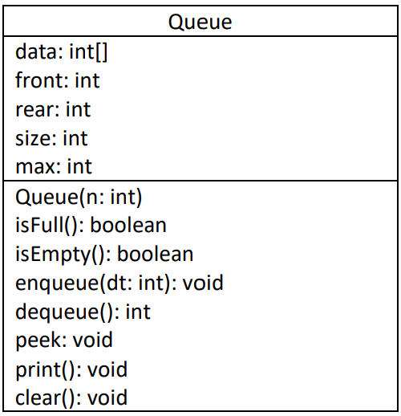<p>

2. Buat package dengan nama **Praktikum1**, kemudian buat class baru dengan nama **Queue**.

3. Tambahkan atribut-atribut Queue sesuai diagram class, kemudian tambahkan pula konstruktornya seperti gambar berikut ini.<p>

    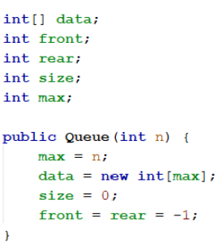<p>

4. Buat method **IsEmpty** bertipe boolean yang digunakan untuk mengecek apakah queue kosong.<p>

    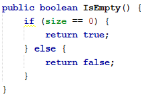<p>

5. Buat method **IsFull** bertipe boolean yang digunakan untuk mengecek apakah queue sudah penuh.<p>

    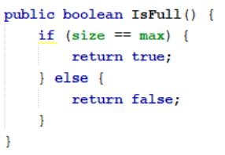<p>

6. Buat method **peek** bertipe void untuk menampilkan elemen queue pada posisi paling depan.<p>

    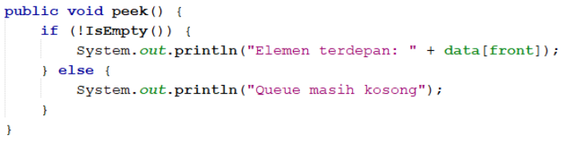<p>

7. Buat method **print** bertipe void untuk menampilkan seluruh elemen pada queue mulai dari posisi front sampai dengan posisi rear.<p>

    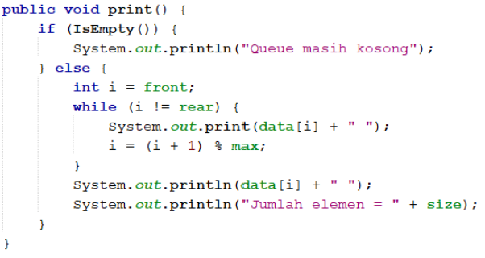<p>

8. Buat method **clear** bertipe void untuk menghapus semua elemen pada queue<p>

    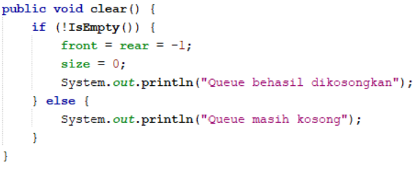<p>

9. Buat method **Enqueue** bertipe void untuk menambahkan isi queue dengan parameter **dt** yang bertipe integer<p>

    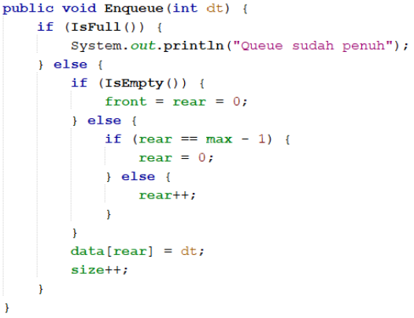<p>

10. Buat method **Dequeue** bertipe int untuk mengeluarkan data pada queue di posisi belakang<p>

    <p>

11. Selanjutnya, buat class baru dengan nama **QueueMain** tetap pada package **Praktikum1**. Buat method **menu** bertipe void untuk memilih menu program pada saat dijalankan.<p>

    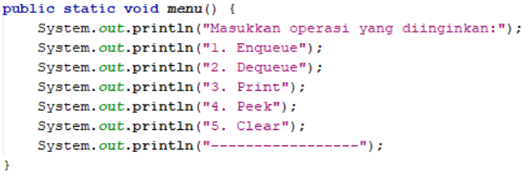<p>

12. Buat fungsi **main**, kemudian deklarasikan Scanner dengan nama sc.

13. Buat variabel **n** untuk menampung masukan berupa jumlah maksimal elemen yang dapat disimpan pada queue.<p>

    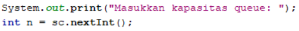<p>

14. Lakukan instansiasi objek Queue dengan nama **Q** dengan mengirimkan parameter **n** sebagai kapasitas elemen queue<p>

    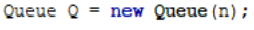<p>

15. Deklarasikan variabel dengan nama **pilih** bertipe integer untuk menampung pilih menu dari pengguna.

16. Lakukan perulangan menggunakan do-while untuk menjalankan program secara terus menerus sesuai masukan yang diberikan. Di dalam perulangan tersebut, terdapat pemilihan kondisi menggunakan switch-case untuk menjalankan operasi queue sesuai dengan masukan pengguna.<p>

    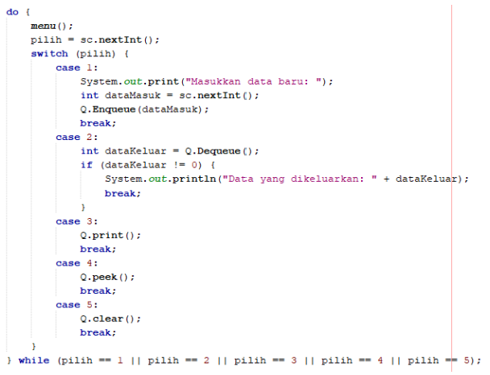<p>

17. Compile dan jalankan class **QueueMain**, kemudian amati hasilnya

>Hasil Output :

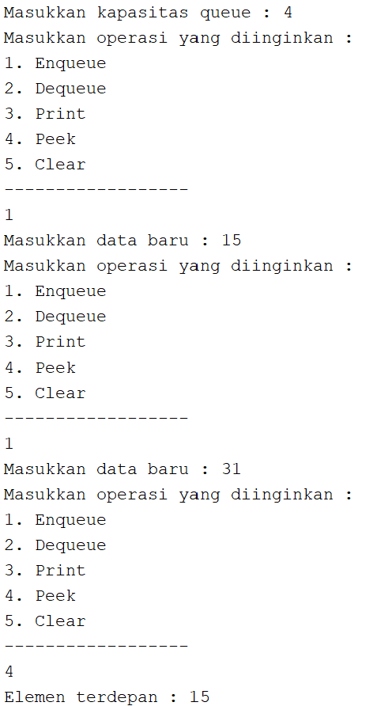<p>

>Source Code queueClass :
```java
package minggu10;

/**
 *
 * @author EgaRam
 */
public class queue {
    int max, size, front, rear;
    int[] data;
    
    public queue(int n){
        max = n;
        data = new int[max];
        size = 0;
        front = rear = -1;
    }
    public boolean IsEmpty(){
        if(size == 0){
            return true;
        }else{
            return false;
        }
    }
    public boolean IsFull(){
        if(size == max){
            return true;
        }else{
            return false;
        }
    }
    public void peek(){
        if(!IsEmpty()){
            System.out.println("Elemen terdepan : " + data[front]);
        }else{
            System.out.println("Queue masih kosong");
        }
    }
    public void print(){
        if(IsEmpty())
            System.out.println("Queue masih kosong");
        else{
            int i = front;
            while(i != rear){
                System.out.print(data[i] + " ");
                i = (i + 1) % max;
            }
            System.out.println(data[i] + " "); //ceatk rear
            System.out.println("Jumlah elemen = " + size);
        }
    }
    public void clear(){
        if(!IsEmpty()){
            front = rear = -1;
            size = 0;
            System.out.println("Queue berhasil dikosongkan");
        }else{
            System.out.println("Queue masih kosong");
        }
    }
    public void Enqueue(int dt){
        int posisi = - 1;
        if(IsFull()){
            System.out.println("Queue sudah penuh"); //Queue overflow : kondisi yang dihasilkan dari mencoba menambahkan elemen ke queue yang sudah penuh
        }else{
            if(IsEmpty()){
                front = rear = 0;
            }else{
                if(rear == max - 1){
                    rear = 0;
                }else{
                    rear++;
                }
            }
            data[rear] = dt;
            size++;
        }
    }
    public int Dequeue(){
        int dt = 0;
        if(IsEmpty()){
            System.out.println("Queue masih kosong"); //Queue underflow : kondisi yang dihasilkan dari mencoba menghapus elemen dariqueue yang masih kosong
        }else{
            dt = data[front];
            size--;
            if(IsEmpty()){
                front = rear = -1;
            }else{
                if(front == max - 1){
                    front = 0;
                }else{
                    front++;
                }
            }
        }
        return dt;
    }
}
```

>Source Code queueMain :
```java
package minggu10;
import java.util.Scanner;
/**
 *
 * @author EgaRam
 */
public class queueMain {
    public static void main(String[] args) {
    Scanner sc = new Scanner(System.in);
    
        System.out.print("Masukkan kapasitas queue : ");
        int n = sc.nextInt();
        queue q = new queue(n);
        int pilih;
        
        do{
            menu();
            pilih = sc.nextInt();
            switch(pilih){
                case 1 :
                    System.out.print("Masukkan data baru : ");
                    int dataMasuk = sc.nextInt();
                    q.Enqueue(dataMasuk);
                    break;
                
                case 2 :
                    int dataKeluar = q.Dequeue();
                    if(dataKeluar != 0){
                        System.out.println("Data yang dikeluarkan : " + dataKeluar);
                        break;
                    }
                    
                case 3 :
                    q.print();
                    break;
                    
                case 4 :
                    q.peek();
                    break;
                    
                case 5 :
                    q.clear();
                    break;
            }
        }while(pilih == 1 || pilih == 2 || pilih == 3 || pilih == 4 || pilih == 5);
    }
    public static void menu(){
        System.out.println("Masukkan operasi yang diinginkan : ");
        System.out.println("1. Enqueue");
        System.out.println("2. Dequeue");
        System.out.println("3. Print");
        System.out.println("4. Peek");
        System.out.println("5. Clear");
        System.out.println("6. Pencarian Index");
        System.out.println("7. Mencari Data Pada Index");
        System.out.println("------------------");
    }
}
```

---
#### 8.2.2 Verifikasi Hasil Percobaan
Samakan hasil compile kode program Anda dengan gambar berikut ini.<p>

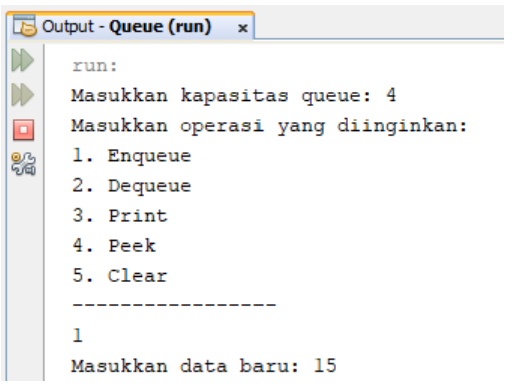<p>
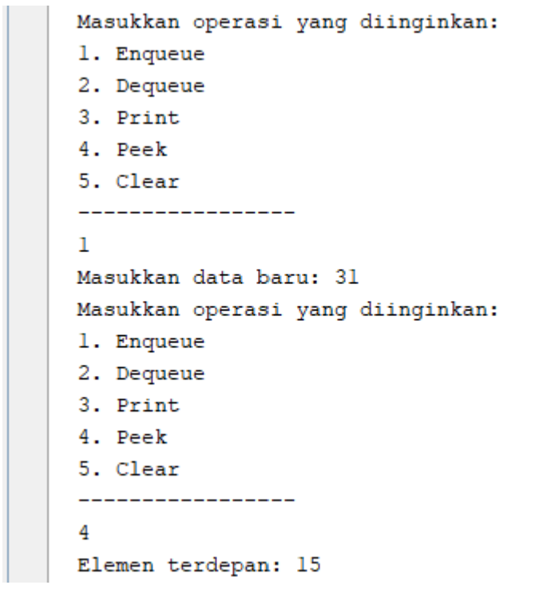<p>

---
#### 8.2.3 Pertanyaan
1. Pada konstruktor, mengapa nilai awal atribut front dan rear bernilai -1, sementara atribut size bernilai 0?

    >**Atribut front dan rear bernilai -1, itu menunjukan bahwa di front dan rear masih belum terisi data apapun atau bisa dibilang kosong. Sementar di atribut size bernilai 0 itu menunjukan antriannya akan bermulai dari data 0**.

2. Pada method **Enqueue**, jelaskan maksud dan kegunaan dari potongan kode berikut!<p>

    <p>

    >**Jika rear sudah sama dengan max - 1 atau berada di index terakhir, maka rear akan bernilai 0 atau kembali ke data ke 0**.

3. Pada method **Dequeue**, jelaskan maksud dan kegunaan dari potongan kode berikut!<p>

    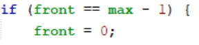<p>

    >**Jika front sudah sama dengan max - 1 atau berada di index terakhir, maka front akan bernilai 0 atau kembali ke data ke 0**.

4. Pada method **print**, mengapa pada proses perulangan variabel i tidak dimulai dari 0 (**int i=0**), melainkan **int i=front**?

    >**Dikarenakan di antrian queue data tidak harus dimulai dari 0 melaikan acak penempatannya, jadi lebih spesifik jika i = front**

5. Perhatikan kembali method print, jelaskan maksud dari potongan kode berikut!<p>

    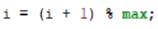<p>

    >**Code tersebut digunakan untuk agar increment dari i itu terus naik dan mencapai sebelum rear, kalau modulusnya itu, maksudnya adalah agar selaras dengan maxnya jadi tidak akan melebihi max datanya**.

6. Tunjukkan potongan kode program yang merupakan queue overflow!

    >**Queue overflow : kondisi yang dihasilkan dari mencoba menambahkan elemen ke queue yang sudah penuh**.<p>

    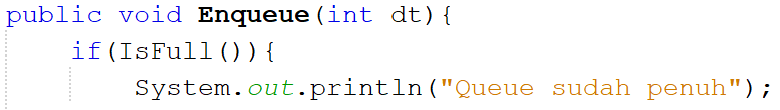<p>

7. Pada saat terjadi queue overflow dan queue underflow, program tersebut tetap dapat berjalan
dan hanya menampilkan teks informasi. Lakukan modifikasi program sehingga pada saat terjadi
queue overflow dan queue underflow, program dihentikan!

>Hasil Output :

>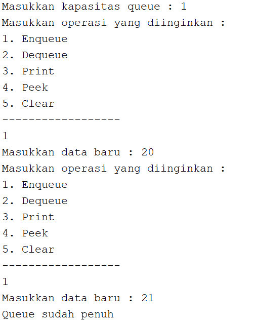<p>

>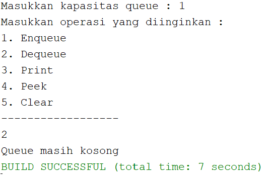<p>

>Source Code queueClass :
```java
package minggu10;

/**
 *
 * @author EgaRam
 */
public class queue {
    int max, size, front, rear;
    int[] data;
    
    public queue(int n){
        max = n;
        data = new int[max];
        size = 0;
        front = rear = -1;
    }
    public boolean IsEmpty(){
        if(size == 0){
            return true;
        }else{
            return false;
        }
    }
    public boolean IsFull(){
        if(size == max){
            return true;
        }else{
            return false;
        }
    }
    public void peek(){
        if(!IsEmpty()){
            System.out.println("Elemen terdepan : " + data[front]);
        }else{
            System.out.println("Queue masih kosong");
        }
    }
    public void print(){
        if(IsEmpty())
            System.out.println("Queue masih kosong");
        else{
            int i = front;
            while(i != rear){
                System.out.print(data[i] + " ");
                i = (i + 1) % max;
            }
            System.out.println(data[i] + " "); //ceatk rear
            System.out.println("Jumlah elemen = " + size);
        }
    }
    public void clear(){
        if(!IsEmpty()){
            front = rear = -1;
            size = 0;
            System.out.println("Queue berhasil dikosongkan");
        }else{
            System.out.println("Queue masih kosong");
        }
    }
    public void Enqueue(int dt){
        int posisi = - 1;
        if(IsFull()){
            System.out.println("Queue sudah penuh"); //Queue overflow : kondisi yang dihasilkan dari mencoba menambahkan elemen ke queue yang sudah penuh
        }else{
            if(IsEmpty()){
                front = rear = 0;
            }else{
                if(rear == max - 1){
                    rear = 0;
                }else{
                    rear++;
                }
            }
            data[rear] = dt;
            size++;
        }
    }
    public int Dequeue(){
        int dt = 0;
        if(IsEmpty()){
            System.out.println("Queue masih kosong"); //Queue underflow : kondisi yang dihasilkan dari mencoba menghapus elemen dariqueue yang masih kosong
        }else{
            dt = data[front];
            size--;
            if(IsEmpty()){
                front = rear = -1;
            }else{
                if(front == max - 1){
                    front = 0;
                }else{
                    front++;
                }
            }
        }
        return dt;
    }
}
```

>Source Code queueMain :
```java
package minggu10;
import java.util.Scanner;
/**
 *
 * @author EgaRam
 */
public class queueMain {
    public static void main(String[] args) {
    Scanner sc = new Scanner(System.in);
    
        System.out.print("Masukkan kapasitas queue : ");
        int n = sc.nextInt();
        queue q = new queue(n);
        int pilih;
        
        do{
            menu();
            pilih = sc.nextInt();
            switch(pilih){
                case 1 :
                    System.out.print("Masukkan data baru : ");
                    int dataMasuk = sc.nextInt();
                    q.Enqueue(dataMasuk);
                    break;
                
                case 2 :
                    int dataKeluar = q.Dequeue();
                    if(dataKeluar != 0){
                        System.out.println("Data yang dikeluarkan : " + dataKeluar);
                        break;
                    }
                    
                case 3 :
                    q.print();
                    break;
                    
                case 4 :
                    q.peek();
                    break;
                    
                case 5 :
                    q.clear();
                    break;
                    
                case 6 :
                    System.out.print("Masukkan data yang akan dicari : ");
                    int cari = sc.nextInt();
                    q.peekPosition(cari);
                    break;
                    
                case 7 :
                    System.out.print("Masukkan index yang ingin dicari : ");
                    int in = sc.nextInt();
                    q.peekAt(in);
                    break;
            }
        }while(pilih == 1 || pilih == 2 || pilih == 3 || pilih == 4 || pilih == 5 || pilih == 6 || pilih == 7);
    }
    public static void menu(){
        System.out.println("Masukkan operasi yang diinginkan : ");
        System.out.println("1. Enqueue");
        System.out.println("2. Dequeue");
        System.out.println("3. Print");
        System.out.println("4. Peek");
        System.out.println("5. Clear");
        System.out.println("6. Pencarian Index");
        System.out.println("7. Mencari Data Pada Index");
        System.out.println("------------------");
    }
}
```

---
### **8.3 Praktikum 2**
**Waktu percobaan : 45 menit**

Pada percobaan ini, kita akan membuat program yang mengilustrasikan teller di bank dalam melayani nasabah.

---
#### 8.3.1 Langkah-langkah Percobaan
1. Perhatikan Diagram Class berikut ini:<p>

    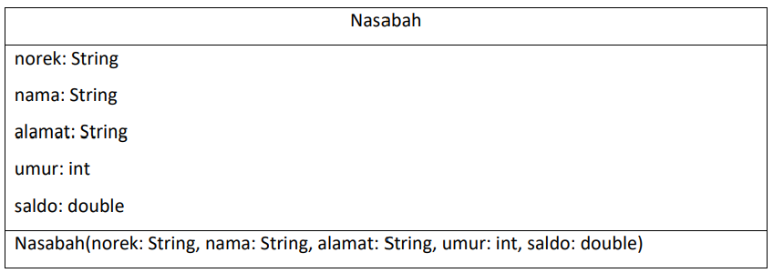<p>

2. Buat package dengan nama **Praktikum2**, kemudian buat class baru dengan nama **Nasabah**.
3. Tambahkan atribut-atribut Nasabah seperti pada Class Diagram, kemudian tambahkan pula konstruktornya seperti gambar berikut ini.<p>

   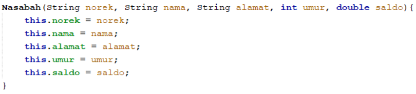<p>

4. Salin kode program class **Queue** pada **Praktikum 1** untuk digunakan kembali pada **Praktikum 2** ini. Karena pada **Praktikum 1**, data yang disimpan pada queue hanya berupa array bertipe integer, sedangkan pada **Praktikum 2** data yang digunakan adalah object, maka perlu dilakukan modifikasi pada class **Queue** tersebut.

5. Lakukan modifikasi pada class **Queue** dengan mengubah tipe **int[] data** menjadi **Nasabah[] data** karena pada kasus ini data yang akan disimpan pada queue berupa object Nasabah. Modifikasi perlu dilakukan pada **atribut**, method **Enqueue**, dan method **Dequeue**.<p>

    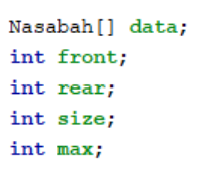<p>
    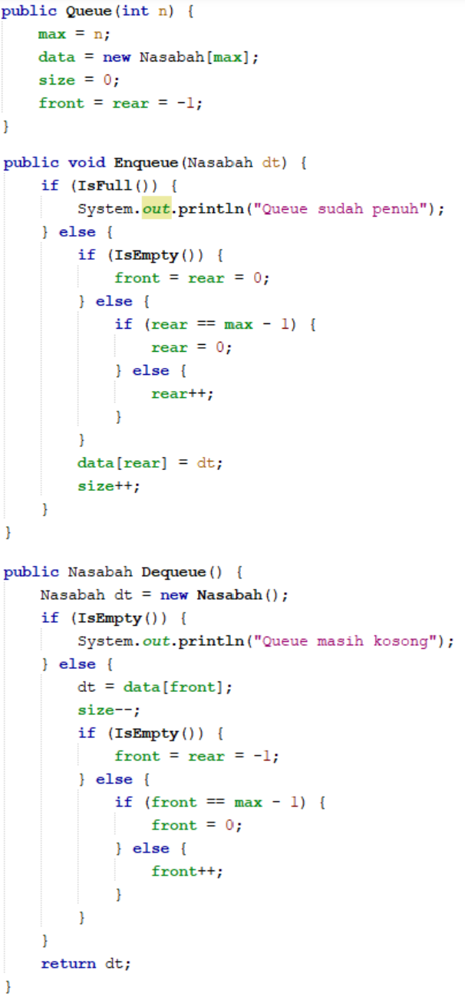<p>

    Baris program **Nasabah dt = new Nasabah();** akan ditandai sebagai error, untuk mengatasinya, tambahkan konstruktor default di dalam class Nasabah.<p>

    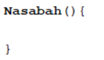<p>

6. Karena satu elemen queue terdiri dari beberapa informasi (norek, nama, alamat, umur, dan saldo), maka ketika mencetak data juga perlu ditampilkan semua informasi tersebut, sehingga meodifikasi perlu dilakukan pada method **peek** dan method **print**.<p>

    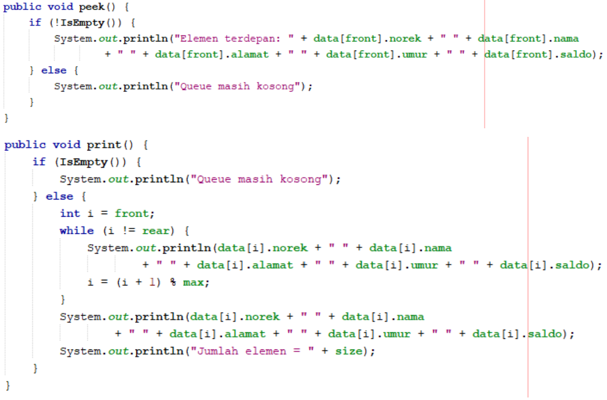<p>

7. Selanjutnya, buat class baru dengan nama **QueueMain** tetap pada package **Praktikum2**. Buat method menu untuk mengakomodasi pilihan menu dari masukan pengguna<p>

    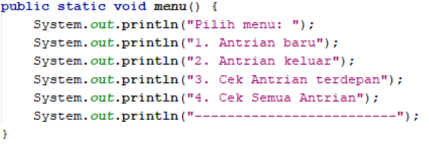<p>

8. Buat fungsi **main**, deklarasikan Scanner dengan nama **sc**

9. Buat variabel **max** untuk menampung kapasitas elemen pada queue. Kemudian lakukan instansiasi objek queue dengan nama **antri** dan nilai parameternya adalah variabel **jumlah**.<p>

    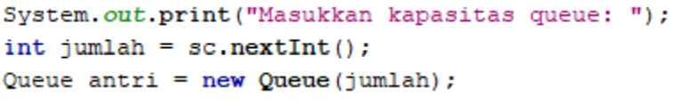<p>

10. Deklarasikan variabel dengan nama **pilih** bertipe integer untuk menampung pilih menu dari pengguna.

11. Tambahkan kode berikut untuk melakukan perulangan menu sesuai dengan masukan yang diberikan oleh pengguna.<p>

    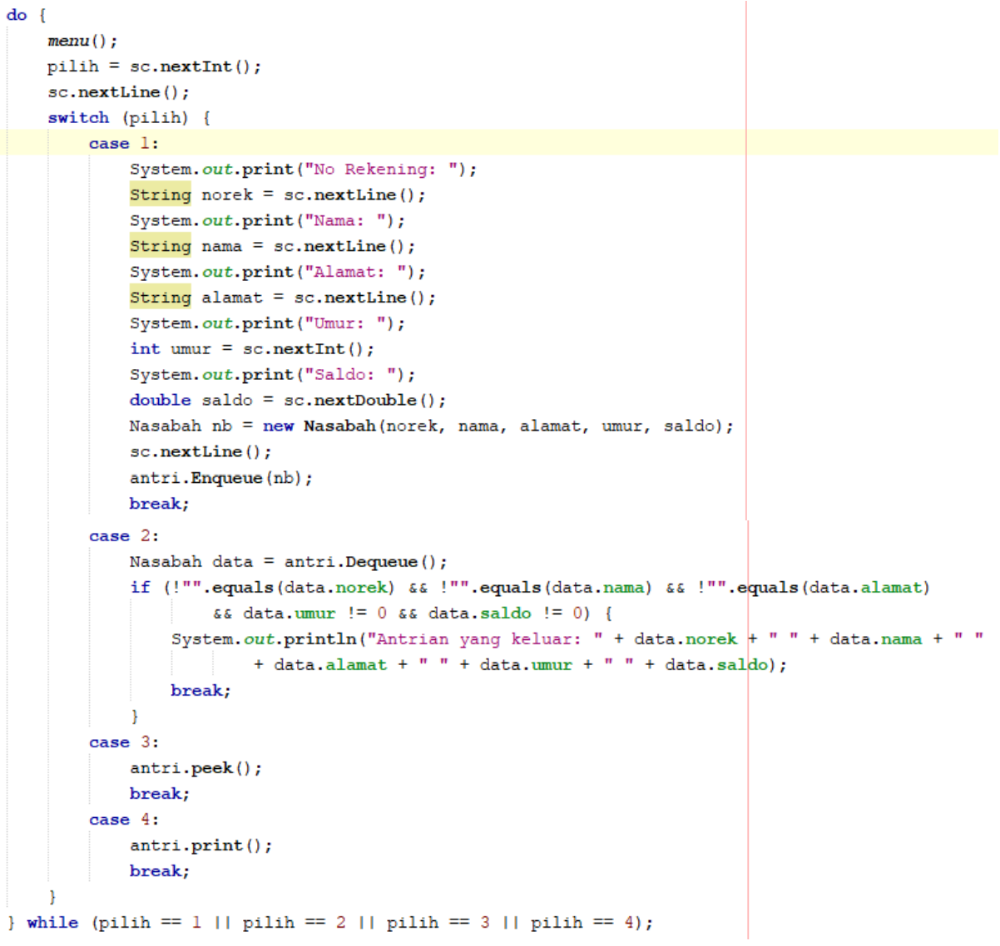<p>

12. Compile dan jalankan class **QueueMain**, kemudian amati hasilnya.

>Hasil Output :

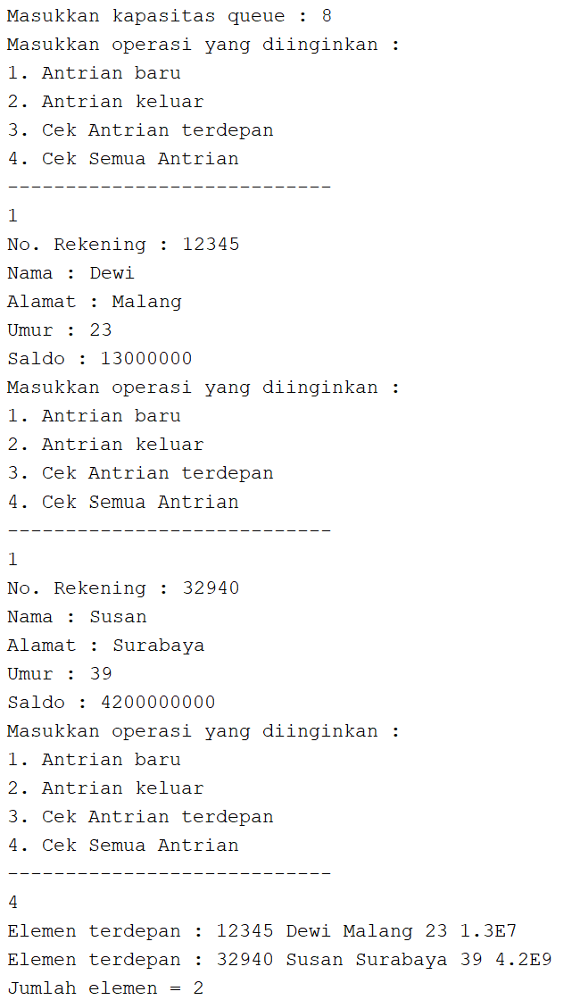<p>

>Source Code NasabahClass :
```java
package minggu10.prak2;

/**
 *
 * @author EgaRam
 */
public class Nasabah {
    String norek, nama, alamat;
    int umur;
    double saldo;
    
    Nasabah(String norek, String nama, String alamat, int umur, double saldo){
        this.norek = norek;
        this.nama = nama;
        this.alamat = alamat;
        this.umur = umur;
        this.saldo = saldo;
    }
    Nasabah(){
        
    }
}
```

>Source Code QueueClass :
```java
package minggu10.prak2;

/**
 *
 * @author EgaRam
 */
public class Queue {
    int max, size, front, rear;
    Nasabah[] data;
    
    public Queue(int n){
        max = n;
        data = new Nasabah[max];
        size = 0;
        front = rear = -1;
    }
    public boolean IsEmpty(){
        if(size == 0){
            return true;
        }else{
            return false;
        }
    }
    public boolean IsFull(){
        if(size == max){
            return true;
        }else{
            return false;
        }
    }
    public void peek(){
        if(!IsEmpty()){
            System.out.println("Elemen terdepan : " + data[front].norek + " " + data[front].nama + " " + data[front].alamat + " " + data[front].umur + " " + data[front].saldo);
        }else{
            System.out.println("Queue masih kosong");
        }
    }
    public void print(){
        if(IsEmpty()){
            System.out.println("Queue masih kosong");
        }else{
            int i = front;
            while(i != rear){
                System.out.println("Elemen terdepan : " + data[i].norek + " " + data[i].nama + " " + data[i].alamat + " " + data[i].umur + " " + data[i].saldo);
                i = (i + 1) % max;
            }
             System.out.println("Elemen terdepan : " + data[i].norek + " " + data[i].nama + " " + data[i].alamat + " " + data[i].umur + " " + data[i].saldo);
            System.out.println("Jumlah elemen = " + size);
        }
    }
    public void clear(){
        if(!IsEmpty()){
            front = rear = -1;
            size = 0;
            System.out.println("Queue berhasil dikosongkan");
        }else{
            System.out.println("Queue masih kosong");
        }
    }
    public void Enqueue(Nasabah dt){
        if(IsFull()){
            System.out.println("Queue sudah penuh");
        }else{
            if(IsEmpty()){
                front = rear = 0;
            }else{
                if(rear == max - 1){
                    rear = 0;
                }else{
                    rear++;
                }
            }
            data[rear] = dt;
            size++;
        }
    }
    public Nasabah Dequeue(){
        Nasabah dt = new Nasabah();
        if(IsEmpty()){
            System.out.println("Queue masih kosong");
        }else{
            dt = data[front];
            size--;
            if(IsEmpty()){
                front = rear = -1;
            }else{
                if(front == max - 1){
                    front = 0;
                }else{
                    front++;
                }
            }
        }
        return dt;
    }
}
```

>Source Code QueMain :
```java
package minggu10.prak2;
import java.util.Scanner;
/**
 *
 * @author EgaRam
 */
public class QueMain {
    public static void main(String[] args) {
    Scanner sc = new Scanner(System.in);
    Scanner sd = new Scanner(System.in);
    
    System.out.print("Masukkan kapasitas queue : ");
    int jumlah = sd.nextInt();
    Queue antri = new Queue(jumlah);
    int pilih;
    
    do{
            menu();
            pilih = sc.nextInt();
            switch(pilih){
                case 1 :
                    System.out.print("No. Rekening : ");
                    String norek = sc.next();
                    System.out.print("Nama : ");
                    String nama = sc.next();
                    System.out.print("Alamat : ");
                    String alamat = sc.next();
                    System.out.print("Umur : ");
                    int umur = sd.nextInt();
                    System.out.print("Saldo : ");
                    double saldo = sd.nextDouble();
                    Nasabah nb = new Nasabah(norek, nama, alamat, umur, saldo);
                    sc.nextLine();
                    antri.Enqueue(nb);
                    break;
                
                case 2 :
                    Nasabah data = antri.Dequeue();
                    if(!"".equals(data.norek) && !"".equals(data.nama) && !"".equals(data.alamat) && data.umur != 0 && data.saldo != 0){
                        System.out.println("Antrian yang keluar : " + data.norek + " " + data.nama + " " + data.alamat + " " + data.umur + " " + data.saldo);
                        break;
                    }
                    
                case 3 :
                    antri.peek();
                    break;
                    
                case 4 :
                    antri.print();
                    break;
                    
                case 5 :
                    antri.peekRear();
                    break;
            }
        }while(pilih == 1 || pilih == 2 || pilih == 3 || pilih == 4);
    }
    public static void menu(){
        System.out.println("Masukkan operasi yang diinginkan : ");
        System.out.println("1. Antrian baru");
        System.out.println("2. Antrian keluar");
        System.out.println("3. Cek Antrian terdepan");
        System.out.println("4. Cek Semua Antrian");
        System.out.println("5. Cek Antrian terbelakang");
        System.out.println("----------------------------");
    }
}
```

---
#### 8.3.2 Verifikasi Hasil Percobaan
Samakan hasil compile kode program Anda dengan gambar berikut ini.<p>

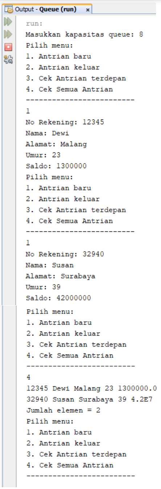<p>

---
#### 8.3.3 Pertanyaan
1. Pada class QueueMain, jelaskan fungsi IF pada potongan kode program berikut!<p>

    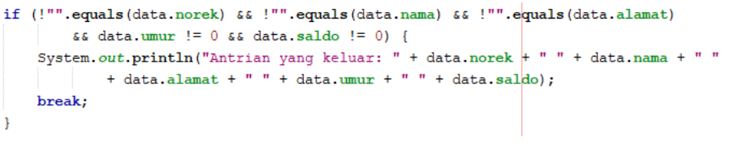<p>

    >- **Jika menggunakan fungsi equals(), semua karakter dari kedua variable tersebut harus sama, meliputi huruf besar dan kecilnya, pada fungsi equals(), saat kita menginputkan data, tetapi ada salah satu atau beberpa huruf dengan ukuran berbeda, maka akan bernilai false namun karena di kode program tersebut ada tanda !, maka walaupun menggunakan huruf yang berbeda, program masih tetap berjalan**.
    >- **Pada system out print itu untuk menampilkan hasil output keybord ke program**.
    >- **Fungsi kode program break disini adalah perintah khusus yang dipakai untuk memaksa sebuah perulangan berhenti sebelum waktunya**.

2. Lakukan modifikasi program dengan menambahkan method baru bernama **peekRear** pada class Queue yang digunakan untuk mengecek antrian yang berada di posisi belakang! Tambahkan pula daftar menu **5. Cek Antrian paling belakang** pada class **QueueMain** sehingga method **peekRear** dapat dipanggil!

>Hasil Output :

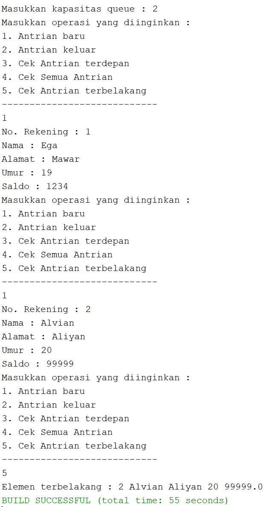<p>

>Source Code NasabahClass :
```java
package minggu10.prak2;

/**
 *
 * @author EgaRam
 */
public class Nasabah {
    String norek, nama, alamat;
    int umur;
    double saldo;
    
    Nasabah(String norek, String nama, String alamat, int umur, double saldo){
        this.norek = norek;
        this.nama = nama;
        this.alamat = alamat;
        this.umur = umur;
        this.saldo = saldo;
    }
    Nasabah(){
        
    }
}
```

>Source Code QueueClass :
```java
package minggu10.prak2;

/**
 *
 * @author EgaRam
 */
public class Queue {
    int max, size, front, rear;
    Nasabah[] data;
    
    public Queue(int n){
        max = n;
        data = new Nasabah[max];
        size = 0;
        front = rear = -1;
    }
    public boolean IsEmpty(){
        if(size == 0){
            return true;
        }else{
            return false;
        }
    }
    public boolean IsFull(){
        if(size == max){
            return true;
        }else{
            return false;
        }
    }
    public void peek(){
        if(!IsEmpty()){
            System.out.println("Elemen terdepan : " + data[front].norek + " " + data[front].nama + " " + data[front].alamat + " " + data[front].umur + " " + data[front].saldo);
        }else{
            System.out.println("Queue masih kosong");
        }
    }
    public void print(){
        if(IsEmpty()){
            System.out.println("Queue masih kosong");
        }else{
            int i = front;
            while(i != rear){
                System.out.println("Elemen terdepan : " + data[i].norek + " " + data[i].nama + " " + data[i].alamat + " " + data[i].umur + " " + data[i].saldo);
                i = (i + 1) % max;
            }
             System.out.println("Elemen terdepan : " + data[i].norek + " " + data[i].nama + " " + data[i].alamat + " " + data[i].umur + " " + data[i].saldo);
            System.out.println("Jumlah elemen = " + size);
        }
    }
    public void clear(){
        if(!IsEmpty()){
            front = rear = -1;
            size = 0;
            System.out.println("Queue berhasil dikosongkan");
        }else{
            System.out.println("Queue masih kosong");
        }
    }
    public void Enqueue(Nasabah dt){
        if(IsFull()){
            System.out.println("Queue sudah penuh");
        }else{
            if(IsEmpty()){
                front = rear = 0;
            }else{
                if(rear == max - 1){
                    rear = 0;
                }else{
                    rear++;
                }
            }
            data[rear] = dt;
            size++;
        }
    }
    public Nasabah Dequeue(){
        Nasabah dt = new Nasabah();
        if(IsEmpty()){
            System.out.println("Queue masih kosong");
        }else{
            dt = data[front];
            size--;
            if(IsEmpty()){
                front = rear = -1;
            }else{
                if(front == max - 1){
                    front = 0;
                }else{
                    front++;
                }
            }
        }
        return dt;
    }
    public void peekRear(){
        if(!IsEmpty()){
            System.out.println("Elemen terbelakang : " + data[rear].norek + " " + data[rear].nama + " " + data[rear].alamat + " " + data[rear].umur + " " + data[rear].saldo);
        }else{
            System.out.println("Queue masih kosong");
        }
    }
}
```

>Source Code QueMain :
```java
package minggu10.prak2;
import java.util.Scanner;
/**
 *
 * @author EgaRam
 */
public class QueMain {
    public static void main(String[] args) {
    Scanner sc = new Scanner(System.in);
    Scanner sd = new Scanner(System.in);
    
    System.out.print("Masukkan kapasitas queue : ");
    int jumlah = sd.nextInt();
    Queue antri = new Queue(jumlah);
    int pilih;
    
    do{
            menu();
            pilih = sc.nextInt();
            switch(pilih){
                case 1 :
                    System.out.print("No. Rekening : ");
                    String norek = sc.next();
                    System.out.print("Nama : ");
                    String nama = sc.next();
                    System.out.print("Alamat : ");
                    String alamat = sc.next();
                    System.out.print("Umur : ");
                    int umur = sd.nextInt();
                    System.out.print("Saldo : ");
                    double saldo = sd.nextDouble();
                    Nasabah nb = new Nasabah(norek, nama, alamat, umur, saldo);
                    sc.nextLine();
                    antri.Enqueue(nb);
                    break;
                
                case 2 :
                    Nasabah data = antri.Dequeue();
                    if(!"".equals(data.norek) && !"".equals(data.nama) && !"".equals(data.alamat) && data.umur != 0 && data.saldo != 0){
                        System.out.println("Antrian yang keluar : " + data.norek + " " + data.nama + " " + data.alamat + " " + data.umur + " " + data.saldo);
                        break;
                    }
                    
                case 3 :
                    antri.peek();
                    break;
                    
                case 4 :
                    antri.print();
                    break;
                    
                case 5 :
                    antri.peekRear();
                    break;
            }
        }while(pilih == 1 || pilih == 2 || pilih == 3 || pilih == 4);
    }
    public static void menu(){
        System.out.println("Masukkan operasi yang diinginkan : ");
        System.out.println("1. Antrian baru");
        System.out.println("2. Antrian keluar");
        System.out.println("3. Cek Antrian terdepan");
        System.out.println("4. Cek Semua Antrian");
        System.out.println("5. Cek Antrian terbelakang");
        System.out.println("----------------------------");
    }
}
```

---
### **8.4 Tugas**

1. Tambahkan dua method berikut ke dalam class Queue pada **Praktikum 1**:
- Method **peekPosition(data: int) : void**

    Untuk menampilkan posisi dari sebuah data di dalam queue, misalnya dengan mengirimkan data tertentu, akan diketahui posisi (indeks) data tersebut berada di urutan ke berapa
- Method **peekAt(position: int) : void**

    Untuk menampilkan data yang berada pada posisi (indeks) tertentu 
    
    Sesuaikan daftar menu yang terdapat pada class **QueueMain** sehingga kedua method tersebut dapat dipanggil!

>Hasil Output :

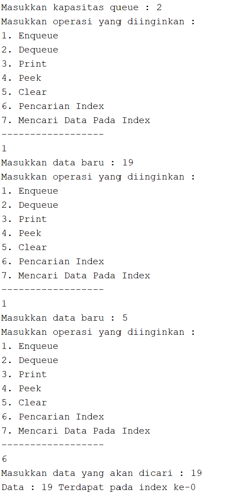<p>
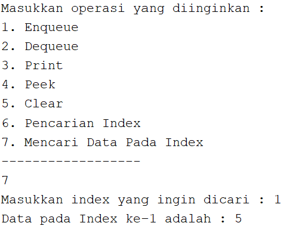<p>

>Source Code queueClass :
```java
package minggu10;

/**
 *
 * @author EgaRam
 */
public class queue {
    int max, size, front, rear;
    int[] data;
    
    public queue(int n){
        max = n;
        data = new int[max];
        size = 0;
        front = rear = -1;
    }
    public boolean IsEmpty(){
        if(size == 0){
            return true;
        }else{
            return false;
        }
    }
    public boolean IsFull(){
        if(size == max){
            return true;
        }else{
            return false;
        }
    }
    public void peek(){
        if(!IsEmpty()){
            System.out.println("Elemen terdepan : " + data[front]);
        }else{
            System.out.println("Queue masih kosong");
        }
    }
    public void print(){
        if(IsEmpty())
            System.out.println("Queue masih kosong");
        else{
            int i = front;
            while(i != rear){
                System.out.print(data[i] + " ");
                i = (i + 1) % max;
            }
            System.out.println(data[i] + " "); //ceatk rear
            System.out.println("Jumlah elemen = " + size);
        }
    }
    public void clear(){
        if(!IsEmpty()){
            front = rear = -1;
            size = 0;
            System.out.println("Queue berhasil dikosongkan");
        }else{
            System.out.println("Queue masih kosong");
        }
    }
    public void Enqueue(int dt){
        int posisi = - 1;
        if(IsFull()){
            System.out.println("Queue sudah penuh"); //Queue overflow : kondisi yang dihasilkan dari mencoba menambahkan elemen ke queue yang sudah penuh
            System.exit(0);
        }else{
            if(IsEmpty()){
                front = rear = 0;
            }else{
                if(rear == max - 1){
                    rear = 0;
                }else{
                    rear++;
                }
            }
            data[rear] = dt;
            size++;
        }
    }
    public int Dequeue(){
        int dt = 0;
        if(IsEmpty()){
            System.out.println("Queue masih kosong"); //Queue underflow : kondisi yang dihasilkan dari mencoba menghapus elemen dariqueue yang masih kosong
            System.exit(0);
        }else{
            dt = data[front];
            size--;
            if(IsEmpty()){
                front = rear = -1;
            }else{
                if(front == max - 1){
                    front = 0;
                }else{
                    front++;
                }
            }
        }
        return dt;
    }
    public void peekPosition(int data){
        int i = front;
        boolean j = true;
        while(j){
            if(data == this.data[i]){
                System.out.println("Data : " + data + " Terdapat pada index ke-" + i);
                j = false;
            }
            i++;
        }
    }
    public void peekAt(int position){
    int e = front;
    boolean w = true;
        while(w){
            if(position == e){
                System.out.println("Data pada Index ke-" + e + " adalah : " + this.data[e]);
                w = false;
            }
            e++;
        }
    }
}
```

>Source Code queueMain :
```java
package minggu10;
import java.util.Scanner;
/**
 *
 * @author EgaRam
 */
public class queueMain {
    public static void main(String[] args) {
    Scanner sc = new Scanner(System.in);
    
        System.out.print("Masukkan kapasitas queue : ");
        int n = sc.nextInt();
        queue q = new queue(n);
        int pilih;
        
        do{
            menu();
            pilih = sc.nextInt();
            switch(pilih){
                case 1 :
                    System.out.print("Masukkan data baru : ");
                    int dataMasuk = sc.nextInt();
                    q.Enqueue(dataMasuk);
                    break;
                
                case 2 :
                    int dataKeluar = q.Dequeue();
                    if(dataKeluar != 0){
                        System.out.println("Data yang dikeluarkan : " + dataKeluar);
                        break;
                    }
                    
                case 3 :
                    q.print();
                    break;
                    
                case 4 :
                    q.peek();
                    break;
                    
                case 5 :
                    q.clear();
                    break;
                    
                case 6 :
                    System.out.print("Masukkan data yang akan dicari : ");
                    int cari = sc.nextInt();
                    q.peekPosition(cari);
                    break;
                    
                case 7 :
                    System.out.print("Masukkan index yang ingin dicari : ");
                    int in = sc.nextInt();
                    q.peekAt(in);
                    break;
            }
        }while(pilih == 1 || pilih == 2 || pilih == 3 || pilih == 4 || pilih == 5 || pilih == 6 || pilih == 7);
    }
    public static void menu(){
        System.out.println("Masukkan operasi yang diinginkan : ");
        System.out.println("1. Enqueue");
        System.out.println("2. Dequeue");
        System.out.println("3. Print");
        System.out.println("4. Peek");
        System.out.println("5. Clear");
        System.out.println("6. Pencarian Index");
        System.out.println("7. Mencari Data Pada Index");
        System.out.println("------------------");
    }
}
```

2. Buatlah program antrian untuk mengilustasikan mahasiswa yang sedang meminta tanda tangan KRS pada dosen DPA di kampus. Ketika seorang mahasiswa akan mengantri, maka dia harus menuliskan terlebih dulu NIM, nama, absen, dan IPK seperti yang digambarkan pada Class diagram berikut:<p>

    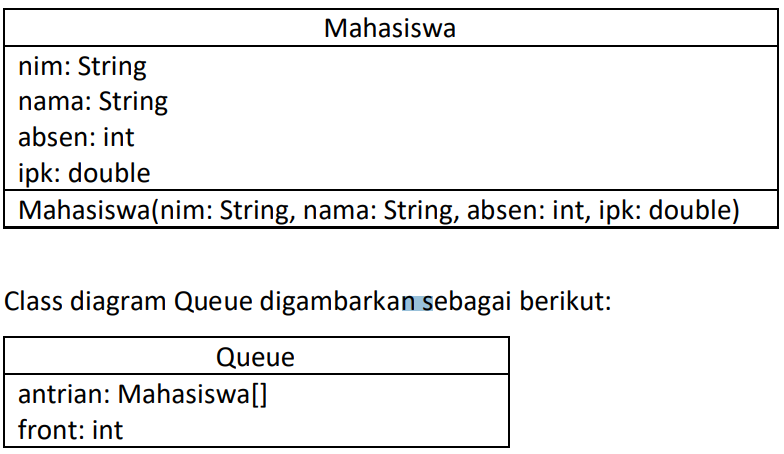<p>
    <p>

    Keterangan:
- Method create(), isEmpty(), isFull(), enqueue(), dequeue() dan print(), kegunaannya sama seperti yang telah dibuat pada Praktikum
- Method peek(): digunakan untuk menampilkan data Mahasiswa yang berada di posisi antrian paling depan
- Method peekRear(): digunakan untuk menampilkan data Mahasiswa yang berada di posisi antrian paling belakang
- Method peekPosition(): digunakan untuk menampilkan posisi antrian ke berapa, seorang Mahasiswa berada. Pengecekan dilakukan berdasarkan NIM
- Method printMahasiswa(): digunakan untuk menampilkan data mahasiswa pada suatu posisi tertentu dalam antrian

>Hasil Output :

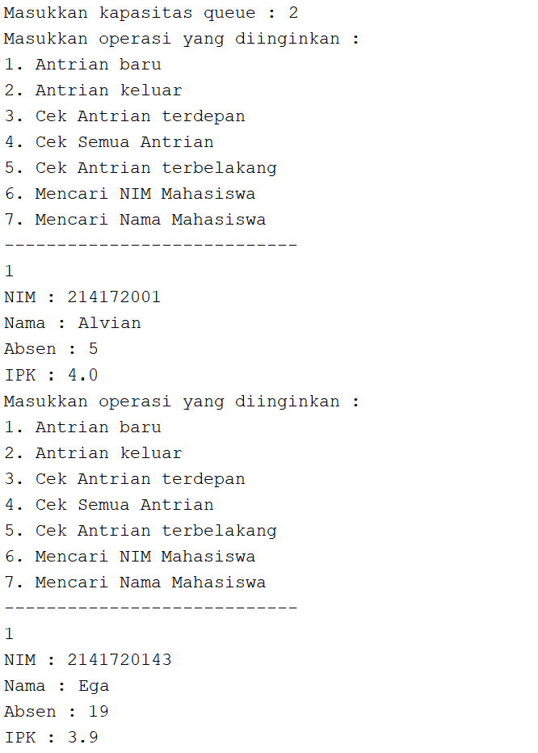<p>
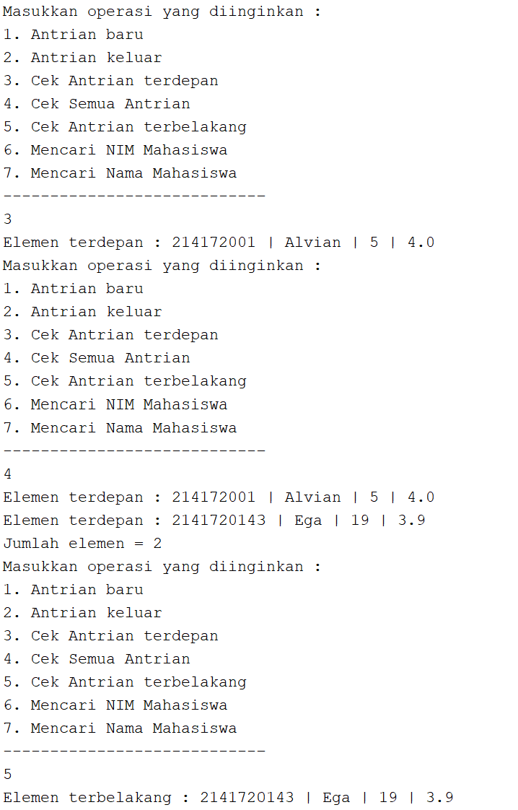<p>
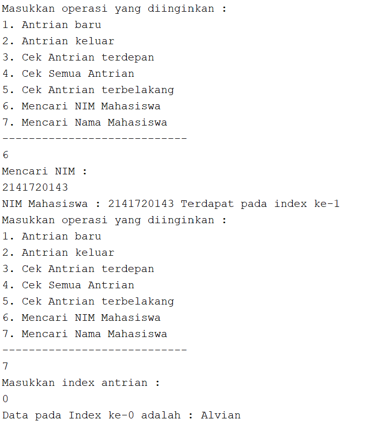<p>

>Source Code MahasiswaClass :
```java
package minggu10.Latihan2;

/**
 *
 * @author EgaRam
 */
public class Mahasiswa {
    String nim, nama;
    int absen;
    double ipk;
    
    Mahasiswa(String ni, String n, int u, double i){
        nim = ni;
        nama = n;
        absen = u;
        ipk = i;
    }
    Mahasiswa(){
        
    }
}
```

>Source Code queueClass :
```java
package minggu10.Latihan2;

/**
 *
 * @author EgaRam
 */
public class queue {
    Mahasiswa antrian[];
    int front, rear, size, max;
    
    public queue(int n){
    max = n;
    antrian = new Mahasiswa[max];
    size = 0;
    front = rear = -1;
    }
    public boolean IsEmpty(){
        if(size == 0){
            return true;
        }else{
            return false;
        }
    }
    public boolean IsFull(){
        if(size == max){
            return true;
        }else{
            return false;
        }
    }
    public void peek(){
        if(!IsEmpty()){
            System.out.println("Elemen terdepan : " + antrian[front].nim + " | " + antrian[front].nama + " | " + antrian[front].absen + " | " + antrian[front].ipk);
        }else{
            System.out.println("Queue masih kosong");
        }
    }
    public void print(){
        if(IsEmpty()){
            System.out.println("Queue masih kosong");
        }else{
            int i = front;
            while(i != rear){
                System.out.println("Elemen terdepan : " + antrian[i].nim + " | " + antrian[i].nama + " | " + antrian[i].absen + " | " + antrian[i].ipk);
                i = (i + 1) % max;
            }
             System.out.println("Elemen terdepan : " + antrian[i].nim + " | " + antrian[i].nama + " | " + antrian[i].absen + " | " + antrian[i].ipk);
            System.out.println("Jumlah elemen = " + size);
        }
    }
    public void Enqueue(Mahasiswa dt){
        int posisi = - 1;
        if(IsFull()){
            System.out.println("Queue sudah penuh"); //Queue overflow : kondisi yang dihasilkan dari mencoba menambahkan elemen ke queue yang sudah penuh
            System.exit(0);
        }else{
            if(IsEmpty()){
                front = rear = 0;
            }else{
                if(rear == max - 1){
                    rear = 0;
                }else{
                    rear++;
                }
            }
            antrian[rear] = dt;
            size++;
        }
    }
    public Mahasiswa Dequeue(){
        Mahasiswa dt = new Mahasiswa();
        if(IsEmpty()){
            System.out.println("Queue masih kosong"); //Queue underflow : kondisi yang dihasilkan dari mencoba menghapus elemen dariqueue yang masih kosong
            System.exit(0);
        }else{
            dt = antrian[front];
            size--;
            if(IsEmpty()){
                front = rear = -1;
            }else{
                if(front == max - 1){
                    front = 0;
                }else{
                    front++;
                }
            }
        }
        return dt;
    }
    public void peekRear(){
        if(!IsEmpty()){
            System.out.println("Elemen terbelakang : " + antrian[rear].nim + " | " + antrian[rear].nama + " | " + antrian[rear].absen + " | " + antrian[rear].ipk);
        }else{
            System.out.println("Queue masih kosong");
        }
    }
    public void peekPosition(String nim){
        int i = front;
        boolean j = true;
        while(j){
            if(nim.equals(this.antrian[i].nim)){
                System.out.println("NIM Mahasiswa : " + antrian[i].nim + " Terdapat pada index ke-" + i);
                j = false;
            }
            i++;
        }
    }
    public void printMahasiswa(int posisi){
    int e = front;
    boolean w = true;
        while(w){
            if(posisi == e){
                System.out.println("Data pada Index ke-" + e + " adalah : " + this.antrian[e].nama);
                w = false;
            }
            e++;
        }
    }
}
```

>Source Code MhsMain :
```java
package minggu10.Latihan2;
import java.util.Scanner;
/**
 *
 * @author EgaRam
 */
public class MhsMain {
    public static void main(String[] args) {
    Scanner sc = new Scanner(System.in);
    Scanner sd = new Scanner(System.in);
    
    System.out.print("Masukkan kapasitas queue : ");
    int jumlah = sd.nextInt();
    queue antri = new queue(jumlah);
    int pilih;
    
    do{
            menu();
            pilih = sc.nextInt();
            switch(pilih){
                case 1 :
                    System.out.print("NIM : ");
                    String nim = sc.next();
                    System.out.print("Nama : ");
                    String nama = sc.next();
                    System.out.print("Absen : ");
                    int absen = sc.nextInt();
                    System.out.print("IPK : ");
                    double ipk = sd.nextDouble();
                    Mahasiswa nb = new Mahasiswa(nim, nama, absen, ipk);
                    sc.nextLine();
                    antri.Enqueue(nb);
                    break;
                
                case 2 :
                    Mahasiswa data = antri.Dequeue();
                    if(!"".equals(data.nim) && !"".equals(data.nama) && data.absen != 0 && data.ipk != 0){
                        System.out.println("Antrian yang keluar : " + data.nim + " " + data.nama + " " + data.absen + " " + data.ipk);
                        break;
                    }
                    
                case 3 :
                    antri.peek();
                    break;
                    
                case 4 :
                    antri.print();
                    break;
                    
                case 5 :
                    antri.peekRear();
                    break;
                    
                case 6 :
                    System.out.println("Mencari NIM : ");
                    String cr = sc.next();
                    antri.peekPosition(cr);
                    break;
                    
                case 7 :
                    System.out.println("Masukkan index antrian : ");
                    int in = sc.nextInt();
                    antri.printMahasiswa(in);
                    break;
            }
        }while(pilih == 1 || pilih == 2 || pilih == 3 || pilih == 4 || pilih == 5 || pilih == 6 || pilih == 7);
    }
    public static void menu(){
        System.out.println("Masukkan operasi yang diinginkan : ");
        System.out.println("1. Antrian baru");
        System.out.println("2. Antrian keluar");
        System.out.println("3. Cek Antrian terdepan");
        System.out.println("4. Cek Semua Antrian");
        System.out.println("5. Cek Antrian terbelakang");
        System.out.println("6. Mencari NIM Mahasiswa");
        System.out.println("7. Mencari Nama Mahasiswa");
        System.out.println("----------------------------");
    }
}
```
    
---
## *<center>Terimakasiih Banyak</center>*
---
