## **Jobsheet Pertemuan 2**
# Muhammad Ega Rama Fernanda
# 1F/19


### 2.1 Tujuan Praktikum
Setelah melakukan materi praktikum ini, mahasiswa mampu:
1. Mengenal objek dan class sebagai konsep mendasar pada pemrograman berorientasi objek
2. Mendeklarasikan class, atribut dan method
3. Membuat objek (instansiasi)
4. Mengakses atribut dan method dari suatu objek
5. Menerapkan konstruktor


### 2.2 Deklarasi Class, Atribut dan Method
Waktu : 45 Menit

Perhatikan Diagram Class berikut ini:

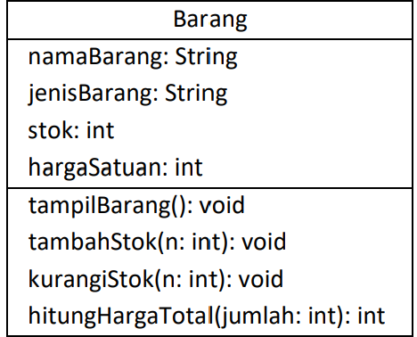

Berdasarkan diagram class di atas, akan dibuat program class dalam Java.


### 2.2.1 Langkah-langkah Percobaan
1. Buat Project baru, dengan nama StrukturData. Buat paket dengan nama minggu2, buatlah class
baru dengan nama Barang.
2. Lengkapi class Barang dengan atribut dan method yang telah digambarkan di dalam diagram
class di atas, sebagai berikut:
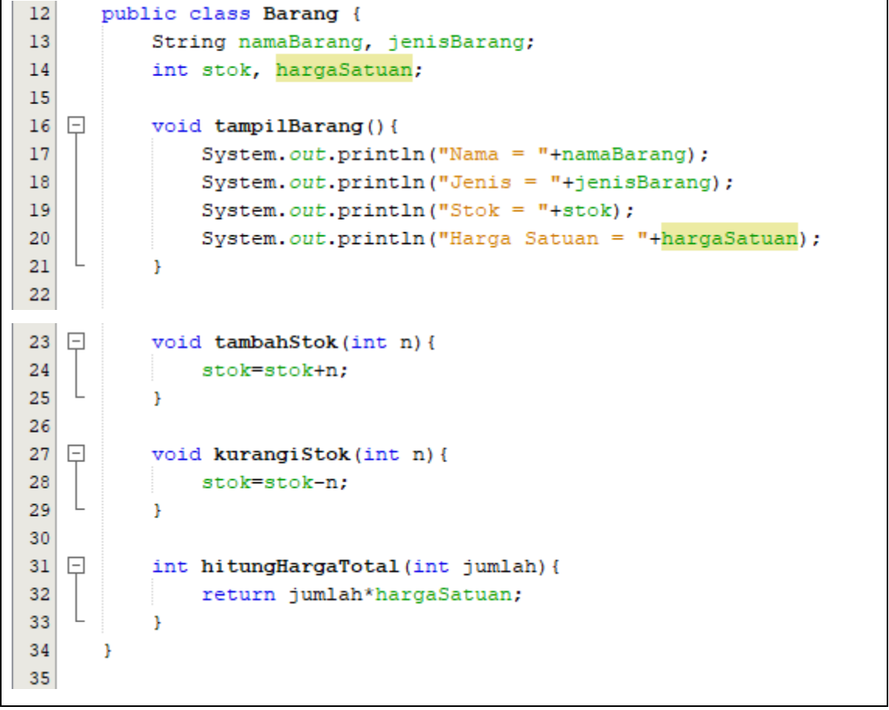
3. Coba jalankan (Run) class Barang tersebut. Apakah bisa? **tidak bisa**

>Hasil output :
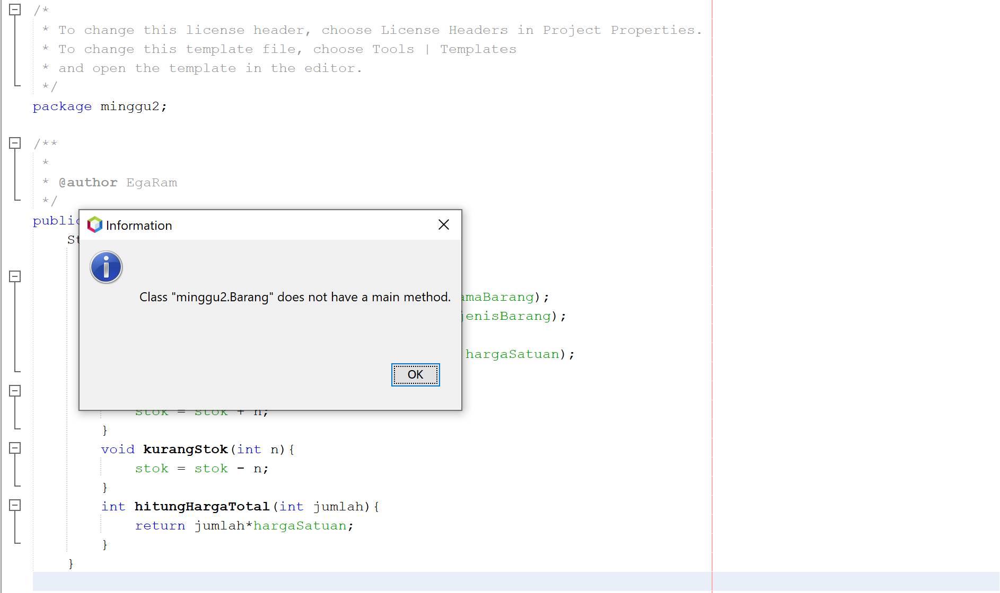

>Code
``` java
public class Barang {
    String namaBarang, jenisBarang;
        int stok, hargaSatuan;

        void tampilBarang(){
            System.out.println("Nama Barang : " +namaBarang);
            System.out.println("Jenis Barang : " +jenisBarang);
            System.out.println("Stok : " + stok);
            System.out.println("Harga Satuan : " + hargaSatuan);
        }
        void tambahStok(int n){
            stok = stok + n;
        }
        void kurangStok(int n){
            stok = stok - n;
        }
        int hitungHargaTotal(int jumlah){
            return jumlah*hargaSatuan;
        }
    }
```


### 2.2.2 Verifikasi Hasil Percobaan
Cocokkan hasil compile kode program anda dengan gambar berikut ini.
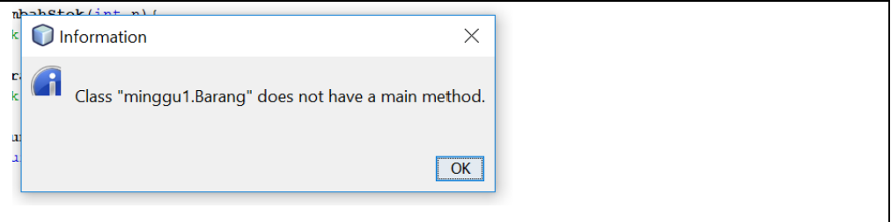


### 2.2.3 Pertanyaan
1. Sebutkan 2 karakteristik class/objek!

    **atribut dan method**

2. Kata kunci apakah yang digunakan untuk mendeklarasikan class?

    **class**
3. Perhatikan class Barang yang ada di Praktikum di atas, ada berapa atribut yang dimiliki oleh class
tersebut? Sebutkan! Dan pada baris berapa saja deklarasi atribut dilakukan?

    **4 Atribut yaitu namaBarang, jenisBarang, stok, hargaSatuan. deklarasi atribut dilakukan pada baris 13 dan 14.**
4. Ada berapa method yang dimiliki oleh class tersebut? Sebutkan! Dan pada baris berapa saja
deklarasi method dilakukan?

    **4 method yaitu, tampilBarang, tambahStok, kurangiStok, hitungHargaTotal. di deklarasi pada baris 16, 23, 27,, 31.**
5. Perhatikan method kurangiStok() yang ada di class Barang, modifikasi isi method tersebut
sehingga proses pengurangan hanya dilakukan jika stok masih ada (masih lebih besar dari 0)
6. Menurut Anda, mengapa method tambahStok() dibuat dengan memiliki 1 parameter berupa
bilangan int?

    **karena untuk mengoutputkan bilangan bulat, kita memerlukan tipe data int untuk mengcomplie program tersebut agar tidak eror atau tidak tampil.**
7. Menurut Anda, mengapa method hitungHargaTotal() memiliki tipe data int?

    **karena untuk mencetak variabel bilangan bulat harus menggunakan tipe data int dan karena ini menghitung jumlah jadi perlu mengembalikan suatu nilai.**
8. Menurut Anda, mengapa method tambahStok() memiliki tipe data void?

    **karena disini hanya ingin menampilkan stok barang yang ditambahkan, jadi tidak perlu mengembalikan nilai.**


### 2.3 Instansiasi Objek dan Mengakses Atribut & Method
Waktu : 45 Menit

Sampai tahap ini, kita telah membuat class Barang dengan sukses. Selanjutnya, apabila diinginkan
untuk mulai menggunakan class Barang tersebut, mengakses atribut-atribut dan method-method
yang ada di dalamnya, maka selanjutnya perlu dibuat objek/instance dari class Barang terlebih dahulu.


### 2.3.1 Langkah-langkah Percobaan
1. Di dalam paket minggu2, buatlah class baru dengan nama BarangMain. Dan di dalam class
BarangMain tersebut, buatlah method main().
2. Di dalam method main(), lakukan instansiasi, dan kemudian lanjutkan dengan mengakses atribut
dan method dari objek yang telah terbentuk.
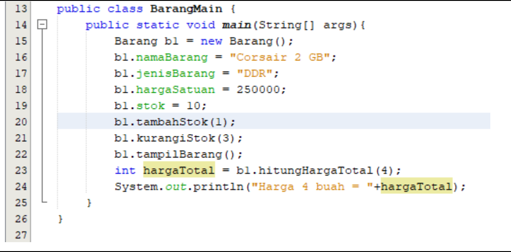
3. Jalankan (Run) class BarangMain tersebut dan amati hasilnya.
>Hasil output :
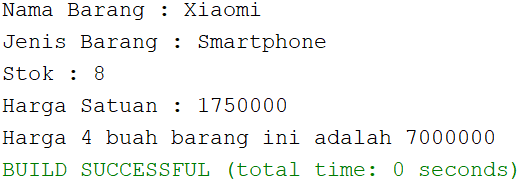

>Code
```java
public class BarangMain {
        public static void main (String[] args){
            Barang b1 = new Barang();
            b1.namaBarang = "Xiaomi";
            b1.jenisBarang = "Smartphone";
            b1.hargaSatuan = 1750000;
            b1.stok = 0;
            b1.tambahStok(1);
            b1.kurangStok(3);
            b1.tampilBarang();
            int hargaTotal = b1.hitungHargaTotal(4);
            System.out.println("Harga 4 buah barang ini adalah " + hargaTotal);
        }
    }
```


### 2.3.2 Verifikasi Hasil Percobaan
Cocokkan hasil compile kode program anda dengan gambar berikut ini.
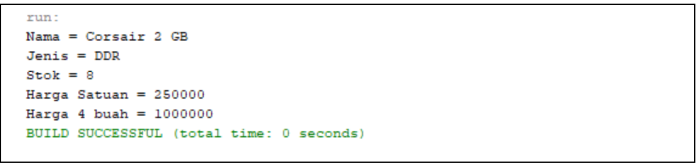


### 2.3.3 Pertanyaan
1. Pada class BarangMain, pada baris berapakah proses instansiasi dilakukan? Dan apa nama objek
yang dihasilkan?

    **pada baris 19-25, nama objeknya : b1.namaBarang = "Xiaomi";
    b1.jenisBarang = "Smartphone"; 
    b1.hargaSatuan = 1750000; 
    b1.stok = 10; 
    b1.tambahStok(1); 
    b1.kurangStok(3); 
    b1.tampilBarang();**
2. Bagaimana cara mengakses atribut dan method dari suatu objek?

    **Sekali object tersebut dibuat, semua anggota (attribute dan method) bisa diakses oleh object tersebut.**


### 2.4 Membuat Konstruktor
Waktu : 45 Menit

Di dalam percobaan ini, kita akan mempraktekkan bagaimana membuat berbagai macam
konstruktor berdasarkan parameternya.


### 2.4.1 Langkah-langkah Percobaan
1. Perhatikan kembali class Barang. Tambahkan di dalam class Barang tersebut 2 buah
konstruktor. 1 konstruktor default dan 1 konstruktor berparameter.
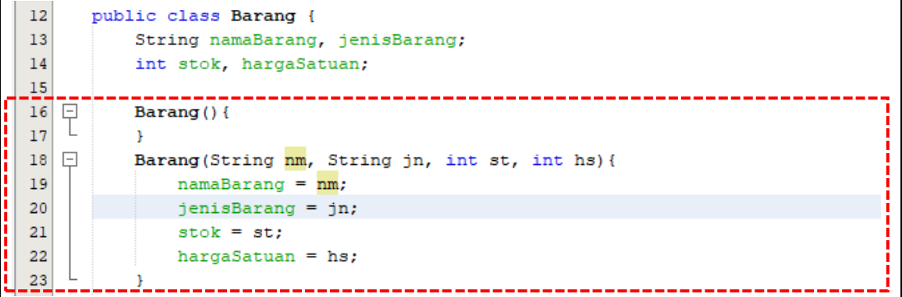
2. Buka kembali class BarangMain. Dan buat sebuah objek lagi, kali ini dengan menggunakan
konstruktor berparameter.
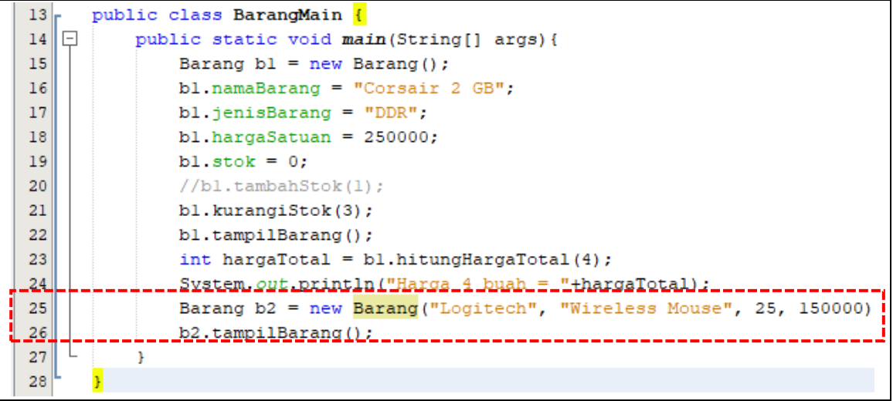
3. Jalankan kembali class BarangMain dan amati hasilnya.
>Hasil output :
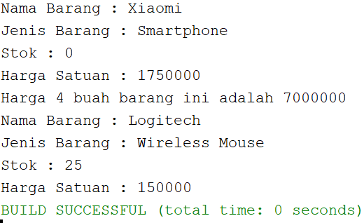

>Code Barang
```java
public class Barang {
    String namaBarang, jenisBarang;
        int stok, hargaSatuan;
        
        Barang(){
        }
        Barang(String nm, String jn, int st, int hs){
            namaBarang = nm;
            jenisBarang = jn;
            stok = st;
            hargaSatuan = hs;
        }
        
        void tampilBarang(){
            System.out.println("Nama Barang : " +namaBarang);
            System.out.println("Jenis Barang : " +jenisBarang);
            System.out.println("Stok : " + stok);
            System.out.println("Harga Satuan : " + hargaSatuan);
        }
        void tambahStok(int n){
            stok = stok + n;
        }
        void kurangStok(int n){
            stok = stok - n;
        }
        int hitungHargaTotal(int jumlah){
            return jumlah*hargaSatuan;
        }
    }
```
>Code BarangMain
```java
public class BarangMain {
        public static void main (String[] args){
            Barang b1 = new Barang();
            b1.namaBarang = "Xiaomi";
            b1.jenisBarang = "Smartphone";
            b1.hargaSatuan = 1750000;
            b1.stok = 0;
            //b1.tambahStok(1);
            //b1.kurangStok(3);
            b1.tampilBarang();
            int hargaTotal = b1.hitungHargaTotal(4);
            System.out.println("Harga 4 buah barang ini adalah " + hargaTotal);
            Barang b2 = new Barang("Logitech", "Wireless Mouse", 25, 150000);
            b2.tampilBarang();
        }
    }
```


### 2.4.2 Verifikasi Hasil Percobaan
Cocokkan hasil compile kode program anda dengan gambar berikut ini.
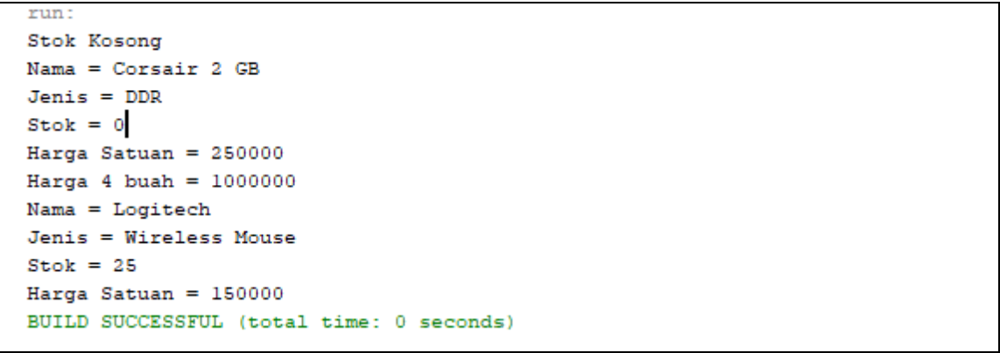


2.4.3 Pertanyaan
1. Perhatikan class Barang yang ada di Praktikum 2.4.1, pada baris berapakah deklarasi
konstruktor berparameter dilakukan?

    **pada baris ke 18**
2. Perhatikan class BarangMain di Praktikum 2.4.1, apa sebenarnya yang dilakukan pada baris
program dibawah ini?


**baris code tersebut berguna untuk menyiapkan barang ke 2 yang ingin di masukkan lalu nanti ditampilkannya dengan menggunakan code b2.tampilBarang().**
3. Coba buat objek dengan nama b3 dengan menggunakan konstruktor berparameter dari class
Barang.
>Hasil output
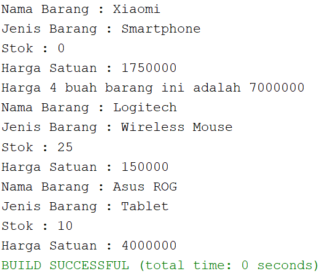

>Code
```java
public class BarangMain {
        public static void main (String[] args){
            Barang b1 = new Barang();
            b1.namaBarang = "Xiaomi";
            b1.jenisBarang = "Smartphone";
            b1.hargaSatuan = 1750000;
            b1.stok = 0;
            //b1.tambahStok(1);
            //b1.kurangStok(3);
            b1.tampilBarang();
            int hargaTotal = b1.hitungHargaTotal(4);
            System.out.println("Harga 4 buah barang ini adalah " + hargaTotal);
            Barang b2 = new Barang("Logitech", "Wireless Mouse", 25, 150000);
            b2.tampilBarang();
            Barang b3 = new Barang("Asus ROG", "Tablet", 10, 4000000);
            b3.tampilBarang();
        }
    }
```


### 2.5 Latihan Praktikum
Waktu : 60 Menit
1. Buat program berdasarkan diagram class berikut ini!
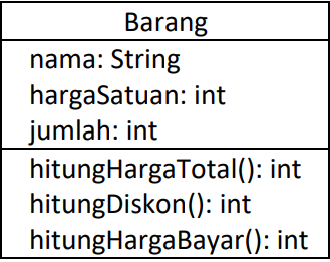

- Method hitungHargaTotal() digunakan untuk menghitung harga total yang merupakan
perkalian antara hargaSatuan dengan jumlah barang yang dibeli
- Method hitungDiskon() digunakan untuk menghitung diskon dengan aturan sbb:
    - Jika harga total > 100000, akan mendapat diskon 10%
    - Jika harga total mulai dari 50000 sampai 100000 akan mendapat diskon sebesar 5%
    - Jika dibawah 50000 tidak mendapat diskon
- Method hitungHargaBayar() digunakan untuk menghitung harga total setelah dikurangi
diskon
>Hasil output
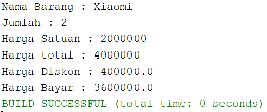

>Code Java
```java
public class barangDiskon {
    String nama;
    int hargaSatuan, jumlah;
    int hargaTot;
    float diskon;
    float harga;
    
    barangDiskon(){
        }
    barangDiskon(String nm, int jm, int hs){
            nama = nm;
            jumlah = jm;
            hargaSatuan = hs;
        }
    void tampilBarang(){
            System.out.println("Nama Barang : " +nama);
            System.out.println("Jumlah : " + jumlah);
            System.out.println("Harga Satuan : " + hargaSatuan);
            System.out.println("Harga total : " + hargaTot);
            System.out.println("Harga Diskon : " + diskon);
            System.out.println("Harga Bayar : " + harga);
    }
    int hitungHargaTotal(int jumlah){
        hargaTot = hargaSatuan*jumlah;
        return hargaSatuan;
    }
    void hitungDiskon(){
        if(hargaTot > 100000){
            diskon = (float)(hargaTot*0.1);
        }else if(hargaTot >=50000 && hargaTot <=100000){
            diskon = (float)(hargaTot*0.05);
        }
    }
    void hitungHargaBayar(){
        harga = (float)(hargaTot - diskon);
    } 
}
```

>Code JavaMain
```java
public class barangDiskonMain {
    public static void main(String[] args) {
barangDiskon ds = new barangDiskon();
            ds.nama = "Xiaomi";
            ds.hargaSatuan = 2000000;
            ds.jumlah = 2;
            int hargaTotal = ds.hitungHargaTotal(ds.jumlah);
            ds.hitungDiskon();
            ds.hitungHargaBayar();
            ds.tampilBarang();
    } 
}
```
2. Buat program berdasarkan diagram class berikut ini!
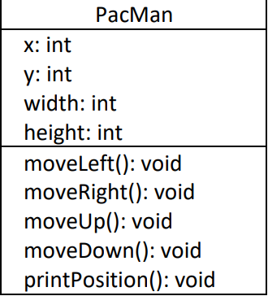
- Atribut x digunakan untuk menyimpan posisi koordinat x (mendatar) dari pacman, sedangkan
atribut y untuk posisi koordinat y (vertikal)
- Atribut width digunakan untuk menyimpan lebar dari area permainan, sedangkan height
untuk menyimpan panjang area
- Method moveLeft() digunakan untuk mengubah posisi pacman ke kiri (koordinat x akan
berkurang 1), sedangkan moveRight() untuk bergerak ke kanan (koordinat x akan bertambah
1). Perlu diperhatikan bahwa koordinat x tidak boleh lebih kecil dari 0 atau lebih besar dari
nilai width
- Method moveUp() digunakan untuk mengubah posisi pacman ke atas (koordinat y akan
berkurang 1), sedangkan moveDown() untuk bergerak ke bawah (koordinat y akan bertambah
1). Perlu diperhatikan bahwa koordinat y tidak boleh lebih kecil dari 0 atau lebih besar dari
nilai height

>Hasil output : <p>
>Titik awal PacMan :
>>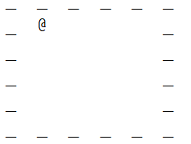
>Perubahan posisi ketika menekan "d" menuju ke arah kanan
>>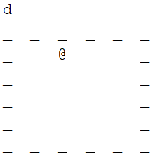
>Perubahan posisi ketika menekan "s" menuju ke arah bawah
>>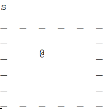
>Perubahan posisi ketika menekan "a" menuju ke arah kiri
>>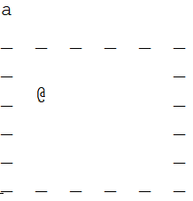
>Perubahan posisi ketika menekan "w" menuju ke arah keatas
>>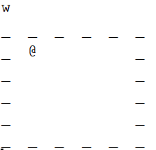
>Perubahan posisi ketika mengetik "keluar" maka game akan berakhir
>>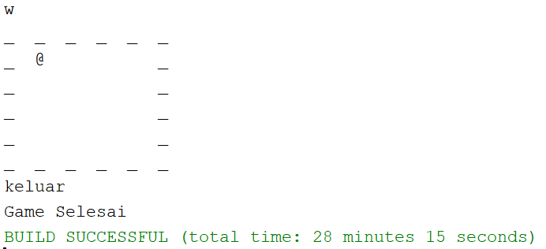

>Source code Java
``` java
public class PacMan {
    int x,y,width,height;
    
    PacMan(){
    }
    PacMan(int xh, int yv, int w, int h){
        x = xh;
        y = yv;
        width = w;
        height = h;
    }
           
    void moveLeft(){
        if(x > 1)x--;
        printPosition();
    }
    void moveRight(){
        if(x < width)x++;
        printPosition();
    }
    void moveUp(){
        if(y > 1)y--;
        printPosition();
    }
    void moveDown(){  
        if(y < height)y++;
        printPosition();
    } 
    void printPosition(){ 
        for(int e = 0; e <= height; e++){
            for(int g = 0; g <= width; g++){
                if(e == 0 || e == height || g == 0 || g == width){
                    System.out.print("_  ");
                }else if(e == y && g == x){
                    System.out.print("@  ");
                }else{
                    System.out.print("   ");
                }
            }
            System.out.println();
        }
    
    }
}
```
>Source code JavaMain
```java
import java.util.Scanner;
public class PacManMain {
    public static void main(String[] args) {
        PacMan runner = new PacMan(1, 1, 5, 5);
        Scanner sc = new Scanner(System.in);
        
        runner.printPosition();
        loop : while(true){
            switch(sc.nextLine()){
                case "a" :
                    runner.moveLeft();
                    break;
                case "d" :
                    runner.moveRight();
                    break;
                case "w" :
                    runner.moveUp();
                    break;
                case "s" :
                    runner.moveDown();
                    break;
                case "keluar" :
                    System.out.println("Game Selesai");
                    break loop;
            }
        }
    }
    
}
```
