## **<center>Jobsheet Pertemuan 3</center>**

><p>Nama : Muhammad Ega Rama Fernanda<p>
>Kelas : 1F<p>
>Nomer Absen : 19<p>
>Prodi : D-IV Teknik Inormatika<p>
>Jurusan : Teknologi Inormasi<p>
><center> Politeknik Negeri Malang</center>


<br>

### 3.1 Tujuan Praktikum
    Setelah melakukan materi praktikum ini, mahasiswa mampu:
1. Memahami dan menjelaskan fungsi array yang berisikan variabel objek.
2. Mahasiswa mampu menangkap logika tentang permasalahan array of object dalam Java
3. Mahasiswa mampu menerapkan pembuatan array of object dalam Java

### 3.2 Membuat Array dari Object, Mengisi dan Menampilkan
    Didalam praktikum ini, kita akan mempraktekkan bagaimana membuat array dari object, kemudian mengisi dan menampilkan array tersebut.

#### 3.2.1 Langkah-langkah Percobaan
1. Buat Project baru, dengan nama “ArrayObjects”. Buat package dengan nama minggu3.
2. Buat class PersegiPanjang:
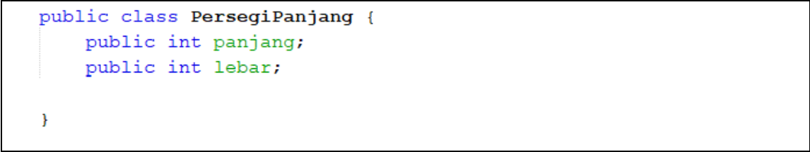
3. Pada fungsi main yaitu pada class ArrayObjects, buatlah array PersegiPanjang yang berisi 3
elemen:
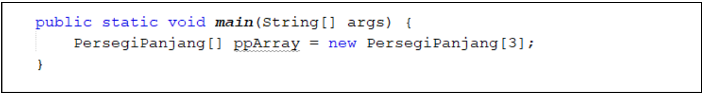
4. Kemudian isikan masing-masing atributnya:
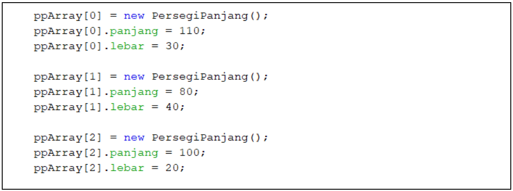
5. Cetak ke layar semua atribut dari objek ppArray:
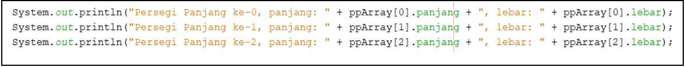
6. Jalankan dan amati hasilnya.

>Hasil output:
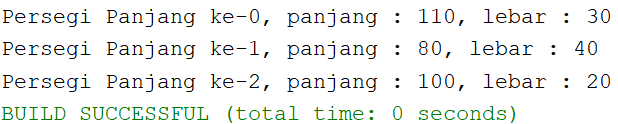

>Code PersegiPanjang
```java
public class PersegiPanjang {
    public int panjang;
    public int lebar;
```

>Code ArrayObjects (Sebagai MethodMain)
```java
    public static void main(String[] args){
        PersegiPanjang[] ppArray = new PersegiPanjang[3];
    
    ppArray[0] = new PersegiPanjang();
    ppArray[0].panjang = 110;
    ppArray[0].lebar = 30;
    
    ppArray[1] = new PersegiPanjang();
    ppArray[1].panjang = 80;
    ppArray[1].lebar = 40;
    
    ppArray[2] = new PersegiPanjang();
    ppArray[2].panjang = 100;
    ppArray[2].lebar = 20;
    
        System.out.println("Persegi Panjang ke-0, panjang : " + ppArray[0].panjang + ", lebar : " + ppArray[0].lebar);
        System.out.println("Persegi Panjang ke-1, panjang : " + ppArray[1].panjang + ", lebar : " + ppArray[1].lebar);
        System.out.println("Persegi Panjang ke-2, panjang : " + ppArray[2].panjang + ", lebar : " + ppArray[2].lebar);
    }
}
```


#### 3.2.2 Verifikasi Hasil Percobaan
    Cocokkan hasil compile kode program anda dengan gambar berikut ini.
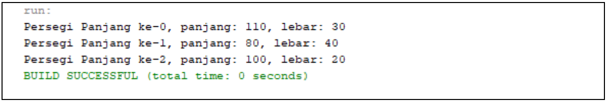


#### 3.2.3 Pertanyaan
1. Berdasarkan uji coba 3.2, apakah class yang akan dibuat array of object harus selalu memiliki
atribut dan sekaligus method?Jelaskan!

    **Harus ada, karena atribut di class berupa variabel yang akan dibaca di method, dan method berguna untuk tindakan yang bisa dilakukan di dalam class.**
2. Apakah class PersegiPanjang memiliki konstruktor?Jika tidak, kenapa dilakukan pemanggilan
konstruktur pada baris program berikut :
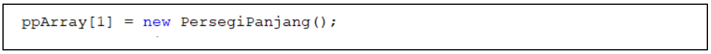

    **
3. Apa yang dimaksud dengan kode berikut ini:
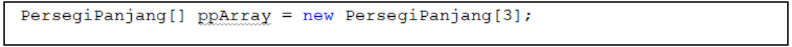

    **Maksud code tersebut untuk menunjukan array persegi panjang dari class persegi panjang yang berperan sebagai tipe data, ppArray hanya sebagai nama dari array tersebut, lalu diakhir kurung persegi dengan nomer 3 berguna untuk menentukan jumlah objeknya.**
4. Apa yang dimaksud dengan kode berikut ini:
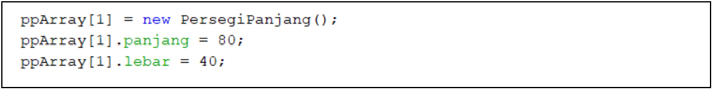

    **Maksud kode tersebut untuk menunjukan indeks atau jumlah dari objek yang sudah ditentukan diawal kita jabarkan lagi mulai dari 0 hingga 2, dengan begitu jumlahnya menjadi 3 objek.**
5. Mengapa class main dan juga class PersegiPanjang dipisahkan pada uji coba 3.2?

    **Karena disaat class PersegiPanjang dan main class nya dipisahkan akan membuat sebuah source code tersebut lebih mudah diatur**


### 3.3 Menerima Input Isian Array Menggunakan Looping
    Pada praktikum ini kita akan mengubah hasil program dari praktikum 3.2 sehingga program dapat menerima input dan menggunakan looping untuk mengisikan atribut dari semua persegi panjang yang ada di ppArray.


#### 3.3.1 Langkah-langkah Percobaan
1. Import scanner pada class ArrayObjects.
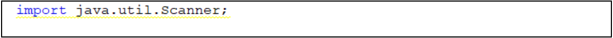
Note: Letakkan kode import dibawah kode package.
2. Pada praktikum 3.2 poin nomor 4, ganti kodenya dengan kode berikut ini, yaitu membuat objek
Scanner untuk menerima input, kemudian melakukan looping untuk menerima input:
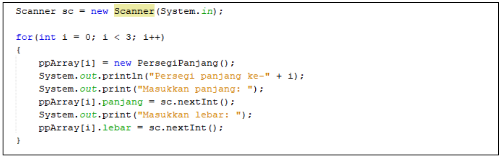
3. Pada praktikum 3.2 poin nomor 5, ganti kodenya dengan berikut ini, yaitu melakukan looping
untuk mengakses isi array ppArray dan menampilkannya ke layar: 
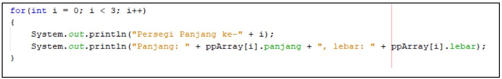
4. Jalankan dan amati hasilnya.

>Hasil output:
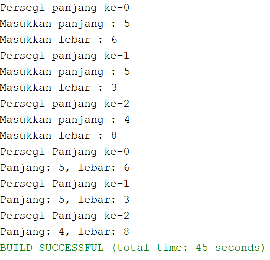

>Code yang diubah di MethodMain ArrayObjects
```java
public class ArrayObjects {
    public static void main(String[] args) {
        PersegiPanjang[] ppArray = new PersegiPanjang[3];
        Scanner sc = new Scanner(System.in);
        
        for(int i = 0; i<3; i++){
            ppArray[i] = new PersegiPanjang();
            System.out.println("Persegi panjang ke-" +i);
            System.out.print("Masukkan panjang : ");
            ppArray[i].panjang = sc.nextInt();
            System.out.print("Masukkan lebar : ");
            ppArray[i].lebar = sc.nextInt();
        }
        for(int i = 0; i<3; i++){
            System.out.println("Persegi Panjang ke-" +i);
            System.out.println("Panjang: " + ppArray[i].panjang + ", lebar: " + ppArray[i].lebar);
        }
    }
}
```


#### 3.3.2 Verifikasi Hasil Percobaan
    Contoh verifikasi hasil percobaan ini.
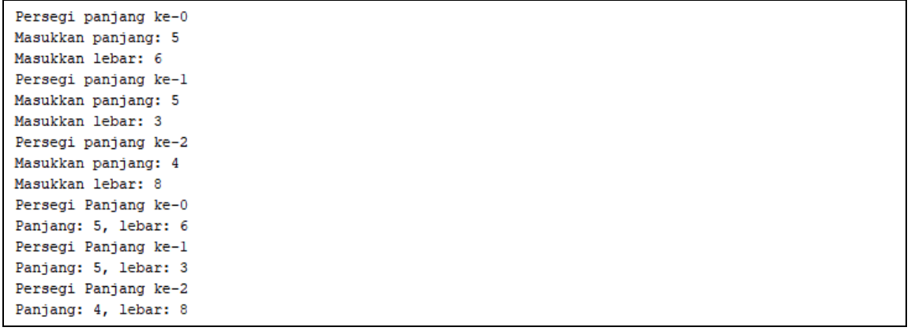


#### 3.3.3 Pertanyaan
1. Apakah array of object dapat diimplementasikan pada array 2 Dimensi?

    **Bisa**
2. Jika jawaban soal no satu iya, berikan contohnya! Jika tidak, jelaskan!

    **Misalkan perihal tentang nomer meja ditempatkan oleh siapa, nah disitu nanti kita membuat String[][] meja = new String[2][3], yang dimana 2 menunjukan baris dan 3 menunjukan kolom.**
3. Jika diketahui terdapat class Persegi yang memiliki atribut sisi bertipe integer, maka kode
dibawah ini akan memunculkan error saat dijalankan. Mengapa?
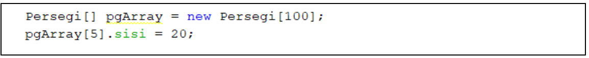

    **karena tidak ada Deklarasi dan Instansiasi Array Of Object pada program tersebut sehingga menghasilkan eror**
4. Modifikasi kode program pada praktikum 3.3 agar length array menjadi inputan dengan Scanner!

>Hasil output:
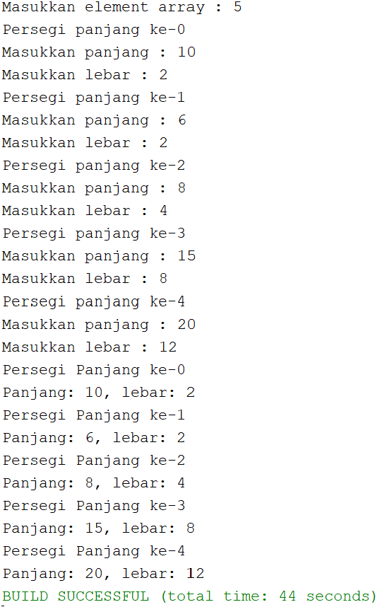

>Code yang di modif:
```java
import java.util.Scanner;
/**
 *
 * @author EgaRam
 */
public class ArrayObjects {
    public static void main(String[] args) {
        Scanner sc = new Scanner(System.in);
        int jumlah;
        System.out.print("Masukkan element array : ");
        jumlah = sc.nextInt();
        PersegiPanjang[] ppArray = new PersegiPanjang[jumlah];
        
        
        for(int i = 0; i<ppArray.length; i++){
            ppArray[i] = new PersegiPanjang();
            System.out.println("Persegi panjang ke-" +i);
            System.out.print("Masukkan panjang : ");
            ppArray[i].panjang = sc.nextInt();
            System.out.print("Masukkan lebar : ");
            ppArray[i].lebar = sc.nextInt();
        }
        for(int i = 0; i<ppArray.length; i++){
            System.out.println("Persegi Panjang ke-" +i);
            System.out.println("Panjang: " + ppArray[i].panjang + ", lebar: " + ppArray[i].lebar);
        }
    }
}
```

5. Apakah boleh Jika terjadi duplikasi instansiasi array of objek, misalkan saja instansiasi dilakukan
pada ppArray[i] sekaligus ppArray[0]?Jelaskan !

    **karena akan terjadi error terhadap system. System akan bingung membaca program kita terdapat 2x instansiasi pparray[0].**


### 3.4 Operasi Matematika Atribut Object Array
    Pada praktikum ini kita akan melakukan pengoperasian matematika beberapa atribut pada masing-masing anggota array.


#### 3.4.1 Langkah-langkah Percobaan
1. Buat package baru “ArrayBalok”.
2. Buat class Balok:
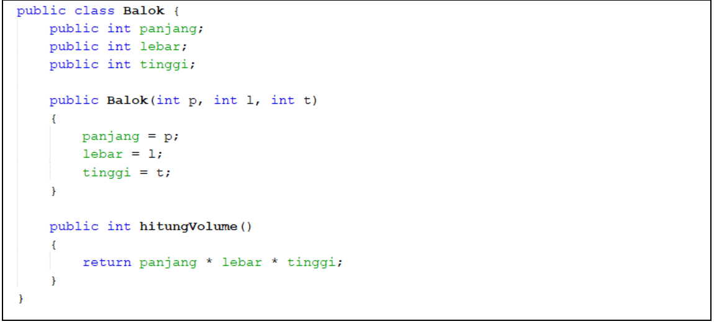
3. Pada fungsi main yaitu pada class ArrayBalok, buat array Balok yang berisi 3 elemen:
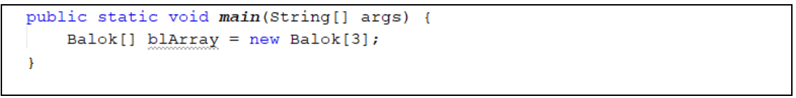
4. Kemudian tambahkan kode berikut ini untuk mengisi array blArray menggunakan konstruktor dari class Balok:
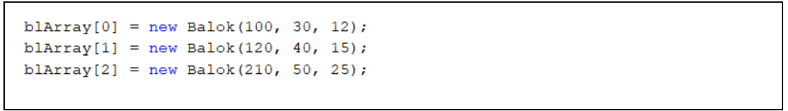
5. Tampilkan semua volume balok tersebut dengan cara memanggil method hitungVolume() di dalam looping seperti berikut ini:
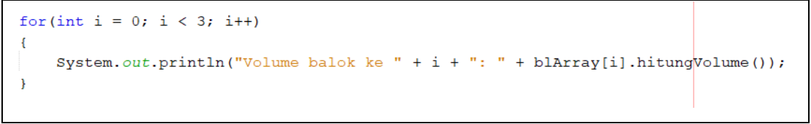
6. Jalankan dan amati hasilnya.

>Hasil output:
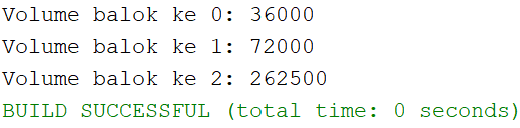

>Code class Balok
```java
public class Balok {
    public int panjang;
    public int lebar;
    public int tinggi;
    
    public Balok(int p, int l, int t){
        panjang = p;
        lebar = l;
        tinggi = t;
    }
    public int hitungVolume(){
        return panjang*lebar*tinggi;
    }
}
```
>Code ArrayBalokMain
```java
public class ArrayBalok {
    public static void main(String[] args) {
        Balok[] blArray = new Balok[3];
    
    blArray[0] = new Balok(100, 30, 12);
    blArray[1] = new Balok(120, 40, 15);
    blArray[2] = new Balok(210, 50, 25);       
    
    for(int i = 0; i<3; i++){
        System.out.println("Volume balok ke " +i + ": " + blArray[i].hitungVolume());
    }
    }
}
```


#### 3.4.2 Verifikasi Hasil Percobaan
    Cocokkan hasil compile kode program anda dengan gambar berikut ini.
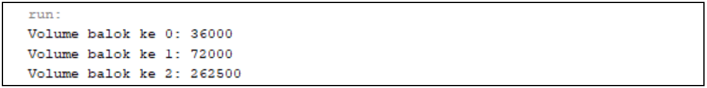


#### 3.4.3 Pertanyaan
1. Dapatkah konstruktor berjumlah lebih dalam satu kelas? Jelaskan dengan contoh!

    **Dapat, karena java mengijinkan lebih dari satu konstruktor (overloading) untuk setiap class, salah satu konstruktor yang ada, pasti akan dieksekusi pada saat pertama kali instance dari suatu class (new). konstruktor mana yang dipanggil dari parameter yang dilewatkan.**
2. Jika diketahui terdapat class Segitiga seperti berikut ini:
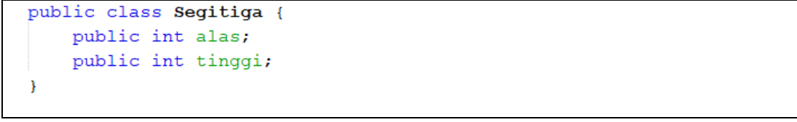
Tambahkan konstruktor pada class Segitiga tersebut yang berisi parameter int a, int t
yang masing-masing digunakan untuk mengisikan atribut alas dan tinggi.
```java
public class segitiga {
    public int alas;
    public int tinggi;

public segitiga(int a, int t){
    alas = a;
    tinggi = t;  
}
```
3. Tambahkan method hitungLuas() dan hitungKeliling() pada class Segitiga
tersebut.
```java
public double hitungLuas(){
    return alas*tinggi*0.5;
}
public int hitungKeliling(){
    return alas*3;
}
}
```
4. Pada fungsi main, buat array Segitiga sgArray yang berisi 4 elemen, isikan masing-masing
atributnya sebagai berikut:
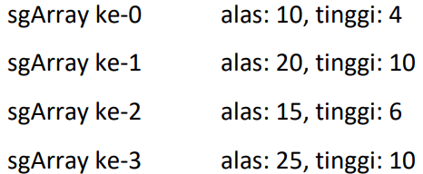
```java
public static void main(String[] args) {
    segitiga[] sgArray = new segitiga[4];
    
    sgArray[0] = new segitiga(10, 4);
    sgArray[1] = new segitiga(20, 10);
    sgArray[2] = new segitiga(15, 6);
    sgArray[3] = new segitiga(25, 10);
```
5. Kemudian menggunakan looping, cetak luas dan keliling dengan cara memanggil method
hitungLuas() dan hitungKeliling().
```java
for(int i = 0; i<4; i++){
        System.out.println("Luas segitiga ke- " +i + ": " + sgArray[i].hitungLuas());
        System.out.println("Keliling segitiga ke- " +i + ": " + sgArray[i].hitungKeliling());
    }   
    }
}
```

>Hasil output:
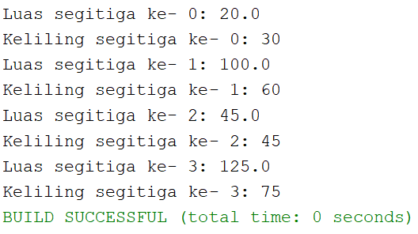

>Code segitiga class :
```java
public class segitiga {
    public int alas;
    public int tinggi;

public segitiga(int a, int t){
    alas = a;
    tinggi = t;  
}
public double hitungLuas(){
    return alas*tinggi*0.5;
}
public int hitungKeliling(){
    return alas*3;
}
}
```
>Code segitigaMain :
```java
public class segitigaMain {

    public static void main(String[] args) {
    segitiga[] sgArray = new segitiga[4];
    
    sgArray[0] = new segitiga(10, 4);
    sgArray[1] = new segitiga(20, 10);
    sgArray[2] = new segitiga(15, 6);
    sgArray[3] = new segitiga(25, 10);
    
    for(int i = 0; i<4; i++){
        System.out.println("Luas segitiga ke- " +i + ": " + sgArray[i].hitungLuas());
        System.out.println("Keliling segitiga ke- " +i + ": " + sgArray[i].hitungKeliling());
    }   
    }
    }
```


### 3.5 Latihan Praktikum
1. Buatlah program yang dapat menghitung luas permukaan dan volume beberapa bangun ruang
(minimal 3, jenis bangun luas bebas). Buatlah 3 (tiga) class sesuai dengan jumlah jenis bangun
ruang. Dan buat satu main class untuk membuat array of objek yang menginputkan atribut-atribut
yang ada menggunakan konstruktor semua bangun ruang tersebut.
Keterangan : Buat looping untuk menginputkan masing-masing atributnya, kemudian tampilkan
luas permukaan dan volume dari tiap jenis bangun ruang tersebut.

>Hasil output :
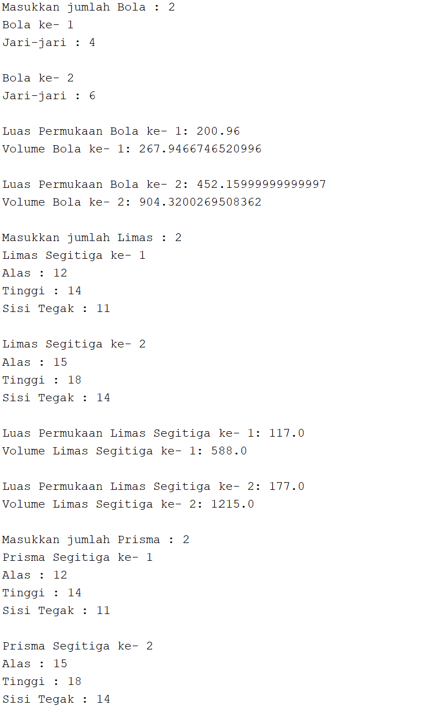
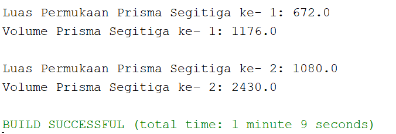

>Code bola class :
```java
public class bola {
    double jariJari;
    
public double hitungLuasPermukaanB(){
    return (4*3.14*jariJari*jariJari);
}
public double hitungVolumeB(){
    return (4/(float)3*3.14*jariJari*jariJari*jariJari);
}
}
```
>Code limasSegitiga class :
```java
public class limasSegitiga {
    double alas, tinggi, sisiTegak;

public double hitungLuasPermukaan(){
    return alas*tinggi/2 + 3*sisiTegak;
}
public double hitungVolume(){
    return (0.5*(0.5*alas*tinggi)*tinggi);
}
}
```
>Code prismaSegitiga class :
```java
public class prismaSegitiga {
    double alasP, tinggiP, sisiTegakP;
    
public double hitungLuasPermukaanP(){
    return ((alasP*3) * tinggiP + 2 * 1/(float)2 * alasP * tinggiP);
}
public double hitungVolumeP(){
    return ((1/(float)2 * alasP * tinggiP) * tinggiP);
}
}
```
>Code latihan1Main :
```java
import java.util.Scanner;
public class latihan1Main {

    public static void main(String[] args) {
    Scanner sc = new Scanner(System.in);
    int bla, lim, prim;
    System.out.print("Masukkan jumlah Bola : ");
    bla = sc.nextInt();
    bola [] bl = new bola[bla];
    
    for(int i = 0; i<bl.length; i++){
            bl[i] = new bola();
            System.out.println("Bola ke- " +(i+1));
            System.out.print("Jari-jari : ");
            bl[i].jariJari = sc.nextDouble();
            System.out.println();
    }
    for(int i = 0; i<bl.length; i++){
        System.out.println("Luas Permukaan Bola ke- " +(i+1) + ": " + bl[i].hitungLuasPermukaanB());
        System.out.println("Volume Bola ke- " +(i+1) + ": " + bl[i].hitungVolumeB());
        System.out.println();
    }
    
    System.out.print("Masukkan jumlah Limas : ");
    lim = sc.nextInt();
    limasSegitiga [] lm = new limasSegitiga[lim];
    
    for(int i = 0; i<lm.length; i++){
            lm[i] = new limasSegitiga();
            System.out.println("Limas Segitiga ke- " +(i+1));
            System.out.print("Alas : ");
            lm[i].alas = sc.nextDouble();
            System.out.print("Tinggi : ");
            lm[i].tinggi = sc.nextDouble();
            System.out.print("Sisi Tegak : ");
            lm[i].sisiTegak = sc.nextDouble();
            System.out.println();
    }
    for(int i = 0; i<lm.length; i++){
        System.out.println("Luas Permukaan Limas Segitiga ke- " +(i+1) + ": " + lm[i].hitungLuasPermukaan());
        System.out.println("Volume Limas Segitiga ke- " +(i+1) + ": " + lm[i].hitungVolume());
        System.out.println();
    }
    
    System.out.print("Masukkan jumlah Prisma : ");
    prim = sc.nextInt();
    prismaSegitiga [] pr = new prismaSegitiga[prim];
    
    for(int i = 0; i<pr.length; i++){
            pr[i] = new prismaSegitiga();
            System.out.println("Prisma Segitiga ke- " +(i+1));
            System.out.print("Alas : ");
            pr[i].alasP = sc.nextDouble();
            System.out.print("Tinggi : ");
            pr[i].tinggiP = sc.nextDouble();
            System.out.print("Sisi Tegak : ");
            pr[i].sisiTegakP = sc.nextDouble();
            System.out.println();
    }
    for(int i = 0; i<pr.length; i++){
        System.out.println("Luas Permukaan Prisma Segitiga ke- " +(i+1) + ": " + pr[i].hitungLuasPermukaanP());
        System.out.println("Volume Prisma Segitiga ke- " +(i+1) + ": " + pr[i].hitungVolumeP());
        System.out.println();
    }
    }
}
```

2. Sebuah perusahaan jual beli tanah membutuhkan sebuah program yang dapat memberitahu luas
tanah. Program tersebut dapat menerima input jumlah tanah yang akan dihitung dan atribut panjang dan lebar masing-masing dari tanah yang diinputkan. Program dapat menampilkan luas
tanah masing-masing tanah yang diinputkan tadi dan juga tanah terluas dari ketiga tanah yang
ada. Contoh output program:
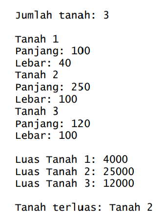

>Hasil output :
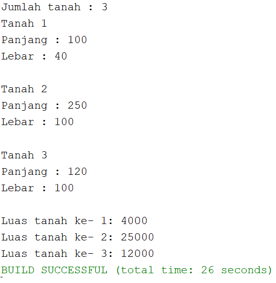

>Code latihan2 class :
```java
public class latihan2 {
    int panjang;
    int lebar;
    
public int hitungLuas(){
    return panjang*lebar;
}
}
```
>Code latihan2Main :
```java
import java.util.Scanner;
public class latihan2Main {

    public static void main(String[] args) {
    Scanner sc = new Scanner(System.in);
    int tanah;
    System.out.print("Jumlah tanah : ");
    tanah = sc.nextInt();
    latihan2 [] l2 = new latihan2[tanah];
    
    for(int i = 0; i<l2.length; i++){
            l2[i] = new latihan2();
            System.out.println("Tanah " +(i+1));
            System.out.print("Panjang : ");
            l2[i].panjang = sc.nextInt();
            System.out.print("Lebar : ");
            l2[i].lebar = sc.nextInt();
            System.out.println();
    }
    for(int i = 0; i<l2.length; i++){
        System.out.println("Luas tanah ke- " +(i+1) + ": " + l2[i].hitungLuas());
    }
    }
}
```

3. Sebuah kampus membutuhkan program untuk menampilkan informasi mahasiswa berupa nama,
nim, jenis kelamin dan juga IPK mahasiswa. Program dapat menerima input semua informasi
tersebut, kemudian menampilkanya kembali ke user. Implementasikan program tersebut jika
dimisalkan terdapat 3 data mahasiswa yang tersedia. Contoh output program:
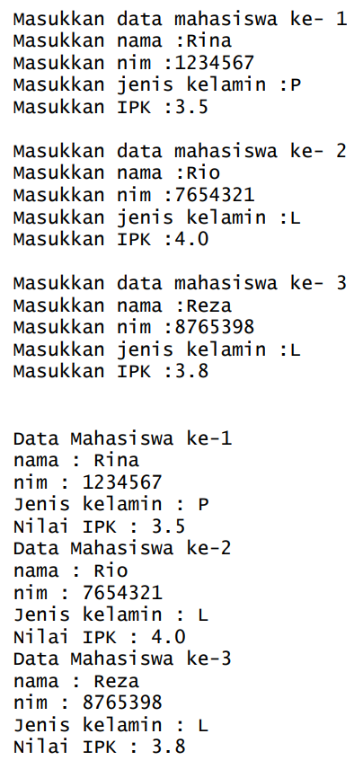

>Hasil output :
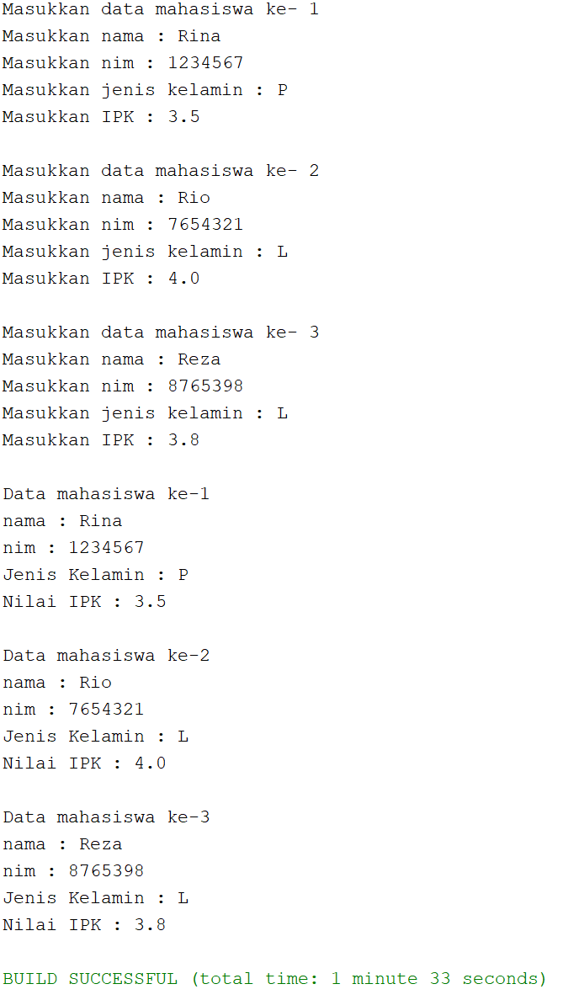

>Code latihan3 class :
```java
public class latihan3 {
    int nim;
    double ipk;
    String jk, nama;
}
```
>Code latihan3Main :
```java
import java.util.Scanner;
public class latihan3Main {
    public static void main(String[] args) {
        Scanner sc = new Scanner(System.in);
        Scanner st = new Scanner(System.in);
        Scanner sb = new Scanner(System.in);
        latihan3 [] l3 = new latihan3[3];
    
    for(int i = 0; i<3 ; i++){
        l3[i] = new latihan3();
            System.out.println("Masukkan data mahasiswa ke- " +(i+1));
            System.out.print("Masukkan nama : ");
            l3[i].nama = sc.nextLine();
            System.out.print("Masukkan nim : ");
            l3[i].nim = st.nextInt();
            System.out.print("Masukkan jenis kelamin : ");
            l3[i].jk = sc.nextLine();
            System.out.print("Masukkan IPK : ");
            l3[i].ipk = sb.nextDouble();
            System.out.println();
    }
    for(int i = 0; i<3; i++){
        System.out.println("Data mahasiswa ke-" +(i+1));
        System.out.println("nama : " + l3[i].nama);
        System.out.println("nim : " + l3[i].nim);
        System.out.println("Jenis Kelamin : " + l3[i].jk);
        System.out.println("Nilai IPK : " + l3[i].ipk);
        System.out.println();
    }
    }
}
```