## **<center>Jobsheet Pertemuan 4</center>**

><p>Nama : Muhammad Ega Rama Fernanda<p>
>Kelas : 1F<p>
>Nomer Absen : 19<p>
>Prodi : D-IV Teknik Inormatika<p>
>Jurusan : Teknologi Inormasi<p>
><center> Politeknik Negeri Malang</center>


<br>

### 4.1 Tujuan Praktikum
Setelah melakukan materi praktikum ini, mahasiswa mampu:
1. Mahasiswa mampu membuat algoritma bruteforce dan divide-conquer
2. Mahasiswa mampu menerapkan penggunaan algorima bruteforce dan divide-conquer
---
### 4.2 Menghitung Nilai Faktorial dengan Algoritma Brute Force dan Divide and Conquer
Perhatikan Diagram Class berikut ini :<p>
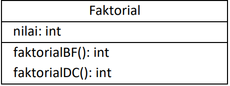<p>
Berdasarkan diagram class di atas, akan dibuat program class dalam Java. Untuk menghitung nilai
faktorial suatu angka menggunakan 2 jenis algoritma, Brute Force dan Divide and Conquer. Jika
digambarkan terdapat perbedaan proses perhitungan 2 jenis algoritma tersebut sebagai berikut :

Tahapan pencarian nilai faktorial dengan algoritma Brute Force :
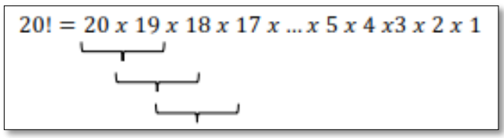<p>
Tahapan pencarian nilai faktorial dengan algoritma Divide and Conquer :
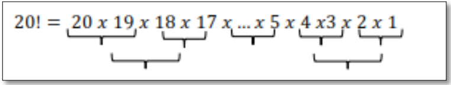<p>

---
#### 4.2.1 Langkah-langkah Percobaan
1. Buat Project baru, dengan nama “BruteForceDivideConquer”. Buat package dengan nama
minggu5.
2. Buatlah class baru dengan nama Faktorial
3. Lengkapi class Faktorial dengan atribut dan method yang telah digambarkan di dalam diagram
class di atas, sebagai berikut:
- Tambahkan atribut nilai
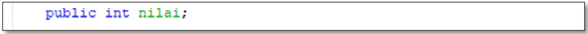
- Tambahkan method faktorialBF() nilai
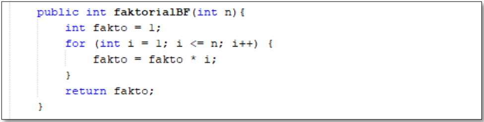
- Tambahkan method faktorialDC() nilai
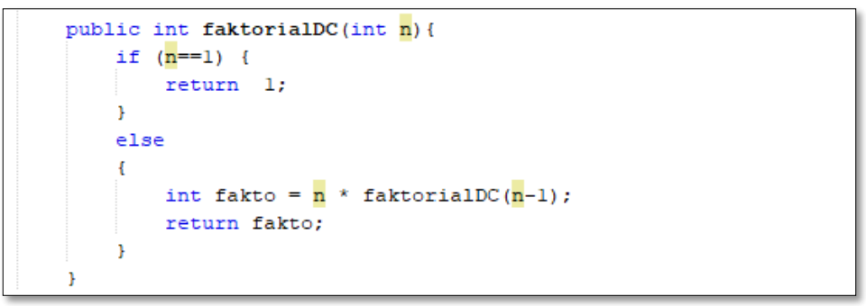

4. Coba jalankan (Run) class Faktorial dengan membuat class baru MainFaktorial.
- Di dalam fungsi main sediakan komunikasi dengan user untuk menginputkan jumlah angka
yang akan dicari nilai faktorialnya
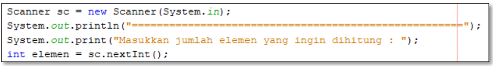
- Buat Array of Objek pada fungsi main, kemudian inputkan beberapa nilai yang akan
dihitung faktorialnya
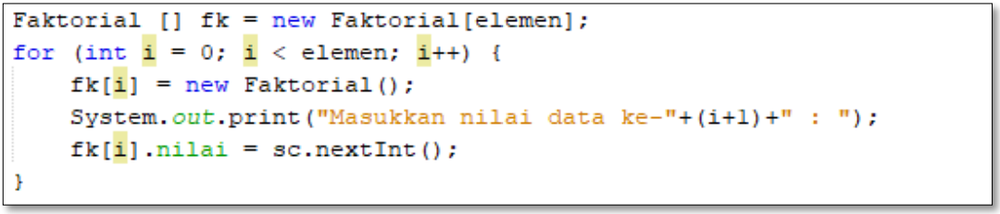
- Tampilkan hasil pemanggilan method faktorialDC() dan faktorialBF()
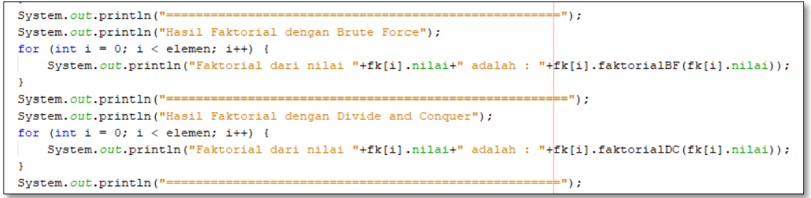
- Pastikan program sudah berjalan dengan baik!

>Source code FaktorialClass :
```java
package Minggu5;

/**
 *
 * @author EgaRam
 */
public class Faktorial {
    public int nilai;
    
    int faktorialBF(int n){
        int fakto = 1;
        for(int i=1; i <= n; i++){
            fakto *= i;
        }
        return fakto;
    }
    int faktorialDC(int n){
        if(n==1){
            return 1;
        }else{
            int fakto = n * faktorialDC(n-1);
            return fakto;
        }
    }
}
```
>Source code FaktorialMain :
```java
package Minggu5;
import java.util.Scanner;
/**
 *
 * @author EgaRam
 */
public class FaktorialMain {
    public static void main(String[] args) {
    Scanner sc = new Scanner(System.in);
        System.out.println("============");
        System.out.println("Input nilai yang di faktorialkan: ");
        int elemen = sc.nextInt();
        
        Faktorial[] fk = new Faktorial[elemen];
        for(int i = 0; i < elemen; i++){
            fk[i] = new Faktorial();
            System.out.println("Data ke-"+(i+1)+": ");
            fk[i].nilai = sc.nextInt();
        }
        System.out.println("++++++++++++");
        System.out.println("Hasil Faktorial dengan Brute Force");
        for(int i = 0; i < elemen; i++){
            System.out.println("Hasil faktorial dari nilai " + fk[i].nilai + " adalah " + fk[i].faktorialBF(fk[i].nilai));
        }
        System.out.println("++++++++++++");
        System.out.println("Hasil Faktorial dengan Divide and Conquer");
        for(int i = 0; i < elemen; i++){
            System.out.println("Hasil faktorial dari nilai " + fk[i].nilai + " adalah " + fk[i].faktorialBF(fk[i].nilai));
        }
    }
    
}
```

>Hasil Output :
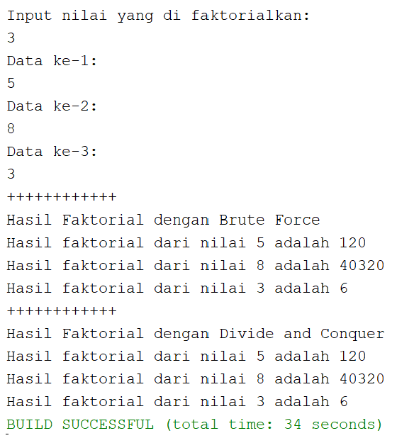

---
#### 4.2.2 Verifikasi Hasil Percobaan
Cocokkan hasil compile kode program anda dengan gambar berikut ini. 


---
#### 4.2.3 Pertanyaan
1. Jelaskan mengenai base line Algoritma Divide Conquer untuk melakukan pencarian nilai faktorial!

    **Dalam base line Algoritma Divide Conquer pada class factorial menggunakan pemilihan if (n==1) return 1; yang artinya jika nilai yang akan dimasukkan nantinya adalah 1 maka hasil yang akan ditampilkan oleh program main nantinya adalah 1 dan berfungsi sebagai batas dari divide conquer dimana perulangan kali akan berakhir saat n sudah sama dengan 1.**
2. Pada implementasi Algoritma Divide and Conquer Faktorial apakah lengkap terdiri dari 3 tahapan
divide, conquer, combine? Jelaskan masing-masing bagiannya pada kode program!

    - **Divide : membagi masalah menjadi beberapa masalah yang memiliki kemiripan dengan masalahsemula namun berukuran lebih kecil (idealnya berukuran hampir sama). Dalam kodingan percobaan 1 faktorial, divide ditujukan oleh adanya pemecahan masalah menjadi 2 masalah yang diisyaratkan dengan kondisi pemilihan if-else dimana if berperan sebagai base case dan else sebagai rekursif call.**
    - **Conquer: memecahkan (menyelesaikan) masing-masing upamasalah (secara rekursif). Dalam kodingan percobaan 1 faktorial, conquer ditujukan oleh adanya penyelesaian masalah secara reqursif dimana masalah diselesaikan masing-masing yang telah diisyaratkan pada codingan dalam else yang memberikan rumus int fakto = n * faktorialDC(n-1); yang berarti nanti setiap masalah akan dikalikan sendiri-sendiri.**
    - **Combine: mengabungkan solusi masing-masing masalah sehingga membentuk solusi masalah semula. Dalam kodingan percobaan 1 faktorial, combine ditujukan oleh adanya penarikan hasil keseluruhan berupa return atau pengembalian nilai dari proses rekursif pada tahap conquer yangdiisyaratkan pada return fakto; di else dalam method faktorialDC();**
3. Apakah memungkinkan perulangan pada method faktorialBF() dirubah selain menggunakan
for?Buktikan!

    **Bisa, selama termasuk looping maka jenis looping apapun bisa digunakan pada method faktorialBF() dan saya sudah mencoba membuktikannya dengan looping jenis while dan program tetap berjalan dengan baik.**
>Codingan :<p>
    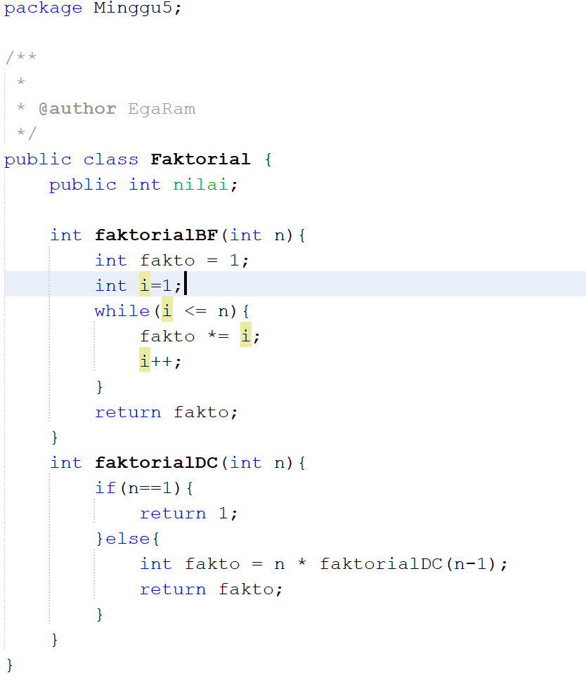<p>
>Output :<p>
    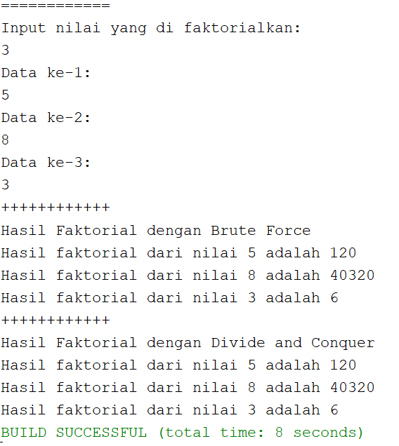<p>

4. Tambahkan pegecekan waktu eksekusi kedua jenis method tersebut!
>Menambah kan codingan untuk Waktu Awal di FaktorialMain :<p>
    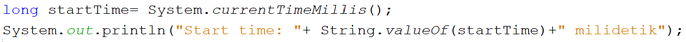<p>
>Menambah kan codingan untuk Waktu Akhir dan eksekusi di FaktorialMain :
    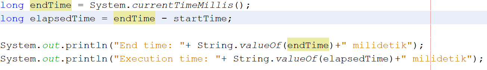<p>
>Hasil Output :<p>
    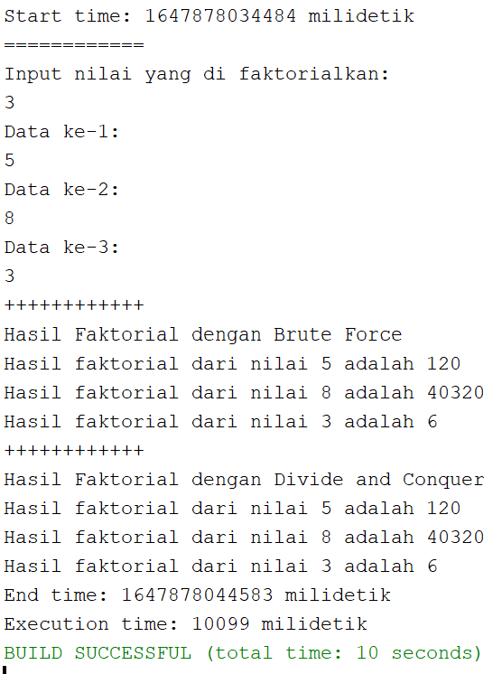<p>
5. Buktikan dengan inputan elemen yang di atas 20 angka, apakah ada perbedaan waktu eksekusi?
>Hasil Output :<p>
    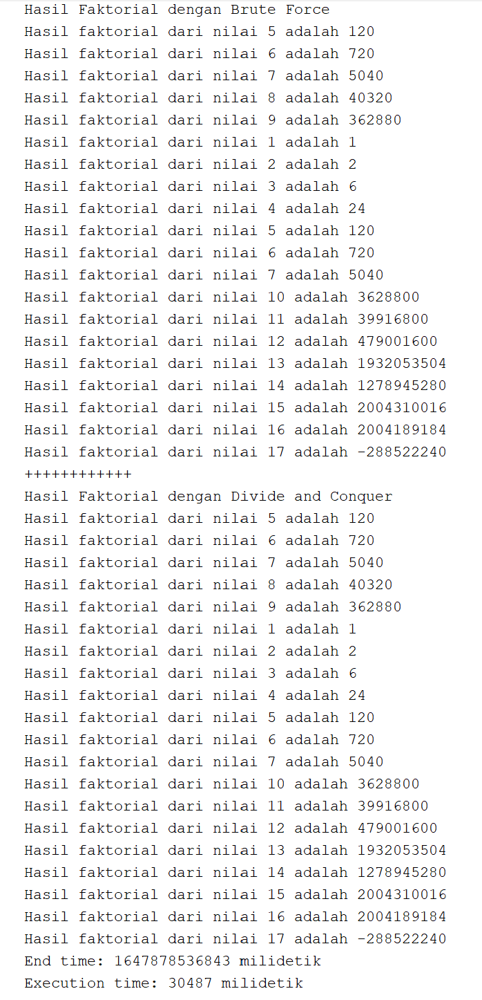<p>
    **Ada perbedaan waktu eksekusi yang sangat terlihat pada program dimana pada elemen yang berjumlah 3 waktu eksekusi yang diperlukan lebih sedikit daripada waktu eksekusi yang dibutuhkan oleh elemen yang berjumlah diatas 20 angka, untuk buktinya bisa anda lihat pada output program di atas.**

---
### 4.3 Menghitung Hasil Pangkat dengan Algoritma Brute Force dan Divide and Conquer
Pada praktikum ini kita akan membuat program class dalam Java. Untuk menghitung nilai pangkat
suatu angka menggunakan 2 jenis algoritma, Brute Force dan Divide and Conquer.

---
#### 4.3.1 Langkah-langkah Percobaan
1. Di dalam paket minggu5, buatlah class baru dengan nama Pangkat. Dan di dalam class Pangkat
tersebut, buat atribut angka yang akan dipangkatkan sekaligus dengan angka pemangkatnya
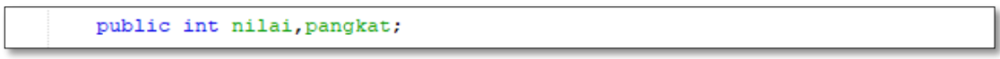
2. Pada class Pangkat tersebut, tambahkan method PangkatBF()
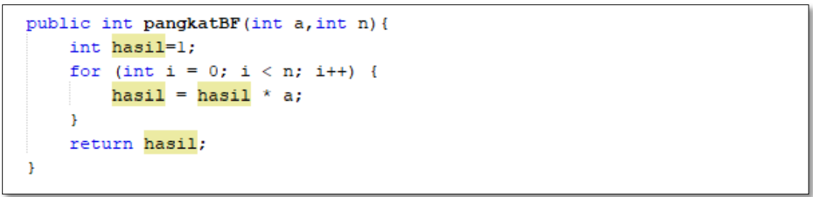
3. Pada class Pangkat juga tambahkan method PangkatDC()
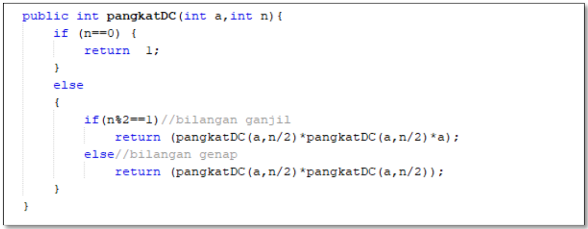
4. Perhatikan apakah sudah tidak ada kesalahan yang muncul dalam pembuatan class Pangkat
5. Selanjutnya buat class baru yang di dalamnya terdapat method main. Class tersebut dapat
dinamakan MainPangkat. Tambahkan kode pada class main untuk menginputkan jumlah nilai
yang akan dihitung pangkatnya.

6. Nilai pada tahap 5 selanjutnya digunakan untuk instansiasi array of objek. Di dalam Kode berikut
ditambahkan proses pengisian beberapa nilai yang akan dipangkatkan sekaligus dengan
pemangkatnya.
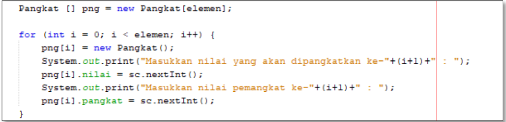
7. Kemudian, panggil hasil nya dengan mengeluarkan return value dari method PangkatBF() dan
PangkatDC().
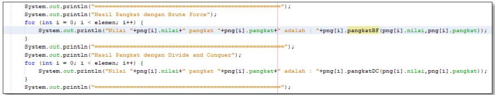

>Source code PangkatClass :
```java
package Minggu5.pangkat;

/**
 *
 * @author EgaRam
 */
public class Pangkat {
    int nilai, pangkat;
    
    int pangkatBF(int a, int n){
        int hasil = 1;
        for(int i = 0; i < n; i++){
            hasil *= a; 
        }
        return hasil;
    }
    int pangkatDC(int a, int n){
        if(n == 0){
            return 1;
        }else{
            if(n%2 == 1){
                return (pangkatDC(a,n/2)*pangkatDC(a,n/2)*a);
            }else{
                return (pangkatDC(a,n/2)*pangkatDC(a,n/2));
                }
        }
    }
}
```
>Source code PangkatMain :
```java
package Minggu5.pangkat;
import java.util.Scanner;
/**
 *
 * @author EgaRam
 */
public class PangkatMain {

    public static void main(String[] args) {
    Scanner sc = new Scanner(System.in);
        System.out.println("Masukkan jumlah elemen yang dihitung: ");
        int elemen = sc.nextInt();
        
        Pangkat[] png = new Pangkat[elemen];
        for(int i=0; i < elemen; i++){
            png[i] = new Pangkat();
            System.out.println("Masukkan nilai yang dipangkatkan: ");
            png[i].nilai = sc.nextInt();
            System.out.println("Masukkan nilai pemangkat ke-"+(i+1)+": ");
            png[i].pangkat = sc.nextInt();
        }
        System.out.println("Hasil pangkat dengan Brute Force");
        for(int i=0; i < elemen; i++){
            System.out.println("Nilai " +png[i].nilai+ " pangkat " + png[i].pangkat+" adalah " + png[i].pangkatBF(png[i].nilai,png[i].pangkat));
        }
        
        System.out.println("Hasil pangkat dengan Divide and Conquer");
        for(int i=0; i < elemen; i++){
            System.out.println("Nilai " +png[i].nilai+ " pangkat " + png[i].pangkat+" adalah " + png[i].pangkatBF(png[i].nilai,png[i].pangkat));
        }
    } 
}
```

>Hasil Output :
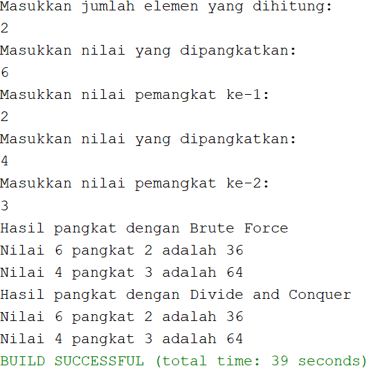

---
#### 4.3.2 Verifikasi Hasil Percobaan
Pastikan output yang ditampilkan sudah benar seperti di bawah ini.
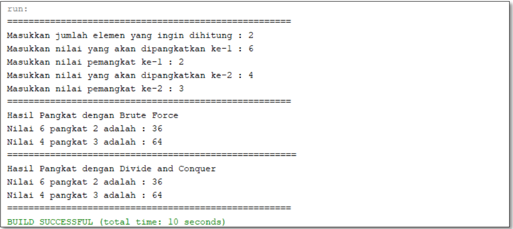

---
#### 4.3.3 Pertanyaan
1. Jelaskan mengenai perbedaan 2 method yang dibuat yaitu PangkatBF() dan PangkatDC()!

- **Pada method pangkatBF() operasi mencari hitung hasil pangkat dilakukan dengan cara bruteforce yang dilakukan dengan iterative/perulangan/looping dan algoritma brute forcenya adalah mendeklarasikan dahulu hasil = 1 lalu melakukan perulangan dengan batas n (pangkatnya) dan dalam perulangan tersebut dilakukan looping dari hasil tadi di kali dengan a (bilangan yang akan dipangkat) dan perulangan akan terus berlanjut hingga < n sehingga a akan menghasilkan nilai hasil dari pemangkatannya.**

- **Pada method pangkatDC() operasi mencari hitung hasil pangkat dilakukan dengan cara divide 
conquer yang dilakukan dengan rekursif dan algoritma divide conquer yang dilakukan terbagi 
dalam 3 tahap yaitu : divide => memecah masalah jadi beberapa masalah yang diimplementasikan 
dalam pemilihan kondisi berupa if-else pada method, lalu ada conquer => penyelesaian dari 
setiap beberapa masalah yang tercantum pada else dan terakhir ada combine => menggabungkan kembali menjadi sebuah solusi yang diimplementasikan pada return an di else.**

2. Pada method PangkatDC() terdapat potongan program sebagai berikut:
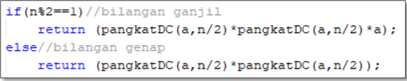
Jelaskan arti potongan kode tersebut

**Arti dari program tersebut adalah**
- **Jika n (pangkat bilangan) dimodulus 2 hasilnya adalah 1 maka returnnya (kembalian nilai) 
adalah hasil dari (pangkatDC(a,n/2) x pangkatDC(a, n/2) x a) karena bilangan pangkatnya adalah 
ganjil**

- **Jika n (pangkat bilangan) dimodulus 2 hasilnya adalah tidak sama dengan 1 maka returnnya 
(kembalian nilai) adalah hasil dari (pangkatDC(a,n/2) x pangkatDC(a, n/2) karena bilangan 
pangkatnya adalah genap**

3. Apakah tahap combine sudah termasuk dalam kode tersebut?Tunjukkan!

    **Sudah, tahap combine dalam kode tersebut ditunjukan pada sintaks return atau pengembalian nilai 
    dimana hasil dari conquer atau penyelesaian beberapa masalah sebelumnya di return kan semua dan dalam
    tahap combine dilakukan pemanggilan hasil dari bilangan berpangkat tersebut.**

4. Modifikasi kode program tersebut, anggap proses pengisian atribut dilakukan dengan
konstruktor.

>Source code PangkatClass :
```java
package Minggu5.pangkat;

/**
 *
 * @author EgaRam
 */
public class Pangkat {
    int nilai, pangkat;
    
    public Pangkat(int n, int p){
        nilai = n;
        pangkat = p;
    }
    
    int pangkatBF(int a, int n){
        int hasil = 1;
        for(int i = 0; i < n; i++){
            hasil *= a; 
        }
        return hasil;
    }
    int pangkatDC(int a, int n){
        if(n == 0){
            return 1;
        }else{
            if(n%2 == 1){
                return (pangkatDC(a,n/2)*pangkatDC(a,n/2)*a);
            }else{
                return (pangkatDC(a,n/2)*pangkatDC(a,n/2));
                }
        }
    }
}
```
>Source code PangkatMain :
```java
package Minggu5.pangkat;
import java.util.Scanner;
/**
 *
 * @author EgaRam
 */
public class PangkatMain {

    public static void main(String[] args) {
    Scanner sc = new Scanner(System.in);
        
        System.out.println("=================================");
        Pangkat[] png = new Pangkat[5];
        png[0] = new Pangkat(10,2);
        png[1] = new Pangkat(8,3);
        png[2] = new Pangkat(4,2);
        png[3] = new Pangkat(3,5);
        png[4] = new Pangkat(8,3);
        System.out.println("=================================");
        
        System.out.println("Hasil pangkat dengan Brute Force");
        for(int i=0; i < png.length; i++){
            System.out.println("Nilai " +png[i].nilai+ " pangkat " + png[i].pangkat+" adalah " + png[i].pangkatBF(png[i].nilai,png[i].pangkat));
        }
        
        System.out.println("Hasil pangkat dengan Divide and Conquer");
        for(int i=0; i < png.length; i++){
            System.out.println("Nilai " +png[i].nilai+ " pangkat " + png[i].pangkat+" adalah " + png[i].pangkatBF(png[i].nilai,png[i].pangkat));
        }
    }
    
}
```
>Hasil Output :
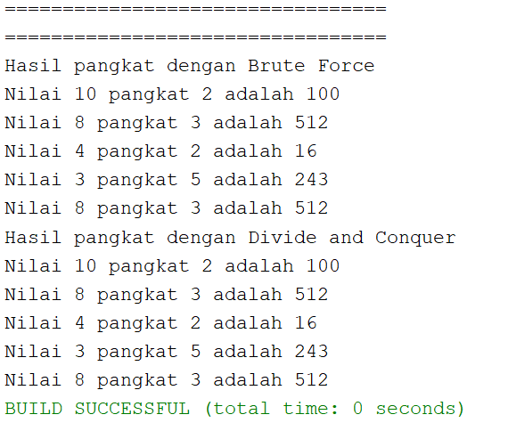

5. Tambahkan menu agar salah satu method yang terpilih saja yang akan dijalankan!
>Source code PangkatMain :
```java
package Minggu5.pangkat;
import java.util.Scanner;
/**
 *
 * @author EgaRam
 */
public class PangkatMain {

    public static void main(String[] args) {
    Scanner sc = new Scanner(System.in);
    char keluar;
        
        System.out.println("=================================");
        Pangkat[] png = new Pangkat[5];
        png[0] = new Pangkat(10,2);
        png[1] = new Pangkat(8,3);
        png[2] = new Pangkat(4,2);
        png[3] = new Pangkat(3,5);
        png[4] = new Pangkat(8,3);
        System.out.println("=================================");
        
        do{
            System.out.println("===================================================");
            System.out.println(" Hitung Pangkat BruteForce dan Divide Conquer");
            System.out.println("===================================================");
            
            System.out.println("Menu Hitung: ");
            System.out.println("1. Hitung BruteFoce"); 
            System.out.println("2. Hitung Divide Conquer");
            System.out.println("3. Keluar");
            System.out.print("Pilih Menu Ke-[1-3] : ");
            int menu=sc.nextInt();
            switch (menu){
                case 1 :
                    System.out.println("Hasil Pangkat dengan Brute Force");
                    for (int i=0; i<png.length; i++){
                        System.out.println("Nilai "+ png[i].nilai+ " pangkat "+ png[i].pangkat +" adalah " + png[i].pangkatBF(png[i].nilai, png[i].pangkat));
                    }
                    break;
                case 2 :
                    System.out.println("Hasil Pangkat dengan Divide and Conquer");
                    for (int i=0; i<png.length; i++){
                        System.out.println("Nilai "+ png[i].nilai+ " pangkat "+ png[i].pangkat +" adalah " + png[i].pangkatDC(png[i].nilai, png[i].pangkat));
                    }
                    break;
                case 3 :
                    System.out.println("------Terima Kasih!------");
                    break;
                default :
                    System.out.println("Mohon maaf, Menu yang anda masukkan TIDAK ADA !");
                    break;
            } if (menu == 3) {keluar = 'T';} 
            else {
                System.out.print("\nKembali ke Menu Utama ? [Y/T] : ");
                keluar = sc.next().charAt(0);
            }
        } while (keluar == 'Y' || keluar == 'y');
        System.out.println("===================================================");
    }
}
```
>Hasil Output :
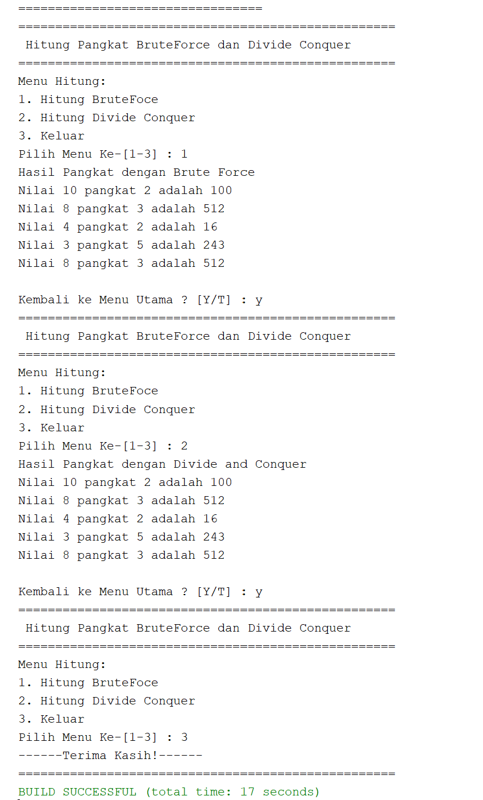

---
### 4.4 Menghitung Sum Array dengan Algoritma Brute Force dan Divide and Conquer
Di dalam percobaan ini, kita akan mempraktekkan bagaimana proses divide, conquer, dan
combine diterapkan pada studi kasus penjumlahan keuntungan suatu perusahaan dalam beberapa
bulan.

---
#### 4.4.1 Langkah-langkah Percobaan
1. Pada paket minggu5. Buat class baru yaitu class Sum. DI salam class tersebut terdapat beberapa atribut jumlah elemen array, array, dan juga total. Tambahkan pula konstruktor pada class Sum.
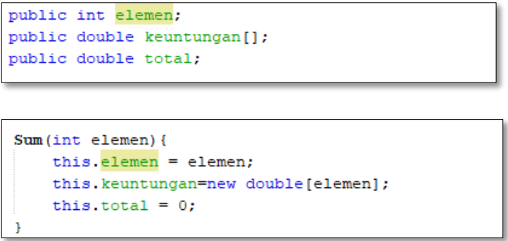
2. Tambahkan method TotalBF() yang akan menghitung total nilai array dengan cara iterative.
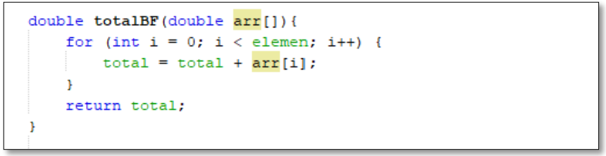
3. Tambahkan pula method TotalDC() untuk implementasi perhitungan nilai total array
menggunakan algoritma Divide and Conquer
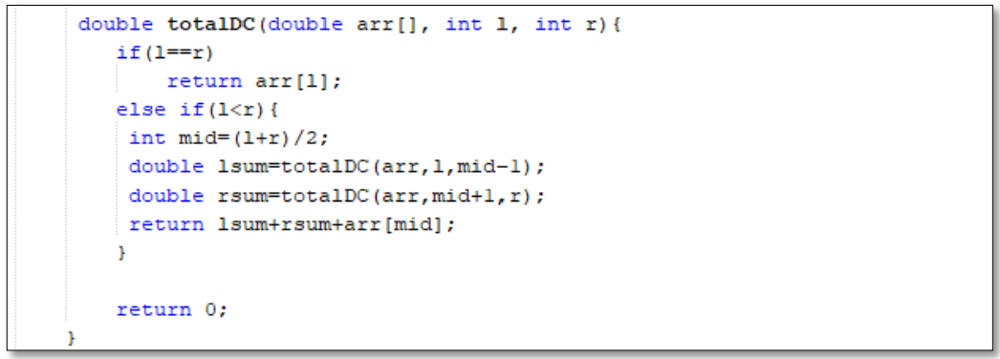
4. Buat class baru yaitu MainSum. Di dalam kelas ini terdapat method main. Pada method ini user
dapat menuliskan berapa bulan keuntungan yang akan dihitung. Dalam kelas ini sekaligus dibuat
instansiasi objek untuk memanggil atribut ataupun fungsi pada class Sum
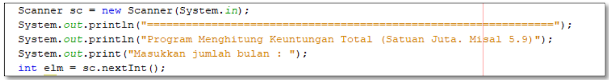
5. Karena yang akan dihitung adalah total nilai keuntungan, maka ditambahkan pula pada method
main mana array yang akan dihitung. Array tersebut merupakan atribut yang terdapat di class
Sum, maka dari itu dibutuhkan pembuatan objek Sum terlebih dahulu.
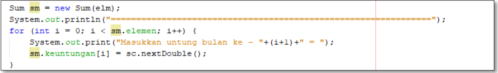
6. Tampilkan hasil perhitungan melalui objek yang telah dibuat untuk kedua cara yang ada (Brute
Force dan Divide and Conquer)
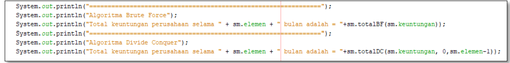

>Source code SumClass :
```java
package Minggu5.sumArray;

/**
 *
 * @author EgaRam
 */
public class Sum {
    public int elemen;
    public double keuntungan[];
    public double total;
    
    Sum(int elemen){
        this.elemen = elemen;
        this.keuntungan = new double[elemen];
        this.total = 0;
    }
    double totalBF(double arr[]){
        for(int i = 0; i < elemen; i++){
            total = total + arr[i];
        }
        return total;
    }
    double totalDC(double arr[], int l, int r){
        if(l==r)
            return arr[l];
        else if(l<r){
            int mid = (l+r)/2;
            double lsum=totalDC(arr,l,mid-l);
            double rsum=totalDC(arr,r,mid+l);
            return lsum+rsum+arr[mid];
        }
        return 2.2;
    }
    
}
```
>Source code SumMain :
```java
package Minggu5.sumArray;
import java.util.Scanner;
/**
 *
 * @author EgaRam
 */
public class MainSum {
    public static void main(String[] args) {
    Scanner sc = new Scanner(System.in);
        System.out.println("============================");
        System.out.println("Program Menghitung Keuntungan Total (Satuan Juta. Misal 5.9)");
        System.out.print("Masukkan jumlah bulan : ");
        int elm = sc.nextInt();
        
        Sum sm = new Sum(elm);
        System.out.println("============================");
        for(int i = 0; i < sm.elemen; i++){
            System.out.print("Masukkan untung bulan ke - "+(i+1)+" = ");
            sm.keuntungan[i] = sc.nextDouble();
        }
        System.out.println("==============================");
        System.out.println("Algoritma Brute Force");
        System.out.println("Total keuntungan perusahaan selama "+sm.elemen+ " bulan adalah = "+sm.totalBF(sm.keuntungan));
        System.out.println("==============================");
        System.out.println("Algoritma Divide Conquer");
        System.out.println("Total keuntungan perusahaan selama " + sm.elemen+ " bulan adalah = "+sm.totalDC(sm.keuntungan, 0, sm.elemen-1));
    }
    
}
```
>Hasil Output :
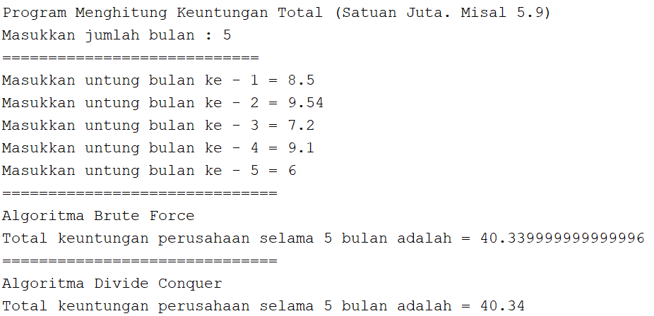

---
4.4.2 Verifikasi Hasil Percobaan
Cocokkan hasil compile kode program anda dengan gambar berikut ini.


---
#### 4.4.3 Pertanyaan
1. Berikan ilustrasi perbedaan perhitungan keuntungan dengan method TotalBF() ataupun TotalDC()

    - **TotalBF()
    Pada totalBF() menggunakan fungsi iterative/perulangan untuk melakukan penjumlahan semua elemen array[i] yang nantinya dimasukkan pada operasi penjumlahan variable total dan di returnkan variable totalnya. Nilai dari variable total adalah hasil penjumlahan seluruh elemen array[i].**

    - **TotalDC()
    Pada totalDC() perhitungan keuntungan menggunakan fungsi rekursif untuk melakukan proses divide yang diimplementasikan dengan adanya if-else, if-else untuk membagi masalah menjadi beberapa masalah, lalu melakukan tahap conquer untuk menyelesaikan setiap beberapa masalah tersebut dimana jika l==r maka return arr[l], jika l<r maka ada variable baru yang diberi nama mid yang berasal dari (l+r)/2 dan mereturn kan hasil penjumlahan lsum + rsum + arr[mid], dan terakhir jika bukan keduanya maka return 0. Lalu pada tahap akhir atau combine maka semua hasil penyelesaian tadi dijadikan satu menjadi solusi.**

2. Perhatikan output dari kedua jenis algoritma tersebut bisa jadi memiliki hasil berbeda di
belakang koma. Bagaimana membatasi output di belakang koma agar menjadi standar untuk
kedua jenis algoritma tersebut.

>Source Code SumClass :
```java
package Minggu5.sumArray;

/**
 *
 * @author EgaRam
 */
public class Sum {
    public int elemen;
    public double keuntungan[];
    public double total;
    
    Sum(int elemen){
        this.elemen = elemen;
        this.keuntungan = new double[elemen];
        this.total = 0;
    }
    double totalBF(double arr[]){
        for(int i = 0; i < elemen; i++){
            total = total + arr[i];
        }
        return total;
    }
    double totalDC(double arr[], int l, int r){
        if(l==r){
            return arr[l];
        }else if(l<r){
            int mid = (l+r)/2;
            double lsum=totalDC(arr,l,mid-1);
            double rsum=totalDC(arr,mid+1,r);
            return lsum+rsum+arr[mid];
        }
        return 0;
    }
    
}
```
>Source Code SumMain :
```java
package Minggu5.sumArray;
import java.util.Scanner;
/**
 *
 * @author EgaRam
 */
public class MainSum {
    public static void main(String[] args) {
    Scanner sc = new Scanner(System.in);
        System.out.println("============================");
        System.out.println("Program Menghitung Keuntungan Total (Satuan Juta. Misal 5.9)");
        System.out.print("Masukkan jumlah bulan : ");
        int elm = sc.nextInt();
        
        Sum sm = new Sum(elm);
        System.out.println("============================");
        for(int i = 0; i < sm.elemen; i++){
            System.out.print("Masukkan untung bulan ke - "+(i+1)+" = ");
            sm.keuntungan[i] = sc.nextDouble();
        }
        System.out.println("==============================");
        System.out.println("Algoritma Brute Force");
        System.out.printf("Total keuntungan perusahaan selama "+sm.elemen + " bulan adalah = %.2f ",sm.totalBF(sm.keuntungan));
        
        System.out.println("Algoritma Divide Conquer");
        System.out.printf("Total keuntungan perusahaan selama " + sm.elemen + " bulan adalah = %.2f ",sm.totalDC(sm.keuntungan, 0, sm.elemen-1));
    }
    
}
```
>Hasil Output :
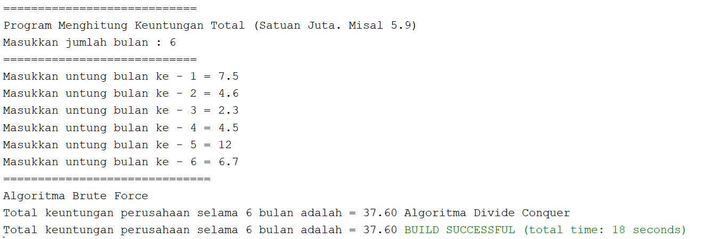

3. Mengapa terdapat formulasi return value berikut?Jelaskan!


**Untuk mereturnkan semua hasil dari penjumlahan keuntungan dari lsum (penjumlahan left/kiri) lalu dengan rsum (penjumlahan right/kanan) dan dengan arr[mid] (penjumlahan mid/tengah), sehingga dari penjumlahan ketiganya bisa diketemukan berapa banyak keuntungan yang didapat dari perusahaan tersebut dalam rentang waktu n bulan.**

4. Kenapa dibutuhkan variable mid pada method TotalDC()?

    **Karena perhitungan keuntungan pada method totalDC() tersebut membagi bagiannya menjadi left(l) dan right(r) dan dibutuhkan variable mid untuk menghitungan semua bagian tengahnya. Misalkan  array = 1,2,3,4,5 maka l adalah indeks 0/awal dan r adalah indeks 4/terakhir dan l masih belum == dengan r maka dibagi menjadi 2 bagian dan mid = indeks 2 karena (l+r)/2. Lalu pada bagian left berarti dimulai dari indeks l(l=0) dan diakhiri indeks mid-1, sedangkan pada bagian right dimulai dari indeks mid dan diakhiri r (r=4). Dan terus menerus dibagi 2 hingga indeks l==r dan mereturnkan nilai tersebut.**

5. Program perhitungan keuntungan suatu perusahaan ini hanya untuk satu perusahaan saja.
Bagaimana cara menghitung sekaligus keuntungan beberapa bulan untuk beberapa
perusahaan.(Setiap perusahaan bisa saja memiliki jumlah bulan berbeda-beda)? Buktikan
dengan program!

>Source Code SumClass :
```java
package Minggu5.sumArray;

/**
 *
 * @author EgaRam
 */
public class Sum {
    public int elemen;
    public double keuntungan[];
    public double total;
    
    public double totalBF(double arr[]){
        for (int i=0; i<arr.length;i++){
            total = total + arr[i];
        }
        return total;
    }
    public double totalDC(double arr[], int l, int r){
        if(l==r)
            return arr[l];
        else if (l<r){
            int mid = (l+r)/2;
            double lsum = totalDC(arr, l, mid-1);
            double rsum = totalDC(arr, mid+1, r);
            return lsum+rsum+arr[mid];
        }
        return 0;
    } 
}
```
>Source Code SumMain :
```java
package Minggu5.sumArray;
import java.util.Scanner;
/**
 *
 * @author EgaRam
 */
public class MainSum {
    public static void main(String[] args) {
        Scanner sc = new Scanner(System.in);
        System.out.println("============================================================");
        System.out.println("Program Menghitung Keuntungan Total (Satuan Juta, Misal 5.9)");
        System.out.print("Masukkan jumlah Perusahaan : ");
        int per = sc.nextInt();
        Sum peru[] = new Sum[per];
        for (int i=0; i<peru.length; i++){
            peru[i] = new Sum();
            
            System.out.println("============================================================");
            System.out.println("Perusahaan ke-"+(i+1));
            System.out.print("Masukkan jumlah bulan : ");
            peru[i].elemen = sc.nextInt();
        
            System.out.println("============================================================");
            peru[i].keuntungan = new double [peru[i].elemen];
            for (int j=0; j<peru[i].elemen; j++){
                System.out.print("Masukkan untung bulan ke-"+(j+1)+" = ");
                peru[i].keuntungan[j] = sc.nextDouble();
            }
            
            System.out.println("============================================================");
        }
            Sum dat = new Sum();
            for(int i=0; i<peru.length; i++){
                System.out.println("Perusahaan ke-"+(i+1));
                System.out.println("Jumlah Bulan : "+ peru[i].elemen);
                System.out.println("");
                System.out.println("Algoritma Brute Force");
                System.out.printf("Total keuntungan perusahaan selama "+ peru[i].elemen + " bulan adalah = %.2f ", dat.totalBF(peru[i].keuntungan));
                System.out.println("\n");
                System.out.println("Algoritma Divide Conquer");
                System.out.printf("Total keuntungan perusahaan selama "+ peru[i].elemen + " bulan adalah = %.2f ", dat.totalDC(peru[i].keuntungan, 0, peru[i].elemen-1));
                System.out.println("\n============================================================");
            }
        }
    }
```
>Hasil Output :
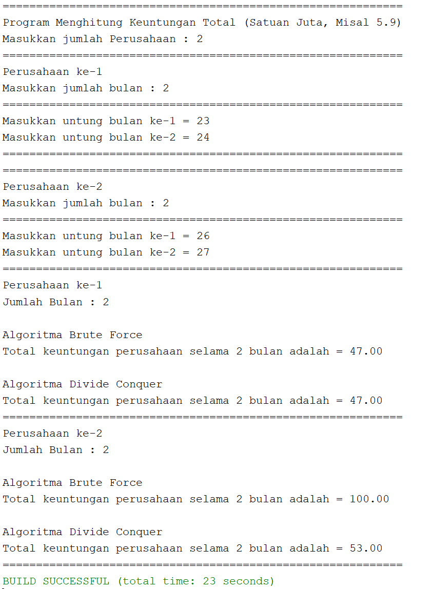


---
### 4.5 Latihan Praktikum
1. Suatu Perguruan Tinggi di kota Malang sedang mengadakan pemilihan suara untuk memilih ketua
BEM tahun 2022. Jika jumlah suara yang terkumpul diumpamakan selalu genap. Maka dengan
inputan kandidat terpilih, carilah mayoritas jumlah suara untuk masing-masing kandidat. (Jumlah
elemen array dan hasil pemilhan suara merupakan inputan user).

    **Elemen Mayoritas : Elemen mayoritas di dalam A adalah elemen yang terdapat pada lebih dari
n/2 posisi. Contohnya, jika n=6 atau n=7 maka nilai mayoritas paling sedikit adalah 4. Berasal
dari (7/2)+1 atau (6/2)+1).**
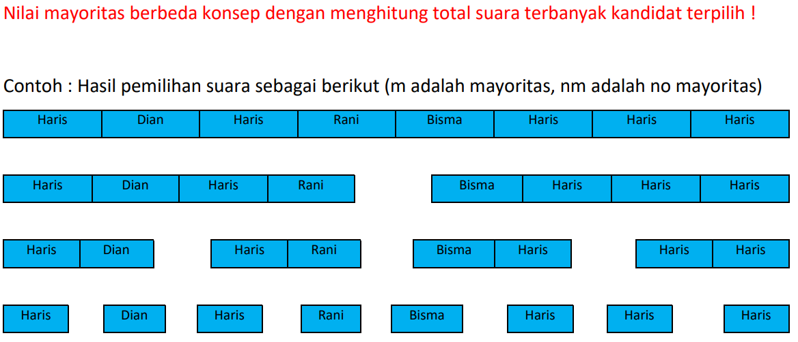
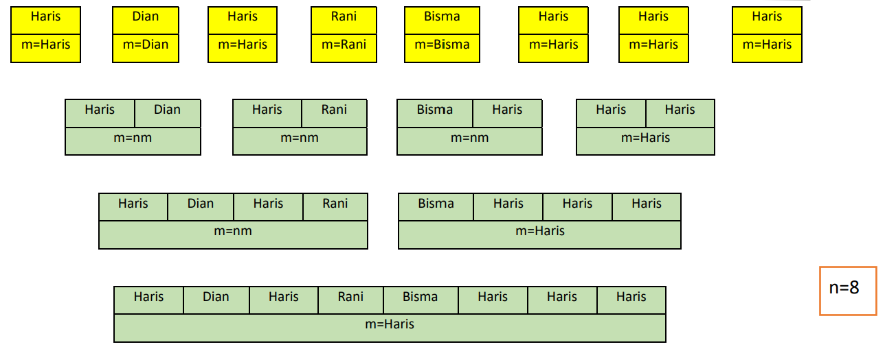
Karena n = 8, nilai mayoritas paling sedikit sejumlah 5 (8/2+1)
Keterangan : Warna Biru adalah proses divide, warna kuning dimulainya proses conquer, warna
hijau dimulainya proses combine
    
 >Source Code LatihanClass :
 ```java
 package Minggu5.Praktikum;
/**
 *
 * @author EgaRam
 */
public class Latihan {
    public int vote, jumlahVote, jumlahKandidat = 4;
    public String kandidat;
    public int nilai, acc, control = 0;
    public int[] array = new int[10000];

    public int hitungHasil(int js, int k1, int k2, int k3, int k4){
        if(nilai == 5){
            nilai = 1;
        }
        if (nilai == 1 && k1 > 0){
            array[control] = nilai;
            control++;
            nilai++;
            return hitungHasil(js, k1 - 1, k2, k3, k4);
        }else if (nilai == 2 && k2 > 0){
            array[control] = nilai;
            control++;
            nilai++;
            return hitungHasil(js, k1, k2 - 1, k3, k4);
        }else if (nilai == 3 && k3 > 0){
            array[control] = nilai;
            control++;
            nilai++;
            return hitungHasil(js, k1, k2, k3 - 1, k4);
        }else if (nilai == 4 && k4 > 0){
            array[control] = nilai;
            control++;
            nilai++;
            return hitungHasil(js, k1, k2, k3, k4 - 1);
        }else if (k1 == 0 && k2 == 0 && k3 == 0 && k4 == 0){
            if (array[acc] == array[acc+1] && acc+1 < js){
                return array[acc];

            }else if (acc + 2 < js){
                acc += 2;
                return hitungHasil(js, k1, k2, k3, k4);
            }else{
                return 0;
            }
        }else{
            nilai++;
            return hitungHasil(js, k1, k2, k3, k4);
        }
    }
}
```
>Source Code LatihanMain :   
```java
package Minggu5.Praktikum;
import java.util.Scanner;
/**
 *
 * @author EgaRam
 */
public class LatihanMain {
    public static void main(String[] args) {
        Scanner sc = new Scanner(System.in);
        System.out.println("=======================================================");
        System.out.println("\t\t PEMILIHAN KETUA BEM KOTA MALANG");
        System.out.println("=======================================================");
        Latihan pol = new Latihan();
        Latihan[] bem = new Latihan[pol.jumlahKandidat];
        
        for(int i = 0; i < pol.jumlahKandidat; i++) {
            bem[i] = new Latihan();
            System.out.println("Nama Kandidat BEM ke- " + (i+1) + ": ");
            bem[i].kandidat = sc.nextLine();
        }
        for (int i = 0; i < pol.jumlahKandidat; i++) {
            System.out.println("Jumlah Pemilih Suara Kandidat BEM ke = " + (i+1) + ": ");
            bem[i].vote = sc.nextInt();
            pol.jumlahVote += bem[i].vote;
        }
        System.out.println("=======================================================");
        int hasil_bem = pol.hitungHasil(pol.jumlahVote, bem[0].vote, bem[1].vote, bem[2].vote, bem[3].vote);
        if(hasil_bem == 0) {
            System.out.println("Kandidat memiliki mayoritas hampir sama");
        }else{
            System.out.println("Ketua BEM Kota Malang Adalah " + bem[hasil_bem-1].kandidat);
        }
    }
}
```

>Hasil Output :
"Images/coba14.png">
