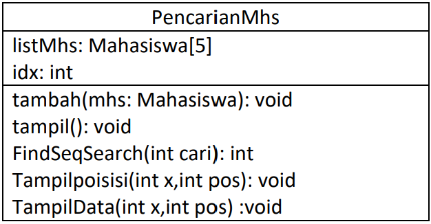

## **<center>Jobsheet Pertemuan 7</center>**

><p>Nama : Muhammad Ega Rama Fernanda<p>
>Kelas : 1F<p>
>Nomer Absen : 19<p>
>Prodi : D-IV Teknik Inormatika<p>
>Jurusan : Teknologi Inormasi<p>
><center> Politeknik Negeri Malang</center>


<br>

### 6.1. Tujuan Praktikum
Setelah melakukan materi praktikum ini, mahasiswa mampu:
1. Menjelaskan mengenai algoritma Searching.
2. Membuat dan mendeklarasikan struktur algoritma Searching.
3. Menerapkan dan mengimplementasikan algoritma Searching.

---
### 6.2. Searching / Pencarian Menggunakan Agoritma Sequential Search
Perhatikan diagram class Mahasiswa di bawah ini! Diagram class ini yang selanjutnya akan dibuat sebagai acuan dalam membuat kode program class Mahasiswa.<p>

<p>

Berdasarkan class diagram di atas, akan dibuat class Mahasiswa yang berfunsi untuk membuat objek mahasiswa yang akan dimasukan ke dalam sebuah array. Terdapat sebuah konstruktor berparameter dan juga fungsi tampil() untuk menampilkan semua attribute yang ada.

<p>

Selanjutnya class diagram di atas merupakan representasi dari sebuah class yang berfungsi untuk melakukan operasi-operasi dari objek array mahasiswa, misalkan untuk menambahkan objek mahasiswa, menampilkan semua data mahasiswa, untuk melakukan pencarian berdasarkan NIM menggunakan algoritma Sequential Search, menampilkan posisi dari data yang dicari, serta menampilkan data mahasiswa yang dicari.

---
#### 6.2.1. Langkah-langkah Percobaan Sequential Search
1. Buatlah Project baru pada Netbeans dengan nama TestSearching
2. Kemuadian buat packages baru dengan nama minggu7.
3. Buat class Mahasiswa, kemudian deklarasikan atribut berikut ini:<p>

<p>

4. Buatlah konstruktor dengan nama Mahasiswa dengan parameter (int ni, String n, int u, double i) kemudian Isi konstruktor tersebut dengan kode berikut!

<p>

5. Buatlah method tampil bertipe void.<p>

<p>

6. Buat class baru dengan nama PencarianMhs seperti di bawah ini!<p>

<p>

7. Tambahkan method tambah() di dalam class tersebut! Method tambah() digunakan untuk menambahkan objek dari class Mahasiswa ke dalam atribut listMhs.<p>

<p>

8. Tambahkan method tampil() di dalam class PencarianMhs! Method tampil() digunakan untuk menampilkan semua data mahasiswa-mahasiswa yang ada di dalam class tersebut! Perhatikan penggunaan sintaks for yang agak berbeda dengan for yang telah dipelajari sebelumnya, meskipun secara konsep sebenarnya mirip.<p>

<p>

9. Tambahkan method FindSeqSearch bertipe integer dengan parameter cari bertipe integer. Kemudian Deklarasikan isi method FindSeqSearch dengan algoritma pencarian data menggunakan teknik sequential searching.<p>

<p>

10. Buatlah method Tampilpoisisi bertipe void dan Deklarasikan isi dari method Tampilpoisisi.<p>

<p>

11. Buatlah method TampilData bertipe void dan Deklarasikan isi dari method TampilData.<p>

<p>

12. Buatlah class baru dengan nama MahasiswaMain tambahkan method main seperti pada gambar berikut!<p>

<p>

13. Di dalam method main(), buatlah sebuah objek PencarianMhs dan buatlah 5 objek mahasiswa kemudian tambahkan semua objek mahasiswa tersebut dengan memanggil fungsi tambah pada objek PencarianMhs.<p>

<p>

14. Panggil method tampil() untuk melihat semua data yang telah dimasukan.<p>

<p>

15. Untuk melakukan pencarian berdasarkan NIM mahasiswa. Buatlah variable cari yang dapat menampung masukan dari keyboard lalu panggil method FindSeqSearch dengan isi parameternya adalah variable cari.<p>

<p>

16. Lakukan pemanggilan method Tampilposisi dari class PencarianMhs.<p>

<p>

17. Lakukan pemanggilan method TampilData dari class PencarianMhs.<p>

<p>

18. Jalankan dan amati hasilnya.

>Hasil Output :<p>

<p>
<p>

>Source Code MahasiswaClass :

```java
package minggu7;

/**
 *
 * @author EgaRam
 */
public class Mahasiswa {
    int nim;
    String nama;
    int umur;
    double ipk;
    
    Mahasiswa(int ni, String n, int u, double i){
        nim = ni;
        nama = n;
        umur = u;
        ipk = i;
    }
    void tampil(){
        System.out.println("Nim = "+ nim);
        System.out.println("Nama = "+ nama);
        System.out.println("Umur = "+ umur);
        System.out.println("IPK = "+ ipk);
    }
}
```

>Source Code PencarianMhsClass :

```java
package minggu7;

/**
 *
 * @author EgaRam
 */
public class PencarianMhs {
    Mahasiswa listMhs[] = new Mahasiswa[5];
    int idx;
    
    void tambah(Mahasiswa m){
        if(idx < listMhs.length){
            listMhs[idx] = m;
            idx++;
        }else{
            System.out.println("Data sudah penuh !!");
        }
    }
    void tampil(){
        for(Mahasiswa m : listMhs){
            m.tampil();
            System.out.println("-----------------------");
        }
    }
    public int FindSeqSearch(int cari){
        int posisi = -1;
        for(int j = 0; j<listMhs.length; j++){
            if(listMhs[j].nim == cari){
                posisi = j;
                break;
            }
        }
        return posisi;
    }
    public void Tampilposisi(int x, int pos){
        if(pos != - 1){
        System.out.println("data : " +x+ " ditemukan pada indeks " + pos);
        }else{           
        System.out.println("data " +x+ "tidak ditemukan");
        }
    }
    public void TampilData(int x, int pos){
        if(pos != -1){
            System.out.println("Nim\t : " + x);
            System.out.println("Nama\t : " + listMhs[pos].nama);
            System.out.println("Umur\t : " + listMhs[pos].umur);
            System.out.println("IPK\t : " + listMhs[pos].ipk);
        }else{
            System.out.println("data " +x+ "tidak ditemukan ");
        }
    }
}
```

>Source Code MahasiswaMain :

```java
package minggu7;
import java.util.Scanner;
/**
 *
 * @author EgaRam
 */
public class MahasiswaMain {
    public static void main(String[] args) {
        Scanner s = new Scanner(System.in);
        Scanner s1 = new Scanner(System.in);
        
        PencarianMhs data = new PencarianMhs();
        int jumMhs = 5;
        
        System.out.println("-----------------------------");
        System.out.println("Masukkan data mahasiswa secara Urut dari Nim Terkecil : ");
        for(int i = 0; i<jumMhs; i++){
            System.out.println("---------------------------");
            System.out.print("Nim\t: ");
            int nim = s.nextInt();
            System.out.print("Nama\t: ");
            String nama = s1.nextLine();
            System.out.print("Umur\t: ");
            int umur = s.nextInt();
            System.out.print("IPK\t: ");
            double ipk = s.nextDouble();
           
            Mahasiswa m = new Mahasiswa(nim, nama, umur, ipk);
            data.tambah(m);
        }
            System.out.println("------------------------------------");
            System.out.println("Data keseluruhan Mahasiswa");
            data.tampil();
            
            System.out.println("____________________________________");
            System.out.println("____________________________________");
            System.out.println("Pencarian data : ");
            System.out.println("Masukkan Nim Mahasiswa yang dicari : ");
            System.out.println("NIM : ");
            int cari = s.nextInt();
            System.out.println("Menggunakan sequential Search");
            int posisi = data.FindSeqSearch(cari);
            data.Tampilposisi(cari, posisi);
            data.TampilData(cari, posisi);
            System.out.println();
    }
}
```

---
#### 6.2.2. Verifikasi Hasil Percobaan
Cocokkan hasil kode program anda dengan gambar berikut ini.<p>

<p>
<p>

---
#### 6.2.3. Pertanyaan
1. Jelaskan perbedaan metod TampilData dan Tampilposisi pada class PencarianMhs

>Jawaban :
>- **Metod tampilData digunakan untuk menampilkan data yang sudah diinputkan oleh user dan dioutputkan dengan list data yang sudah diinputkan.**
>- **Metod tampilPosisi digunakan untuk menampilkan index hasil pencarian yang ingin dicari.**

2. Jelaskan fungsi break pada kode program dibawah ini!<p>

<p>

>Jawaban :
> **Untuk menghentikan program pada saat "posisi = j" sudah ditemukan.**

3. Jika Data Nim yang dimasukkan tidak terurut dari kecil ke besar. Apakah program masih dapat berjalan? Apakah hasil yang dikeluarkan benar? Mengapa demikian!

>Jawaban :
> **Program masih berjalan dan hasil masih sesuai, karena konsep sequential tidak memerlukan pengurutan nomer pada algoritmanya, jadi walaupun nomernya tidak urut, program tetap masih berjalan.**
---
### 6.3. Searching / Pencarian Menggunakan Binary Search

---
#### 6.3.1. Langkah-langkah Percobaan Binary Search
1. Pada percobaan 6.2.1 (sequential search) tambahkan method FindBinarySearch bertipe integer pada class PencarianMhs. Kemudian Deklarasikan isi method FindBinarySearch dengan algoritma pencarian data menggunakan teknik binary searching.<p>

<p>

2. Panggil method FindBinarySearch terdapat pada class PencarianMhs di kelas Mahasiswamain. Kemudia panggil method tampilposisi dan tampilData<p>

<p>

3. Jalankan dan amati hasilnya. 

>Hasil Output :<p>

<p>
<p>
<p>

>Source Code MahasiswaClass :

```java
package minggu7;

/**
 *
 * @author EgaRam
 */
public class Mahasiswa {
    int nim;
    String nama;
    int umur;
    double ipk;
    
    Mahasiswa(int ni, String n, int u, double i){
        nim = ni;
        nama = n;
        umur = u;
        ipk = i;
    }
    void tampil(){
        System.out.println("Nim = "+ nim);
        System.out.println("Nama = "+ nama);
        System.out.println("Umur = "+ umur);
        System.out.println("IPK = "+ ipk);
    }
}
```

>Source Code PencarianMhsClass :

```java
package minggu7;

/**
 *
 * @author EgaRam
 */
public class PencarianMhs {
    Mahasiswa listMhs[] = new Mahasiswa[5];
    int idx;
    
    void tambah(Mahasiswa m){
        if(idx < listMhs.length){
            listMhs[idx] = m;
            idx++;
        }else{
            System.out.println("Data sudah penuh !!");
        }
    }
    void tampil(){
        for(Mahasiswa m : listMhs){
            m.tampil();
            System.out.println("-----------------------");
        }
    }
    public int FindSeqSearch(int cari){
        int posisi = -1;
        for(int j = 0; j<listMhs.length; j++){
            if(listMhs[j].nim == cari){
                posisi = j;
                break;
            }
        }
        return posisi;
    }
    public void Tampilposisi(int x, int pos){
        if(pos != - 1){
        System.out.println("data : " +x+ " ditemukan pada indeks " + pos);
        }else{           
        System.out.println("data " +x+ "tidak ditemukan");
        }
    }
    public void TampilData(int x, int pos){
        if(pos != -1){
            System.out.println("Nim\t : " + x);
            System.out.println("Nama\t : " + listMhs[pos].nama);
            System.out.println("Umur\t : " + listMhs[pos].umur);
            System.out.println("IPK\t : " + listMhs[pos].ipk);
        }else{
            System.out.println("data " +x+ "tidak ditemukan ");
        }
    }
    public int FindBinarySearch(int cari, int left, int rigth){
        int mid;
        if(rigth >= left){
            mid = (left + rigth)/2;
            if(cari == listMhs[mid].nim){
                return (mid);
            }else if(listMhs[mid].nim > cari){
                return FindBinarySearch(cari, left, mid-1);
            }else{
                return FindBinarySearch(cari, mid+1, rigth);
            }
        }
        return -1;
    }
}
```

>Source Code MahasiswaMain :

```java
package minggu7;
import java.util.Scanner;
/**
 *
 * @author EgaRam
 */
public class MahasiswaMain {
    public static void main(String[] args) {
        Scanner s = new Scanner(System.in);
        Scanner s1 = new Scanner(System.in);
        
        PencarianMhs data = new PencarianMhs();
        int jumMhs = 5;
        
        System.out.println("-----------------------------");
        System.out.println("Masukkan data mahasiswa secara Urut dari Nim Terkecil : ");
        for(int i = 0; i<jumMhs; i++){
            System.out.println("---------------------------");
            System.out.print("Nim\t: ");
            int nim = s.nextInt();
            System.out.print("Nama\t: ");
            String nama = s1.nextLine();
            System.out.print("Umur\t: ");
            int umur = s.nextInt();
            System.out.print("IPK\t: ");
            double ipk = s.nextDouble();
           
            Mahasiswa m = new Mahasiswa(nim, nama, umur, ipk);
            data.tambah(m);
        }
            System.out.println("------------------------------------");
            System.out.println("Data keseluruhan Mahasiswa");
            data.tampil();
            
            System.out.println("____________________________________");
            System.out.println("____________________________________");
            System.out.println("Pencarian data : ");
            System.out.println("Masukkan Nim Mahasiswa yang dicari : ");
            System.out.println("NIM : ");
            int cari = s.nextInt();
            System.out.println("Menggunakan sequential Search");
            int posisi = data.FindSeqSearch(cari);
            data.Tampilposisi(cari, posisi);
            data.TampilData(cari, posisi);
            System.out.println();

            System.out.println("===================================");
            System.out.println("Menggunakan binary Search");
            posisi = data.FindBinarySearch(cari, 0, jumMhs-1);
            data.Tampilposisi(cari, posisi);
            data.TampilData(cari, posisi);
    }
}
```

---
#### 6.3.2. Verifikasi Hasil Percobaan
Cocokkan hasil kode program anda dengan gambar berikut ini.<p>

<p>
<p>

---
#### 6.3.3. Pertanyaan
1. Tunjukkan pada kode program yang mana proses divide dijalankan!

> Jawaban :
```java
public int FindBinarySearch(int cari, int left, int rigth){
        int mid;
        if(rigth >= left){
            mid = (left + rigth)/2; //Dividenya
            if(cari == listMhs[mid].nim){
                return (mid);
            }else if(listMhs[mid].nim > cari){
                return FindBinarySearch(cari, left, mid-1);
            }else{
                return FindBinarySearch(cari, mid+1, rigth);
            }
        }
        return -1;
```

2. Tunjukkan pada kode program yang mana proses conquer dijalankan!

> Jawaban :
```java
public int FindBinarySearch(int cari, int left, int rigth){
        int mid;
        if(rigth >= left){
            mid = (left + rigth)/2; //Dividenya
            if(cari == listMhs[mid].nim){
                return (mid);
            // proses conquer :
            }else if(listMhs[mid].nim > cari){
                return FindBinarySearch(cari, left, mid-1);
            }else{
                return FindBinarySearch(cari, mid+1, rigth);
            }
        }
        return -1;
```

3. Jika data Nim yang dimasukkan tidak urut. Apakah program masih dapat berjalan? Mengapa demikian!

>Jawaban :
> **Program masih berjalan, namun hasil dari bijary searchnya tidak ditemukan karena konsep binary memerlukan pengurutan nomer pada algoritmanya, jadi yang tampil hasilnya hanya sequential dan binarynya mengoutputkan "data tidak ditemukan"**

4. Jika Nim yang dimasukkan dari NIM terbesar ke terkecil (missal : 20215, 20214, 20212, 20211, 20210) dan elemen yang dicari adalah 20210. Bagaimana hasil dari binary search? Apakah sesuai? Jika tidak sesuai maka ubahlah kode program binary seach agar hasilnya sesuai

>Jawaban :
> **Hasil tidak sesuai**

>Code yang dirubah di PencarianMhsClass :

```java
    public int FindBinarySearch(int cari, int left, int rigth){
        int mid;
        if(rigth >= left){
            mid = (left + rigth)/2;
            if(cari == listMhs[mid].nim){
                return (mid);
            }else if(listMhs[mid].nim < cari){ //Dibagian yang ini, yang pertama lebih besar menjadi lebih kecil
                return FindBinarySearch(cari, left, mid-1);
            }else{
                return FindBinarySearch(cari, mid+1, rigth);
            }
        }
        return -1;
    }
}
```

>Hasil Output :<p>

<p>

5. Modifikasilah program diatas yang mana jumlah mahasiswa yang di inputkan sesuai dengan masukan dari keyboard.<p>

<p>
<p>

>Source Code MahasiswaClass :

```java
package minggu7;

/**
 *
 * @author EgaRam
 */
public class Mahasiswa {
    int nim;
    String nama;
    int umur;
    double ipk;
    
    Mahasiswa(int ni, String n, int u, double i){
        nim = ni;
        nama = n;
        umur = u;
        ipk = i;
    }
    void tampil(){
        System.out.println("Nim = "+ nim);
        System.out.println("Nama = "+ nama);
        System.out.println("Umur = "+ umur);
        System.out.println("IPK = "+ ipk);
    }
}
```

>Source Code PencarianMhsClass :

```java
package minggu7;

/**
 *
 * @author EgaRam
 */
public class PencarianMhs {
    Mahasiswa listMhs[];
    int idx;
    
    void tambah(Mahasiswa m){
        if(idx < listMhs.length){
            listMhs[idx] = m;
            idx++;
        }else{
            System.out.println("Data sudah penuh !!");
        }
    }
    void tampil(){
        for(Mahasiswa m : listMhs){
            m.tampil();
            System.out.println("-----------------------");
        }
    }
    public int FindSeqSearch(int cari){
        int posisi = - 1;
        for(int j = 0; j<listMhs.length; j++){
            if(listMhs[j].nim == cari){
                posisi = j;
                break;
            }
        }
        return posisi;
    }
    public void Tampilposisi(int x, int pos){
        if(pos != - 1){
        System.out.println("data : " +x+ " ditemukan pada indeks " + pos);
        }else{           
        System.out.println("data " +x+ "tidak ditemukan");
        }
    }
    public void TampilData(int x, int pos){
        if(pos != -1){
            System.out.println("Nim\t : " + x);
            System.out.println("Nama\t : " + listMhs[pos].nama);
            System.out.println("Umur\t : " + listMhs[pos].umur);
            System.out.println("IPK\t : " + listMhs[pos].ipk);
        }else{
            System.out.println("data " +x+ "tidak ditemukan ");
        }
    }
    public int FindBinarySearch(int cari, int left, int rigth){
        int mid;
        if(rigth >= left){
            mid = (left + rigth)/2;
            if(cari == listMhs[mid].nim){
                return (mid);
            }else if(listMhs[mid].nim < cari){
                return FindBinarySearch(cari, left, mid-1);
            }else{
                return FindBinarySearch(cari, mid+1, rigth);
            }
        }
        return -1;
    }
}
```

>Source Code MahasiswaMain :

```java
package minggu7;
import java.util.Scanner;
/**
 *
 * @author EgaRam
 */
public class MahasiswaMain {
    public static void main(String[] args) {
        Scanner s = new Scanner(System.in);
        Scanner s1 = new Scanner(System.in);
        
        PencarianMhs data = new PencarianMhs();
        
        System.out.print("Masukkan jumlah data Mahasiswa : ");
        int jumMhs = s.nextInt();
        Mahasiswa[] e = new Mahasiswa[jumMhs];
        data.listMhs = e;
        
        System.out.println("-----------------------------");
        System.out.println("Masukkan data mahasiswa secara Urut dari Nim Terkecil : ");
        
        for(int i = 0; i<jumMhs; i++){
            System.out.println("---------------------------");
            System.out.print("Nim\t: ");
            int nim = s.nextInt();
            System.out.print("Nama\t: ");
            String nama = s1.nextLine();
            System.out.print("Umur\t: ");
            int umur = s.nextInt();
            System.out.print("IPK\t: ");
            double ipk = s.nextDouble();
           
            Mahasiswa m = new Mahasiswa(nim, nama, umur, ipk);
            data.tambah(m);
        }
            System.out.println("------------------------------------");
            System.out.println("Data keseluruhan Mahasiswa");
            data.tampil();
            
            System.out.println("____________________________________");
            System.out.println("____________________________________");
            System.out.println("Pencarian data : ");
            System.out.println("Masukkan Nim Mahasiswa yang dicari : ");
            System.out.println("NIM : ");
            int cari = s.nextInt();
            System.out.println("Menggunakan sequential Search");
            int posisi = data.FindSeqSearch(cari);
            data.Tampilposisi(cari, posisi);
            data.TampilData(cari, posisi);
            System.out.println();
            
            System.out.println("===================================");
            System.out.println("Menggunakan binary Search");
            posisi = data.FindBinarySearch(cari, 0, jumMhs-1);
            data.Tampilposisi(cari, posisi);
            data.TampilData(cari, posisi);
    }
}
```

---
### 6.4. Percobaan Pengayaan Divide and Conquer

---
#### 6.4.1. Langkah-langkah Percobaan Merge Sort
1 Buatlah Package baru pada NetBeans dengan nama MergeSortTest
2 Tambahkan class MergeSorting pada package tersebut
3 Pada class MergeSorting buatlah method mergeSort yang menerima parameter data array yang akan diurutkan<p>

<p>

4 Buatlah method merge untuk melakukan proses penggabungan data dari bagian kiri dan kanan. <p>

<p>

5 Implementasikan proses merge sebagai berikut. <p>

<p>

6 Buatlah method sort<p>

<p>

7 Implementasikan kode berikut pada method sort<p>

<p>

8 Pada method mergeSort, panggil method sort dengan parameter data yang ingin diurutkan serta range data awal sampai dengan akhir.

9 Tambahkan method printArray<p>

<p>

10 Sebagai langkah terakhir, deklarasikan data yang akan diurutkan kemudian panggil proses sorting pada class SortMain<p>

<p>

---
#### 6.4.2. Verifikasi Hasil Percobaan
Cocokkan hasil compile kode program anda dengan gambar berikut ini.<p>

<p>

---
### 6.5. Latihan Praktikum
1. Modifikasi percobaan searching diatas dengan ketentuan berikut ini
- Sebelum dilakukan searching dengan binary search data harus dilakukan pengurutan dengan menggunakan algoritma sorting (pilih salah satu algoritma sorting dari pertemuan sebelumnya)

> Jawaban :
<p>
<p>
<p>
<p>

>Source Code MahasiswaClass :

```java
package minggu7;

/**
 *
 * @author EgaRam
 */
public class Mahasiswa {
    int nim;
    String nama;
    int umur;
    double ipk;
    
    Mahasiswa(int ni, String n, int u, double i){
        nim = ni;
        nama = n;
        umur = u;
        ipk = i;
    }
    void tampil(){
        System.out.println("Nim = "+ nim);
        System.out.println("Nama = "+ nama);
        System.out.println("Umur = "+ umur);
        System.out.println("IPK = "+ ipk);
    }
}
```

>Source Code PencarianMhsClass :

```java
package minggu7;

/**
 *
 * @author EgaRam
 */
public class PencarianMhs {
    Mahasiswa listMhs[] = new Mahasiswa[5];
    int idx;
    
    void tambah(Mahasiswa m){
        if(idx < listMhs.length){
            listMhs[idx] = m;
            idx++;
        }else{
            System.out.println("Data sudah penuh !!");
        }
    }
    void tampil(){
        for(Mahasiswa m : listMhs){
            m.tampil();
            System.out.println("-----------------------");
        }
    }
    public int FindSeqSearch(int cari){
        int posisi = - 1;
        for(int j = 0; j<listMhs.length; j++){
            if(listMhs[j].nim == cari){
                posisi = j;
                break;
            }
        }
        return posisi;
    }
    public void Tampilposisi(int x, int pos){
        if(pos !=  -1){
        System.out.println("data : " +x+ " ditemukan pada indeks " + pos);
        }else{           
        System.out.println("data " +x+ "tidak ditemukan");
        }
    }
    public void TampilData(int x, int pos){
        if(pos != -1){
            System.out.println("Nim\t : " + x);
            System.out.println("Nama\t : " + listMhs[pos].nama);
            System.out.println("Umur\t : " + listMhs[pos].umur);
            System.out.println("IPK\t : " + listMhs[pos].ipk);
        }else{
            System.out.println("data " +x+ "tidak ditemukan ");
        }
    }
    void bubblesort() {
        for (int i = 0; i < listMhs.length - 1; i++) {
            for (int n = 1; n < listMhs.length - i; n++) {
                if (listMhs[n].nim > listMhs[n - 1].nim) {
                    Mahasiswa tmp = listMhs[n];
                    listMhs[n] = listMhs[n - 1];
                    listMhs[n - 1] = tmp;
                }
            }
        }
    }
    public int FindBinarySearch(int cari, int left, int rigth){
        int mid;
        if(rigth >= left){
            mid = (left + rigth)/2;
            if(cari == listMhs[mid].nim){
                return (mid);
            }else if(listMhs[mid].nim < cari){
                return FindBinarySearch(cari, left, mid-1);
            }else{
                return FindBinarySearch(cari, mid+1, rigth);
            }
        }
        return -1;
    }
}
```

>Source Code MahasiswaMain :

```java
package minggu7;
import java.util.Scanner;
/**
 *
 * @author EgaRam
 */
public class MahasiswaMain {
    public static void main(String[] args) {
        Scanner s = new Scanner(System.in);
        Scanner s1 = new Scanner(System.in);
        
        PencarianMhs data = new PencarianMhs();
        int jumMhs = 5;
        
        System.out.println("-----------------------------");
        System.out.println("Masukkan data mahasiswa secara Urut dari Nim Terkecil : ");
        for(int i = 0; i<jumMhs; i++){
            System.out.println("---------------------------");
            System.out.print("Nim\t: ");
            int nim = s.nextInt();
            System.out.print("Nama\t: ");
            String nama = s1.nextLine();
            System.out.print("Umur\t: ");
            int umur = s.nextInt();
            System.out.print("IPK\t: ");
            double ipk = s.nextDouble();
           
            Mahasiswa m = new Mahasiswa(nim, nama, umur, ipk);
            data.tambah(m);
        }
            System.out.println("------------------------------------");
            System.out.println("Data keseluruhan Mahasiswa");
            data.tampil();
            
            System.out.println("------------------------------------");
            System.out.println("Data keseluruhan Setelah diurutkan Mahasiswa");
            data.bubblesort();
            data.tampil();
            
            System.out.println("____________________________________");
            System.out.println("____________________________________");
            System.out.println("Pencarian data : ");
            System.out.println("Masukkan Nim Mahasiswa yang dicari : ");
            System.out.println("NIM : ");
            int cari = s.nextInt();
            System.out.println("Menggunakan sequential Search");
            int posisi = data.FindSeqSearch(cari);
            data.Tampilposisi(cari, posisi);
            data.TampilData(cari, posisi);
            System.out.println();
            
            System.out.println("===================================");
            System.out.println("Menggunakan binary Search");
            posisi = data.FindBinarySearch(cari, 0, jumMhs-1);
            data.Tampilposisi(cari, posisi);
            data.TampilData(cari, posisi);
    }
}
```

2. Modifikasi percobaan searching diatas dengan ketentuan berikut ini
- Pencarian dilakukan berdasarkan Nama Mahasiswa (gunakan Algoritma Sequential Search)
- Jika terdapat nama yang sama? Bagaimana keluaran dari kode program ketika pencarian dilakukan pada nama yang sama!

> Jawaban :
<p>
<p>

>Source Code MahasiswaClass :

```java
package minggu7;

/**
 *
 * @author EgaRam
 */
public class Mahasiswa {
    int nim;
    String nama;
    int umur;
    double ipk;
    
    Mahasiswa(int ni, String n, int u, double i){
        nim = ni;
        nama = n;
        umur = u;
        ipk = i;
    }
    void tampil(){
        System.out.println("Nim = "+ nim);
        System.out.println("Nama = "+ nama);
        System.out.println("Umur = "+ umur);
        System.out.println("IPK = "+ ipk);
    }
}
```

>Source Code PencarianMhsClass :

```java
package minggu7;

/**
 *
 * @author EgaRam
 */
public class PencarianMhs {
    Mahasiswa listMhs[];
    int idx;
    
    void tambah(Mahasiswa m){
        if(idx < listMhs.length){
            listMhs[idx] = m;
            idx++;
        }else{
            System.out.println("Data sudah penuh !!");
        }
    }
    void tampil(){
        for(Mahasiswa m : listMhs){
            m.tampil();
            System.out.println("-----------------------");
        }
    }
    public int FindSeqSearch(String cari){
        int posisi = - 1;
        for(int j = 0; j<listMhs.length; j++){
            if(cari.equalsIgnoreCase(listMhs[j].nama)){
                posisi = j;
                break;
            }
        }
        return posisi;
    }
    public void Tampilposisi(String x, int pos){
        if(pos !=  -1){
        System.out.println("data : " +x+ " ditemukan pada indeks " + pos);
        }else{           
        System.out.println("data " +x+ "tidak ditemukan");
        }
    }
    public void TampilData(String x, int pos){
        if(pos != -1){
            System.out.println("Nim\t : " + listMhs[pos].nim);
            System.out.println("Nama\t : " + x);
            System.out.println("Umur\t : " + listMhs[pos].umur);
            System.out.println("IPK\t : " + listMhs[pos].ipk);
        }else{
            System.out.println("data " +x+ "tidak ditemukan ");
        }
    }
}
```

>Source Code MahasiswaMain :

```java
package minggu7;
import java.util.Scanner;
/**
 *
 * @author EgaRam
 */
public class MahasiswaMain {
    public static void main(String[] args) {
        Scanner s = new Scanner(System.in);
        Scanner s1 = new Scanner(System.in);
        
        PencarianMhs data = new PencarianMhs();
        
        
        System.out.print("Masukkan jumlah data mahasiswa : ");
        int jumMhs = s.nextInt();
        Mahasiswa[] e = new Mahasiswa[jumMhs];
        data.listMhs = e;
        
        System.out.println("-----------------------------");
        System.out.println("Masukkan data mahasiswa secara Urut dari Nim Terkecil : ");
        for(int i = 0; i<jumMhs; i++){
            System.out.println("---------------------------");
            System.out.print("Nim\t: ");
            int nim = s.nextInt();
            System.out.print("Nama\t: ");
            String nama = s1.nextLine();
            System.out.print("Umur\t: ");
            int umur = s.nextInt();
            System.out.print("IPK\t: ");
            double ipk = s.nextDouble();
           
            Mahasiswa m = new Mahasiswa(nim, nama, umur, ipk);
            data.tambah(m);
        }
            System.out.println("------------------------------------");
            System.out.println("Data keseluruhan Mahasiswa");
            data.tampil();
            
            System.out.println("____________________________________");
            System.out.println("____________________________________");
            System.out.println("Pencarian data : ");
            System.out.println("Masukkan Nama Mahasiswa yang dicari : ");
            System.out.println("Nama : ");
            String cari = s1.nextLine();
            System.out.println("Menggunakan sequential Search");
            int posisi = data.FindSeqSearch(cari);
            data.Tampilposisi(cari, posisi);
            data.TampilData(cari, posisi);
            System.out.println();
    }
}
```

3. Terdapat sebuah data array 1 dimensi sebagai berikut <p>

<p>

Buatlah program untuk mengurutkan array tersebut (boleh memilih metode pengurutan) selanjutnya lakukan pencarian dan mencetak isi array yang nilainya terbesar, dan mencetak ada berapa buah nilai terbesar tersebut serta berada dilokasi mana saja nilai terbesar tersebut! (menggunakan binary search)<p>

<p>

>Source Code Latihan3Class :

```java
package minggu7.LatihanPrak3;

/**
 *
 * @author EgaRam
 */
public class Latihan3 {
    public int[] data;
    public int max = 0;
    public int posisi;
    public int jumlah = 0;

    Latihan3(int nilai[]) {
        data = nilai;
    }

    void tampil() {
        for (int i = 0; i < data.length; i++) {
            System.out.print(data[i] + " ");
        }
        System.out.println();
    }

    void bubblesort() {
        for (int i = 0; i < data.length - 1; i++) {
            for (int n = 1; n < data.length - i; n++) {
                if (data[n] > data[n - 1]) {
                    int tmp = data[n];
                    data[n] = data[n - 1];
                    data[n - 1] = tmp;
                }
            }
        }
    }

    public int Searching(int cari, int kiri, int kanan) {
        int mid;
        if (kanan >= kiri) {
            mid = (kiri + kanan) / 2;
            if (cari == data[mid]) {
                return (mid);
            } else if (data[mid] > cari) {
                return Searching(cari, mid + 1, kanan);
            } else {
                return Searching(cari, kiri, mid - 1);
            }
        }
        return -1;
    }

    public int nilaiTerbesar() {
        for (int i = 0; i < data.length; i++) {
            if (data[i] > max) {
                max = data[i];
            }
        }
        System.out.println("Nilai terbesarnya adalah : " + max);
        return max;
    }

    public void tampilPosisi(int pos) {
        for (int i = 0; i < data.length; i++) {
            if (data[i] == max) {
                jumlah++;
            }
        }
        System.out.print("dengan jumlah " + jumlah);
        System.out.println();
        posisi = max;
        for (int i = 0; i < data.length; i++) {
            if (posisi == data[i]) {
                pos = i;
                System.out.println("Data ditemukan pada indeks ke-" + pos);
            }
        }
    }
}
```

>Source Code Latihan3Main :

```java
package minggu7.LatihanPrak3;

/**
 *
 * @author EgaRam
 */
public class Latihan3Main {
    public static void main(String[] args) {
        int bil[] = {12, 17, 2, 1, 70, 50, 90, 17, 2, 90};
        Latihan3 arr = new Latihan3(bil);
        
        int jum = 10;
        int max = 0;
        System.out.println("===============================");
        System.out.println("--------------DATA-------------");
        arr.tampil();
        arr.bubblesort();
        System.out.println("===============================");
        System.out.println("Setelah di sorting");
        arr.tampil();
        arr.nilaiTerbesar();
        arr.Searching(max, 0, jum - 1);
        arr.tampilPosisi(max);
    }

}
```

---