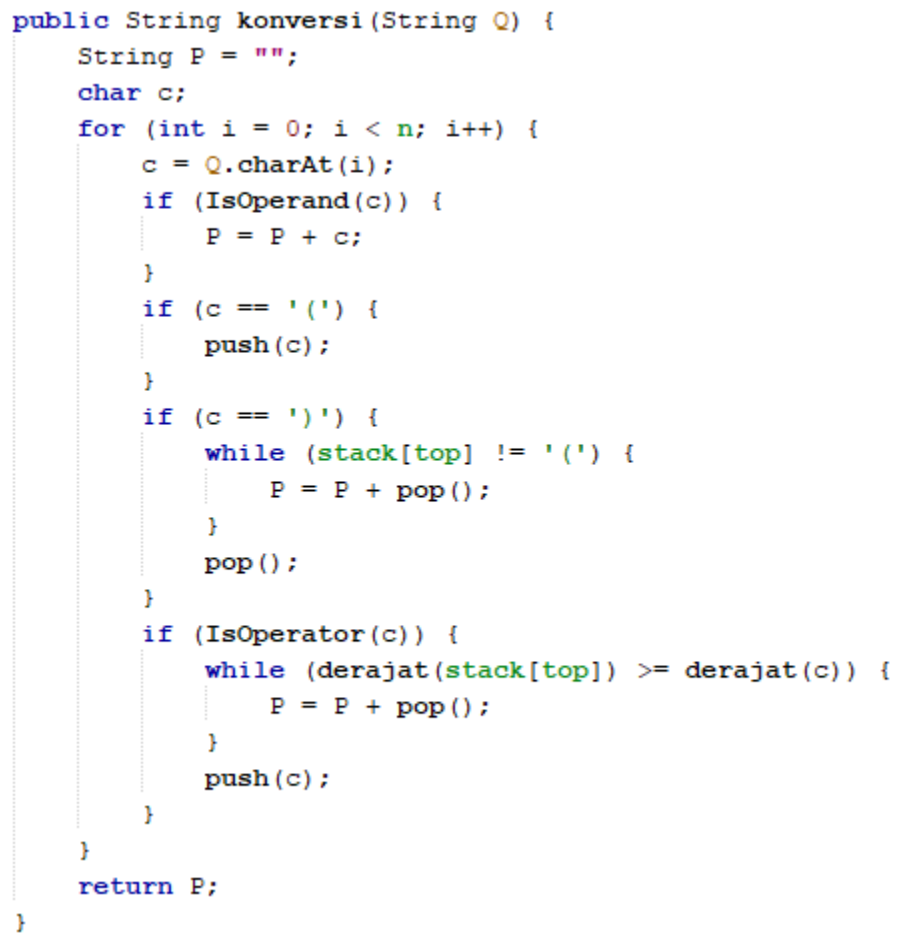

## **<center>Jobsheet Pertemuan 9</center>**

><p>Nama : Muhammad Ega Rama Fernanda<p>
>Kelas : 1F<p>
>Nomer Absen : 19<p>
>Prodi : D-IV Teknik Inormatika<p>
>Jurusan : Teknologi Inormasi<p>
><center> Politeknik Negeri Malang</center>


<br>

---

### 7.1 Tujuan Praktikum
Setelah melakukan materi praktikum ini, mahasiswa mampu:
1. Mengenal struktur data Stack
2. Membuat dan mendeklarasikan struktur data Stack
3. Menerapkan algoritma Stack dengan menggunakan array
---

### 7.2 Praktikum 1
**Waktu percobaan : 45 menit**

Pada percobaan ini, kita akan membuat program yang mengilustrasikan tumpukan pakaian yang disimpan ke dalam stack. Karena sebuah pakaian mempunyai beberapa informasi, maka implementasi Stack dilakukan dengan menggunakan array of object untuk mewakili setiap elemennya.

---
#### 7.2.1 Langkah-langkah Percobaan
1. Perhatikan Diagram Class Pakaian berikut ini:<p>

    <p>

2. Buat package dengan nama **Praktikum1**, kemudian buat class baru dengan nama **Pakaian**.
3. Tambahkan atribut-atribut Pakaian seperti pada Class Diagram Pakaian, kemudian tambahkan pula konstruktornya seperti gambar berikut ini.<p>

    <p>

4. Setelah membuat class Pakaian, selanjutnya perlu dibuat class Stack yang berisi atribut dan method sesuai diagram Class Stack berikut ini:<p>

    <p>

**Keterangan**: Tipe data pada variabell **data** menyesuaikan dengan data yang akan akan disimpan di dalam Stack. Pada praktikum ini, data yang akan disimpan merupakan array of object dari Pakaian, sehingga tipe data yang digunakan adalah **Pakaian**

5. Buat class baru dengan nama Stack. Kemudian tambahkan atribut dan konstruktor seperti
gambar berikut ini.<p>

    <p>

6. Buat method **IsEmpty** bertipe boolean yang digunakan untuk mengecek apakah stack kosong.<p>

    <p>

7. Buat method **IsFull** bertipe boolean yang digunakan untuk mengecek apakah stack sudah terisi penuh.<p>

    <p>

8. Buat method **push** bertipe void untuk menambahkan isi elemen stack dengan parameter **pkn** yang berupa object **Pakaian**<p>

    <p>

9. Buat method **Pop** bertipe void untuk mengeluarkan isi elemen stack. Karena satu elemen stack terdiri dari beberapa informasi (jenis, warna, merk, ukuran, dan harga), maka ketika mencetak data juga perlu ditampilkan semua informasi tersebut<p>

    <p>

10. Buat method **peek** bertipe void untuk memeriksa elemen stack pada posisi paling atas.<p>

    <p>

11. Buat method **print** bertipe void untuk menampilkan seluruh elemen pada stack.<p>

    <p>

12. Buat method **clear** bertipe void untuk menghapus seluruh isi stack.<p>

    <p>

13. Selanjutnya, buat class baru dengan nama **StackMain**. Buat fungsi main, kemudian lakukan instansiasi objek dari class **Stack** dengan nama **stk** dan nilai parameternya adalah 5<p>

<p>

14. Deklarasikan Scanner dengan nama **sc**
15. Tambahkan kode berikut ini untuk menerima input data Pakaian, kemudian semua informasi tersebut dimasukkan ke dalam stack<p>

    <p>

**Catatan**: sintaks sc.nextLine() sebelum sintaks st.push(p) digunakan untuk mengabaikan karakter new line

16. Lakukan pemanggilan method print, method pop, dan method peek dengan urutan sebagai berikut.<p>

    <p>

17. Compile dan jalankan class **StackMain**, kemudian amati hasilnya.

>Hasil Output :

<p>

>Source Code pakaianClass :
```java
package minggu9;

/**
 *
 * @author EgaRam
 */
public class pakaian {
    String jenis, warna, merk, ukuran;
    double harga;
    
    pakaian(String jenis, String warna, String merk, String ukuran, double harga){
        this.jenis = jenis;
        this.warna = warna;
        this.merk = merk;
        this.ukuran = ukuran;
        this.harga = harga;
    }
}
```

>Source Code stackClass :
```java
package minggu9;

/**
 *
 * @author EgaRam
 */
public class stack {
    int size;
    int top;
    pakaian data[];
    
    public stack(int size){
        this.size = size;
        data = new pakaian[size];
        top = -1; //menandakan stacknya masih kosong jika -1
    }
    public boolean IsEmpty(){
        if(top == -1){
            return true;
        }else{
            return false;
        }
    }
    public boolean IsFull(){
        if(top == size - 1){
            return true;
        }else{
            return false;
        }
    }
    public void push(pakaian pkn){
        if(!IsFull()){
            top++;
            data[top] = pkn;
        }else{
            System.out.println("Isi stack penuh!");
        }
    }
    public void pop(){
        if(!IsEmpty()){
            pakaian x = data[top];
            top--;
            System.out.println("Data yang keluar : " + x.jenis + " " + x.warna + " " + x.merk + " " + x.ukuran + " " + x.harga);
        }else{
            System.out.println("Stack masih kosong");
        }
    }
    public void peek(){
        System.out.println("Elemen teratas : " + data[top].jenis + " " + data[top].warna + " " + data[top].merk + " " + data[top].ukuran + " " + data[top].harga);
    }
    public void print(){
        System.out.println("Isi stack : ");
        for(int i = top; i >= 0; i--){
            System.out.println(data[i].jenis + " " + data[i].warna + " " + data[i].merk + " " + data[i].ukuran + " " + data[i].harga);
        }
        System.out.println("");
    }
    public void clear(){
        if(!IsEmpty()){
            for(int i = top; i >= 0; i--){
                top--;
            }
            System.out.println("Stack sudah dikosongkan");
        }else{
            System.out.println("Stack masih kosong");
        }
    }
}
```

>Source Code StackMain :
```java
package minggu9;
import java.util.Scanner;
/**
 *
 * @author EgaRam
 */
public class StackMain {

    public static void main(String[] args) {
    Scanner sc = new Scanner(System.in);
    stack stk = new stack(5);
    
    char pilih;
    do{
        System.out.println("Jenis : ");
        String jenis = sc.nextLine();
        System.out.println("Warna : ");
        String warna = sc.nextLine();
        System.out.println("Merk : ");
        String merk = sc.nextLine();
        System.out.println("Ukuran : ");
        String ukuran = sc.nextLine();
        System.out.println("Harga : ");
        double harga = sc.nextDouble();
        
        pakaian p = new pakaian(jenis, warna, merk, ukuran, harga);
        System.out.print("Apakah Anda akan menambahkan data baru ke stack (y/n)? ");
        pilih = sc.next().charAt(0);
        sc.nextLine(); //mengabaikan karakter new line
        stk.push(p);
    }while(pilih == 'y');
    
    stk.print();
    stk.pop();
    stk.peek();
    stk.print();
    }
}
```

---
#### 7.2.2 Verifikasi Hasil Percobaan

<p>

---
#### 7.2.3 Pertanyaan
1. Berapa banyak data pakaian yang dapat ditampung di dalam stack? Tunjukkan potongan kode program untuk mendukung jawaban Anda tersebut!

    >**ada 5, potongan kode programnya terdapat di Main**.<p>

    <p>

2. Perhatikan class **StackMain**, pada saat memanggil fungsi push, parameter yang dikirimkan adalah **p**. Data apa yang tersimpan pada variabel **p** tersebut?<p>

    <p>

    >**Data yang tersimpan pada variabel p adalah data yang dimasukkan melalui scanner**.

3. Apakah fungsi penggunaan **do-while** yang terdapat pada class **StackMain**?

    >**perulangan do-while tersebut digunakan untuk menentukan pernyata yang ingin dipilih oleh user**. 

4. Modifikasi kode program pada class **StackMain** sehingga pengguna dapat memilih operasi pada stack (push, pop, peek, atau print) melalui pilihan menu program dengan memanfaatkan kondisi IF-ELSE atau SWITCH-CASE!

>Hasil Output :

<p>
<p>

>Source Code pakaianClass :
```java
package minggu9;

/**
 *
 * @author EgaRam
 */
public class pakaian {
    String jenis, warna, merk, ukuran;
    double harga;
    
    pakaian(String jenis, String warna, String merk, String ukuran, double harga){
        this.jenis = jenis;
        this.warna = warna;
        this.merk = merk;
        this.ukuran = ukuran;
        this.harga = harga;
    }
}
```

>Source Code stackClass :
```java
package minggu9;

/**
 *
 * @author EgaRam
 */
public class stack {
    int size;
    int top;
    pakaian data[];
    
    public stack(int size){
        this.size = size;
        data = new pakaian[size];
        top = -1; //menandakan stacknya masih kosong jika -1
    }
    public boolean IsEmpty(){
        if(top == -1){
            return true;
        }else{
            return false;
        }
    }
    public boolean IsFull(){
        if(top == size - 1){
            return true;
        }else{
            return false;
        }
    }
    public void push(pakaian pkn){
        if(!IsFull()){
            top++;
            data[top] = pkn;
        }else{
            System.out.println("Isi stack penuh!");
        }
    }
    public void pop(){
        if(!IsEmpty()){
            pakaian x = data[top];
            top--;
            System.out.println("Data yang keluar : " + x.jenis + " " + x.warna + " " + x.merk + " " + x.ukuran + " " + x.harga);
        }else{
            System.out.println("Stack masih kosong");
        }
    }
    public void peek(){
        System.out.println("Elemen teratas : " + data[top].jenis + " " + data[top].warna + " " + data[top].merk + " " + data[top].ukuran + " " + data[top].harga);
    }
    public void print(){
        System.out.println("Isi stack : ");
        for(int i = top; i >= 0; i--){
            System.out.println(data[i].jenis + " " + data[i].warna + " " + data[i].merk + " " + data[i].ukuran + " " + data[i].harga);
        }
        System.out.println("");
    }
    public void clear(){
        if(!IsEmpty()){
            for(int i = top; i >= 0; i--){
                top--;
            }
            System.out.println("Stack sudah dikosongkan");
        }else{
            System.out.println("Stack masih kosong");
        }
    }
}
```

>Source Code StackMain :
```java
package minggu9;
import java.util.Scanner;
/**
 *
 * @author EgaRam
 */
public class StackMain {
    public static void main(String[] args) {
    Scanner sc = new Scanner(System.in);
    stack stk = new stack(5);
    
    char pilih;
    do{
        System.out.println("+==================================================================+");
        System.out.println("|\t\t\t\t Menu  \t\t\t\t   |");
        System.out.println("+==================================================================+\n");
        System.out.println("[1] Push Barang\t\t");
        System.out.println("[2] Pop Barang\t\t");
        System.out.println("[3] Peek Barang\t\t");
        System.out.println("[4] Print Barang\t\t");
        System.out.print("Pilih Menu : ");
        int pilihan = sc.nextInt();
        
        switch(pilihan){
            case 1 :
                 do{
                    System.out.print("Jenis : ");
                    String jenis = sc.next();
                    System.out.print("Warna : ");
                    String warna = sc.next();
                    System.out.print("Merk : ");
                    String merk = sc.next();
                    System.out.print("Ukuran : ");
                    String ukuran = sc.next();
                    System.out.print("Harga : ");
                    double harga = sc.nextDouble();
        
                    pakaian p = new pakaian(jenis, warna, merk, ukuran, harga);
                    System.out.print("Apakah Anda akan menambahkan data baru ke stack (y/n)? ");
                    pilih = sc.next().charAt(0);
                    sc.nextLine(); //mengabaikan karakter new line
                    stk.push(p);
                }while(pilih == 'y'); 
                break;
            
            case 2 :
                stk.pop();
                break;
            
            case 3 :
                stk.peek();
                break;
                
            case 4 :
                stk.print();
                break;   
            
            default :
                System.out.print("Yang Anda inputkan salah!");
                System.exit(0);
            
            case 5 :
                System.exit(0);
                System.out.print("Terimakasih");
        }
    }while(true);   
}
}
```

---
### 7.3 Praktikum 2
**Waktu percobaan : 30 menit**

Pada percobaan ini, kita akan membuat program untuk melakukan konversi notasi infix menjadi notasi postfix.
---

#### 7.3.1 Langkah-langkah Percobaan
1. Perhatikan Diagram Class berikut ini:<p>

    <p>

Berdasarkan diagram class tersebut, akan dibuat program class Postfix dalam Java.

2. Buat package dengan nama **Praktikum2**, kemudian buat class baru dengan nama **Postfix**. Tambahkan atribut **n**, **top**, dan **stack** sesuai diagram class Postfix tersebut.

3. Tambahkan pula konstruktor berparameter seperti gambar berikut ini.<p>

    <p>

4. Buat method **push** dan **pop** bertipe void.<p>

    <p>

5. Buat method **IsOperand** dengan tipe boolean yang digunakan untuk mengecek apakah elemen data berupa operand.<p>

    <p>

6. Buat method **IsOperator** dengan tipe boolean yang digunakan untuk mengecek apakah elemen data berupa operator<p>

    <p>

7. Buat method **derajat** yang mempunyai nilai kembalian integer untuk menentukan derajat operator.<p>

    <p>

8. Buat method konversi untuk melakukan konversi notasi infix menjadi notasi postfix dengan cara mengecek satu persatu elemen data pada **String Q** sebagai parameter masukan.<p>

    <p>

9. Selanjutnya, buat class baru dengan nama **PostfixMain** tetap pada package **Praktikum2**. Buat class main, kemudian buat variabel P dan Q. Variabel P digunakan untuk menyimpan hasil akhir notasi postfix setelah dikonversi, sedangkan variabel Q digunakan untuk menyimpan masukan dari pengguna berupa ekspresi matematika dengan notasi infix. Deklarasikan variabel Scanner dengan nama sc, kemudian panggil fungsi built-in **trim** yang digunakan untuk menghapus adanya spasi di depan atau di belakang teks dari teks persamaan yang dimasukkan oleh pengguna.<p>

    <p>

Penambahan string **“)”** digunakan untuk memastikan semua simbol/karakter yang masih berada di stack setelah semua persamaan terbaca, akan dikeluarkan dan dipindahkan ke postfix.

10. Buat variabel total untuk menghitung banyaknya karaketer pada variabel Q.<p>

    <p>

11. Lakukan instansiasi objek dengan nama **post** dan nilai parameternya adalah total. Kemudian panggil method **konversi** untuk melakukan konversi notasi infix Q menjadi notasi postfix P.<p>

    <p>

12. Compile dan jalankan class **PostfixMain** dan amati hasilnya.
---

#### 7.3.2 Verifikasi Hasil Percobaan

<p>

---

#### 7.3.3 Pertanyaan
1. Perhatikan class **Postfix**, jelaskan alur kerja method **derajat**!

    >**alur method derajat pertama kali jika ketika operator tersebut "^" maka akan mereturn nilai 3, jika ketika operator tersebut "%" maka akan mereturn nilai 2, jika ketika operator tersebut "/" maka akan mereturn nilai 2, jika ketika operator tersebut "*" maka akan mereturn nilai 2, jika ketika operator tersebut "-" maka akan mereturn nilai 1, jika ketika operator tersebut "+" maka akan mereturn nilai 1, jika ketika operator tidak tersedia maka akan mereturn nilai 0**.

2. Apa fungsi kode program berikut?<p>

    <p>
    
    >**variabel c digunakan untuk menyimpan data char i ke dalam variabel Q dengan menggunakan perintah charAt**.

3. Jalankan kembali program tersebut, masukkan ekspresi **3*5^(8-6)%3**. Tampilkan hasilnya!<p>

    <p>

4. Pada soal nomor 3, mengapa tanda kurung tidak ditampilkan pada hasil konversi? Jelaskan!

    >**karena tanda kurung tersebut akan langsung di pop tanpa dimasukkan ke dalam postfix**.
---

### 7.4 Tugas
1. Perhatikan dan gunakan kembali kode program pada **Praktikum 1**. Tambahkan method **getMin** pada class **Stack** yang digunakan untuk mencari dan menampilkan data pakaian dengan harga terendah dari semua data pakaian yang tersimpan di dalam stack!

>Hasil Output :

<p>
<p>

>Source Code pakaianClass :
```java
package minggu9;

/**
 *
 * @author EgaRam
 */
public class pakaian {
    String jenis, warna, merk, ukuran;
    double harga;
    
    pakaian(String jenis, String warna, String merk, String ukuran, double harga){
        this.jenis = jenis;
        this.warna = warna;
        this.merk = merk;
        this.ukuran = ukuran;
        this.harga = harga;
    }
}
```

>Source Code stackClass :
```java
package minggu9;

/**
 *
 * @author EgaRam
 */
public class stack {
    int size;
    int top;
    pakaian data[];
    
    public stack(int size){
        this.size = size;
        data = new pakaian[size];
        top = -1; //menandakan stacknya masih kosong jika -1
    }
    public boolean IsEmpty(){
        if(top == -1){
            return true;
        }else{
            return false;
        }
    }
    public boolean IsFull(){
        if(top == size - 1){
            return true;
        }else{
            return false;
        }
    }
    public void push(pakaian pkn){
        if(!IsFull()){
            top++;
            data[top] = pkn;
        }else{
            System.out.println("Isi stack penuh!");
        }
    }
    public void pop(){
        if(!IsEmpty()){
            pakaian x = data[top];
            top--;
            System.out.println("Data yang keluar : " + x.jenis + " " + x.warna + " " + x.merk + " " + x.ukuran + " " + x.harga);
        }else{
            System.out.println("Stack masih kosong");
        }
    }
    public void peek(){
        System.out.println("Elemen teratas : " + data[top].jenis + " " + data[top].warna + " " + data[top].merk + " " + data[top].ukuran + " " + data[top].harga);
    }
    public void print(){
        System.out.println("Isi stack : ");
        for(int i = top; i >= 0; i--){
            System.out.println(data[i].jenis + " " + data[i].warna + " " + data[i].merk + " " + data[i].ukuran + " " + data[i].harga);
        }
        System.out.println("");
    }
    public void clear(){
        if(!IsEmpty()){
            for(int i = top; i >= 0; i--){
                top--;
            }
            System.out.println("Stack sudah dikosongkan");
        }else{
            System.out.println("Stack masih kosong");
        }
    }
    
    public void getMin() {
        double hrgMin = data[0].harga;
        int idn = 0;
        for (int i = 0; i <= top; i++) {
            if (hrgMin > data[i].harga) {
                idn = i;
                hrgMin = data[i].harga;
            }
        }
        System.out.println("Harga pakaian terendah adalah : " + data[idn].harga);
        System.out.println("Dengan jenis : " + data[idn].jenis);
        System.out.println("Bermerk : " + data[idn].merk);
    }
}
```

>Source Code StackMain :
```java
package minggu9;
import java.util.Scanner;
/**
 *
 * @author EgaRam
 */
public class StackMain {
    public static void main(String[] args) {
    Scanner sc = new Scanner(System.in);
    stack stk = new stack(5);
    
    char pilih;
    do{
        System.out.println("+==================================================================+");
        System.out.println("|\t\t\t\t Menu  \t\t\t\t   |");
        System.out.println("+==================================================================+\n");
        System.out.println("[1] Push Barang\t\t");
        System.out.println("[2] Pop Barang\t\t");
        System.out.println("[3] Peek Barang\t\t");
        System.out.println("[4] Print Barang\t\t");
        System.out.println("[5] List Harga Terkecil\t\t");
        System.out.println("[6] Keluar Dari Program\t\t");
        System.out.print("Pilih Menu : ");
        int pilihan = sc.nextInt();
        
        switch(pilihan){
            case 1 :
                 do{
                    System.out.print("Jenis : ");
                    String jenis = sc.next();
                    System.out.print("Warna : ");
                    String warna = sc.next();
                    System.out.print("Merk : ");
                    String merk = sc.next();
                    System.out.print("Ukuran : ");
                    String ukuran = sc.next();
                    System.out.print("Harga : ");
                    double harga = sc.nextDouble();
        
                    pakaian p = new pakaian(jenis, warna, merk, ukuran, harga);
                    System.out.print("Apakah Anda akan menambahkan data baru ke stack (y/n)? ");
                    pilih = sc.next().charAt(0);
                    sc.nextLine(); //mengabaikan karakter new line
                    stk.push(p);
                }while(pilih == 'y'); 
                break;
            
            case 2 :
                stk.pop();
                break;
            
            case 3 :
                stk.peek();
                break;
                
            case 4 :
                stk.print();
                break;   
            
            default :
                System.out.print("Yang Anda inputkan salah!");
                System.exit(0);
                
            case 5 :
                stk.getMin();
                break;
            
            case 6 :
                System.out.print("Terimakasih");
                System.exit(0);
        }
    }while(true);   
}
}
```

2. Setiap hari Minggu, Dewi pergi berbelanja ke salah satu supermarket yang berada di arearumahnya. Setiap kali selesai berbelanja, Dewi menyimpan struk belanjaannya di dalam laci. Setelah dua bulan, ternyata Dewi sudah mempunyai delapan struk belanja. Dewi berencana mengambil lima struk belanja untuk ditukarkan dengan voucher belanja. Buat sebuah program stack untuk menyimpan data struk belanja Dewi, kemudian lakukan juga proses pengambilan data struk belanja sesuai dengan jumlah struk yang akan ditukarkan dengan voucher. Informasi yang tersimpan pada struk belanja terdiri dari:
- Nomor transaksi
- Tanggal pembelian
- Jumlah barang yang dibeli
- Total harga bayar

Tampilkan informasi struk belanja yang masih tersimpan di dalam stack!

>Hasil Output :

<p>
<p>
<p>
<p>

>Source Code strukClass :
```java
package minggu9.tugas2;

/**
 *
 * @author EgaRam
 */
public class struk {
    String tanggal, namabrg;
    int nomor, jumlah, totharga;
    
    struk(int nomor, String tanggal, int jumlah, String namabrg, int totharga){
        this.nomor = nomor;
        this.tanggal = tanggal;
        this.namabrg = namabrg;
        this.jumlah = jumlah;
        this.totharga = totharga;
    }
}
```

>Source Code stokClass :
```java
package minggu9.tugas2;

/**
 *
 * @author EgaRam
 */
public class stok {

    int size;
    int top;
    struk data[];
    
    public stok(int size){
        this.size = size;
        data = new struk[size];
        top = -1; //menandakan stacknya masih kosong jika -1
    }
    public boolean IsEmpty(){
        if(top == -1){
            return true;
        }else{
            return false;
        }
    }
    public boolean IsFull(){
        if(top == size - 1){
            return true;
        }else{
            return false;
        }
    }
    public void push(struk stk){
        if(!IsFull()){
            top++;
            data[top] = stk;
        }else{
            System.out.println("Isi stack penuh!");
        }
    }
    public void pop(){
        if(!IsEmpty()){
            struk x = data[top];
            top--;
            System.out.println("Data yang keluar : " + x.nomor + " " + x.tanggal + " " + x.namabrg + " " + x.jumlah + " " + x.totharga);
        }else{
            System.out.println("Stack masih kosong");
        }
    }
    public void peek(){
        System.out.println("Elemen teratas : " + data[top].nomor + " " + data[top].tanggal + " " + data[top].namabrg + " " + data[top].jumlah + " " + data[top].totharga);
    }
    public void print(){
        System.out.println("Isi stack : ");
        for(int i = top; i >= 0; i--){
            System.out.println(data[i].nomor + " " + data[i].tanggal + " " + data[i].namabrg + " " + data[i].jumlah + " " + data[i].totharga);
        }
        System.out.println("");
    }
    public void clear(){
        if(!IsEmpty()){
            for(int i = top; i >= 0; i--){
                top--;
            }
            System.out.println("Stack sudah dikosongkan");
        }else{
            System.out.println("Stack masih kosong");
        }
    }
    
    public void getMin() {
        double hrgMin = data[0].totharga;
        int idn = 0;
        for (int i = 0; i <= top; i++) {
            if (hrgMin > data[i].totharga) {
                idn = i;
                hrgMin = data[i].totharga;
            }
        }
        System.out.println("Harga pakaian terendah adalah : " + data[idn].totharga);
        System.out.println("Nama Barang : " + data[idn].namabrg);
        System.out.println("Dengan Nomor : " + data[idn].nomor);
    }
}
```

>Source Code StrukMain :
```java
package minggu9.tugas2;
import java.util.Scanner;
/**
 *
 * @author EgaRam
 */
public class strukMain {
    public static void main(String[] args) {
    Scanner sc = new Scanner(System.in);
    Scanner ss = new Scanner(System.in);
    
    System.out.println("====Arsip Struk Belanja====\n");
    System.out.print("Masukkan banyak Struk : ");
    int st = sc.nextInt();
    stok bn = new stok(st);
    int totalHarga = 0;
    int jumlah, harga;
    
        for (int i = 0; i < st; i++) {
            System.out.print("Masukkan Nomor Transaksi : ");
            int nomor = sc.nextInt();
            System.out.print("Masukkan Tanggal Pembelian : ");
            String tanggal = ss.nextLine();
            System.out.print("Masukkan Nama Barang : ");
            String namabrg = ss.nextLine();
            System.out.print("Jumlah Barang : ");
            jumlah = sc.nextInt();
            System.out.print("Harga Barang : ");
            harga = sc.nextInt();
            totalHarga = jumlah * harga;
            
            struk stk = new struk(nomor, tanggal, jumlah, namabrg, harga);
            sc.nextLine();
            bn.push(stk);
            System.out.println("Total Harga : " + totalHarga);
            System.out.println(" ");
        }
        char pilih;
        do{
            System.out.println("+==================================================================+");
            System.out.println("|\t\t\t\t Menu  \t\t\t\t   |");
            System.out.println("+==================================================================+\n");
            System.out.println("[1] Tampil 5 Struk\t\t");
            System.out.println("[2] Lihat Sisa Struk\t\t");
            System.out.println("[3] List Struk Terkecil\t\t");
            System.out.println("[4] Keluar Dari Program\t\t");
            System.out.print("Pilih Menu [1-4]: ");
            int pilihan = sc.nextInt();
            
        switch(pilihan){
            case 1 :
                bn.pop();
                bn.pop();
                bn.pop();
                bn.pop();
                bn.pop();
            break;
            
            case 2 :
                bn.print();
            break;
            
            case 3 :
                bn.getMin();
            break;
            
            case 4 :
                System.out.println("Terimakasih");
                System.exit(0);
                
            default :
                System.out.println("Input yang anda masukkan salah!");
                System.exit(0);
        }
    }while(true);
    }
}
```