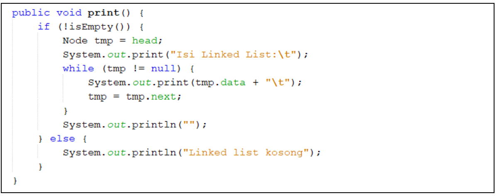

## **<center>Jobsheet Pertemuan 11</center>**

><p>Nama : Muhammad Ega Rama Fernanda<p>
>Kelas : 1F<p>
>Nomer Absen : 19<p>
>Prodi : D-IV Teknik Inormatika<p>
>Jurusan : Teknologi Inormasi<p>
><center> Politeknik Negeri Malang</center>


<br>

---

### **2. Praktikum**

#### **2.1 Pembuatan Single Linked List**
**Waktu percobaan : 30 menit**

Didalam praktikum ini, kita akan mempraktekkan bagaimana membuat Single Linked List dengan
representasi data berupa Node, pengaksesan linked list dan metode penambahan data.

1. Pada Project **StrukturData** yang sudah dibuat pada Minggu sebelumnya, buat package dengan nama **minggu11**

2. Tambahkan class-class berikut:<p>

    <p>

3. Implementasi class Node<p>

    <p>

4. Tambahkan atribut pada class SingleLinkedList<p>

    <p>

5. Sebagai langkah berikutnya, akan diimplementasikan method-method yang terdapat pada SingleLinkedList.

6. Tambahkan method **isEmpty()**.<p>

    <p>

7. Implementasi method untuk mencetak dengan menggunakan proses traverse.<p>

    <p>

8. Implementasikan method **addFirst()**.<p>

    <p>

9. Implementasikan method **addLast()**.<p>

    <p>

10. Implementasikan method **insertAfter**, untuk memasukkan node yang memiliki data input setelah node yang memiliki data key.<p>

    <p>

11. Tambahkan method penambahan node pada indeks tertentu.<p>

     <p>

12. Pada class SLLMain, buatlah fungsi **main**, kemudian buat object dari class SingleLinkedList.<p>

    <p>

13. Tambahkan Method penambahan data dan pencetakan data di setiap penambahannya agar terlihat perubahannya.<p>

    <p>

>Hasil Output :

<p>

>Source Code nodeClass :
```java
package minggu11;

/**
 *
 * @author EgaRam
 */
public class node {
    int data;
    node next;
    
    public node(int nilai, node berikutnya){
        this.data = nilai;
        this.next = berikutnya;
    }
}
```

>Source Code singlelinkedlistClass :
```java
package minggu11;

/**
 *
 * @author EgaRam
 */
public class singlelinkedlist {
    
    node head; //posisi awal linked list
    node tail; //posisi akhir linked list
    
    public boolean isEmpty(){
        return head == null;
    }
    public void print(){
    if(!isEmpty()){
        node tmp = head;
        System.out.print("Isi Linked List : \t");
        while(tmp != null){
            System.out.print(tmp.data + "\t");
            tmp = tmp.next;
        }
        System.out.println(" ");
    }else{
        System.out.println("Linked list kosong");
    }
    }
    public void addFirst(int input){
        node ndInput = new node(input, null);
        if(isEmpty()){ //jika linked list kosong
            head = ndInput; //head dan tail sama dengan node input
            tail = ndInput;
        }else{
            ndInput.next = head;
            head = ndInput;
        }
    }
    public void addLast(int input){
        node ndInput = new node(input, null);
        if(isEmpty()){
            head = ndInput; //head dan tail sama dengan node input
            tail = ndInput;
        }else{
            tail.next = ndInput;
            tail = ndInput;
        }
    }
    public void insertAfter(int key, int input){
        node ndInput = new node(input, null);
        node temp = head;
        do{
            if(temp.data == key){
                ndInput.next = temp.next;
                temp.next = ndInput;
                if(ndInput.next == null){
                    tail = ndInput;
                    break;
                } 
            }
            temp = temp.next;
        }while(temp != null);
    }
    public void insertAt(int index, int input){
        if(index < 0){
            System.out.println("Indeks salah");
        }else if(index == 0){
            addFirst(input);
        }else{
            node temp = head;
            for(int i = 0; i < index - 1; i++){
                temp = temp.next;
            }
            temp.next = new node(input, temp.next);
            if(temp.next.next == null){
                tail = temp.next;
            }
        }
    }
    public int getData(int index){
        node tmp = head;
        for(int i = 0; i < index; i++){
            tmp = tmp.next;
        }
        return tmp.data;
    }
    public int indexOf(int key){
        node tmp = head;
        int index = 0;
        while(tmp != null && tmp.data != key){
            tmp = tmp.next;
            index++;
        }
        if(tmp == null){
            return -1;
        }else{
            return index;
        }
    }
    public void removeFirst(){
        if(isEmpty()){
            System.out.println("Linked List masih kosong, tidak dapat dihapus!");
        }else if(head == tail){
            head = tail = null;
        }else{
            head = head.next;
        }
    }
    public void removeLast(){
        if(isEmpty()){
            System.out.println("Linked List masih kosong, tidak dapat dihapus");
        }else if(head == tail){
            head = tail = null;
        }else{
            node temp = head;
            while(temp.next != tail){
                temp = temp.next;
            }
            temp.next = null;
            tail = temp;
        }
    }
    public void remove(int key){
        if(isEmpty()){
            System.out.println("Linked List masih kosong, tidak dapat dihapus!");
        }else{
            node temp = head;
            while(temp != null){
                if((temp.data == key) && (temp == head)){
                    this.removeFirst();
                    break;
                }else if(temp.next.data == key){
                    temp.next = temp.next.next;
                    if(temp.next == null){
                        tail = temp;
                    }
                    break;
                }
                temp = temp.next;
            }
        }
    }
    public void removeAt(int index){
        if(index == 0){
            removeFirst();
        }else{
            node temp = head;
            for(int i = 0; i < index - 1; i++){
                temp = temp.next;
            }
            temp.next = temp.next.next;
            if(temp.next == null){
                tail = temp;
            }
        }
    }
}
```

>Source Code sllMain :
```java
package minggu11;

/**
 *
 * @author EgaRam
 */
public class sllMain {
    public static void main(String[] args) {
    singlelinkedlist singLL = new singlelinkedlist();
    
    singLL.print();
    singLL.addFirst(890);
    singLL.print();
    singLL.addLast(760);
    singLL.print();
    singLL.addFirst(700);
    singLL.print();
    singLL.insertAfter(700, 999);
    singLL.print();
    singLL.insertAt(3, 833);
    singLL.print();
    }
}
```

---
#### **2.1.1 Verifikasi Hasil Percobaan**
Cocokkan hasil compile kode program anda dengan gambar berikut ini.<p>

<p>

#### **2.1.2 Pertanyaan**
1. Mengapa hasil compile kode program di baris pertama menghasilkan “Linked List Kosong”?

    >**Karena di program pengetikan pertamanya hanya singll.print atau langsung print dan masih belum mengisi data apapun, jadi hasil isi linked list terbaca kosong**.

2. Pada step 10, jelaskan kegunaan kode berikut<p>

    <p>

    >**Kegunaan kode tersebut adalah ndInput.next = temp.next digunakan untuk mengubah variabel ndInput.next menjadi temp.next, nah temp.next ini nantinya akan sama dengan ndInput yang berarti menyimpan data yang diinputan**.

3. Perhatikan class SingleLinkedList, pada method insertAt Jelaskan kegunaan kode berikut<p>

    <p>

    >**Kegunaan kode tersebut adalah jika temp.next.next == null atau kosong maka tailnya sama dengan temp.next yang tadinya digunakan untuk menyimpan data tail nantinya**.
---

### **2.2 Modifikasi Elemen pada Single Linked List**
**Waktu percobaan : 30 menit**

Didalam praktikum ini, kita akan mempraktekkan bagaimana mengakses elemen, mendapatkan indeks dan melakukan penghapusan data pada Single Linked List.:

---

#### **2.2.1 Langkah-langkah Percobaan**
1. Implementasikan method untuk mengakses data dan indeks pada linked list

2. Tambahkan method untuk mendapatkan data pada indeks tertentu pada class Single Linked List<p>

    <p>

3. Implementasikan method **indexOf**.<p>

    <p>

4. Tambahkan method removeFirst pada class SingleLinkedList<p>

    <p>

5. Tambahkan method untuk menghapus data pada bagian belakang pada class SingleLinkedList<p>

    <p>

6. Sebagai langkah berikutnya, akan diimplementasikan method remove<p>

    <p>

7. Implementasi method untuk menghapus node dengan menggunakan index<p>

    <p>

8. Kemudian, coba lakukan pengaksesan dan penghapusan data di method main pada class SLLMain dengan menambahkan kode berikut<p>

    <p>

9. Method SLLMain menjadi:<p>

    <p>

10. Jalankan class SLLMain

>Hasil Output :

<p>

>Source Code nodeClass :
```java
package minggu11;

/**
 *
 * @author EgaRam
 */
public class node {
    int data;
    node next;
    
    public node(int nilai, node berikutnya){
        this.data = nilai;
        this.next = berikutnya;
    }
}
```

>Source Code singlelinkedlistClass :
```java
package minggu11;

/**
 *
 * @author EgaRam
 */
public class singlelinkedlist {
    
    node head; //posisi awal linked list
    node tail; //posisi akhir linked list
    
    public boolean isEmpty(){
        return head == null;
    }
    public void print(){
    if(!isEmpty()){
        node tmp = head;
        System.out.print("Isi Linked List : \t");
        while(tmp != null){
            System.out.print(tmp.data + "\t");
            tmp = tmp.next;
        }
        System.out.println(" ");
    }else{
        System.out.println("Linked list kosong");
    }
    }
    public void addFirst(int input){
        node ndInput = new node(input, null);
        if(isEmpty()){ //jika linked list kosong
            head = ndInput; //head dan tail sama dengan node input
            tail = ndInput;
        }else{
            ndInput.next = head;
            head = ndInput;
        }
    }
    public void addLast(int input){
        node ndInput = new node(input, null);
        if(isEmpty()){
            head = ndInput; //head dan tail sama dengan node input
            tail = ndInput;
        }else{
            tail.next = ndInput;
            tail = ndInput;
        }
    }
    public void insertAfter(int key, int input){
        node ndInput = new node(input, null);
        node temp = head;
        do{
            if(temp.data == key){
                ndInput.next = temp.next;
                temp.next = ndInput;
                if(ndInput.next == null){
                    tail = ndInput;
                    break;
                } 
            }
            temp = temp.next;
        }while(temp != null);
    }
    public void insertAt(int index, int input){
        if(index < 0){
            System.out.println("Indeks salah");
        }else if(index == 0){
            addFirst(input);
        }else{
            node temp = head;
            for(int i = 0; i < index - 1; i++){
                temp = temp.next;
            }
            temp.next = new node(input, temp.next);
            if(temp.next.next == null){
                tail = temp.next;
            }
        }
    }
    public int getData(int index){
        node tmp = head;
        for(int i = 0; i < index; i++){
            tmp = tmp.next;
        }
        return tmp.data;
    }
    public int indexOf(int key){
        node tmp = head;
        int index = 0;
        while(tmp != null && tmp.data != key){
            tmp = tmp.next;
            index++;
        }
        if(tmp == null){
            return -1;
        }else{
            return index;
        }
    }
    public void removeFirst(){
        if(isEmpty()){
            System.out.println("Linked List masih kosong, tidak dapat dihapus!");
        }else if(head == tail){
            head = tail = null;
        }else{
            head = head.next;
        }
    }
    public void removeLast(){
        if(isEmpty()){
            System.out.println("Linked List masih kosong, tidak dapat dihapus");
        }else if(head == tail){
            head = tail = null;
        }else{
            node temp = head;
            while(temp.next != tail){
                temp = temp.next;
            }
            temp.next = null;
            tail = temp;
        }
    }
    public void remove(int key){
        if(isEmpty()){
            System.out.println("Linked List masih kosong, tidak dapat dihapus!");
        }else{
            node temp = head;
            while(temp != null){
                if((temp.data == key) && (temp == head)){
                    this.removeFirst();
                    break;
                }else if(temp.next.data == key){
                    temp.next = temp.next.next;
                    if(temp.next == null){
                        tail = temp;
                    }
                    break;
                }
                temp = temp.next;
            }
        }
    }
    public void removeAt(int index){
        if(index == 0){
            removeFirst();
        }else{
            node temp = head;
            for(int i = 0; i < index - 1; i++){
                temp = temp.next;
            }
            temp.next = temp.next.next;
            if(temp.next == null){
                tail = temp;
            }
        }
    }
}
```

>Source Code sllMain :
```java
package minggu11;

/**
 *
 * @author EgaRam
 */
public class sllMain {
    public static void main(String[] args) {
    singlelinkedlist singLL = new singlelinkedlist();
    
    singLL.print();
    singLL.addFirst(890);
    singLL.print();
    singLL.addLast(760);
    singLL.print();
    singLL.addFirst(700);
    singLL.print();
    singLL.insertAfter(700, 999);
    singLL.print();
    singLL.insertAt(3, 833);
    singLL.print();

    System.out.println("Data pada indeks ke-1 = " +singLL.getData(1));
    System.out.println("Data 3 berada pada indeks ke-" +singLL.indexOf(760));
        
    singLL.remove(999);
    singLL.print();
    singLL.removeAt(0);
    singLL.print();
    singLL.removeFirst();
    singLL.print();
    singLL.removeLast();
    singLL.print();
    }
}
```

---
#### **2.2.2 Verifikasi Hasil Percobaan**
Cocokkan hasil compile kode program anda dengan gambar berikut ini.<p>

<p>

#### **2.2.3 Pertanyaan**
1. Mengapa digunakan keyword break pada fungsi remove? Jelaskan!

    >**Untuk break yang di if digunakan jika data dihapus pada head dan data tersebut ditemukan, maka akan langsung di break. Untuk break yang kedua jika data yang dihapus setelah head dan ditemukan maka program akan langsung break**.

2. Jelaskan kegunaan kode dibawah pada method remove<p>

    <p>

    >**Jika temp.next.data == key atau mencari nilai yang dicari maka temp.next akan sama dengan temp.next.next atau melanjutkan pencarian sama menemukan nilai yang dicari**.

3. Apa saja nilai kembalian yang dapat dikembalikan pada method indexOf? Jelaskan maksud masing-masing kembalian tersebut!

    >**Didalam method indexOf terdapat 2 pengembalian atau bisa disebut return, nah itu letaknya di if(tmp == null) maka return -1, disini maksudnya adalah jika tmp kosong, maka data tersebut belum di isi. Dan untuk letak yang kedua terdapat di else maka return index, disini maksudnya adalah jika salah maka tmp tersebut memiliki nilai dan akhirnya membuat index untuk nilai tersebut**.
---

### **3. Tugas**
**Waktu pengerjaan : 50 menit**

1. Buat method insertBefore untuk menambahkan node sebelum keyword yang diinginkan

    >Hasil Output :

    <p>

    >Source Code nodeClass :
    ```java
    package minggu11;

    /**
     *
     * @author EgaRam
     */
    public class node {
    int data;
    node next;
    
        public node(int nilai, node berikutnya){
            this.data = nilai;
            this.next = berikutnya;
        }
    }
    ```

    >Source Code singlelinkedlistClass :
    ```java
    package minggu11;

    /**
     *
     * @author EgaRam
     */
    public class singlelinkedlist {
    
        node head; //posisi awal linked list
        node tail; //posisi akhir linked list
    
        public boolean isEmpty(){
            return head == null;
        }
        public void print(){
        if(!isEmpty()){
            node tmp = head;
            System.out.print("Isi Linked List : \t");
            while(tmp != null){
                System.out.print(tmp.data + "\t");
                tmp = tmp.next;
            }
            System.out.println(" ");
        }else{
            System.out.println("Linked list kosong");
        }
        }
        public void addFirst(int input){
            node ndInput = new node(input, null);
            if(isEmpty()){ //jika linked list kosong
                head = ndInput; //head dan tail sama dengan node input
                tail = ndInput;
            }else{
                ndInput.next = head;
                head = ndInput;
            }
        }
        public void addLast(int input){
            node ndInput = new node(input, null);
            if(isEmpty()){
                head = ndInput; //head dan tail sama dengan node input
                tail = ndInput;
            }else{
                tail.next = ndInput;
                tail = ndInput;
            }
        }
        public void insertAfter(int key, int input){
            node ndInput = new node(input, null);
            node temp = head;
            do{
                if(temp.data == key){
                    ndInput.next = temp.next;
                    temp.next = ndInput;
                    if(ndInput.next == null){
                        tail = ndInput;
                        break;
                    } 
                }
                temp = temp.next;
            }while(temp != null);
        }
        public void insertAt(int index, int input){
            if(index < 0){
                System.out.println("Indeks salah");
            }else if(index == 0){
                addFirst(input);
            }else{
                node temp = head;
                for(int i = 0; i < index - 1; i++){
                    temp = temp.next;
                }
                temp.next = new node(input, temp.next);
                if(temp.next.next == null){
                    tail = temp.next;
                }
            }
        }
        public void insertBefore(int key, int input){
            node ndInput = new node(input, null);
            node temp = head;
            do{
                if(temp.data == key){
                    addFirst(input);
                    break;
                }else if(ndInput.next == null){
                        tail = ndInput;
                        break;
                    } 
                temp = temp.next;
            }while(temp != null);
        }
        public int getData(int index){
            node tmp = head;
            for(int i = 0; i < index; i++){
                tmp = tmp.next;
            }
            return tmp.data;
        }
        public int indexOf(int key){
            node tmp = head;
            int index = 0;
            while(tmp != null && tmp.data != key){
                tmp = tmp.next;
                index++;
            }
            if(tmp == null){
                return -1;
            }else{
                return index;
            }
        }
        public void removeFirst(){
            if(isEmpty()){
                System.out.println("Linked List masih kosong, tidak dapat dihapus!");
            }else if(head == tail){
                head = tail = null;
            }else{
                head = head.next;
            }
        }
        public void removeLast(){
            if(isEmpty()){
                System.out.println("Linked List masih kosong, tidak dapat dihapus");
            }else if(head == tail){
                head = tail = null;
            }else{
                node temp = head;
                while(temp.next != tail){
                    temp = temp.next;
                }
                temp.next = null;
                tail = temp;
            }
        }
        public void remove(int key){
            if(isEmpty()){
                System.out.println("Linked List masih kosong, tidak dapat dihapus!");
            }else{
                node temp = head;
                while(temp != null){
                    if((temp.data == key) && (temp == head)){
                    this.removeFirst();
                    break;
                    }else if(temp.next.data == key){
                        temp.next = temp.next.next;
                        if(temp.next == null){
                        tail = temp;
                        }
                        break;
                    }
                    temp = temp.next;
                }
            }
        }
        public void removeAt(int index){
            if(index == 0){
                removeFirst();
            }else{
                node temp = head;
                for(int i = 0; i < index - 1; i++){
                    temp = temp.next;
                }
                temp.next = temp.next.next;
                if(temp.next == null){
                    tail = temp;
                }
            }
        }
    }
    ```

    >Source Code sllMain :
    ```java
    package minggu11;

    /**
     *
     * @author EgaRam
     */
    public class sllMain {
        public static void main(String[] args) {
        singlelinkedlist singLL = new singlelinkedlist();
    
        singLL.print();
        singLL.addFirst(890);
        singLL.print();
        singLL.addLast(760);
        singLL.print();
        singLL.addFirst(700);
        singLL.print();
        singLL.insertAfter(700, 999);
        singLL.print();
        singLL.insertBefore(700, 500);
        singLL.print();
        singLL.insertAt(3, 833);
        singLL.print();
    
        System.out.println("Data pada indeks ke-1 = " +singLL.getData(1));
        System.out.println("Data 3 berada pada indeks ke-" +singLL.indexOf(760));
        
        singLL.remove(999);
        singLL.print();
        singLL.removeAt(0);
        singLL.print();
        singLL.removeFirst();
        singLL.print();
        singLL.removeLast();
        singLL.print();
        }
    }
    ```

2. Implementasikan ilustrasi Linked List Berikut. Gunakan 4 macam penambahan data yang telah dipelajari sebelumnya untuk menginputkan data.<p>

    <p>

    >Hasil Output :

    <p>

    >Source Code nodeClass :
    ```java
    package minggu11;

    /**
    *
    * @author EgaRam
    */
    public class node {
        String data;
        node next;
        
        public node(String nilai, node berikutnya){
            this.data = nilai;
            this.next = berikutnya;
        }
    }
    ```

    >Source Code singlelinkedlistClass :
    ```java
    package minggu11;

    /**
    *
    * @author EgaRam
    */
    public class singlelinkedlist {
        
        node head; //posisi awal linked list
        node tail; //posisi akhir linked list
        
        public boolean isEmpty(){
            return head == null;
        }
        public void print(){
        if(!isEmpty()){
            node tmp = head;
            System.out.print("Isi Linked List : \t");
            while(tmp != null){
                System.out.print(tmp.data + "\t");
                tmp = tmp.next;
            }
            System.out.println(" ");
        }else{
            System.out.println("Linked list kosong");
        }
        }
        public void addFirst(String input){
            node ndInput = new node(input, null);
            if(isEmpty()){ //jika linked list kosong
                head = ndInput; //head dan tail sama dengan node input
                tail = ndInput;
            }else{
                ndInput.next = head;
                head = ndInput;
            }
        }
        public void addLast(String input){
            node ndInput = new node(input, null);
            if(isEmpty()){
                head = ndInput; //head dan tail sama dengan node input
                tail = ndInput;
            }else{
                tail.next = ndInput;
                tail = ndInput;
            }
        }
        public void insertAfter(String key, String input){
            node ndInput = new node(input, null);
            node temp = head;
            do{
                if(temp.data == key){
                    ndInput.next = temp.next;
                    temp.next = ndInput;
                    if(ndInput.next == null){
                        tail = ndInput;
                        break;
                    } 
                }
                temp = temp.next;
            }while(temp != null);
        }
        public void insertAt(int index, String input){
            if(index < 0){
                System.out.println("Indeks salah");
            }else if(index == 0){
                addFirst(input);
            }else{
                node temp = head;
                for(int i = 0; i < index - 1; i++){
                    temp = temp.next;
                }
                temp.next = new node(input, temp.next);
                if(temp.next.next == null){
                    tail = temp.next;
                }
            }
        }
        public void insertBefore(String key, String input){
            node ndInput = new node(input, null);
            node temp = head;
            node gb = null;
            do{
                if(head.data == key){
                    addFirst(input);
                    break;
                }else if(temp.data == key){
                        ndInput.next = temp;
                        gb.next = ndInput;
                        if(ndInput.next == null){
                        tail = ndInput;
                        break;
                        }
                    }
                gb = temp;
                temp = temp.next;
            }while(temp != null);
        }
        public String getData(int index){
            node tmp = head;
            for(int i = 0; i < index; i++){
                tmp = tmp.next;
            }
            return tmp.data;
        }
        public int indexOf(String key){
            node tmp = head;
            int index = 0;
            while(tmp != null && tmp.data != key){
                tmp = tmp.next;
                index++;
            }
            if(tmp == null){
                return -1;
            }else{
                return index;
            }
        }
        public void removeFirst(){
            if(isEmpty()){
                System.out.println("Linked List masih kosong, tidak dapat dihapus!");
            }else if(head == tail){
                head = tail = null;
            }else{
                head = head.next;
            }
        }
        public void removeLast(){
            if(isEmpty()){
                System.out.println("Linked List masih kosong, tidak dapat dihapus");
            }else if(head == tail){
                head = tail = null;
            }else{
                node temp = head;
                while(temp.next != tail){
                    temp = temp.next;
                }
                temp.next = null;
                tail = temp;
            }
        }
        public void remove(String key){
            if(isEmpty()){
                System.out.println("Linked List masih kosong, tidak dapat dihapus!");
            }else{
                node temp = head;
                while(temp != null){
                    if((temp.data == key) && (temp == head)){
                        this.removeFirst();
                        break;
                    }else if(temp.next.data == key){
                        temp.next = temp.next.next;
                        if(temp.next == null){
                            tail = temp;
                        }
                        break;
                    }
                    temp = temp.next;
                }
            }
        }
        public void removeAt(int index){
            if(index == 0){
                removeFirst();
            }else{
                node temp = head;
                for(int i = 0; i < index - 1; i++){
                    temp = temp.next;
                }
                temp.next = temp.next.next;
                if(temp.next == null){
                    tail = temp;
                }
            }
        }
    }
    ```

    >Source Code sllMain :
    ```java
    package minggu11;

    /**
    *
    * @author EgaRam
    */
    public class sllMain {
        public static void main(String[] args) {
        singlelinkedlist singLL = new singlelinkedlist();
        
        singLL.print();
        singLL.addFirst("A");
        singLL.print();
        singLL.addLast("E");
        singLL.print();
        singLL.insertAfter("A", "B");
        singLL.print();
        singLL.insertAt(2, "C");
        singLL.print();
        singLL.insertBefore("E", "D");
        singLL.print();
        
        System.out.println("Data pada indeks ke-1 = " +singLL.getData(1));
        System.out.println("Data 3 berada pada indeks ke-" +singLL.indexOf("A"));
        
        singLL.removeAt(0);
        singLL.print();
        singLL.removeFirst();
        singLL.print();
        singLL.removeLast();
        singLL.print();
        }
    }
    ```

3. Buatlah Implementasi Stack berikut menggunakan Single Linked List<p>

    <p>

    >Hasil Output :

    <p>
    <p>
    <p>

    >Source Code nodeClass :
    ```java
    package minggu11.Tugas2;

    /**
    *
    * @author EgaRam
    */
    public class node {
        String data;
        node next;
        
        public node(String nilai, node berikutnya){
            this.data = nilai;
            this.next = berikutnya;
        }
    }
    ```

    >Source Code singleLinkedlistClass :
    ```java
    package minggu11.Tugas2;

    /**
    *
    * @author EgaRam
    */
    public class singleLinkedlist {
        node head; //posisi awal linked list
        node tail; //posisi akhir linked list
        
        public boolean isEmpty(){
            return head == null;
        }
        public void pre(){
        if(!isEmpty()){
            node tmp = head;
            System.out.println("Berhasil menambahkan data : " + tmp.data);
        }
        }
        public void print(){
        if(!isEmpty()){
            node tmp = head;
            while(tmp != null){
                System.out.println(tmp.data + "\t");
                tmp = tmp.next;
            }
            System.out.println(" ");
        }else{
            System.out.println("Linked list kosong");
        }
        }
        public void addFirst(String input){
            node ndInput = new node(input, null);
            if(isEmpty()){ //jika linked list kosong
                head = ndInput; //head dan tail sama dengan node input
                tail = ndInput;
            }else{
                ndInput.next = head;
                head = ndInput;
            }
        }
        public int indexOf(String key){
            node tmp = head;
            int index = 0;
            while(tmp != null && tmp.data != key){
                tmp = tmp.next;
                index++;
            }
            if(tmp == null){
                return -1;
            }else{
                return index;
            }
        }
        public String getData(int index){
            node tmp = head;
            for(int i = 0; i < index; i++){
                tmp = tmp.next;
            }
            return tmp.data;
        }
        public void removeFirst(){
            node tmp = head;
            if(isEmpty()){
                System.out.println("Linked List masih kosong, tidak dapat dihapus!");
            }else if(head == tail){
                head = tail = null;
            }else{
                head = head.next;
            }
            System.out.println("Menghapus Data : " + tmp.data);
        }
        public void removeLast(){
            node tmp = tail;
            if(isEmpty()){
                System.out.println("Linked List masih kosong, tidak dapat dihapus");
            }else if(head == tail){
                head = tail = null;
            }else{
                node temp = head;
                while(temp.next != tail){
                    temp = temp.next;
                }
                temp.next = null;
                tail = temp;
                System.out.println("Menghapus Data : " + tmp.data);
            }
        }
        public void remove(String key){
            if(isEmpty()){
                System.out.println("Linked List masih kosong, tidak dapat dihapus!");
            }else{
                node temp = head;
                while(temp != null){
                    if((temp.data == key) && (temp == head)){
                        this.removeFirst();
                        break;
                    }else if(temp.next.data == key){
                        temp.next = temp.next.next;
                        if(temp.next == null){
                            tail = temp;
                        }
                        break;
                    }
                    temp = temp.next;
                }
            }
        }
        public void removeAt(int index){
            if(index == 0){
                removeFirst();
            }else{
                node temp = head;
                for(int i = 0; i < index - 1; i++){
                    temp = temp.next;
                }
                temp.next = temp.next.next;
                if(temp.next == null){
                    tail = temp;
                }
            }
        }
    }
    ```

    >Source Code sLLMain :
    ```java
    package minggu11.Tugas2;

    /**
    *
    * @author EgaRam
    */
    public class sLLMain {
    public static void main(String[] args) {
        singleLinkedlist singLL = new singleLinkedlist();
        
        singLL.addFirst("Bahasa");
        singLL.pre();
        singLL.print();
        singLL.addFirst("Android");
        singLL.pre();
        singLL.print();
        singLL.addFirst("Komputer");
        singLL.pre();
        singLL.print();
        singLL.addFirst("Basis Data");
        singLL.pre();
        singLL.print();
        singLL.addFirst("Matematika");
        singLL.pre();
        singLL.print();
        singLL.addFirst("Algoritma");
        singLL.pre();
        singLL.print();
        singLL.addFirst("Statistika");
        singLL.pre();
        singLL.print();
        singLL.addFirst("Multimedia");
        singLL.pre();
        singLL.print();
        
        System.out.println("=======================");
        System.out.println("||Hasil Linked List :||");
        System.out.println("=======================");
        System.out.println(" ");
        singLL.print();
        
        System.out.println("====================================================");
        System.out.println("Data pada indeks ke-1 = " +singLL.getData(1));
        System.out.println("Data " +singLL.getData(4) + " tersebut berada pada indeks ke-" +singLL.indexOf("Basis Data"));
        System.out.println("====================================================");
        System.out.println(" ");
        
        System.out.println("========================");
        System.out.println("||Remove Linked List :||");
        System.out.println("========================");
        System.out.println(" ");
        
        singLL.removeAt(0);
        singLL.print();
        singLL.removeFirst();
        singLL.print();
        singLL.removeLast();
        singLL.print();
        }
    }
    ```

4. Buatlah implementasi program antrian untuk mengilustasikan mahasiswa yang sedang meminta tanda tangan KRS pada dosen DPA di kampus pada tugas jobsheet 8 menggunakan LinkedList. Implementasikan Queue pada antrian mahasiswa dengan menggunakan konsep LinkedList!

    >Hasil Output :

    <p>
    <p>
    <p>

    >Source Code nodeClass :
    ```java
    package minggu11.Tugas3;

    /**
    *
    * @author EgaRam
    */
    public class node {
        node next;
        String nim, nama;
        int absen;
        double ipk;
        
        public node(String nim, String nama, int absen, double ipk, node berikutnya){
            this.nim = nim;
            this.nama = nama;
            this.absen = absen;
            this.ipk = ipk;
            this.next = berikutnya;
        }
    }
    ```

    >Source Code singlelinkedlistMhsClass :
    ```java
    package minggu11.Tugas3;

    /**
    *
    * @author EgaRam
    */
    public class singlelinkedlistMhs {
        node head; //posisi awal linked list
        node tail; //posisi akhir linked list
        
        public boolean isEmpty(){
            return head == null;
        }
        public void print(){
        if(!isEmpty()){
            node tmp = head;
            while(tmp != null){
                System.out.println(tmp.nim + " | " + tmp.nama + " | " + tmp.absen + " | " + tmp.ipk);
                tmp = tmp.next;
            }
            System.out.println(" ");
        }else{
            System.out.println("Linked list kosong");
        }
        }
        public void addLast(String nim, String nama, int absen, double ipk){
            node ndInput = new node(nim, nama, absen, ipk, null);
            if(isEmpty()){
                head = ndInput; //head dan tail sama dengan node input
                tail = ndInput;
            }else{
                tail.next = ndInput;
                tail = ndInput;
            }
        }
        public void peek(){
            if(!isEmpty()){
                node tmp = head;
                System.out.println("Elemen terdepan : " + tmp.nim + " | " + tmp.nama + " | " + tmp.absen + " | " + tmp.ipk);
            }else{
                System.out.println("Queue masih kosong");
            }
        }
        public void peekRear(){
            if(!isEmpty()){
                node tmp = tail;
                System.out.println("Elemen terbelakang : " + tmp.nim + " | " + tmp.nama + " | " + tmp.absen + " | " + tmp.ipk);
            }else{
                System.out.println("Queue masih kosong");
            }
        }
        public void getData(int index){
            if(isEmpty()){
                System.out.println("Antrian masih koson!");
            }else{
            node tmp = head;
            for(int i = 0; i < index; i++){
                tmp = tmp.next;
            }
                System.out.println("Data pada index ke-" + index + " adalah " + tmp.nim + " | " + tmp.nama + " | " + tmp.absen + " | " + tmp.ipk);
            }
        }
        public void removeLast(){
            node tmp = tail;
            if(isEmpty()){
                System.out.println("Linked List masih kosong, tidak dapat dihapus");
            }else if(head == tail){
                head = tail = null;
            }else{
                node temp = head;
                while(temp.next != tail){
                    temp = temp.next;
                }
                temp.next = null;
                tail = temp;
            }
        }
    }
    ```

    >Source Code sLLMain :
    ```java
    package minggu11.Tugas3;
    import java.util.Scanner;
    /**
    *
    * @author EgaRam
    */
    public class sllMhsMain {
        public static void main(String[] args) {
        singlelinkedlistMhs singLL = new singlelinkedlistMhs();
        Scanner sc = new Scanner(System.in);
        Scanner in = new Scanner(System.in);
            
        char pilih;
        int menu;
        do {
            System.out.println("Pilihan Menu");
            System.out.println("1. Tambah Data");
            System.out.println("2. Hapus Data Terakhir");
            System.out.println("3. Lihat Elemen Paling Depan");
            System.out.println("4. Lihat Elemen Paling Belakang");
            System.out.println("5. Mencari Data Mahasiswa Melalui Index");
            System.out.println("6. Tampilkan Data");
            System.out.println("7. EXIT");
            System.out.print("Masukkan Pilihan Menu (1-7): ");
            menu = sc.nextInt();
            System.out.println("");
            if (menu < 1 || menu > 8) {
                System.out.println("Masukkan Pilihan Menu Yang Benar!");
            }

            switch (menu) {
                case 1: {
                    do {
                        System.out.print("Masukkan NIM              : ");
                        String nim = in.nextLine();
                        System.out.print("Masukkan Nama             : ");
                        String nama = in.nextLine();
                        System.out.print("Masukkan No.Absen         : ");
                        int absen = sc.nextInt();
                        System.out.print("Masukkan IPK Mahasiswa    : ");
                        double ipk = sc.nextDouble();
                        System.out.print("Apakah anda ingin menambah data baru?(y/n) : ");
                        pilih = sc.next().charAt(0);
                        singLL.addLast(nim, nama, absen, ipk);
                        System.out.println("");
                    } while (pilih == 'y' || pilih == 'Y');
                }
                break;
                case 2: {
                    singLL.removeLast();
                    System.out.println("");
                }
                break;
                case 3: {
                    singLL.peek();
                    System.out.println("");
                }
                break;
                case 4: {
                    singLL.peekRear();
                    System.out.println("");
                }
                break;
                case 5: {
                    System.out.print("Masukkan Index Pada Data Yang Dicari : ");
                    int idx = sc.nextInt();
                    singLL.getData(idx);
                    System.out.println("");
                }
                break;
                case 6: {
                    singLL.print();
                    System.out.println("");
                }
            }
        } while (menu > 0 && menu < 7);
            System.out.println("TERIMA KASIH :D");
        }
    }
    ```