## **<center>Jobsheet Pertemuan 12</center>**

><p>Nama : Muhammad Ega Rama Fernanda<p>
>Kelas : 1F<p>
>Nomer Absen : 19<p>
>Prodi : D-IV Teknik Inormatika<p>
>Jurusan : Teknologi Inormasi<p>
><center> Politeknik Negeri Malang</center>


<br>

---

### **12.1 Tujuan Praktikum**

Setelah melakukan praktikum ini, mahasiswa mampu:
1. memahami algoritma double linked lists;
2. membuat dan mendeklarasikan struktur algoritma double linked lists;
3. menerapkan algoritma double linked lists dalam beberapa study case.

---
### **12.2 Kegiatan Praktikum 1**
#### **12.2.1 Percobaan 1**
Pada percobaan 1 ini akan dibuat class Node dan class DoubleLinkedLists yang didalamnya terdapat operasi-operasi untuk menambahkan data dengan beberapa cara (dari bagian depan linked list, belakang ataupun indeks tertentu pada linked list).

1. Perhatikan diagram class Node dan class DoublelinkedLists di bawah ini! Diagram class ini yang selanjutnya akan dibuat sebagai acuan dalam membuat kode program DoubleLinkedLists.<p>

    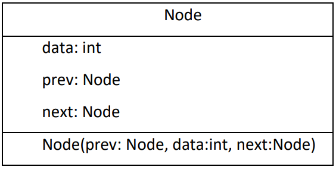<p>
    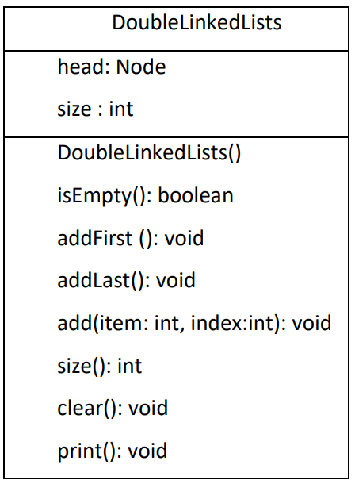<p>

2. Buat paket baru dengan nama **doublelinkedlists**
3. Buat class di dalam paket tersebut dengan nama **Node**<p>

    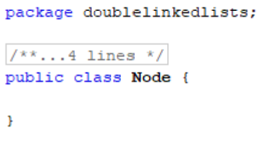<p>

4. Di dalam class tersebut, deklarasikan atribut sesuai dengan diagram class di atas.<p>

    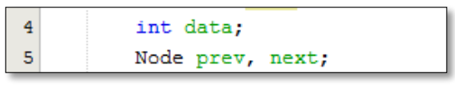<p>

5. Selanjutnya tambahkan konstruktor default pada class Node sesuai diagram di atas.<p>

    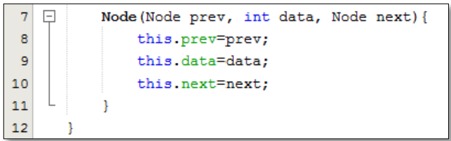<p>

6. Buatlah sebuah class baru bernama DoubleLinkedLists pada package yang sama dengan node seperti gambar berikut:<p>

    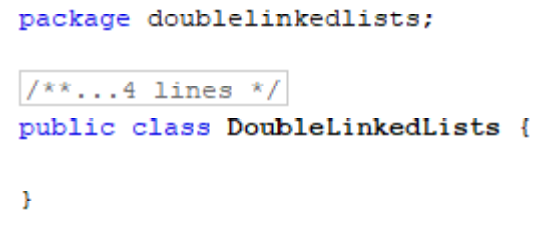<p>

7. Pada class DoubleLinkedLists tersebut, deklarasikan atribut sesuai dengan diagram class di atas.<p>

    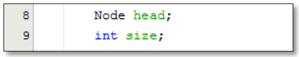<p>

8. Selajuntnya, buat konstruktor pada class DoubleLinkedLists sesuai gambar berikut.<p>

    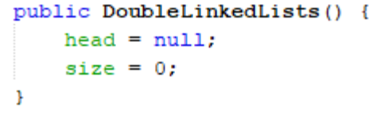<p>

9. Buat method **isEmpty()**. Method ini digunakan untuk memastikan kondisi linked list kosong.<p>

    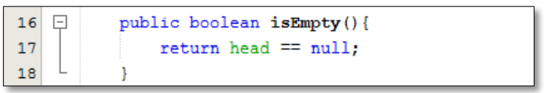<p>

10. Kemudian, buat method **addFirst()**. Method ini akan menjalankan penambahan data di bagian depan linked list.<p>

    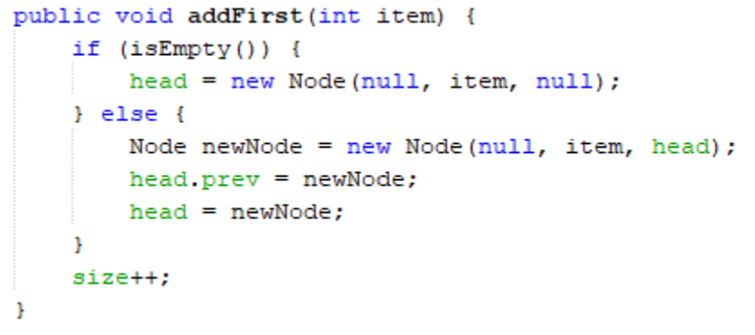<p>

11. Selain itu pembuatan method **addLast()** akan menambahkan data pada bagian belakang linked list.<p>

    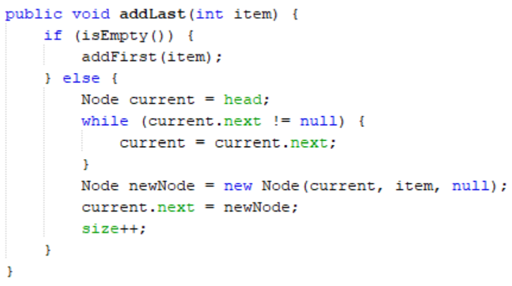<p>

12. Untuk menambakan data pada posisi yang telah ditentukan dengan indeks, dapat dibuat dengan method **add(int item, int index)**<p>

    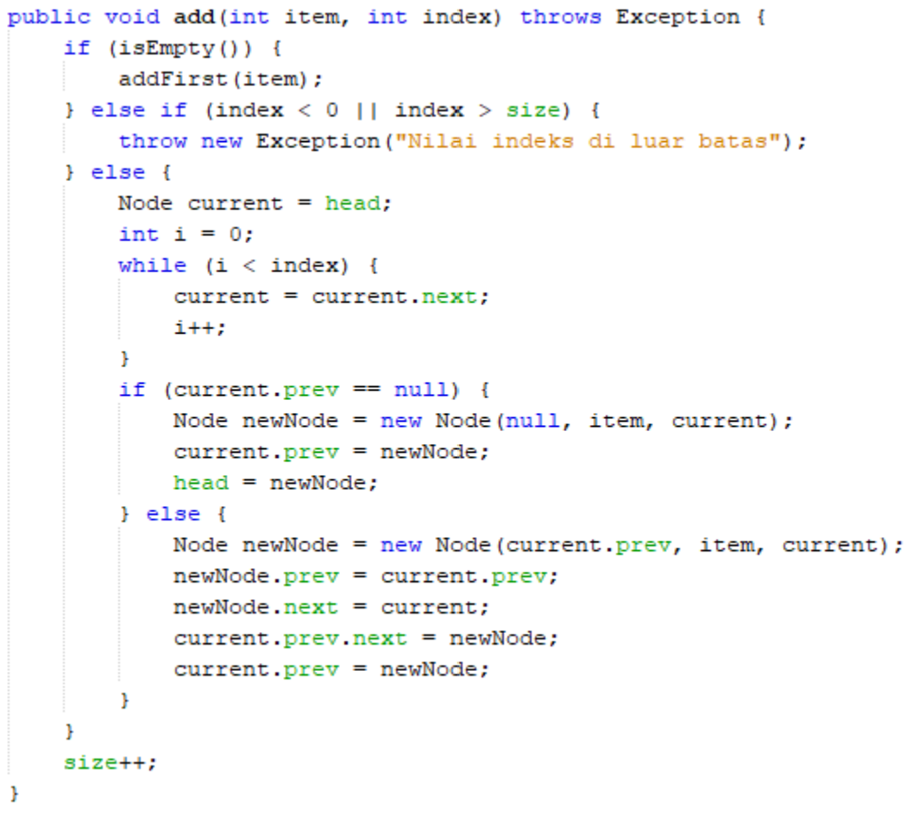<p>

13. Jumlah data yang ada di dalam linked lists akan diperbarui secara otomatis,sehingga dapat dibuat method **size()** untuk mendapatkan nilai dari size.<p>

    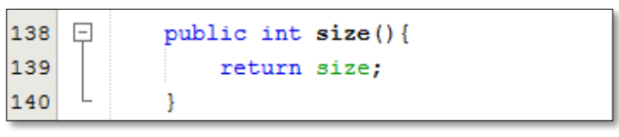<p>

14. Selanjutnya dibuat method **clear()** untuk menghapus semua isi linked lists, sehingga linked lists dalam kondisi kosong.<p>

    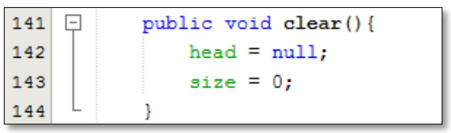<p>

15. Untuk mencetak isi dari linked lists dibuat method **print()**. Method ini akan mencetak isi linked lists berapapun size-nya. Jika kosong akan dimunculkan suatu pemberitahuan bahwa linked lists dalam kondisi kosong.<p>

    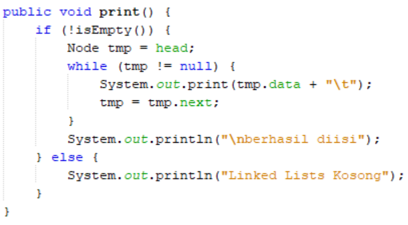<p>

16. Selanjutya dibuat class Main DoubleLinkedListsMain untuk mengeksekusi semua method yang ada pada class DoubleLinkedLists.<p>

    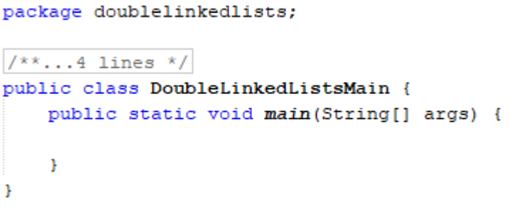<p>

17. Pada main class pada langkah 16 di atas buatlah object dari class DoubleLinkedLists kemudian eksekusi potongan program berikut ini.<p>

    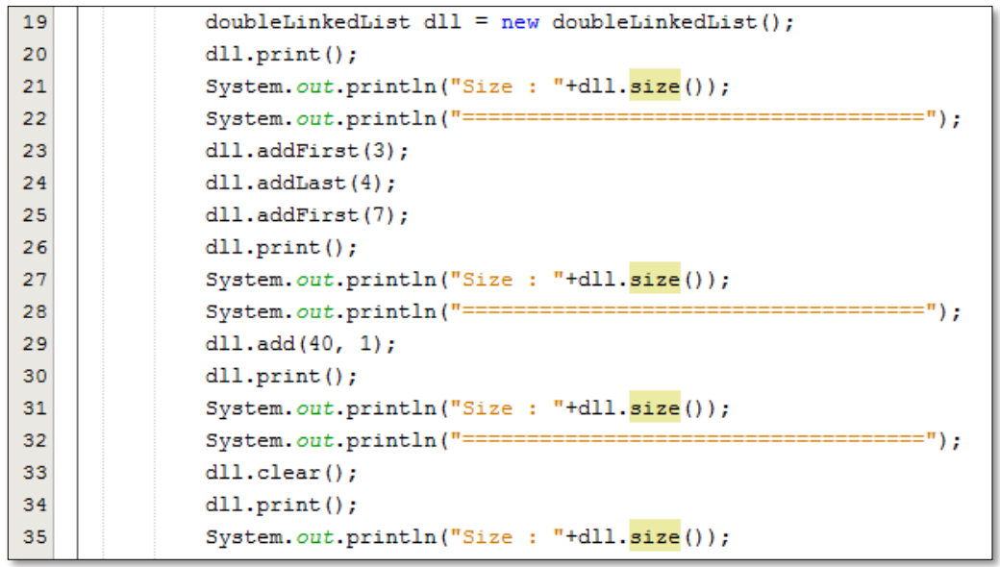<p>

>Hasil Output :

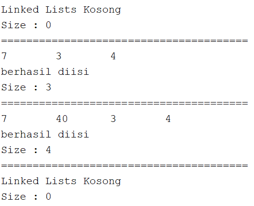<p>

>Source Code nodeClass :
```java
package minggu12;

/**
 *
 * @author EgaRam
 */
public class node {
    int data;
    node prev, next;
    
    node(node prev, int data, node next){
        this.prev = prev;
        this.data = data;
        this.next = next;
    }
}
```

>Source Code doublelinkedlistsClass :
```java
package minggu12;

/**
 *
 * @author EgaRam
 */
public class doublelinkedlists {
    node head;
    int size;
    
    public doublelinkedlists(){
        head = null;
        size = 0;
    }
    public boolean isEmpty(){
        return head == null;
    }
    public void addFirst(int item){
        if(isEmpty()){
            head = new node(null, item, null);
        }else{
            node newnode = new node(null, item, head);
            head.prev = newnode;
            head = newnode;
        }
        size++;
    }
    public void addLast(int item){
        if(isEmpty()){
            addFirst(item);
        }else{
            node current = head;
            while(current.next != null){
                current = current.next;
            }
            node newnode = new node(current, item, null);
            current.next = newnode;
            size++;
        }
    }
    public void add(int item, int index) throws Exception{
        if(isEmpty()){
            addFirst(item);
        }else if(index < 0 || index > size){
            throw new Exception("Nilai indeks di luar batas");
        }else{
            node current = head;
            int i = 0;
            while(i < index){
                current = current.next;
                i++;
            }
            if(current.prev == null){
                node newnode = new node(null, item, current);
                current.prev = newnode;
                head = newnode;
            }else{
                node newnode = new node(current.prev, item, current);
                newnode.prev = current.prev;
                newnode.next = current;
                current.prev.next = newnode;
                current.prev = newnode;
            }
        }
        size++;
    }
    public int size(){
        return size;
    }
    public void clear(){
        head = null;
        size = 0;
    }
    public void print(){
        if(!isEmpty()){
            node tmp = head;
            while(tmp != null){
                System.out.print(tmp.data + "\t");
                tmp = tmp.next;
            }
            System.out.println("\nberhasil diisi");
        }else{
            System.out.println("Linked Lists Kosong");
        }
    }
}
```

>Source Code doublelinkedlistsMain :
```java
package minggu12;

/**
 *
 * @author EgaRam
 */
public class doublelinkedlistsMain {
    public static void main(String[] args) throws Exception {   
        
    doublelinkedlists dll = new doublelinkedlists();
    dll.print();
    System.out.println("Size : " + dll.size());
    System.out.println("=======================================");
    dll.addFirst(3);
    dll.addLast(4);
    dll.addFirst(7);
    dll.print();
    System.out.println("Size : " + dll.size());
    System.out.println("=======================================");
    dll.add(40, 1);
    dll.print();
    System.out.println("Size : " + dll.size());
    System.out.println("=======================================");
    dll.clear();
    dll.print();
    System.out.println("Size : " + dll.size());
    }
}
```

---
#### **12.2.2 Verifikasi Hasil Percobaan**
Verifikasi hasil kompilasi kode program Anda dengan gambar berikut ini.<p>

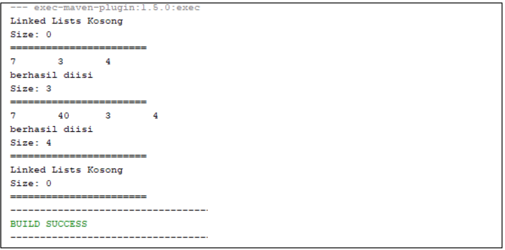<p>

---
#### **12.2.3 Pertanyaan Percobaan**
1. Jelaskan perbedaan antara single linked list dengan double linked lists!

    >**Linked list hanya memiliki 1 buah pointer yaitu next, sedangkan double linked lists memiliki 2 buah pointer yaitu next dan prev**.

2. Perhatikan class Node, didalamnya terdapat atribut next dan prev. Untuk apakah atribut tersebut?

    >**Pointer next merujuk pada node setelahnya, dan pointer prev merujuk pada node sebelumnya**.

3. Perhatikan konstruktor pada class DoubleLinkedLists. Apa kegunaan inisialisasi atribut head dan size seperti pada gambar berikut ini?<p>

    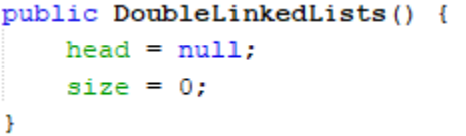<p>

    >**Potongan code diatas berfungsi, head = null digunakan untuk default node awal yang menandakan masih kosong/null, sedangkan size = 0 digunakan untuk menandakan size awal menunjukan angka awal dimulai dari nol**.

4. Pada method **addFirst()**, kenapa dalam pembuatan object dari konstruktor class Node prev dianggap sama dengan null?<p>
    
    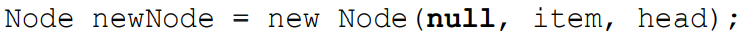<p>

    >**Karena pada method addFirst awal mula atau head itu menunjukan dimana pointer prevnya bernilai null, dan digunakan untuk menambahkan node pada awal atau item ke-0**.

5. Perhatikan pada method **addFirst()**. Apakah arti statement head.prev = newNode ?

    >**Untuk merujuk kepada jika ada node yang baru atau head yang baru**.
6. Perhatikan isi method **addLast()**, apa arti dari pembuatan object Node dengan mengisikan parameter prev dengan current, dan next dengan null?

    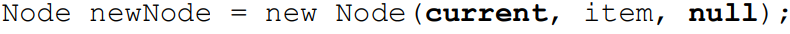<p>

    >**Karena pada method addLast dimana parameter prev dengan current berfungsi untuk menyimapan node sebelumnya, sedangkan pointer next dengan null tidak merujuk pada node manapun dikarenakan sudah berada diakhir atau tail**.

---
### **12.3 Kegiatan Praktikum 2**
#### **12.3.1 Tahapan Percobaan**

Pada praktikum 2 ini akan dibuat beberapa method untuk menghapus isi LinkedLists pada class DoubleLinkedLists. Penghapusan dilakukan dalam tiga cara di bagian paling depan, paling belakang, dan sesuai indeks yang ditentukan pada linkedLists. Method tambahan tersebut akan ditambahkan sesuai pada diagram class berikut ini.

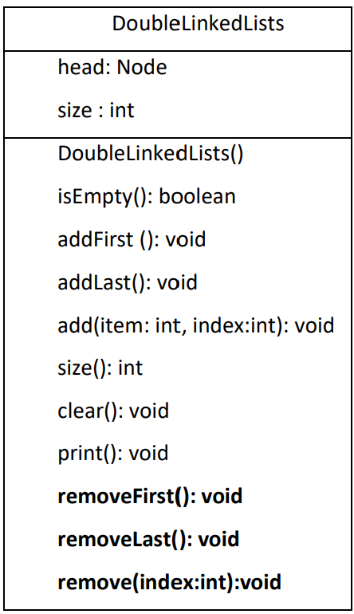<p>

1. Buatlah method **removeFirst()** di dalam class **DoubleLinkedLists**.<p>

    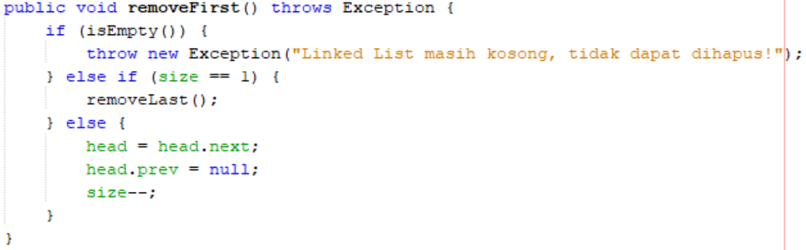<p>

2. Tambahkan method **removeLast()** di dalam class **DoubleLinkedLists**.<p>

    <p>

3. Tambahkan pula method **remove(int index)** pada class **DoubleLinkedLists** dan amati hasilnya.<p>

    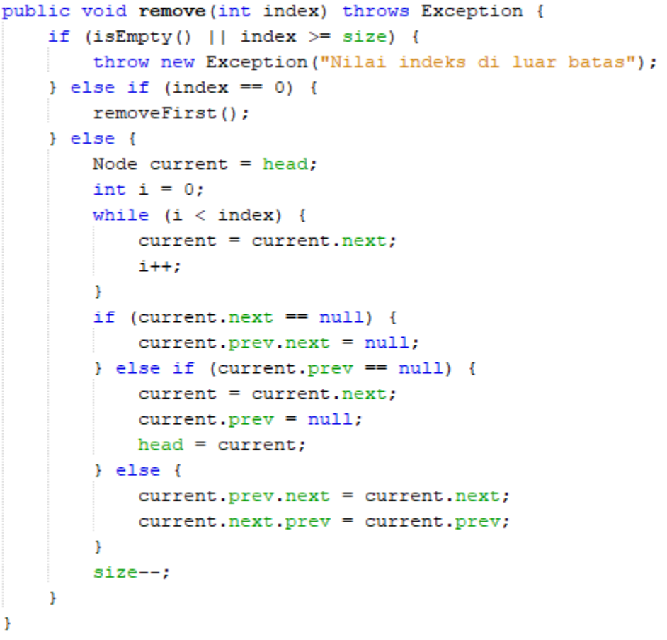<p>

4. Untuk mengeksekusi method yang baru saja dibuat, tambahkan potongan kode program berikut pada **main class**.<p>

    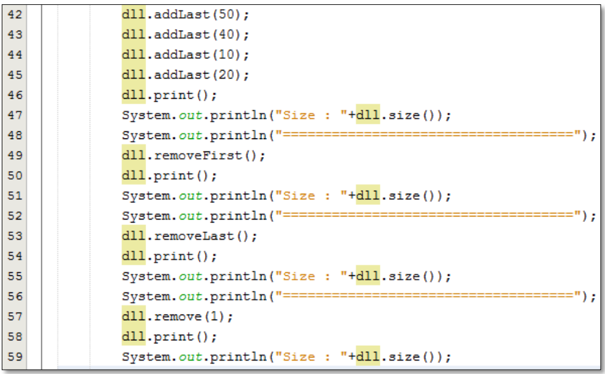<p>

>Hasil Output :

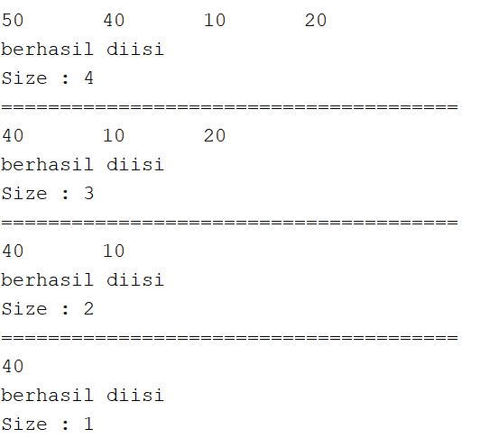<p>

>Source Code nodeClass :
```java
package minggu12;

/**
 *
 * @author EgaRam
 */
public class node {
    int data;
    node prev, next;
    
    node(node prev, int data, node next){
        this.prev = prev;
        this.data = data;
        this.next = next;
    }
}
```

>Source Code doublelinkedlistsClass :
```java
package minggu12;

/**
 *
 * @author EgaRam
 */
public class doublelinkedlists {
    node head;
    int size;
    
    public doublelinkedlists(){
        head = null;
        size = 0;
    }
    public boolean isEmpty(){
        return head == null;
    }
    public void addFirst(int item){
        if(isEmpty()){
            head = new node(null, item, null);
        }else{
            node newnode = new node(null, item, head);
            head.prev = newnode;
            head = newnode;
        }
        size++;
    }
    public void addLast(int item){
        if(isEmpty()){
            addFirst(item);
        }else{
            node current = head;
            while(current.next != null){
                current = current.next;
            }
            node newnode = new node(current, item, null);
            current.next = newnode;
            size++;
        }
    }
    public void add(int item, int index) throws Exception{
        if(isEmpty()){
            addFirst(item);
        }else if(index < 0 || index > size){
            throw new Exception("Nilai indeks di luar batas");
        }else{
            node current = head;
            int i = 0;
            while(i < index){
                current = current.next;
                i++;
            }
            if(current.prev == null){
                node newnode = new node(null, item, current);
                current.prev = newnode;
                head = newnode;
            }else{
                node newnode = new node(current.prev, item, current);
                newnode.prev = current.prev;
                newnode.next = current;
                current.prev.next = newnode;
                current.prev = newnode;
            }
        }
        size++;
    }
    public int size(){
        return size;
    }
    public void clear(){
        head = null;
        size = 0;
    }
    public void print(){
        if(!isEmpty()){
            node tmp = head;
            while(tmp != null){
                System.out.print(tmp.data + "\t");
                tmp = tmp.next;
            }
            System.out.println("\nberhasil diisi");
        }else{
            System.out.println("Linked Lists Kosong");
        }
    }
    public void removeFirst() throws Exception{
        if(isEmpty()){
            throw new Exception("Linked List masih kosong, tidak dapat dihapus!");
        }else if (size == 1){
            removeLast();
        }else{
            head = head.next;
            head.prev = null;
            size--;
        }
    }
    public void removeLast() throws Exception{
        if(isEmpty()){
            throw new Exception("Linked List masih kosong, tidak dapat dihapus!");
        }else if(head.next == null){
            head = null; //proses penghapusan head
            size--;
            return;
        }
        node current = head;
        while(current.next.next != null){
            current = current.next;
        }
        current.next = null;
        size--;
    }
    public void remove(int index) throws Exception{
        if(isEmpty() || index >= size){
            throw new Exception("Nilai indeks di luar batas");
        }else if (index == 0){
            removeFirst();
        }else{
            node current = head;
            int i = 0;
            while(i < index){
                current = current.next;
                i++;
            }
            if(current.next == null){
                current.prev.next = null;
            }else if(current.prev == null){
                current = current.next;
                current.prev = null;
                head = current;
            }else{
                current.prev.next = current.next;
                current.next.prev = current.prev;
            }
            size--;
        }
    }
}
```

>Source Code doublelinkedlistsMain :
```java
package minggu12;

/**
 *
 * @author EgaRam
 */
public class doublelinkedlistsMain {
    public static void main(String[] args) throws Exception {   
        
    doublelinkedlists dll = new doublelinkedlists();
    dll.print();
    System.out.println("Size : " + dll.size());
    System.out.println("=======================================");
    dll.addFirst(3);
    dll.addLast(4);
    dll.addFirst(7);
    dll.print();
    System.out.println("Size : " + dll.size());
    System.out.println("=======================================");
    dll.add(40, 1);
    dll.print();
    System.out.println("Size : " + dll.size());
    System.out.println("=======================================");
    dll.clear();
    dll.print();
    System.out.println("Size : " + dll.size());

    dll.addLast(50);
    dll.addLast(40);
    dll.addLast(10);
    dll.addLast(20);
    dll.print();
    System.out.println("Size : " + dll.size());
    System.out.println("=======================================");
    dll.removeFirst();
    dll.print();
    System.out.println("Size : " + dll.size());
    System.out.println("=======================================");
    dll.removeLast();
    dll.print();
    System.out.println("Size : " + dll.size());
    System.out.println("=======================================");
    dll.remove(1);
    dll.print();
    System.out.println("Size : " + dll.size());
    }
}
```

---
#### **12.3.2 Verifikasi Hasil Percobaan**
Verifikasi hasil kompilasi kode program Anda dengan gambar berikut ini.<p>

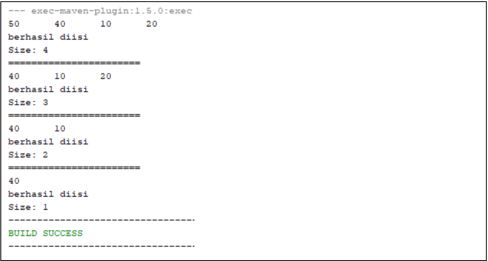<p>

---
#### **12.3.3 Pertanyaan Percobaan**
1. Apakah maksud statement berikut pada method **removeFirst()**?<p>

    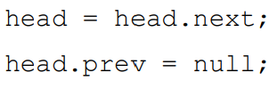<p>

    >**Maksud dari potongan diatas adalah untuk penghapusan index yang berada di awal atau head, dan head akan berpindah ke posisi node selanjutnya**.

2. Bagaimana cara mendeteksi posisi data ada pada bagian akhir pada method **removeLast()**?

    >**Dengan cara mencari pointer nextnya bernilai null**.

3. Jelaskan alasan potongan kode program di bawah ini tidak cocok untuk perintah **remove**!<p>

    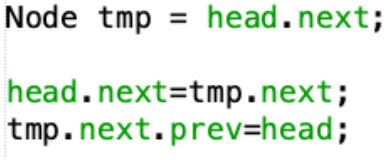<p>

    >**Karena node tmp menyimpan data setelah head, selanjutnya head.next menyimpan data pada tmp.next, kemudian tmp.next.prev menuju ke head. Maka dapat disimpulkan potongan program diatas tidak cocok untuk digunakan di perintah remove**.

4. Jelaskan fungsi kode program berikut ini pada fungsi **remove**!<p>

    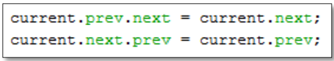<p>

    >**Fungsi potongan code diatas untuk merubah nilai yang tadinya ada pada current.prev.next akan dipindah pada current.next. Sedangkan potongan program yang dibawah current.next.prev nilainya akan dipindah pada current.prev**.

---
### **12.4 Kegiatan Praktikum 3**
#### **12.4.1 Tahapan Percobaan**

Pada praktikum 3 ini dilakukan uji coba untuk mengambil data pada linked list dalam 3 kondisi, yaitu mengambil data paling awal, paling akhir dan data pada indeks tertentu dalam linked list. Method mengambil data dinamakan dengan get. Ada 3 method get yang dibuat pada praktikum ini sesuai dengan diagram class DoubleLinkedLists.<p>

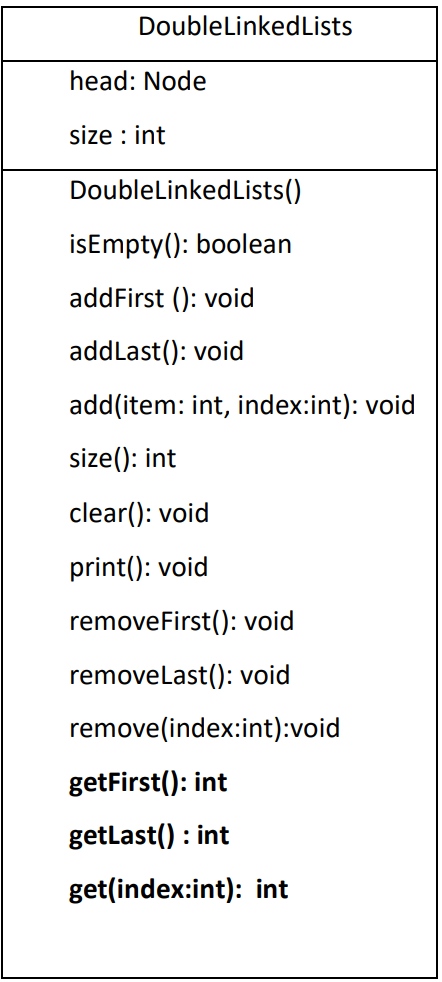<p>

1. Buatlah method **getFirst()** di dalam class DoubleLinkedLists untuk mendapatkan data pada awal linked lists.

    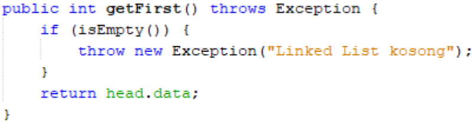<p>

2. Selanjutnya, buatlah method **getLast()** untuk mendapat data pada akhir linked lists.

    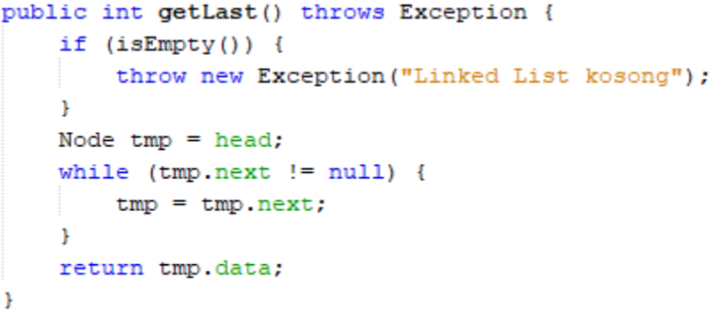<p>

3. Method **get(int index)** di buat untuk mendapatkan data pada indeks tertentu

    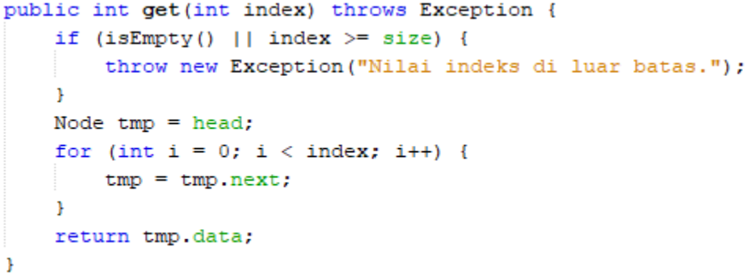<p>

4. Pada main class tambahkan potongan program berikut dan amati hasilnya!

    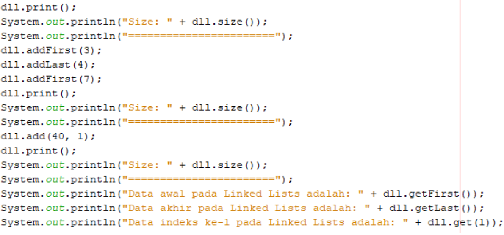<p>

>Hasil Output :

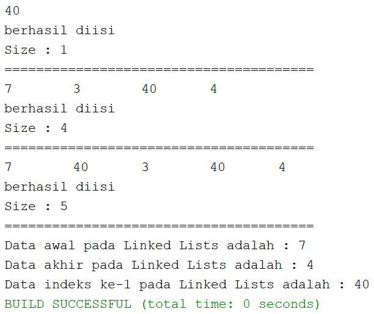<p>

>Source Code nodeClass :
```java
package minggu12;

/**
 *
 * @author EgaRam
 */
public class node {
    int data;
    node prev, next;
    
    node(node prev, int data, node next){
        this.prev = prev;
        this.data = data;
        this.next = next;
    }
}
```

>Source Code doublelinkedlistsClass :
```java
package minggu12;

/**
 *
 * @author EgaRam
 */
public class doublelinkedlists {
    node head;
    int size;
    
    public doublelinkedlists(){
        head = null;
        size = 0;
    }
    public boolean isEmpty(){
        return head == null;
    }
    public void addFirst(int item){
        if(isEmpty()){
            head = new node(null, item, null);
        }else{
            node newnode = new node(null, item, head);
            head.prev = newnode;
            head = newnode;
        }
        size++;
    }
    public void addLast(int item){
        if(isEmpty()){
            addFirst(item);
        }else{
            node current = head;
            while(current.next != null){
                current = current.next;
            }
            node newnode = new node(current, item, null);
            current.next = newnode;
            size++;
        }
    }
    public void add(int item, int index) throws Exception{
        if(isEmpty()){
            addFirst(item);
        }else if(index < 0 || index > size){
            throw new Exception("Nilai indeks di luar batas");
        }else{
            node current = head;
            int i = 0;
            while(i < index){
                current = current.next;
                i++;
            }
            if(current.prev == null){
                node newnode = new node(null, item, current);
                current.prev = newnode;
                head = newnode;
            }else{
                node newnode = new node(current.prev, item, current);
                newnode.prev = current.prev;
                newnode.next = current;
                current.prev.next = newnode;
                current.prev = newnode;
            }
        }
        size++;
    }
    public int size(){
        return size;
    }
    public void clear(){
        head = null;
        size = 0;
    }
    public void print(){
        if(!isEmpty()){
            node tmp = head;
            while(tmp != null){
                System.out.print(tmp.data + "\t");
                tmp = tmp.next;
            }
            System.out.println("\nberhasil diisi");
        }else{
            System.out.println("Linked Lists Kosong");
        }
    }
    public void removeFirst() throws Exception{
        if(isEmpty()){
            throw new Exception("Linked List masih kosong, tidak dapat dihapus!");
        }else if (size == 1){
            removeLast();
        }else{
            head = head.next;
            head.prev = null;
            size--;
        }
    }
    public void removeLast() throws Exception{
        if(isEmpty()){
            throw new Exception("Linked List masih kosong, tidak dapat dihapus!");
        }else if(head.next == null){
            head = null; //proses penghapusan head
            size--;
            return;
        }
        node current = head;
        while(current.next.next != null){
            current = current.next;
        }
        current.next = null;
        size--;
    }
    public void remove(int index) throws Exception{
        if(isEmpty() || index >= size){
            throw new Exception("Nilai indeks di luar batas");
        }else if (index == 0){
            removeFirst();
        }else{
            node current = head;
            int i = 0;
            while(i < index){
                current = current.next;
                i++;
            }
            if(current.next == null){
                current.prev.next = null;
            }else if(current.prev == null){
                current = current.next;
                current.prev = null;
                head = current;
            }else{
                current.prev.next = current.next;
                current.next.prev = current.prev;
            }
            size--;
        }
    }
    public int getFirst() throws Exception{
        if(isEmpty()){
            throw new Exception("Linked List Kosong");
        }
        return head.data;
    }
    public int getLast() throws Exception{
        if(isEmpty()){
            throw new Exception("Linked List Kosong");
        }
        node tmp = head;
        while(tmp.next != null){
            tmp = tmp.next;
        }
        return tmp.data;
    }
    public int get(int index) throws Exception{
        if(isEmpty() || index >= size){
            throw new Exception("Nilai indeks di luar batas");
        }
        node tmp = head;
        for(int i = 0; i < index; i++){
            tmp = tmp.next;
        }
        return tmp.data;
    }
}
```

>Source Code doublelinkedlistsMain :
```java
package minggu12;

/**
 *
 * @author EgaRam
 */
public class doublelinkedlistsMain {
    public static void main(String[] args) throws Exception {   
        
    doublelinkedlists dll = new doublelinkedlists();
    dll.print();
    System.out.println("Size : " + dll.size());
    System.out.println("=======================================");
    dll.addFirst(3);
    dll.addLast(4);
    dll.addFirst(7);
    dll.print();
    System.out.println("Size : " + dll.size());
    System.out.println("=======================================");
    dll.add(40, 1);
    dll.print();
    System.out.println("Size : " + dll.size());
    System.out.println("=======================================");
    dll.clear();
    dll.print();
    System.out.println("Size : " + dll.size());

    dll.addLast(50);
    dll.addLast(40);
    dll.addLast(10);
    dll.addLast(20);
    dll.print();
    System.out.println("Size : " + dll.size());
    System.out.println("=======================================");
    dll.removeFirst();
    dll.print();
    System.out.println("Size : " + dll.size());
    System.out.println("=======================================");
    dll.removeLast();
    dll.print();
    System.out.println("Size : " + dll.size());
    System.out.println("=======================================");
    dll.remove(1);
    dll.print();
    System.out.println("Size : " + dll.size());

    dll.print();
    System.out.println("Size : " + dll.size());
    System.out.println("=======================================");
    dll.addFirst(3);
    dll.addLast(4);
    dll.addFirst(7);
    dll.print();
    System.out.println("Size : " + dll.size());
    System.out.println("=======================================");
    dll.add(40, 1);
    dll.print();
    System.out.println("Size : " + dll.size());
    System.out.println("=======================================");
    System.out.println("Data awal pada Linked Lists adalah : " + dll.getFirst());
    System.out.println("Data akhir pada Linked Lists adalah : " + dll.getLast());
    System.out.println("Data indeks ke-1 pada Linked Lists adalah : " + dll.get(1));
    }
}
```

---
#### **12.4.2 Verifikasi Hasil Percobaan**
Verifikasi hasil kompilasi kode program Anda dengan gambar berikut ini.<p>

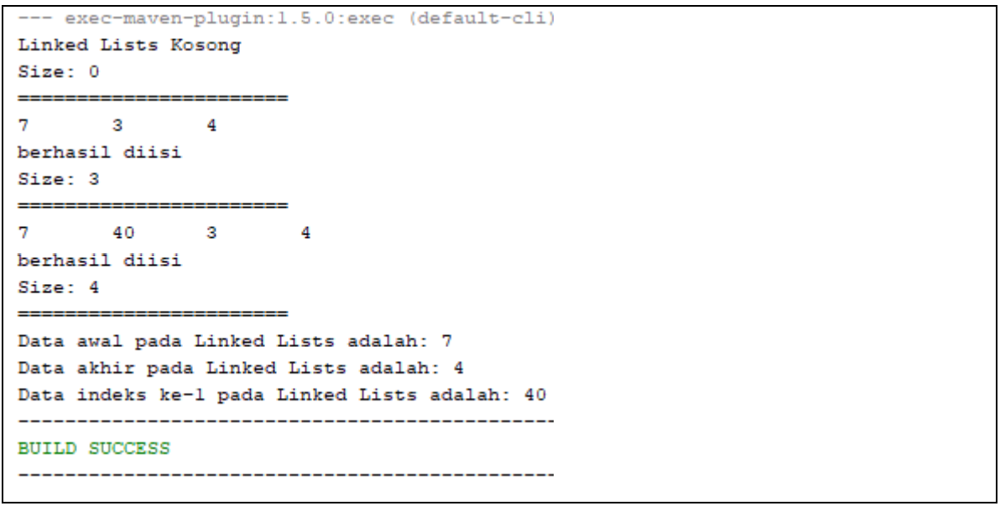<p>

---
#### **12.4.3 Pertanyaan Percobaan**
1. Jelaskan method **size()** pada class DoubleLinkedLists!

    >**Method tersebut digunakan untuk mengetahui jumlah node yang ada pada double linked lists**.

2. Jelaskan cara mengatur indeks pada double linked lists supaya dapat dimulai dari indeks ke1!

    >**Dengan cara melakukan perulangan dimana nantinya diinisialisasikan dengan index = 1**.

3. Jelaskan perbedaan karakteristik fungsi **Add** pada Double Linked Lists dan Single Linked Lists!

    >- **Fungsi Add pada double linked lists adalah terdapat 1 fungsi yang index sisanya dapat ditambah diawal atau pada akhir index**;
    >- **Fungsi Add pada single linked list adalah terdapat 3 fungsi yaitu insertAfter, insertBefoure, dan insertAt**.
4. Jelaskan perbedaan logika dari kedua kode program di bawah ini!<p>

    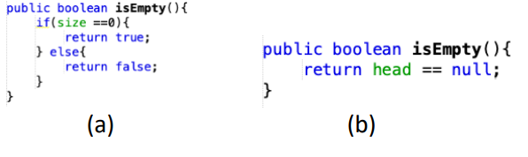<p>

    >- **Pada gambar "a" terdapat pemilihan/if else dimana jika size = 0 maka true, sedangkan jika tidak maka false**.
    >- **Pada gambar "b" tidak menggunakan pemilihan, langsung merujuk kepada return head = null**.

---
### **12.5 Tugas Praktikum**

1. Buat program antrian vaksinasi menggunakan queue berbasis double linked list sesuai ilustrasi dan menu di bawah ini! **(counter jumlah antrian tersisa di menu cetak(3) dan data orang yang telah divaksinasi di menu Hapus Data(2) harus ada) Ilustrasi Program**<p>

    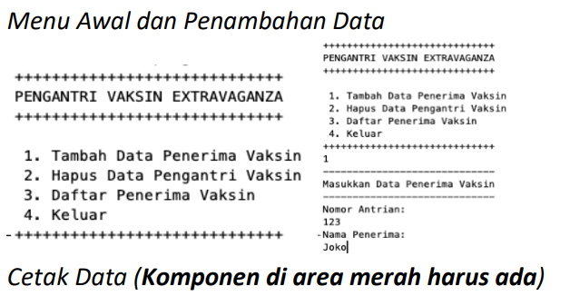<p>
    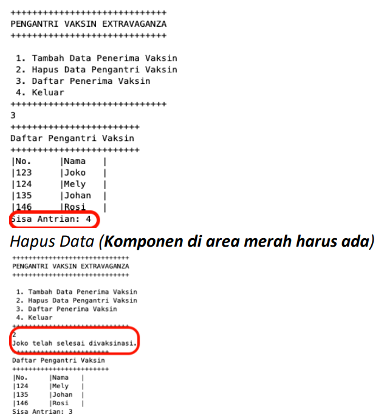<p>

    >Hasil Output :

    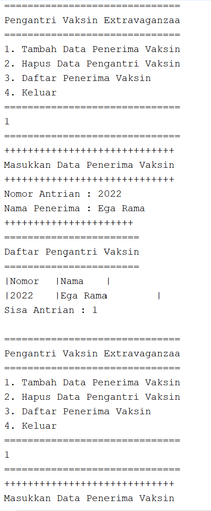<p>
    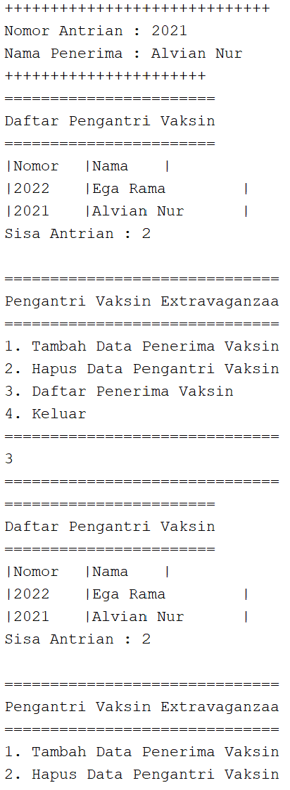<p>
    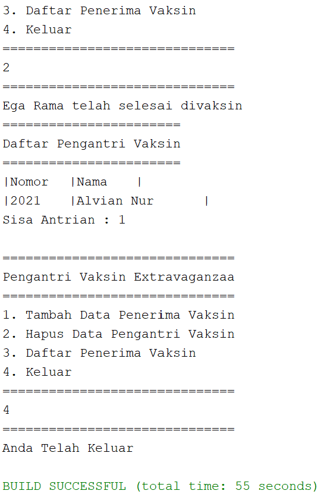<p>

    >Source Code nodeClass :
    ```java
    package minggu12.Tugas1;

    /**
     *
     * @author EgaRam
     */
    public class node {

        int nomor;
        String nama;
        node prev, next;
    
        node(node prev, int nomor, String nama, node next){
            this.prev = prev;
            this.nomor = nomor;
            this.nama = nama;
            this.next = next;
        }
    }
    ```

    >Source Code doublelinkedlist :
    ```java
    package minggu12.Tugas1;

    /**
     *
     * @author EgaRam
     */
    public class doublelinkedlist {
       node head, tail;
      int size;

    public doublelinkedlist(){
         head = null;
          tail = null;
         size = 0;
     }
    public boolean isEmpty(){
          return head == null;
     }
    public void Enqueue(int nomor, String nama){
        node newnode = new node(null, nomor, nama, null);
        if(isEmpty()){
            head = newnode;
            tail = newnode;
        }else{
           tail.next = newnode;
           tail = newnode;
        }
        size++;
    }
    public void Dequeue() throws Exception{
            if(isEmpty()){
              throw new Exception("Linked list masih kosong,  tidak     dapat dihapus");
            }else if(size == 1){
             removeLast();
         }else{
            System.out.println(head.nama + " telah selesai divaksin");
            head = head.next;
            head.prev = null;
            size--;
            }
        }
    public void print(){
        if(!isEmpty()){
            node tmp = head;
            System.out.println("=======================");
            System.out.println("Daftar Pengantri Vaksin");
            System.out.println("=======================");
            System.out.println("|Nomor\t|Nama\t|");
            while(tmp != null){
                System.out.println("|" + tmp.nomor + "\t|" + tmp.nama + "\t|");
                tmp = tmp.next;
            }
            System.out.print("Sisa Antrian : " + size);
            System.out.println("");
        }else{
            System.out.println("Linked List Kosong");
        }
    }
    public void removeLast() throws Exception{
        if(isEmpty()){
            throw new Exception("Linked List masih kosong, tidak dapat dihapus!");
        }else if(head.next == null){
            head = null; //proses penghapusan head
            size--;
            return;
        }
        node current = head;
        while(current.next.next != null){
            current = current.next;
        }
        current.next = null;
        size--;
        }
    }
    ```

    >Source Code doublelinkedlistMain :
    ```java
    package minggu12.Tugas1;
    import java.util.Scanner;
    /**
    *
    * @author EgaRam
    */
    public class doublelinkedlistMain {
    public static void main(String[] args) throws Exception{
        Scanner sc = new Scanner(System.in);
        Scanner ss = new Scanner(System.in);
        doublelinkedlist dll = new doublelinkedlist();
        int menu = 0;
        
            do{
                System.out.println("==============================");
                System.out.println("Pengantri Vaksin Extravaganzaa");
                System.out.println("==============================");
                System.out.println("1. Tambah Data Penerima Vaksin");
                System.out.println("2. Hapus Data Pengantri Vaksin");
                System.out.println("3. Daftar Penerima Vaksin");
                System.out.println("4. Keluar");
                System.out.println("==============================");
                System.out.print("Masukkan Pilihan Menu (1-4): ");
                menu = sc.nextInt();
                System.out.println("==============================");
                if (menu < 1 || menu > 5) {
                System.out.println("Masukkan Pilihan Menu Yang Benar!");
                }
                switch(menu){
                    case 1:
                        System.out.println("+++++++++++++++++++++++++++++");
                        System.out.println("Masukkan Data Penerima Vaksin");
                        System.out.println("+++++++++++++++++++++++++++++");
                        System.out.print("Nomor Antrian : ");
                        int no = sc.nextInt();
                        System.out.print("Nama Penerima : ");
                        String nama = ss.nextLine();
                        dll.Enqueue(no, nama);
                        System.out.println("++++++++++++++++++++++");
                        dll.print();
                        break;
                        
                    case 2:
                        dll.Dequeue();
                        dll.print();
                        break;
                     
                    case 3:
                        dll.print();
                        break;
                        
                    case 4:
                        System.out.println("Anda Telah Keluar");
                        break;
                }
            System.out.println();
            }while (menu > 0 && menu < 5);
        }
    }
    ```


2. Buatlah program daftar film yang terdiri dari id, judul dan rating menggunakan double linked lists, bentuk program memiliki fitur pencarian melalui ID Film dan pengurutan Rating secara descending. Class Film wajib diimplementasikan dalam soal ini. **Contoh Ilustrasi Program**<p>

    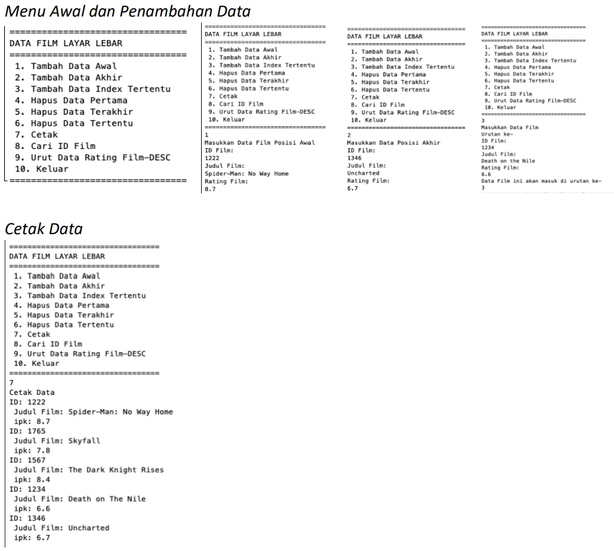<p>
    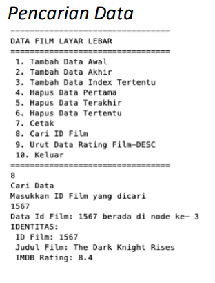<p>

    >Hasil Output :

    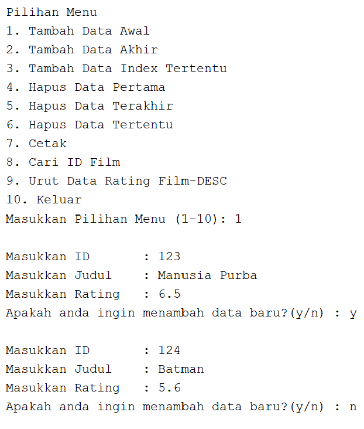<p>
    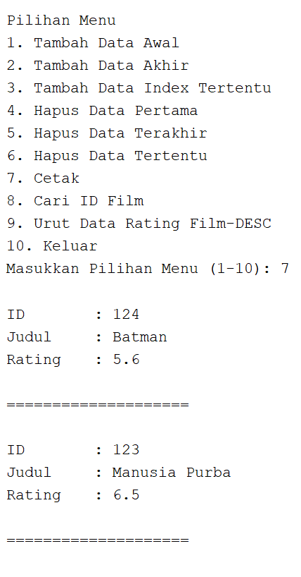<p>
    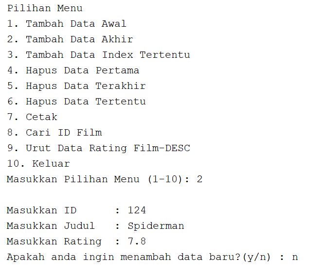<p>
    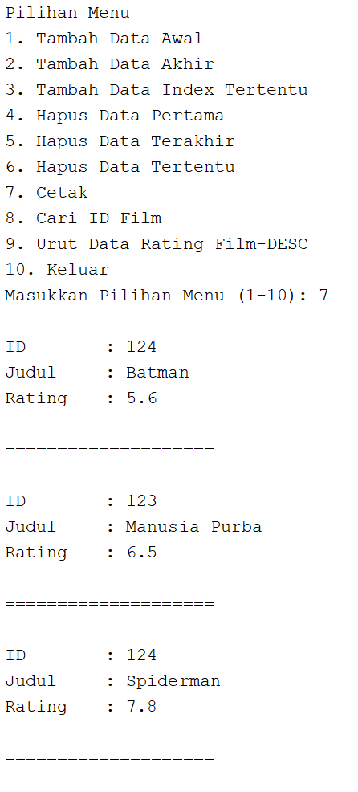<p>
    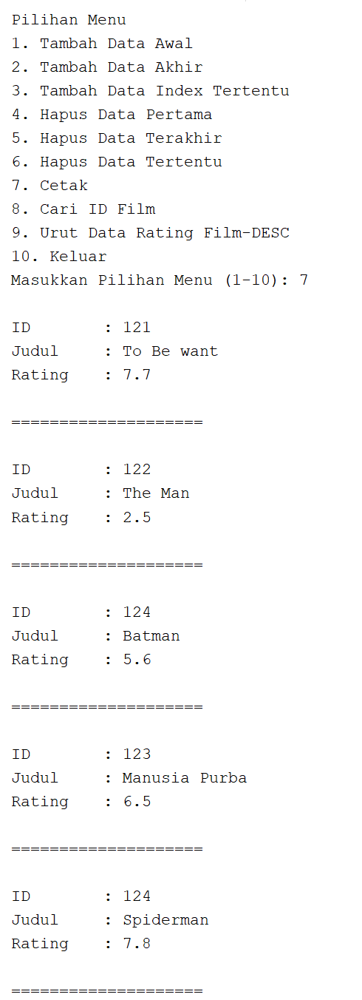<p>
    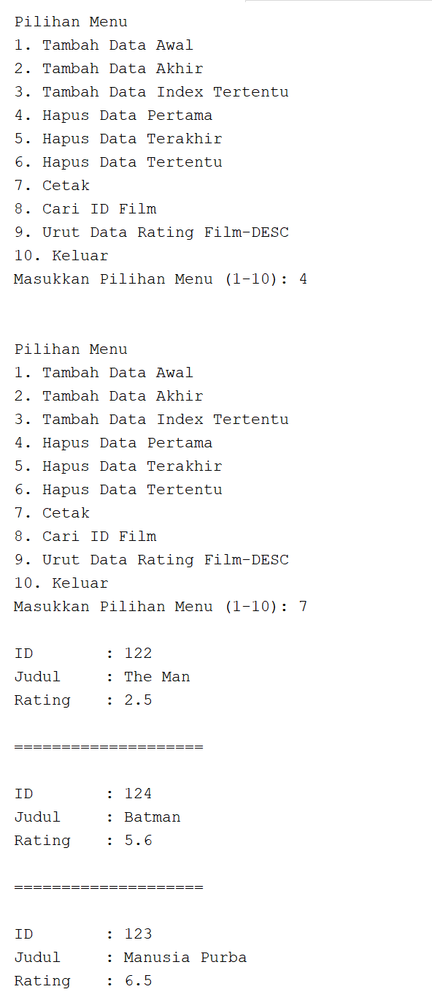<p>
    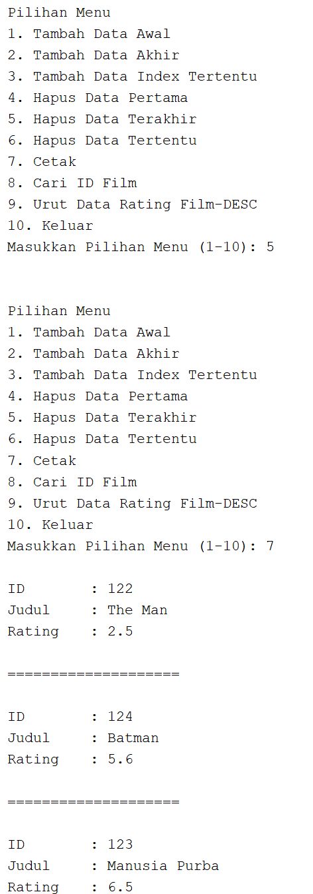<p>
    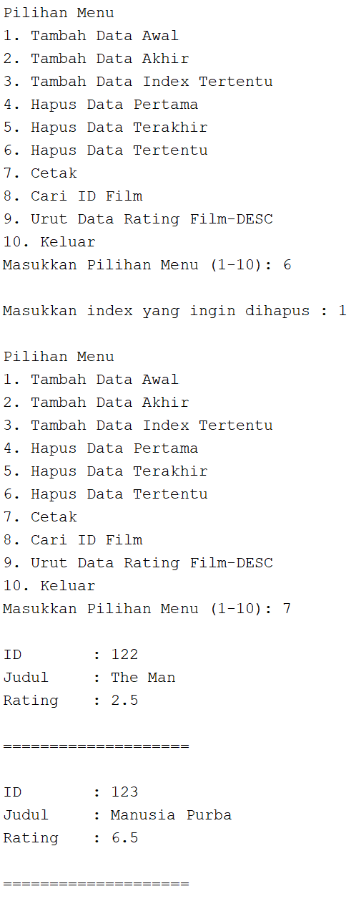<p>
    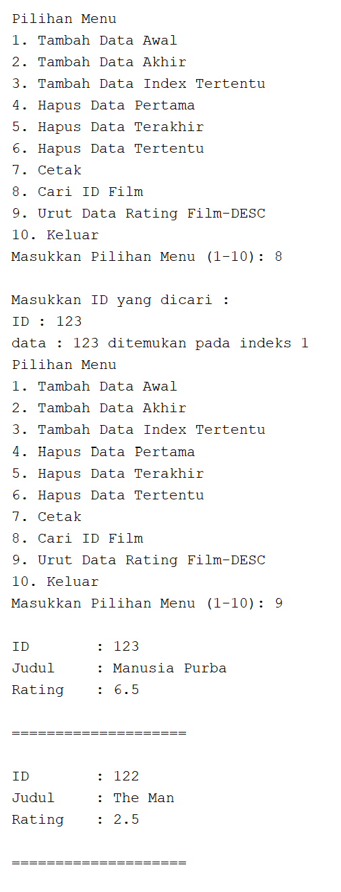<p>
    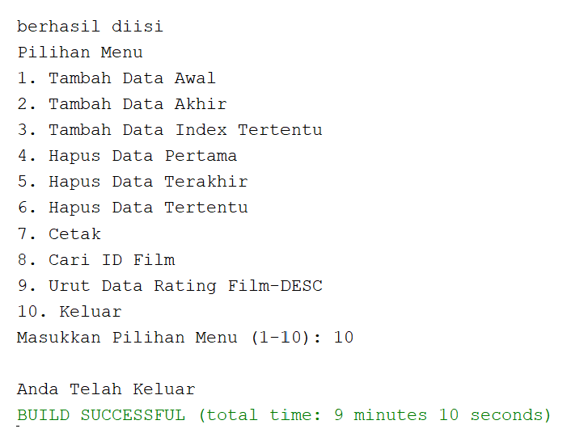<p>

    >Source Code nodeFClass :
    ```java
    package minggu12.Tugas2;

    /**
     *
    * @author EgaRam
     */
    public class nodeF {
      int id;
     double rating;
     String judul;
      nodeF prev, next;
    
      nodeF(nodeF prev, int id, String judul, double rating, nodeF next){
            this.prev = prev;
            this.id = id;
            this.judul = judul;
            this.rating = rating;
            this.next = next;
        }
    }
    ```

    >Source Code dlFilmClass :
    ```java
    package minggu12.Tugas2;

    /**
     *
    * @author EgaRam
     */
    public class dlFilm {
     nodeF head, tail;
     int size;
    
     public dlFilm(){
            head = null;
            tail = null;
            size = 0;
        }
        public boolean isEmpty(){
            return head == null;
        }
        public void bubbleSort(){
            nodeF current = null, index = null;
            double temp;
            String tnmp;
            int tmpn;
            if (head == null) {
                return;
            } else {
                for (current = head; current.next != null; current = current.next) {
                    for (index = current.next; index != null; index = index.next) {
                        if (current.rating < index.rating) {
                            temp = current.rating;
                            current.rating = index.rating;
                            index.rating = temp;
                            tmpn = current.id;
                            current.id = index.id;
                            index.id = tmpn;
                            tnmp = current.judul;
                            current.judul = index.judul;
                            index.judul = tnmp;
                        }
                    }
                }
                print();
            }
        }
        public int FindSeqSearch(int cari){
            nodeF tmp = head;
            int posisi = - 1;
            int index = 0;
            for(int j = 1; j < tmp.id; j++){
                if(tmp.id == cari){
                    posisi = index;
                    break;
                }
                index++;
                tmp = tmp.next;
            }
            return posisi;
        }
        public void Tampilposisi(int x, int pos){
            if(pos !=  -1){
            System.out.println("data : " +x+ " ditemukan pada indeks " + pos);
            }else{           
            System.out.println("data " +x+ " tidak ditemukan");
            }
        }
        public void addFirst(int id, String judul, double rating){
            if(isEmpty()){
                head = new nodeF(null, id, judul, rating, null);
            }else{
                nodeF newnode = new nodeF(null, id, judul, rating, head);
                head.prev = newnode;
                head = newnode;
            }
            size++;
        }
        public void addLast(int id, String judul, double rating){
            if(isEmpty()){
                addFirst(id, judul, rating);
            }else{
                nodeF current = head;
                while(current.next != null){
                    current = current.next;
                }
                nodeF newnode = new nodeF(current, id, judul, rating, null);
                current.next = newnode;
                size++;
            }
        }
        public void add(int id, String judul, double rating, int index) throws Exception{
            if(isEmpty()){
                addFirst(id, judul, rating);
            }else if(index < 0 || index > size){
                throw new Exception("Nilai indeks di luar batas");
            }else{
                nodeF current = head;
                int i = 0;
                while(i < index){
                    current = current.next;
                    i++;
                }
                if(current.prev == null){
                    nodeF newnode = new nodeF(null, id, judul, rating, current);
                    current.prev = newnode;
                    head = newnode;
                }else{
                    nodeF newnode = new nodeF(current.prev, id, judul, rating, current);
                    newnode.prev = current.prev;
                    newnode.next = current;
                    current.prev.next = newnode;
                    current.prev = newnode;
                }
            }
            size++;
        }
        public int size(){
            return size;
        }
        public void clear(){
            head = null;
            size = 0;
        }
        public void print(){
            if(!isEmpty()){
                nodeF tmp = head;
                while(tmp != null){
                    System.out.println("ID\t : " + tmp.id);
                    System.out.println("Judul\t : " + tmp.judul);
                    System.out.println("Rating\t : " + tmp.rating);
                    System.out.println();
                    System.out.println("====================");
                    System.out.println();
                    tmp = tmp.next;
                }
                System.out.println("\nberhasil diisi");
            }else{
                System.out.println("Linked Lists Kosong");
            }
        }
        public void removeFirst() throws Exception{
            if(isEmpty()){
                throw new Exception("Linked List masih kosong, tidak dapat dihapus!");
            }else if (size == 1){
                removeLast();
            }else{
                head = head.next;
                head.prev = null;
                size--;
            }
        }
        public void removeLast() throws Exception{
            if(isEmpty()){
                throw new Exception("Linked List masih kosong, tidak dapat dihapus!");
            }else if(head.next == null){
                head = null; //proses penghapusan head
                size--;
                return;
            }
            nodeF current = head;
            while(current.next.next != null){
                current = current.next;
            }
            current.next = null;
            size--;
        }
        public void remove(int index) throws Exception{
            if(isEmpty() || index >= size){
                throw new Exception("Nilai indeks di luar batas");
            }else if (index == 0){
                removeFirst();
            }else{
                nodeF current = head;
                int i = 0;
                while(i < index){
                    current = current.next;
                    i++;
                }
                if(current.next == null){
                    current.prev.next = null;
                }else if(current.prev == null){
                    current = current.next;
                    current.prev = null;
                    head = current;
                }else{
                    current.prev.next = current.next;
                    current.next.prev = current.prev;
                }
                size--;
            }
        }
    }
    ```

    >Source filmMain :
    ```java
    package minggu12.Tugas2;
    import java.util.Scanner;
    /**
    *
    * @author EgaRam
    */
    public class filmMain {
        public static void main(String[] args) throws Exception {
        dlFilm dbl = new dlFilm();
        Scanner sc = new Scanner(System.in);
        Scanner in = new Scanner(System.in);
            
        char pilih;
        int menu;
        do {
            System.out.println("Pilihan Menu");
            System.out.println("1. Tambah Data Awal");
            System.out.println("2. Tambah Data Akhir");
            System.out.println("3. Tambah Data Index Tertentu");
            System.out.println("4. Hapus Data Pertama");
            System.out.println("5. Hapus Data Terakhir");
            System.out.println("6. Hapus Data Tertentu");
            System.out.println("7. Cetak");
            System.out.println("8. Cari ID Film");
            System.out.println("9. Urut Data Rating Film-DESC");
            System.out.println("10. Keluar");
            System.out.print("Masukkan Pilihan Menu (1-10): ");
            menu = sc.nextInt();
            System.out.println("");
            if (menu < 1 || menu > 10) {
                System.out.println("Masukkan Pilihan Menu Yang Benar!");
            }

            switch (menu) {
                case 1: {
                    do {
                        System.out.print("Masukkan ID       : ");
                        int id = sc.nextInt();
                        System.out.print("Masukkan Judul    : ");
                        String judul = in.nextLine();
                        System.out.print("Masukkan Rating   : ");
                        double rating = sc.nextDouble();
                        System.out.print("Apakah anda ingin menambah data baru?(y/n) : ");
                        pilih = sc.next().charAt(0);
                        dbl.addFirst(id, judul, rating);
                        System.out.println("");
                    } while (pilih == 'y' || pilih == 'Y');
                }
                break;
                case 2: {
                    do {
                    System.out.print("Masukkan ID      : ");
                        int id = sc.nextInt();
                        System.out.print("Masukkan Judul   : ");
                        String judul = in.nextLine();
                        System.out.print("Masukkan Rating  : ");
                        double rating = sc.nextDouble();
                        System.out.print("Apakah anda ingin menambah data baru?(y/n) : ");
                        pilih = sc.next().charAt(0);
                        dbl.addLast(id, judul, rating);
                        System.out.println("");
                    } while (pilih == 'y' || pilih == 'Y');
                }
                break;
                case 3: {
                    do{
                    System.out.print("Masukkan ID         : ");
                    int id = sc.nextInt();
                    System.out.print("Masukkan Judul      : ");
                    String judul = in.nextLine();
                    System.out.print("Masukkan Rating     : ");
                    double rating = sc.nextDouble();
                    System.out.print("Masukkan index yang ingin dipilih : ");
                    int index = sc.nextInt();
                    System.out.print("Apakah anda ingin menambah data baru?(y/n) : ");
                    pilih = sc.next().charAt(0);
                    dbl.add(id, judul, rating, index);
                    System.out.println("");
                    } while (pilih == 'y' || pilih == 'Y');
                }
                break;
                case 4: {
                    dbl.removeFirst();
                    System.out.println("");
                }
                break;
                case 5: {
                    dbl.removeLast();
                    System.out.println("");
                }
                break;
                case 6: {
                    System.out.print("Masukkan index yang ingin dihapus : ");
                    int index = sc.nextInt();
                    dbl.remove(index);
                    System.out.println("");
                    break;
                }
                case 7: {
                    dbl.print();
                    System.out.println("");
                    break;
                }
                case 8: {
                    System.out.println("Masukkan ID yang dicari : ");
                    System.out.print("ID : ");
                    int cari = sc.nextInt();
                    int posisi = dbl.FindSeqSearch(cari);
                    dbl.Tampilposisi(cari, posisi);
                    break;
                }
                case 9: {
                    dbl.bubbleSort();
                    break;
                }
                case 10: {
                    System.out.println("Anda Telah Keluar");
                    System.exit(0);
                }
            }
        } while (menu > 0 && menu < 11);
        }
    }
    ```
    
