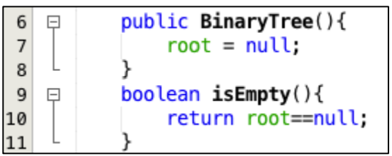
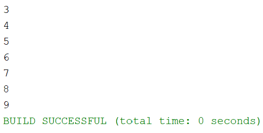
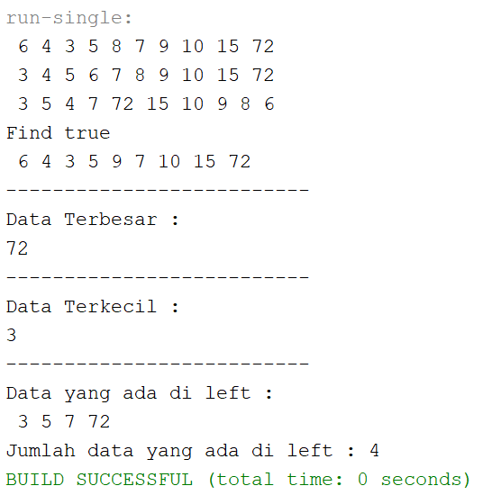

## **<center>Jobsheet Pertemuan 14</center>**

><p>Nama : Muhammad Ega Rama Fernanda<p>
>Kelas : 1F<p>
>Nomer Absen : 19<p>
>Prodi : D-IV Teknik Inormatika<p>
>Jurusan : Teknologi Inormasi<p>
><center> Politeknik Negeri Malang</center>


<br>

---

## **1. Tujuan Praktikum**

Setelah melakukan praktikum ini, mahasiswa mampu:
1. memahami model Tree khususnya Binary Tree
2. membuat dan mendeklarasikan struktur algoritma Binary Tree.
3. menerapkan dan mengimplementasikan algoritma Binary Tree dalam kasus Binary Search Tree

---
## **2. Praktikum**
### **2.1 Implementasi Binary Search Tree menggunakan Linked List**
#### **2.1.1 Tahapan percobaan**
**Waktu Percobaan (45 menit)**

Pada percobaan ini akan diimplementasikan Binary Search Tree dengan operasi dasar, dengan menggunakan array (praktikum 2) dan linked list (praktikum 1). Sebelumnya, akan dibuat class Node, dan Class BinaryTree<p>

<p>

1. Buatlah class **Node**, **BinaryTree** dan **BinaryTreeMain**
2. Di dalam class Node, tambahkan atribut **data**, **left** dan **right**, serta konstruktor default dan berparameter.<p>

    <p>

3. Di dalam class **BinaryTree**, tambahkan atribut root.<p>

    <p>

4. Tambahkan konstruktor default dan method **isEmpty()** di dalam class **BinaryTree**<p>

    <p>

5. Tambahkan method **add()** di dalam class **BinaryTree**. Di bawah ini proses penambahan node **tidak dilakukan secara rekursif**, agar lebih mudah dilihat alur proses penambahan node dalam tree. Sebenarnya, jika dilakukan dengan proses rekursif, penulisan kode akan lebih efisien.<p>

    <p>

6. Tambahkan method find()<p>

    <p>

7. Tambahkan method **traversePreOrder()**, **traverseInOrder()** dan **traversePostOrder()**. Method traverse digunakan untuk mengunjungi dan menampilkan node-node dalam tree, baik dalam mode pre-order, in-order maupun post-order.<p>

    <p>

8. Tambahkan method **getSuccessor()**. Method ini akan digunakan ketika proses penghapusan node yang memiliki 2 child.<p>

    <p>

9. Tambahkan method **delete()**.

    <p>

Di dalam method delete tambahkan pengecekan apakah tree kosong, dan jika tidak cari posisi node yang akan di hapus.<p>

<p>

Kemudian tambahkan proses penghapusan terhadap node current yang telah ditemukan.<p>

<p>

10. Buka class BinaryTreeMain dan tambahkan method main().<p>

    <p>

11. Compile dan jalankan class BinaryTreeMain untuk mendapatkan simulasi jalannya program tree yang telah dibuat.
12. Amati hasil running tersebut.

>Hasil Output :

<p>

>Source Code nodeClass :
```java
package minggu13;

/**
 *
 * @author EgaRam
 */
public class node {
    int data;
    node left;
    node right;
    
    public node(){
    }
    public node(int data){
        this.left = null;
        this.data = data;
        this.right = null;
    }
}
```

>Source Code BinaryTreeArrayClass :
```java
package minggu13.prak2;

/**
 *
 * @author EgaRam
 */
public class BinaryTreeArray {
    int[] data;
    int idxLast;
    
    public BinaryTreeArray(){
        data = new int[10];
    }
    void populateData(int data[], int idxLast){
        this.data = data;
        this.idxLast = idxLast;
    }
    void traverseInOrder(int idxStart){
        if(idxStart <= idxLast){
            traverseInOrder(2*idxStart+1);
            System.out.println(data[idxStart] + " ");
            traverseInOrder(2*idxStart+2);
        }
    }
}
```

>Source Code BinaryTreeArrayMain :
```java
package minggu13.prak2;

/**
 *
 * @author EgaRam
 */
public class BinaryTreeArrayMain {
    public static void main(String[] args) {
    BinaryTreeArray bta = new BinaryTreeArray();
    int[] data = {6,4,8,3,5,7,9,0,0,0};
    int idxLast = 6;
    bta.populateData(data, idxLast);
    bta.traverseInOrder(0);
    }
}
```

---
#### **2.1.2 Pertanyaan Percobaan**
1. Mengapa dalam binary search tree proses pencarian data bisa lebih efektif
dilakukan dibanding binary tree biasa?

    >**Karena binary search tree data yang di inputkan sudah terurut, yang mana penempatan data berdasarkan left child(datanya lebih kecil dari node induk) dan right child(datanya lebih besar dari node induk). Nah, jika binary tree, penempatan datanya itu masih belum berurutan sehingga susah untuk melakukan pencarian**.

2. Untuk apakah di class **Node**, kegunaan dari atribut **left** dan **right**?

    >**Untuk menyimpan left child(datanya lebih kecil dari node induk) dan right child(datanya lebih besar dari node induk)**.

3. - Untuk apakah kegunaan dari atribut **root** di dalam class **BinaryTree**?

        >**Untuk menyimpan data yang paling atas/induknya**.

    - Ketika objek tree pertama kali dibuat, apakah nilai dari **root**?

        >**Ketika Objek tree pertama kali dibuat, nilai dari root itu masih null**.

4. Ketika tree masih kosong, dan akan ditambahkan sebuah node baru, proses apa yang akan terjadi?

    >**Akan terjadi proses add(bisa disebut juga operasi insert)**.

5. Perhatikan method **add()**, di dalamnya terdapat baris program seperti di bawah ini. Jelaskan secara detil untuk apa baris program tersebut?<p>

    <p>

    >- **Jika data yang diinputkan lebih kecil dari data yang ada, maka data yang ada disebelah kiri bernilai null, dan data yang sudah ada akan menyimpan data yang disebelah kiri**.
    >- **Jika salah, current tidak memiliki left child, maka node baru yang diinputkan akan dijadikan left child dari current**.

---
### **2.2 Implementasi binary tree dengan array**
**Waktu percobaan: 45 menit**
#### **2.2.1 Tahapan Percobaan**

1. Di dalam percobaan implementasi binary tree dengan array ini, data tree disimpan dalam array dan langsung dimasukan dari method main(), dan selanjutnya akan disimulasikan proses traversal secara inOrder.
2. Buatlah class **BinaryTreeArray** dan **BinaryTreeArrayMain**
3. Buat atribut **data** dan **idxLast** di dalam class **BinaryTreeArray**. Buat juga method **populateData()** dan **traverseInOrder()**. <p>

    <p>

4. Kemudian dalam class **BinaryTreeArrayMain** buat method main() seperti gambar berikut ini.

    <p>

5. Jalankan class **BinaryTreeArrayMain** dan amati hasilnya!

>Hasil Output :

<p>

>Source Code BinaryTreeClass :
```java
package minggu13;

/**
 *
 * @author EgaRam
 */
public class BinaryTree {
    node root;
    
    public BinaryTree(){
        root = null;
    }
    boolean isEmpty(){
        return root == null;
    }
    void add(int data){
        if(isEmpty()){//tree is empty
           root = new node(data);
        }else{
            node current = root;
            while(true){
                if(data < current.data){
                    if(current.left != null){
                        current = current.left;
                    }else{
                        current.left = new node(data);
                        break;
                    }
                }else if(data > current.data){
                    if(current.right != null){
                        current = current.right;
                    }else{
                        current.right = new node(data);
                        break;
                    }
                }else{//data is already exist
                    break;
                }
            }
        }
    }
    boolean find(int data){
        boolean hasil = false;
        node current = root;
        while(current != null){
            if(current.data == data){
                hasil = true;
                break;
            }else if(data < current.data){
                current = current.left;
            }else{
                current = current.right;
            }
        }
        return hasil;
    }
    void traversePreOrder(node Node){
        if(Node != null){
            System.out.print(" " + Node.data);
            traversePreOrder(Node.left);
            traversePreOrder(Node.right);
        }
    }
    void traversePostOrder(node Node){
        if(Node != null){
            traversePostOrder(Node.left);
            traversePostOrder(Node.right);
            System.out.print(" " + Node.data);
        }
    }
    void traverseInOrder(node Node){
        if(Node != null){
            traverseInOrder(Node.left);
            System.out.print(" " + Node.data);
            traverseInOrder(Node.right);
        }
    }
    node getSuccessor(node del){
        node successor = del.right;
        node successorParent = del;
        while(successor.left != null){
            successorParent = successor;
            successor = successor.left;
        }
        if(successor != del.right){
            successorParent.left = successor.right;
            successor.right = del.right;
        }
        return successor;
    }
    void delete(int data){
        if(isEmpty()){
            System.out.println("Tree is empty!");
            return;
        }
        //find node(current) yang ingin di hapus;
        node parent = root;
        node current = root;
        boolean isLeftChild = false;
        while(current != null){
            if(current.data == data){
                break;
            }else if(data < current.data){
                parent = current;
                current = current.left;
                isLeftChild = false;
            }else if(data > current.data){
                parent = current;
                current = current.right;
                isLeftChild = false;
            }
        }
        //deletion
        if(current == null){
            System.out.println("Tidak menemukan data!");
            return;
        }else{
            //jika tidak ada child, akan dihapus
            if(current.left == null && current.right == null){
                if(current == root){
                    root = null;
                }else{
                    if(isLeftChild){
                        parent.left = null;
                    }else{
                        parent.right = null;
                    }
                }
            }else if(current.left == null){//jika ada 1 child(right)
                if(current == root){
                    root = current.right;
                }else{
                    if(isLeftChild){
                        parent.left = current.right;
                    }else{
                        parent.right = current.right;
                    }
                }
            }else if(current.right == null){// jika ada 1 child(left)
                if(current == root){
                    root = current.left;
                }else{
                    if(isLeftChild){
                        parent.left = current.left;
                    }else{
                        parent.right = current.left;
                    }
                }
            }else{//jika ada 2 childs
                node successor = getSuccessor(current);
                if(current == root){
                    root = successor;
                }else{
                    if(isLeftChild){
                        parent.left = successor;
                    }else{
                        parent.right = successor;
                    }
                    successor.left = current.left;
                }
            }
        }
    }
```

>Source Code BinaryTreeMain :
```java
package minggu13;

/**
 *
 * @author EgaRam
 */
public class BinaryTreeMain {
    public static void main(String[] args) {
    BinaryTree bt = new BinaryTree();
    
    bt.add(6);
    bt.add(4);
    bt.add(8);
    bt.add(3);
    bt.add(5);
    bt.add(7);
    bt.add(9);
    bt.add(10);
    bt.add(15);
    
    bt.traversePreOrder(bt.root);
        System.out.println("");
    bt.traverseInOrder(bt.root);
        System.out.println("");
    bt.traversePostOrder(bt.root);
        System.out.println("");
        System.out.println("Find " + bt.find(5));
    bt.delete(8);
    bt.traversePreOrder(bt.root);
        System.out.println("");
    }
}
```

---
#### **13.2.1 Pertanyaan Percobaan**
1. Apakah kegunaan dari atribut data dan idxLast yang ada di class **BinaryTreeArray**?

    >**Kegunaan atribut data adalah untuk menyimpan arrat. Dan idxLast berfungsi untuk menyimpan data index**.

2. Apakah kegunaan dari method **populateData()**?

    >**Method populerData berfungsi untuk menyimpan data pada index terakhir**.

3. Apakah kegunaan dari method **traverseInOrder()**?

    >**Method traverseInOrder berfungsi untuk menelusuri node dengan methode InOrder yang memiliki prinsip left visit rigth**.

4. Jika suatu node binary tree disimpan dalam array indeks 2, maka di indeks berapakah posisi left child dan rigth child masin-masing?

    >**Left Child berada di index ke-5 dan Rigth Child berada di index ke-6**.

5. Apa kegunaan statement int idxLast = 6 pada praktikum 2 percobaan nomor 4?

    >**statement int idxLast = 6 berfungsi untuk menunjukan batas index last atau index terakhirnya adalah 6**.

#### **13.3 Tugas Praktikum**
**Waktu pengerjaan: 90 menit**

1. Buat method di dalam class **BinaryTree** yang akan menambahkan node dengan cara rekursif.

    >Hasil Output :

    <p>

    >Source Code BinaryTreeClass :
    ```java
    package minggu13;

    /**
    *
    * @author EgaRam
    */
    public class BinaryTree {
        node root;
        
        public BinaryTree(){
            root = null;
        }
        boolean isEmpty(){
            return root == null;
        }
        void add(int data){
            if(isEmpty()){//tree is empty
            root = new node(data);
            }else{
                node current = root;
                while(true){
                    if(data < current.data){
                        if(current.left != null){
                            current = current.left;
                        }else{
                            current.left = new node(data);
                            break;
                        }
                    }else if(data > current.data){
                        if(current.right != null){
                            current = current.right;
                        }else{
                            current.right = new node(data);
                            break;
                        }
                    }else{//data is already exist
                        break;
                    }
                }
            }
        }
        boolean find(int data){
            boolean hasil = false;
            node current = root;
            while(current != null){
                if(current.data == data){
                    hasil = true;
                    break;
                }else if(data < current.data){
                    current = current.left;
                }else{
                    current = current.right;
                }
            }
            return hasil;
        }
        void traversePreOrder(node Node){
            if(Node != null){
                System.out.print(" " + Node.data);
                traversePreOrder(Node.left);
                traversePreOrder(Node.right);
            }
        }
        void traversePostOrder(node Node){
            if(Node != null){
                traversePostOrder(Node.left);
                traversePostOrder(Node.right);
                System.out.print(" " + Node.data);
            }
        }
        void traverseInOrder(node Node){
            if(Node != null){
                traverseInOrder(Node.left);
                System.out.print(" " + Node.data);
                traverseInOrder(Node.right);
            }
        }
        node getSuccessor(node del){
            node successor = del.right;
            node successorParent = del;
            while(successor.left != null){
                successorParent = successor;
                successor = successor.left;
            }
            if(successor != del.right){
                successorParent.left = successor.right;
                successor.right = del.right;
            }
            return successor;
        }
        void delete(int data){
            if(isEmpty()){
                System.out.println("Tree is empty!");
                return;
            }
            //find node(current) yang ingin di hapus;
            node parent = root;
            node current = root;
            boolean isLeftChild = false;
            while(current != null){
                if(current.data == data){
                    break;
                }else if(data < current.data){
                    parent = current;
                    current = current.left;
                    isLeftChild = false;
                }else if(data > current.data){
                    parent = current;
                    current = current.right;
                    isLeftChild = false;
                }
            }
            //deletion
            if(current == null){
                System.out.println("Tidak menemukan data!");
                return;
            }else{
                //jika tidak ada child, akan dihapus
                if(current.left == null && current.right == null){
                    if(current == root){
                        root = null;
                    }else{
                        if(isLeftChild){
                            parent.left = null;
                        }else{
                            parent.right = null;
                        }
                    }
                }else if(current.left == null){//jika ada 1 child(right)
                    if(current == root){
                        root = current.right;
                    }else{
                        if(isLeftChild){
                            parent.left = current.right;
                        }else{
                            parent.right = current.right;
                        }
                    }
                }else if(current.right == null){// jika ada 1 child(left)
                    if(current == root){
                        root = current.left;
                    }else{
                        if(isLeftChild){
                            parent.left = current.left;
                        }else{
                            parent.right = current.left;
                        }
                    }
                }else{//jika ada 2 childs
                    node successor = getSuccessor(current);
                    if(current == root){
                        root = successor;
                    }else{
                        if(isLeftChild){
                            parent.left = successor;
                        }else{
                            parent.right = successor;
                        }
                        successor.left = current.left;
                    }
                }
            }
        }
        //Soal No 1
        void recursion(int key){
            root = recursion(root, key);
        }
        public node recursion(node current, int data){
            if(current == null){
                return new node(data);
            }if (data < current.data){
                current.left = recursion (current.left, data);
            }else if (data > current.data){
                current.right = recursion(current.right, data);
            }else{
                return current;
            }
            return current;
        }
    }
    ```

    >Source Code BinaryTreeMain :
    ```java
    package minggu13;

    /**
    *
    * @author EgaRam
    */
    public class BinaryTreeMain {
        public static void main(String[] args) {
        BinaryTree bt = new BinaryTree();
        
        bt.add(6);
        bt.add(4);
        bt.add(8);
        bt.add(3);
        bt.add(5);
        bt.add(7);
        bt.add(9);
        bt.add(10);
        bt.add(15);
        bt.recursion(72);
        
        bt.traversePreOrder(bt.root);
            System.out.println("");
        bt.traverseInOrder(bt.root);
            System.out.println("");
        bt.traversePostOrder(bt.root);
            System.out.println("");
            System.out.println("Find " + bt.find(5));
        bt.delete(8);
        bt.traversePreOrder(bt.root);
            System.out.println("");
        }
    }
    ```


2. Buat method di dalam class **BinaryTree** untuk menampilkan nilai paling kecil dan yang paling besar yang ada di dalam tree.

    >Hasil Output :

    <p>

    >Source Code BinaryTreeClass :
    ```java
    package minggu13;

    /**
    *
    * @author EgaRam
    */
    public class BinaryTree {
        node root;
        
        public BinaryTree(){
            root = null;
        }
        boolean isEmpty(){
            return root == null;
        }
        void add(int data){
            if(isEmpty()){//tree is empty
            root = new node(data);
            }else{
                node current = root;
                while(true){
                    if(data < current.data){
                        if(current.left != null){
                            current = current.left;
                        }else{
                            current.left = new node(data);
                            break;
                        }
                    }else if(data > current.data){
                        if(current.right != null){
                            current = current.right;
                        }else{
                            current.right = new node(data);
                            break;
                        }
                    }else{//data is already exist
                        break;
                    }
                }
            }
        }
        boolean find(int data){
            boolean hasil = false;
            node current = root;
            while(current != null){
                if(current.data == data){
                    hasil = true;
                    break;
                }else if(data < current.data){
                    current = current.left;
                }else{
                    current = current.right;
                }
            }
            return hasil;
        }
        void traversePreOrder(node Node){
            if(Node != null){
                System.out.print(" " + Node.data);
                traversePreOrder(Node.left);
                traversePreOrder(Node.right);
            }
        }
        void traversePostOrder(node Node){
            if(Node != null){
                traversePostOrder(Node.left);
                traversePostOrder(Node.right);
                System.out.print(" " + Node.data);
            }
        }
        void traverseInOrder(node Node){
            if(Node != null){
                traverseInOrder(Node.left);
                System.out.print(" " + Node.data);
                traverseInOrder(Node.right);
            }
        }
        node getSuccessor(node del){
            node successor = del.right;
            node successorParent = del;
            while(successor.left != null){
                successorParent = successor;
                successor = successor.left;
            }
            if(successor != del.right){
                successorParent.left = successor.right;
                successor.right = del.right;
            }
            return successor;
        }
        void delete(int data){
            if(isEmpty()){
                System.out.println("Tree is empty!");
                return;
            }
            //find node(current) yang ingin di hapus;
            node parent = root;
            node current = root;
            boolean isLeftChild = false;
            while(current != null){
                if(current.data == data){
                    break;
                }else if(data < current.data){
                    parent = current;
                    current = current.left;
                    isLeftChild = false;
                }else if(data > current.data){
                    parent = current;
                    current = current.right;
                    isLeftChild = false;
                }
            }
            //deletion
            if(current == null){
                System.out.println("Tidak menemukan data!");
                return;
            }else{
                //jika tidak ada child, akan dihapus
                if(current.left == null && current.right == null){
                    if(current == root){
                        root = null;
                    }else{
                        if(isLeftChild){
                            parent.left = null;
                        }else{
                            parent.right = null;
                        }
                    }
                }else if(current.left == null){//jika ada 1 child(right)
                    if(current == root){
                        root = current.right;
                    }else{
                        if(isLeftChild){
                            parent.left = current.right;
                        }else{
                            parent.right = current.right;
                        }
                    }
                }else if(current.right == null){// jika ada 1 child(left)
                    if(current == root){
                        root = current.left;
                    }else{
                        if(isLeftChild){
                            parent.left = current.left;
                        }else{
                            parent.right = current.left;
                        }
                    }
                }else{//jika ada 2 childs
                    node successor = getSuccessor(current);
                    if(current == root){
                        root = successor;
                    }else{
                        if(isLeftChild){
                            parent.left = successor;
                        }else{
                            parent.right = successor;
                        }
                        successor.left = current.left;
                    }
                }
            }
        }
        //Soal No 1
        void recursion(int key){
            root = recursion(root, key);
        }
        public node recursion(node current, int data){
            if(current == null){
                return new node(data);
            }if (data < current.data){
                current.left = recursion (current.left, data);
            }else if (data > current.data){
                current.right = recursion(current.right, data);
            }else{
                return current;
            }
            return current;
        }
        //Soal No 2
        void max(){
            node current = root;
            while(current.right != null){
                current = current.right;
            }
            System.out.println(current.data);
        }
        void min(){
            node current = root;
            while(current.left != null){
                current = current.left;
            }
            System.out.println(current.data);
        }
    }
    ```

    >Source Code BinaryTreeMain :
    ```java
    package minggu13;

    /**
    *
    * @author EgaRam
    */
    public class BinaryTreeMain {
        public static void main(String[] args) {
        BinaryTree bt = new BinaryTree();
        
        bt.add(6);
        bt.add(4);
        bt.add(8);
        bt.add(3);
        bt.add(5);
        bt.add(7);
        bt.add(9);
        bt.add(10);
        bt.add(15);
        bt.recursion(72);
        
        bt.traversePreOrder(bt.root);
            System.out.println("");
        bt.traverseInOrder(bt.root);
            System.out.println("");
        bt.traversePostOrder(bt.root);
            System.out.println("");
            System.out.println("Find " + bt.find(5));
        bt.delete(8);
        bt.traversePreOrder(bt.root);
            System.out.println("");
            System.out.println("--------------------------");
            System.out.println("Data Terbesar : ");
        bt.max();
            System.out.println("--------------------------");
            System.out.println("Data Terkecil : ");
        bt.min();
        }
    }
    ```

3. Buat method di dalam class **BinaryTree** untuk menampilkan data yang ada di leaf.

    >Hasil Output :

    <p>

    >Source Code BinaryTreeClass :
    ```java
    package minggu13;

    /**
    *
    * @author EgaRam
    */
    public class BinaryTree {
        node root;
        
        public BinaryTree(){
            root = null;
        }
        boolean isEmpty(){
            return root == null;
        }
        void add(int data){
            if(isEmpty()){//tree is empty
            root = new node(data);
            }else{
                node current = root;
                while(true){
                    if(data < current.data){
                        if(current.left != null){
                            current = current.left;
                        }else{
                            current.left = new node(data);
                            break;
                        }
                    }else if(data > current.data){
                        if(current.right != null){
                            current = current.right;
                        }else{
                            current.right = new node(data);
                            break;
                        }
                    }else{//data is already exist
                        break;
                    }
                }
            }
        }
        boolean find(int data){
            boolean hasil = false;
            node current = root;
            while(current != null){
                if(current.data == data){
                    hasil = true;
                    break;
                }else if(data < current.data){
                    current = current.left;
                }else{
                    current = current.right;
                }
            }
            return hasil;
        }
        void traversePreOrder(node Node){
            if(Node != null){
                System.out.print(" " + Node.data);
                traversePreOrder(Node.left);
                traversePreOrder(Node.right);
            }
        }
        void traversePostOrder(node Node){
            if(Node != null){
                traversePostOrder(Node.left);
                traversePostOrder(Node.right);
                System.out.print(" " + Node.data);
            }
        }
        void traverseInOrder(node Node){
            if(Node != null){
                traverseInOrder(Node.left);
                System.out.print(" " + Node.data);
                traverseInOrder(Node.right);
            }
        }
        node getSuccessor(node del){
            node successor = del.right;
            node successorParent = del;
            while(successor.left != null){
                successorParent = successor;
                successor = successor.left;
            }
            if(successor != del.right){
                successorParent.left = successor.right;
                successor.right = del.right;
            }
            return successor;
        }
        void delete(int data){
            if(isEmpty()){
                System.out.println("Tree is empty!");
                return;
            }
            //find node(current) yang ingin di hapus;
            node parent = root;
            node current = root;
            boolean isLeftChild = false;
            while(current != null){
                if(current.data == data){
                    break;
                }else if(data < current.data){
                    parent = current;
                    current = current.left;
                    isLeftChild = false;
                }else if(data > current.data){
                    parent = current;
                    current = current.right;
                    isLeftChild = false;
                }
            }
            //deletion
            if(current == null){
                System.out.println("Tidak menemukan data!");
                return;
            }else{
                //jika tidak ada child, akan dihapus
                if(current.left == null && current.right == null){
                    if(current == root){
                        root = null;
                    }else{
                        if(isLeftChild){
                            parent.left = null;
                        }else{
                            parent.right = null;
                        }
                    }
                }else if(current.left == null){//jika ada 1 child(right)
                    if(current == root){
                        root = current.right;
                    }else{
                        if(isLeftChild){
                            parent.left = current.right;
                        }else{
                            parent.right = current.right;
                        }
                    }
                }else if(current.right == null){// jika ada 1 child(left)
                    if(current == root){
                        root = current.left;
                    }else{
                        if(isLeftChild){
                            parent.left = current.left;
                        }else{
                            parent.right = current.left;
                        }
                    }
                }else{//jika ada 2 childs
                    node successor = getSuccessor(current);
                    if(current == root){
                        root = successor;
                    }else{
                        if(isLeftChild){
                            parent.left = successor;
                        }else{
                            parent.right = successor;
                        }
                        successor.left = current.left;
                    }
                }
            }
        }
        //Soal No 1
        void recursion(int key){
            root = recursion(root, key);
        }
        public node recursion(node current, int data){
            if(current == null){
                return new node(data);
            }if (data < current.data){
                current.left = recursion (current.left, data);
            }else if (data > current.data){
                current.right = recursion(current.right, data);
            }else{
                return current;
            }
            return current;
        }
        //Soal No 2
        void max(){
            node current = root;
            while(current.right != null){
                current = current.right;
            }
            System.out.println(current.data);
        }
        void min(){
            node current = root;
            while(current.left != null){
                current = current.left;
            }
            System.out.println(current.data);
        }
        //Soal No 3
        void printleft(node root){
            if(root == null){
                return;
            }
            if(root.left == null && root.right == null){
                System.out.print(" " + root.data);
                return;
            }
            if(root.left != null){
                printleft(root.left);
            }
            if(root.right != null){
                printleft(root.right);
            }
        }
    }
    ```

    >Source Code BinaryTreeMain :
    ```java
    package minggu13;

    /**
    *
    * @author EgaRam
    */
    public class BinaryTreeMain {
        public static void main(String[] args) {
        BinaryTree bt = new BinaryTree();
        
        bt.add(6);
        bt.add(4);
        bt.add(8);
        bt.add(3);
        bt.add(5);
        bt.add(7);
        bt.add(9);
        bt.add(10);
        bt.add(15);
        bt.recursion(72);
        
        bt.traversePreOrder(bt.root);
            System.out.println("");
        bt.traverseInOrder(bt.root);
            System.out.println("");
        bt.traversePostOrder(bt.root);
            System.out.println("");
            System.out.println("Find " + bt.find(5));
        bt.delete(8);
        bt.traversePreOrder(bt.root);
            System.out.println("");
            System.out.println("--------------------------");
            System.out.println("Data Terbesar : ");
        bt.max();
            System.out.println("--------------------------");
            System.out.println("Data Terkecil : ");
        bt.min();
            System.out.println("--------------------------");
            System.out.println("Data yang ada di left : ");
        bt.printleft(bt.root);
            System.out.println();
        }
    }
    ```

4. Buat method di dalam class **BinaryTree** untuk menampilkan berapa jumlah leaf yang ada di dalam tree.

    >Hasil Output :

    <p>

    >Source Code BinaryTreeClass :
    ```java
    package minggu13;

    /**
    *
    * @author EgaRam
    */
    public class BinaryTree {
        node root;
        
        public BinaryTree(){
            root = null;
        }
        boolean isEmpty(){
            return root == null;
        }
        void add(int data){
            if(isEmpty()){//tree is empty
            root = new node(data);
            }else{
                node current = root;
                while(true){
                    if(data < current.data){
                        if(current.left != null){
                            current = current.left;
                        }else{
                            current.left = new node(data);
                            break;
                        }
                    }else if(data > current.data){
                        if(current.right != null){
                            current = current.right;
                        }else{
                            current.right = new node(data);
                            break;
                        }
                    }else{//data is already exist
                        break;
                    }
                }
            }
        }
        boolean find(int data){
            boolean hasil = false;
            node current = root;
            while(current != null){
                if(current.data == data){
                    hasil = true;
                    break;
                }else if(data < current.data){
                    current = current.left;
                }else{
                    current = current.right;
                }
            }
            return hasil;
        }
        void traversePreOrder(node Node){
            if(Node != null){
                System.out.print(" " + Node.data);
                traversePreOrder(Node.left);
                traversePreOrder(Node.right);
            }
        }
        void traversePostOrder(node Node){
            if(Node != null){
                traversePostOrder(Node.left);
                traversePostOrder(Node.right);
                System.out.print(" " + Node.data);
            }
        }
        void traverseInOrder(node Node){
            if(Node != null){
                traverseInOrder(Node.left);
                System.out.print(" " + Node.data);
                traverseInOrder(Node.right);
            }
        }
        node getSuccessor(node del){
            node successor = del.right;
            node successorParent = del;
            while(successor.left != null){
                successorParent = successor;
                successor = successor.left;
            }
            if(successor != del.right){
                successorParent.left = successor.right;
                successor.right = del.right;
            }
            return successor;
        }
        void delete(int data){
            if(isEmpty()){
                System.out.println("Tree is empty!");
                return;
            }
            //find node(current) yang ingin di hapus;
            node parent = root;
            node current = root;
            boolean isLeftChild = false;
            while(current != null){
                if(current.data == data){
                    break;
                }else if(data < current.data){
                    parent = current;
                    current = current.left;
                    isLeftChild = false;
                }else if(data > current.data){
                    parent = current;
                    current = current.right;
                    isLeftChild = false;
                }
            }
            //deletion
            if(current == null){
                System.out.println("Tidak menemukan data!");
                return;
            }else{
                //jika tidak ada child, akan dihapus
                if(current.left == null && current.right == null){
                    if(current == root){
                        root = null;
                    }else{
                        if(isLeftChild){
                            parent.left = null;
                        }else{
                            parent.right = null;
                        }
                    }
                }else if(current.left == null){//jika ada 1 child(right)
                    if(current == root){
                        root = current.right;
                    }else{
                        if(isLeftChild){
                            parent.left = current.right;
                        }else{
                            parent.right = current.right;
                        }
                    }
                }else if(current.right == null){// jika ada 1 child(left)
                    if(current == root){
                        root = current.left;
                    }else{
                        if(isLeftChild){
                            parent.left = current.left;
                        }else{
                            parent.right = current.left;
                        }
                    }
                }else{//jika ada 2 childs
                    node successor = getSuccessor(current);
                    if(current == root){
                        root = successor;
                    }else{
                        if(isLeftChild){
                            parent.left = successor;
                        }else{
                            parent.right = successor;
                        }
                        successor.left = current.left;
                    }
                }
            }
        }
        //Soal No 1
        void recursion(int key){
            root = recursion(root, key);
        }
        public node recursion(node current, int data){
            if(current == null){
                return new node(data);
            }if (data < current.data){
                current.left = recursion (current.left, data);
            }else if (data > current.data){
                current.right = recursion(current.right, data);
            }else{
                return current;
            }
            return current;
        }
        //Soal No 2
        void max(){
            node current = root;
            while(current.right != null){
                current = current.right;
            }
            System.out.println(current.data);
        }
        void min(){
            node current = root;
            while(current.left != null){
                current = current.left;
            }
            System.out.println(current.data);
        }
        //Soal No 3
        void printleft(node root){
            if(root == null){
                return;
            }
            if(root.left == null && root.right == null){
                System.out.print(" " + root.data);
                return;
            }
            if(root.left != null){
                printleft(root.left);
            }
            if(root.right != null){
                printleft(root.right);
            }
        }
        //Soal No 4
        int jumlahleft(){
            return jumlahleft(root);
        }
        int jumlahleft(node Node){
            if(Node == null){
                return 0;
            }
            if(Node.left == null && Node.right == null){
                return 1;
            }else{
                return jumlahleft(Node.left) + jumlahleft(Node.right);
            }
        }
    }
    ```

    >Source Code BinaryTreeMain :
    ```java
    package minggu13;

    /**
    *
    * @author EgaRam
    */
    public class BinaryTreeMain {
        public static void main(String[] args) {
        BinaryTree bt = new BinaryTree();
        
        bt.add(6);
        bt.add(4);
        bt.add(8);
        bt.add(3);
        bt.add(5);
        bt.add(7);
        bt.add(9);
        bt.add(10);
        bt.add(15);
        bt.recursion(72);
        
        bt.traversePreOrder(bt.root);
            System.out.println("");
        bt.traverseInOrder(bt.root);
            System.out.println("");
        bt.traversePostOrder(bt.root);
            System.out.println("");
            System.out.println("Find " + bt.find(5));
        bt.delete(8);
        bt.traversePreOrder(bt.root);
            System.out.println("");
            System.out.println("--------------------------");
            System.out.println("Data Terbesar : ");
        bt.max();
            System.out.println("--------------------------");
            System.out.println("Data Terkecil : ");
        bt.min();
            System.out.println("--------------------------");
            System.out.println("Data yang ada di left : ");
        bt.printleft(bt.root);
            System.out.println();
            System.out.println("Jumlah data yang ada di left : " + bt.jumlahleft());
        }
    }
    ```

5. Modifikasi class **BinaryTreeArray**, dan tambahkan :
• method **add(int data)** untuk memasukan data ke dalam tree
• method **traversePreOrder()** dan **traversePostOrder()**

    >Hasil Output :

    <p>

    >Source Code nodeClass :
    ```java
    package minggu13;

        /**
        *
        * @author EgaRam
        */
        public class node {
            int data;
            node left;
            node right;
            
            public node(){
            }
            public node(int data){
                this.left = null;
                this.data = data;
                this.right = null;
            }
        }
    ```

    >Source Code BinaryTreeArrayClass :
    ```java
    package minggu13.prak2;

    /**
    *
    * @author EgaRam
    */
    public class BinaryTreeArray {
        int[] data;
        int idxLast;
        
        public BinaryTreeArray(){
            data = new int[10];
        }
        void populateData(int data[], int idxLast){
            this.data = data;
            this.idxLast = idxLast;
        }
        void traverseInOrder(int idxStart){
            if(idxStart <= idxLast){
                traverseInOrder(2*idxStart+1);
                System.out.println(data[idxStart] + " ");
                traverseInOrder(2*idxStart+2);
            }
        }
        //Soal No 5
        void add(int data){
            if(idxLast == this.data.length - 1){
                System.out.println("Tree Array sudah penuh");
            }else{
                this.data[++idxLast] = data;
            }
        }
        void traversePreOrder(int idxStart){
            if(idxStart <= idxLast){
                System.out.print(" " + data[idxStart]);
                traversePreOrder(2 * idxStart + 1);
                traversePreOrder(2 * idxStart + 2);
            }
        }
        void traversePostOrder(int idxStart){
            if(idxStart <= idxLast){
                traversePostOrder(2 * idxStart + 1);
                traversePostOrder(2 * idxStart + 2);
                System.out.print(" " + data[idxStart]);
            }
        }
    }
    ```

    >Source Code BinaryTreeMain :
    ```java
    package minggu13.prak2;

    /**
    *
    * @author EgaRam
    */
    public class BinaryTreeArrayMain {
        public static void main(String[] args) {
        BinaryTreeArray bta = new BinaryTreeArray();
        int[] data = {6,4,8,3,5,7,9,0,0,0};
        int idxLast = 6;
        bta.populateData(data, idxLast);
        bta.traverseInOrder(0);
        
            System.out.println("--------------------------------");
            System.out.println("       Hasil Run 5              ");
            System.out.println("--------------------------------");
            bta.add(45);
            bta.add(25);
            System.out.println("Method Traverse Pre Order");
            bta.traversePreOrder(0);
            System.out.println();
            System.out.println("Method Traverse Post Order");
            bta.traversePostOrder(0);
            System.out.println();
        }
    }
    ```

---
## *<center>Terimakasiih Banyak</center>*
---