## **<center>Jobsheet Pertemuan 15</center>**

><p>Nama : Muhammad Ega Rama Fernanda<p>
>Kelas : 1F<p>
>Nomer Absen : 19<p>
>Prodi : D-IV Teknik Inormatika<p>
>Jurusan : Teknologi Inormasi<p>
><center> Politeknik Negeri Malang</center>


<br>

---

## **1. Tujuan Praktikum**
Setelah melakukan praktikum ini, mahasiswa mampu:
1. memahami model graph;
2. membuat dan mendeklarasikan struktur algoritma graph;
3. menerapkan algoritma dasar graph dalam beberapa studi kasus.

---
## **2. Praktikum**
### **2.1 Implementasi Graph menggunakan Linked List**
#### **2.1.1 Tahapan Percobaan**
**Waktu percobaan (30 menit)**

Pada percobaan ini akan diimplementasikan Graph menggunakan Linked Lists untuk
merepresentasikan graph adjacency. Silakan lakukan langkah-langkah praktikum sebagai berikut.

1. Buatlah class **Node**, dan class **Linked Lists** sesuai dengan praktikum **Double Linked Lists**.<p>

    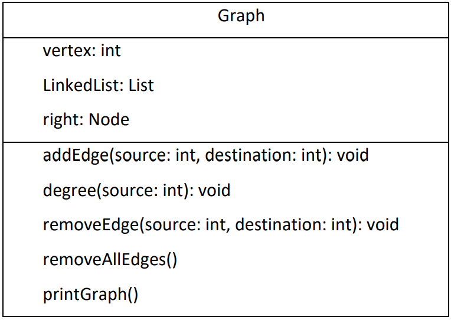<p>

2. Tambahkan class **Graph** yang akan menyimpan method-method dalam graph dan juga method main().<p>

    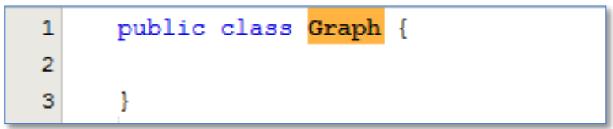<p>

3. Di dalam class **Graph**, tambahkan atribut **vertex** bertipe integer dan **list[]** bertipe LinkedList.<p>

    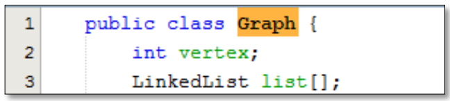<p>

4. Tambahkan konstruktor default untuk menginisialisasi variabel vertex dan menambahkan perulangan untuk jumlah vertex sesuai dengan jumlah length array yang telah ditentukan.<p>

    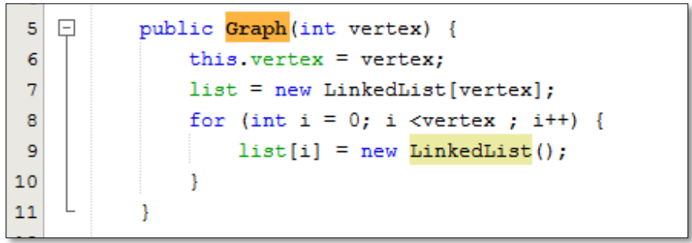<p>

5. Tambahkan method **addEdge()**. Jika yang akan dibuat adalah graph berarah, maka yang dijalankan hanya baris pertama saja. Jika graph tidak berarah yang dijalankan semua baris pada method **addEdge()**.<p>

    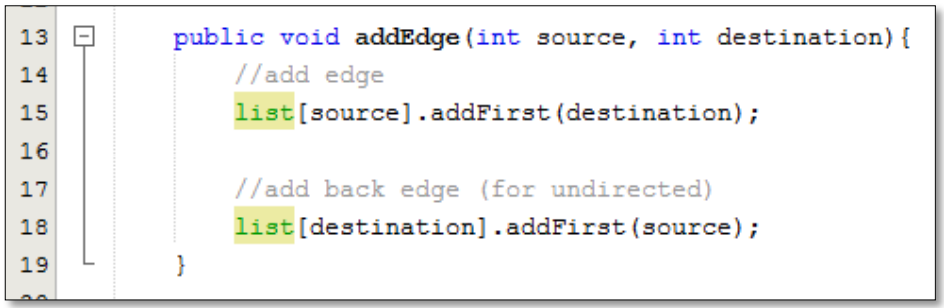<p>

6. Tambahkan method **degree()** untuk menampilkan jumlah derajat lintasan pada suatu vertex. Di dalam metode ini juga dibedakan manakah statement yang digunakan untuk graph berarah atau graph tidak berarah. Eksekusi hanya sesuai kebutuhan saja.<p>

    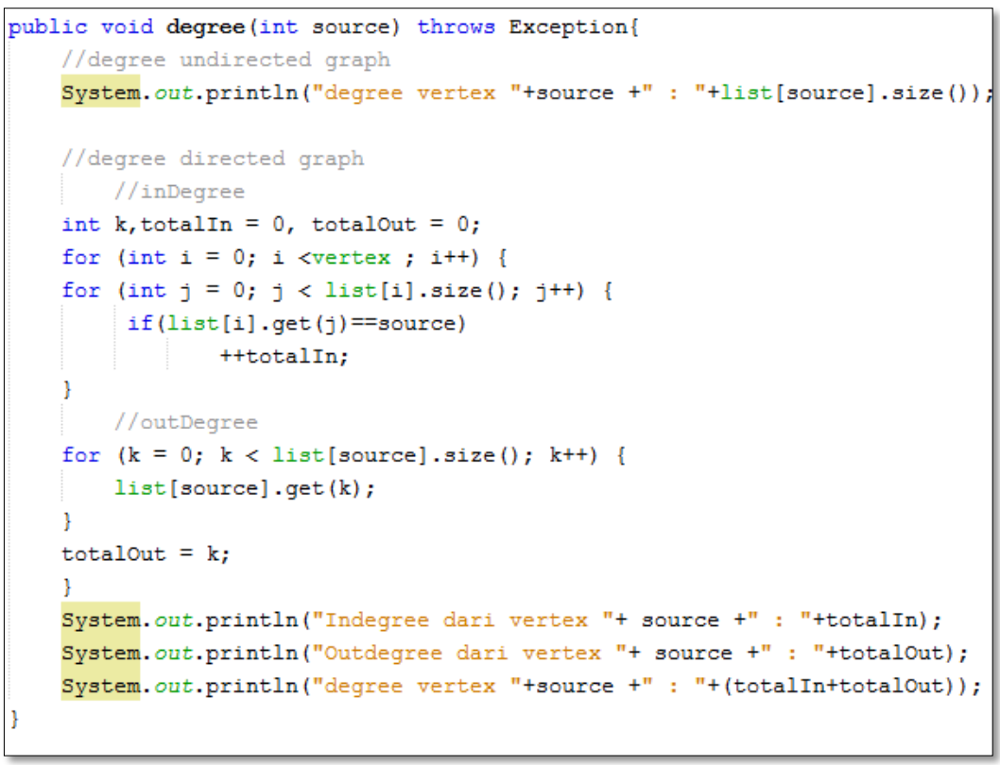<p>

7. Tambahkan method **removeEdge()**. Method ini akan menghapus lintasan ada suatu graph. Oleh karena itu, dibutuhkan 2 parameter untuk menghapus lintasan yaitu source dan destination.<p>

    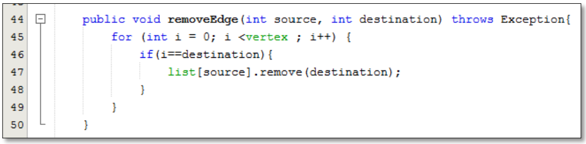<p>

8. Tambahkan method **removeAllEdges()** untuk menghapus semua vertex yang ada di dalam graph.<p>

    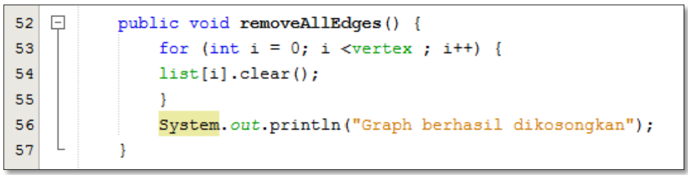<p>

9. Tambahkan method **printGraph()** untuk mencatak graph ter-update.<p>

    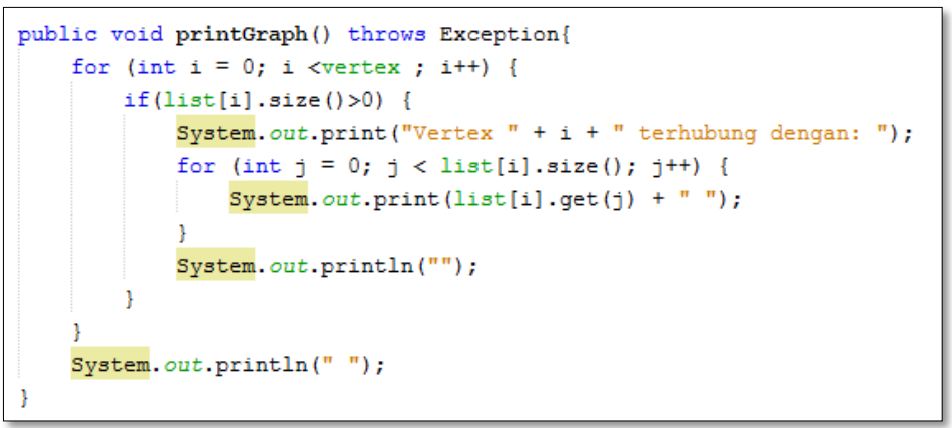<p>

10. Compile dan jalankan method **main()** dalam class **Graph** untuk menambahkan beberapa edge pada graph, kemudian tampilkan. Setelah itu keluarkan hasilnya menggunakan pemanggilan method main(). **Keterangan**: degree harus disesuaikan dengan jenis graph yang telah dibuat (directed/undirected).<p>

    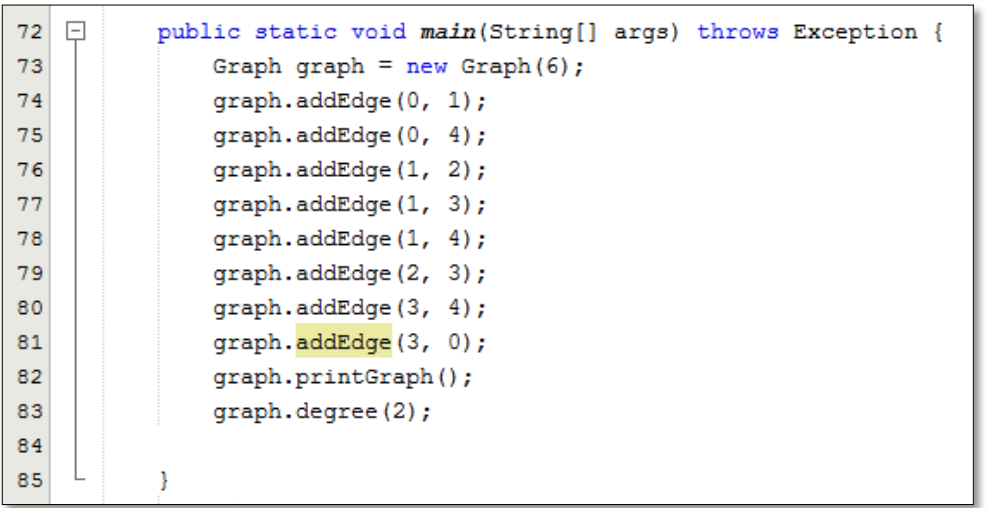<p>

11. Amati hasil running tersebut.
12. Tambahkan pemanggilan method **removeEdge()** sesuai potongan code di bawah ini pada method main(). Kemudian tampilkan graph tersebut.<p>

    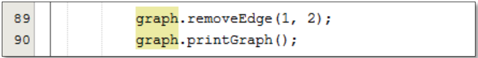<p>

13. Amati hasil running tersebut.
14. Uji coba penghapusan lintasan yang lain! Amati hasilnya!

>Hasil Output :

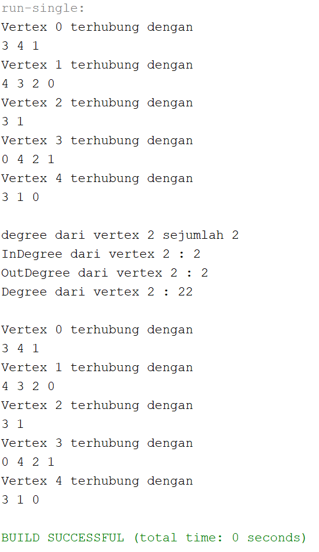<p>

>Source Code nodeClass :
```java
package minggu15;

/**
 *
 * @author EgaRam
 */
public class node {
    int data;
    node prev, next;
    
    node(node prev, int data, node next){
        this.prev = prev;
        this.data = data;
        this.next = next;
    }
}
```

>Source Code graphClass :
```java
package minggu15;

/**
 *
 * @author EgaRam
 */
public class graph {
    int vertex;
    doublelinkedlist list[];
    
    public graph(int vertex){
        this.vertex = vertex;
        list = new doublelinkedlist[vertex];
        for(int i = 0; i < vertex; i++){
            list[i] = new doublelinkedlist();
        }
    }
    void addEdge(int source, int destination){
        //add edge
        list[source].addFirst(destination);
        //add back edge(for undirected)
        list[destination].addFirst(source);
    }
    void degree(int source) throws Exception{
        //undirected
        System.out.println("degree dari vertex " + source + " sejumlah " + list[source].size());
        
        //degree directed graph
        //inDegree
        int k, totalIn = 0, totalOut = 0;
        for(int i = 0; i < vertex; i++){
            for(int j = 0; j < list[i].size; j++){
                if(list[i].get(j) == source){
                    ++totalIn;
                }
            }
        }
        //outdegree
        for(k = 0; k < list[source].size(); k++){
            list[source].get(k);
        }
        totalOut = k;
        System.out.println("InDegree dari vertex " + source + " : " + totalIn);
        System.out.println("OutDegree dari vertex " + source + " : " + totalOut);
        System.out.println("Degree dari vertex " + source + " : " + totalIn + totalOut);
    }
    void removeEdge(int source, int destination) throws Exception{
        for(int i = 0; i < vertex; i++){
            if(i == destination){
                list[source].remove(destination);
            }
        }
    }
    void removeAllEdge(){
        for(int i = 0; i < vertex; i++){
            list[i].clear();
        }
        System.out.println("Seluruh edge pada graf berhasil dihapus");
    }
    void printGraph() throws Exception{
        for(int i = 0; i < vertex; i++){
            if(list[i].size() > 0){
                System.out.println("Vertex " + i + " terhubung dengan ");
                for(int j = 0; j < list[i].size(); j++){
                    System.out.print(list[i].get(j) + " ");
                }
                System.out.println("");
            }
        }
        System.out.println("  ");
    }    
}
```

>Source Code doublelinkedlistClass :
```java
package minggu15;

/**
 *
 * @author EgaRam
 */
public class doublelinkedlist {
    node head;
    int size;
    
    public doublelinkedlist(){
        head = null;
        size = 0;
    }
    public boolean isEmpty(){
        return head == null;
    }
    public void addFirst(int item){
        if(isEmpty()){
            head = new node(null, item, null);
        }else{
            node newnode = new node(null, item, head);
            head.prev = newnode;
            head = newnode;
        }
        size++;
    }
    public void addLast(int item){
        if(isEmpty()){
            addFirst(item);
        }else{
            node current = head;
            while(current.next != null){
                current = current.next;
            }
            node newnode = new node(current, item, null);
            current.next = newnode;
            size++;
        }
    }
    public void add(int item, int index) throws Exception{
        if(isEmpty()){
            addFirst(item);
        }else if(index < 0 || index > size){
            throw new Exception("Nilai indeks di luar batas");
        }else{
            node current = head;
            int i = 0;
            while(i < index){
                current = current.next;
                i++;
            }
            if(current.prev == null){
                node newnode = new node(null, item, current);
                current.prev = newnode;
                head = newnode;
            }else{
                node newnode = new node(current.prev, item, current);
                newnode.prev = current.prev;
                newnode.next = current;
                current.prev.next = newnode;
                current.prev = newnode;
            }
        }
        size++;
    }
    public int size(){
        return size;
    }
    public void clear(){
        head = null;
        size = 0;
    }
    public void print(){
        if(!isEmpty()){
            node tmp = head;
            while(tmp != null){
                System.out.print(tmp.data + "\t");
                tmp = tmp.next;
            }
            System.out.println("\nberhasil diisi");
        }else{
            System.out.println("Linked Lists Kosong");
        }
    }
    public void removeFirst() throws Exception{
        if(isEmpty()){
            throw new Exception("Linked List masih kosong, tidak dapat dihapus!");
        }else if (size == 1){
            removeLast();
        }else{
            head = head.next;
            head.prev = null;
            size--;
        }
    }
    public void removeLast() throws Exception{
        if(isEmpty()){
            throw new Exception("Linked List masih kosong, tidak dapat dihapus!");
        }else if(head.next == null){
            head = null; //proses penghapusan head
            size--;
            return;
        }
        node current = head;
        while(current.next.next != null){
            current = current.next;
        }
        current.next = null;
        size--;
    }
    public void remove(int index) throws Exception{
        if(isEmpty() || index >= size){
            throw new Exception("Nilai indeks di luar batas");
        }else if (index == 0){
            removeFirst();
        }else{
            node current = head;
            int i = 0;
            while(i < index){
                current = current.next;
                i++;
            }
            if(current.next == null){
                current.prev.next = null;
            }else if(current.prev == null){
                current = current.next;
                current.prev = null;
                head = current;
            }else{
                current.prev.next = current.next;
                current.next.prev = current.prev;
            }
            size--;
        }
    }
    public int getFirst() throws Exception{
        if(isEmpty()){
            throw new Exception("Linked List Kosong");
        }
        return head.data;
    }
    public int getLast() throws Exception{
        if(isEmpty()){
            throw new Exception("Linked List Kosong");
        }
        node tmp = head;
        while(tmp.next != null){
            tmp = tmp.next;
        }
        return tmp.data;
    }
    public int get(int index) throws Exception{
        if(isEmpty() || index >= size){
            throw new Exception("Nilai indeks di luar batas");
        }
        node tmp = head;
        for(int i = 0; i < index; i++){
            tmp = tmp.next;
        }
        return tmp.data;
    }
}
```

>Source Code graphMain :
```java
package minggu15;

/**
 *
 * @author EgaRam
 */
public class graphMain {

    /**
     * @param args the command line arguments
     */
    public static void main(String[] args)throws Exception {
        graph Graph = new graph(6);
        Graph.addEdge(0, 1);
        Graph.addEdge(0, 4);
        Graph.addEdge(1, 2);
        Graph.addEdge(1, 3);
        Graph.addEdge(1, 4);
        Graph.addEdge(2, 3);
        Graph.addEdge(3, 4);
        Graph.addEdge(3, 0);
        Graph.printGraph();
        Graph.degree(2);
        System.out.println();
        Graph.printGraph();
    }
}
```

---
#### **2.1.2 Verifikasi Hasil Percobaan**
Verifikasi hasil kompilasi kode program Anda dengan gambar berikut ini.

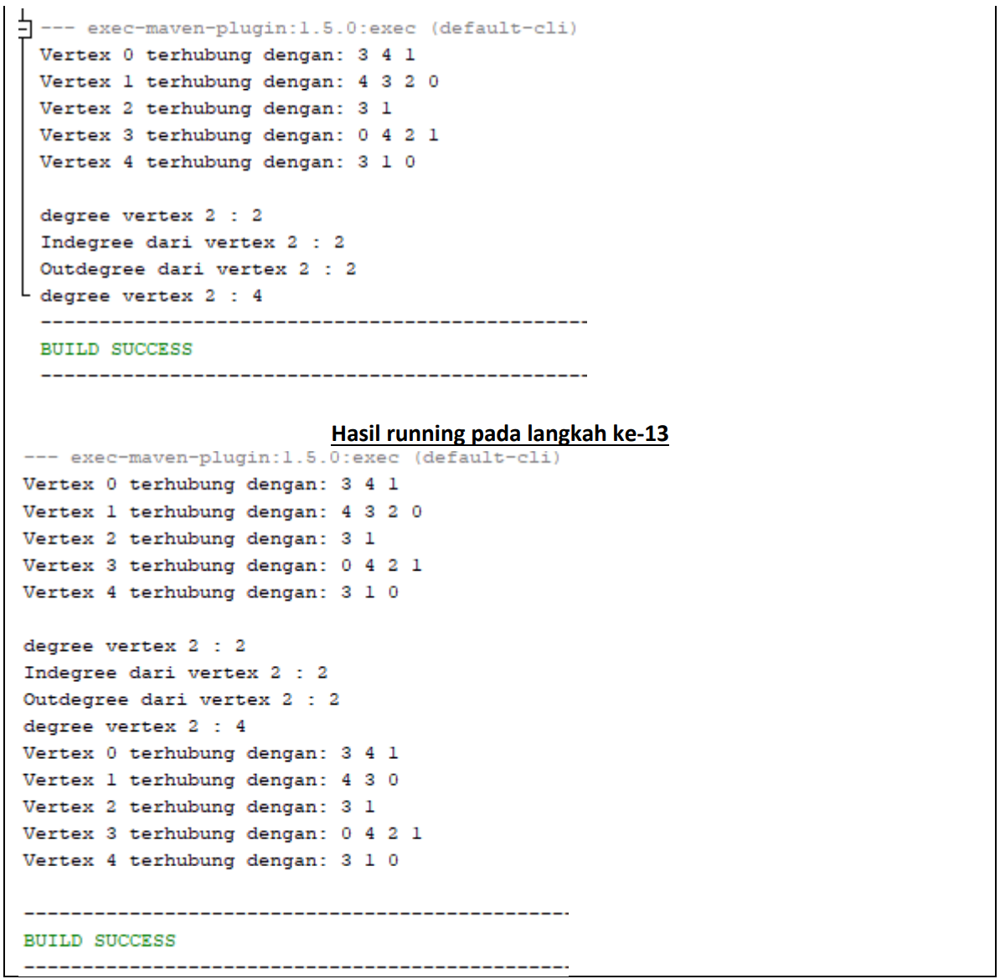<p>

---
#### **2.1.3 Pertanyaan Percobaan**
1. Sebutkan beberapa jenis (minimal 3) algoritma yang menggunakan dasar Graph, dan apakah kegunaan algoritma-algoritma tersebut?

    >- **Algoritma Prim, kegunaannya adalah mencari pohon rentang minimum untuk sebuah graf berbobot yang terhubung. Ini berarti menemukan subset dari tepi yang membentuk sebuah pohon yang mencakup etiap titik, di mana berat total semua tepi di pohon diminimalkan. Jika grafik tidak terhubung, maka ia menemukan hutan rentang minimum (pohon rentang minimum untuk setiap komponen terhubung)**.
    >- **Algoritma Dijkstra, kegunaannya adalah dipakai dalam memecahkan permasalahan jarak terpendek (shortest path problem) untuk sebuah graf berarah (directed graph)**.
    >- **Algoritma Warshall , kegunaannya menghitung jarak terpendek (shortest path) untuk semua pasangan titik pada sebuah graph, dan melakukannya dalam waktu berorde kubik. Algoritma warshall digunakan untuk menyelesaikan permasalahan jalur terpendek multi path**.

2. Pada class Graph terdapat array bertipe LinkedList, yaitu LinkedList list[]. Apakah tujuan pembuatan variabel tersebut ?

    >**Kegunaan linkedlist/doublelinkedlist pada graph, karena kita membutuhkan untuk sebuah node/sebuah vertex itu yang nantinya akan terhubung ke arah tujuannya**.

3. Apakah alasan pemanggilan method addFirst() untuk menambahkan data, bukan method add jenis lain pada linked list ketika digunakan pada method addEdge pada class Graph?

    >**Karena nanti data akan ditambahkan yang pertama, yang berarti kita kenalkan data yang pertama dimasukkan itu dari fungsi method addEdge tersebut**.

4. Bagaimana cara mendeteksi prev pointer pada saat akan melakukan penghapusan suatu edge pada graph ?

    >**Dengan cara menggunakan pada method removeEdge, disana terdapat i == destination, karena destination pada addEdge sudah dinyatakan addFirst(prev) dan source sudah dinyatakan addBack edge(next) maka jika nanti i sudah mencapai destinationnya, list[source].remove[destination] yang artinya akan menghapus garis/hubungan vertex source(node source) dengan vertex destination(node destination)**.

5. Kenapa pada praktikum 2.1.1 langkah ke-12 untuk menghapus path yang bukan merupakan lintasan pertama kali menghasilkan output yang salah ? Bagaimana solusinya ?<p>

    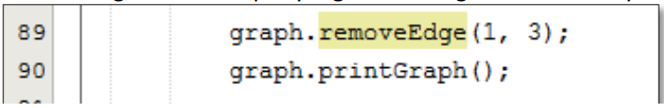<p>

    >**Output program diatas tidak ada yang error, akan tetapi vertex yang dilewati mengalami perubahan lintasan**.

---
### **2.2 Implementasi Graph menggunakan Matriks**
Kegiatan praktikum 2 merupakan implementasi Graph dengan Matriks. Silakan lakukan langkahlangkah percobaan praktikum berikut ini, kemudian verifikasi hasilnya. Setelah itu jawablah pertanyaan terkait percobaan yang telah Anda lakukan.
#### **2.2.1 Tahapan Percobaan**
**Waktu percobaan: 30 menit**

Pada praktikum 2.2 ini akan diimplementasikan Graph menggunakan matriks untuk merepresentasikan graph adjacency. Silakan lakukan langkah-langkah praktikum sebagai berikut.

1. Uji coba graph bagian 2.2 menggunakan array 2 dimensi sebagai representasi graph. Buatlah class **graphArray** yang didalamnya terdapat variabel **vertices** dan **array twoD_array**!<p>

    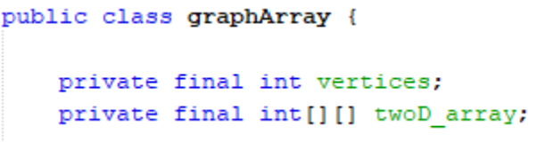<p>

2. Buatlah konstruktor **graphArray** sebagai berikut!<p>

    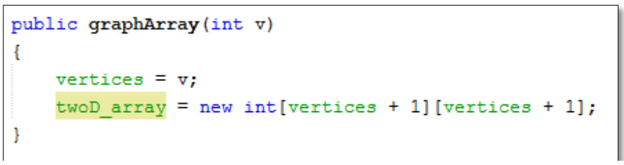<p>

3. Untuk membuat suatu lintasan maka dibuat method **makeEdge()** sebagai berikut.<p>

    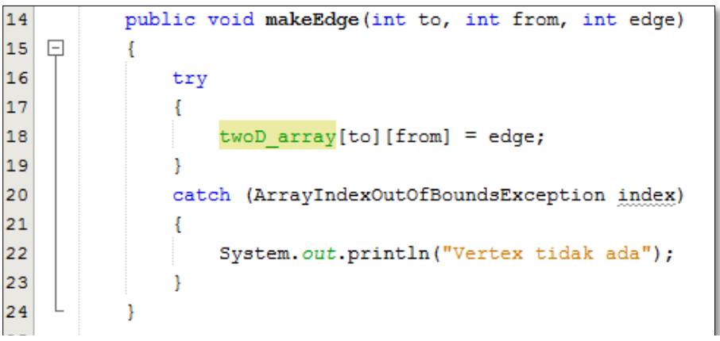<p>

    Untuk menampilkan suatu lintasan diperlukan pembuatan method **getEdge()** berikut.<p>

    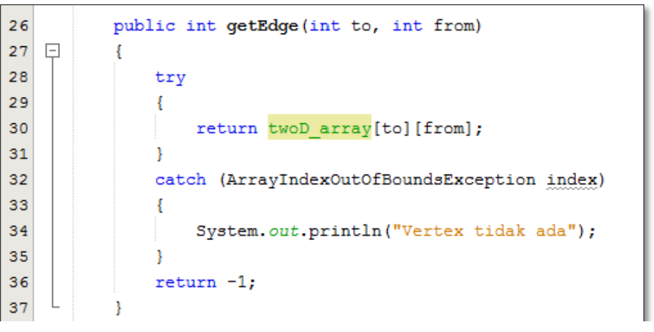<p>

4. Kemudian buatlah method **main()** seperti berikut ini.<p>

    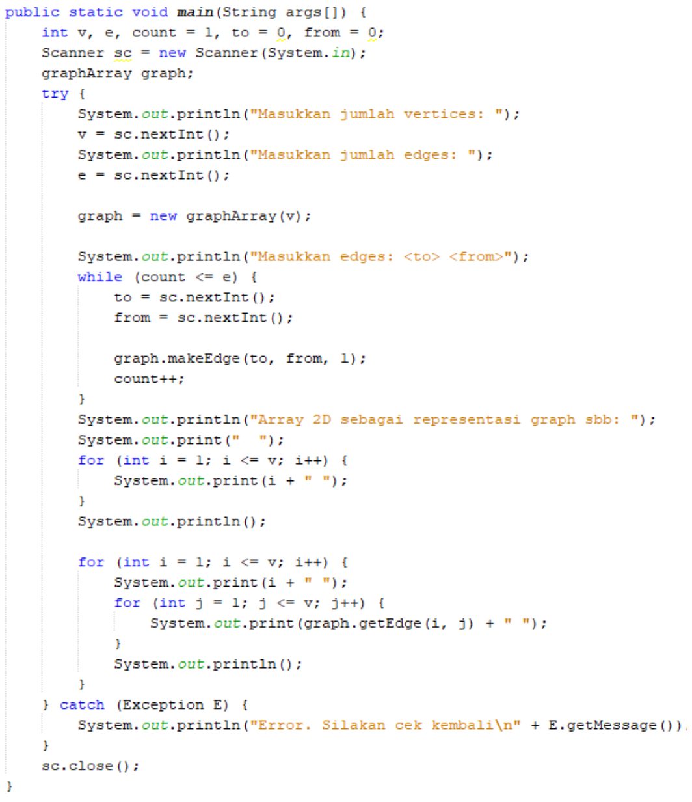<p>

5. Jalankan class **graphArray** dan amati hasilnya!

>Hasil Output :

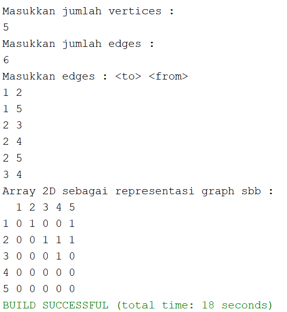<p>

>Source Code graphArrayClass :
```java
package minggu15.prak2;

/**
 *
 * @author EgaRam
 */
public class graphArray {
    int vertices;
    int[][] twoD_array;
    
    graphArray(int v){
        vertices = v;
        twoD_array = new int[vertices + 1][vertices + 1];
    }
    void makeEdge(int to, int from, int edge){
        try{
            twoD_array[to][from] = edge;
        }
        catch (ArrayIndexOutOfBoundsException index){
            System.out.println("Vertex tidak ada");
        }
    }
    int getEdge(int to, int from){
        try{
            return twoD_array[to][from];
        }
        catch (ArrayIndexOutOfBoundsException index){
            System.out.println("Vertex tidak ada");
        }
        return -1;
    }
}
```

>Source Code graphArrayMain :
```java
package minggu15.prak2;
import java.util.Scanner;
/**
 * 
 *
 * @author EgaRam
 */
public class graphArrayMain {
    public static void main(String[] args) {
    int v, e, count = 1, to = 0, from = 0;
    Scanner sc = new Scanner(System.in);
    graphArray graph;
    
    try{
        System.out.println("Masukkan jumlah vertices : ");
        v = sc.nextInt();
        System.out.println("Masukkan jumlah edges : ");
        e = sc.nextInt();
        
        graph = new graphArray(v);
        
        System.out.println("Masukkan edges : <to> <from>");
        while(count <= e){
            to = sc.nextInt();
            from = sc.nextInt();
            
            graph.makeEdge(to, from, 1);
            count++;
        }
        System.out.println("Array 2D sebagai representasi graph sbb : ");
        System.out.print("  ");
        for(int i = 1; i <= v; i++){
            System.out.print(i + " ");
        }
        System.out.println();
        
        for(int i = 1; i <= v; i++){
            System.out.print(i + " ");
            for(int j = 1; j <= v; j++){
                System.out.print(graph.getEdge(i, j) + " ");
            }
            System.out.println();
        }
    }catch(Exception E){
        System.out.println("Error. Silahkan cek kembali\n" + E.getMessage());
    }
    sc.close();
    }
}
```

---
#### **2.2.2 Verifikasi Hasil Percobaan**
Verifikasi hasil kompilasi kode program Anda dengan gambar berikut ini.<p>

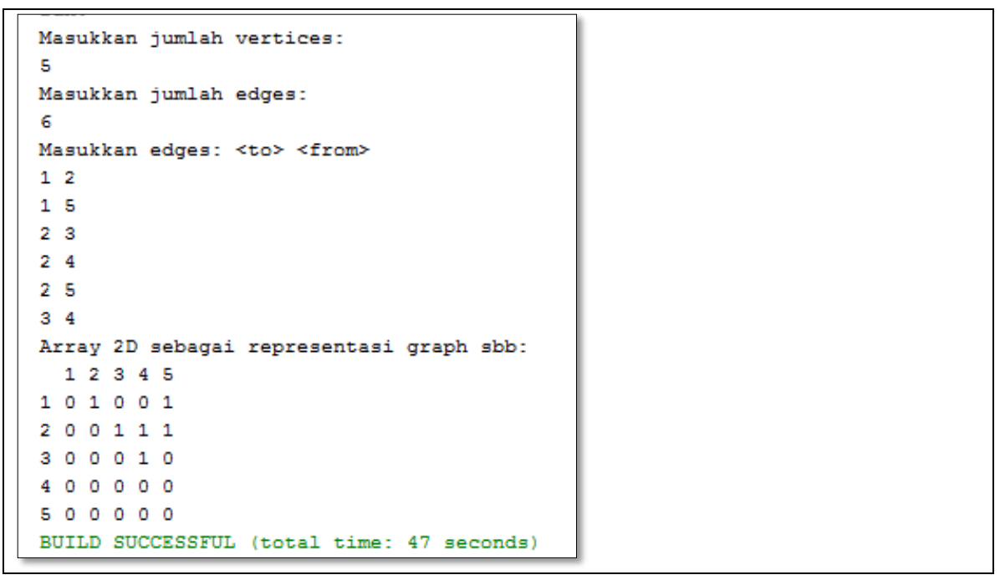<p>

---
#### **2.2.3 Pertanyaan Percobaan**
1. Apakah perbedaan degree/derajat pada directed dan undirected graph?

    >**Pada directed graph degree tidak selalu berhubungan, sedangkan pada undirected graph degree pasti berhubungan**.

2. Pada implementasi graph menggunakan adjacency matriks. Kenapa jumlah vertices harus ditambahkan dengan 1 pada indeks array berikut?<p>

    <p>

    >**Karena penggunaan array diawal dimulai dari 0, maka harus menambah dengan 1 sebagai untuk menghubangkan vertex 1 dengan yang lain**.

3. Apakah kegunaan method **getEdge()** ?

    >**Method getEdge berfungsi untuk menampilkan suatu lintasan yang diperlukan**.

4. Termasuk jenis graph apakah uji coba pada praktikum 2.2?

    >**Termasuk jenis graphArray dengan directed karena pada hasil output menggambarkan directed(terarah) yang dimana 1 dengan 2 saling berhubungan akan tetapi 2 dengan 1 tidak berhubungan, kalau undirected(bebas) seharusnya menjadi satu kesatuan**.

5. Mengapa pada method main harus menggunakan try-catch Exception ?

    >**Agar saat terjadi error, eksekusi program dapat terus berjalan tanpa perlu memberhentikan program, sehingga meminimalisir terjadinya error atau output ditakmuncul**.

---
## **3. Tugas Praktikum**
1. Ubahlah lintasan pada praktikum 2.1 menjadi inputan!

    >Hasil Output :

    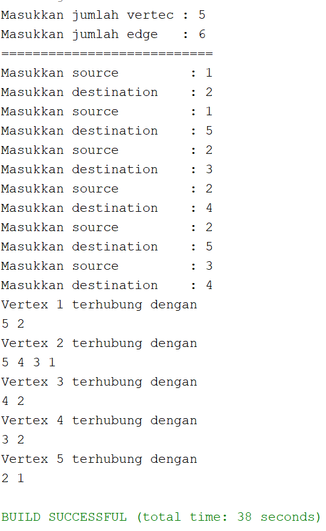<p>

    >Source Code nodeClass :
    ```java
    package minggu15;

    /**
    *
    * @author EgaRam
    */
    public class node {
        int data;
        node prev, next;
        
        node(node prev, int data, node next){
            this.prev = prev;
            this.data = data;
            this.next = next;
        }
    }
    ```

    >Source Code graphClass :
    ```java
    package minggu15;

    /**
    *
    * @author EgaRam
    */
    public class graph {
        int vertex;
        doublelinkedlist list[];
        
        public graph(int vertex){
            this.vertex = vertex;
            list = new doublelinkedlist[vertex];
            for(int i = 0; i < vertex; i++){
                list[i] = new doublelinkedlist();
            }
        }
        void addEdge(int source, int destination){
            //add edge
            list[source].addFirst(destination);
            //add back edge(for undirected)
            list[destination].addFirst(source);
        }
        void degree(int source) throws Exception{
            //undirected
            System.out.println("degree dari vertex " + source + " sejumlah " + list[source].size());
            
            //degree directed graph
            //inDegree
            int k, totalIn = 0, totalOut = 0;
            for(int i = 0; i < vertex; i++){
                for(int j = 0; j < list[i].size; j++){
                    if(list[i].get(j) == source){
                        ++totalIn;
                    }
                }
            }
            //outdegree
            for(k = 0; k < list[source].size(); k++){
                list[source].get(k);
            }
            totalOut = k;
            System.out.println("InDegree dari vertex " + source + " : " + totalIn);
            System.out.println("OutDegree dari vertex " + source + " : " + totalOut);
            System.out.println("Degree dari vertex " + source + " : " + totalIn + totalOut);
        }
        void removeEdge(int source, int destination) throws Exception{
            for(int i = 0; i < vertex; i++){
                if(i == destination){
                    list[source].remove(destination);
                }
            }
        }
        void removeAllEdge(){
            for(int i = 0; i < vertex; i++){
                list[i].clear();
            }
            System.out.println("Seluruh edge pada graf berhasil dihapus");
        }
        void printGraph() throws Exception{
            for(int i = 0; i < vertex; i++){
                if(list[i].size() > 0){
                    System.out.println("Vertex " + i + " terhubung dengan ");
                    for(int j = 0; j < list[i].size(); j++){
                        System.out.print(list[i].get(j) + " ");
                    }
                    System.out.println("");
                }
            }
            System.out.println("  ");
        }    
    }
    ```

    >Source Code doublelinkedlistClass :
    ```java
    package minggu15;

    /**
    *
    * @author EgaRam
    */
    public class doublelinkedlist {
        node head;
        int size;
        
        public doublelinkedlist(){
            head = null;
            size = 0;
        }
        public boolean isEmpty(){
            return head == null;
        }
        public void addFirst(int item){
            if(isEmpty()){
                head = new node(null, item, null);
            }else{
                node newnode = new node(null, item, head);
                head.prev = newnode;
                head = newnode;
            }
            size++;
        }
        public void addLast(int item){
            if(isEmpty()){
                addFirst(item);
            }else{
                node current = head;
                while(current.next != null){
                    current = current.next;
                }
                node newnode = new node(current, item, null);
                current.next = newnode;
                size++;
            }
        }
        public void add(int item, int index) throws Exception{
            if(isEmpty()){
                addFirst(item);
            }else if(index < 0 || index > size){
                throw new Exception("Nilai indeks di luar batas");
            }else{
                node current = head;
                int i = 0;
                while(i < index){
                    current = current.next;
                    i++;
                }
                if(current.prev == null){
                    node newnode = new node(null, item, current);
                    current.prev = newnode;
                    head = newnode;
                }else{
                    node newnode = new node(current.prev, item, current);
                    newnode.prev = current.prev;
                    newnode.next = current;
                    current.prev.next = newnode;
                    current.prev = newnode;
                }
            }
            size++;
        }
        public int size(){
            return size;
        }
        public void clear(){
            head = null;
            size = 0;
        }
        public void print(){
            if(!isEmpty()){
                node tmp = head;
                while(tmp != null){
                    System.out.print(tmp.data + "\t");
                    tmp = tmp.next;
                }
                System.out.println("\nberhasil diisi");
            }else{
                System.out.println("Linked Lists Kosong");
            }
        }
        public void removeFirst() throws Exception{
            if(isEmpty()){
                throw new Exception("Linked List masih kosong, tidak dapat dihapus!");
            }else if (size == 1){
                removeLast();
            }else{
                head = head.next;
                head.prev = null;
                size--;
            }
        }
        public void removeLast() throws Exception{
            if(isEmpty()){
                throw new Exception("Linked List masih kosong, tidak dapat dihapus!");
            }else if(head.next == null){
                head = null; //proses penghapusan head
                size--;
                return;
            }
            node current = head;
            while(current.next.next != null){
                current = current.next;
            }
            current.next = null;
            size--;
        }
        public void remove(int index) throws Exception{
            if(isEmpty() || index >= size){
                throw new Exception("Nilai indeks di luar batas");
            }else if (index == 0){
                removeFirst();
            }else{
                node current = head;
                int i = 0;
                while(i < index){
                    current = current.next;
                    i++;
                }
                if(current.next == null){
                    current.prev.next = null;
                }else if(current.prev == null){
                    current = current.next;
                    current.prev = null;
                    head = current;
                }else{
                    current.prev.next = current.next;
                    current.next.prev = current.prev;
                }
                size--;
            }
        }
        public int getFirst() throws Exception{
            if(isEmpty()){
                throw new Exception("Linked List Kosong");
            }
            return head.data;
        }
        public int getLast() throws Exception{
            if(isEmpty()){
                throw new Exception("Linked List Kosong");
            }
            node tmp = head;
            while(tmp.next != null){
                tmp = tmp.next;
            }
            return tmp.data;
        }
        public int get(int index) throws Exception{
            if(isEmpty() || index >= size){
                throw new Exception("Nilai indeks di luar batas");
            }
            node tmp = head;
            for(int i = 0; i < index; i++){
                tmp = tmp.next;
            }
            return tmp.data;
        }
    }
    ```

    >Source Code graphMain :
    ```java
    package minggu15;
    import java.util.Scanner;
    /**
    *
    * @author EgaRam
    */
    public class graphMain {
        public static void main(String[] args)throws Exception {
            Scanner sc = new Scanner(System.in);
            
            System.out.print("Masukkan jumlah vertec : ");
            int ve = sc.nextInt();
            System.out.print("Masukkan jumlah edge   : ");
            int ed = sc.nextInt();
            graph Graph = new graph(ed);
            
            System.out.println("===========================");
            
            for(int i = 0; i <= ve; i++){
                System.out.print("Masukkan source         : ");
                int source = sc.nextInt();
                System.out.print("Masukkan destination    : ");
                int destination = sc.nextInt();
            
            Graph.addEdge(destination, source);
            }
            Graph.printGraph();
        }
    }
    ```

2. Tambahkan method **graphType** dengan tipe boolean yang akan membedakan graph termasuk directed atau undirected graph. Kemudian update seluruh method yang berelasi dengan method **graphType** tersebut (hanya menjalankan statement sesuai dengan jenis graph) pada praktikum 2.1

    >Hasil Output :

    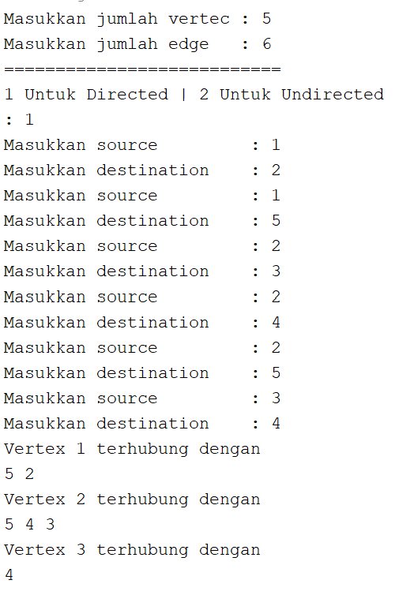<p>
    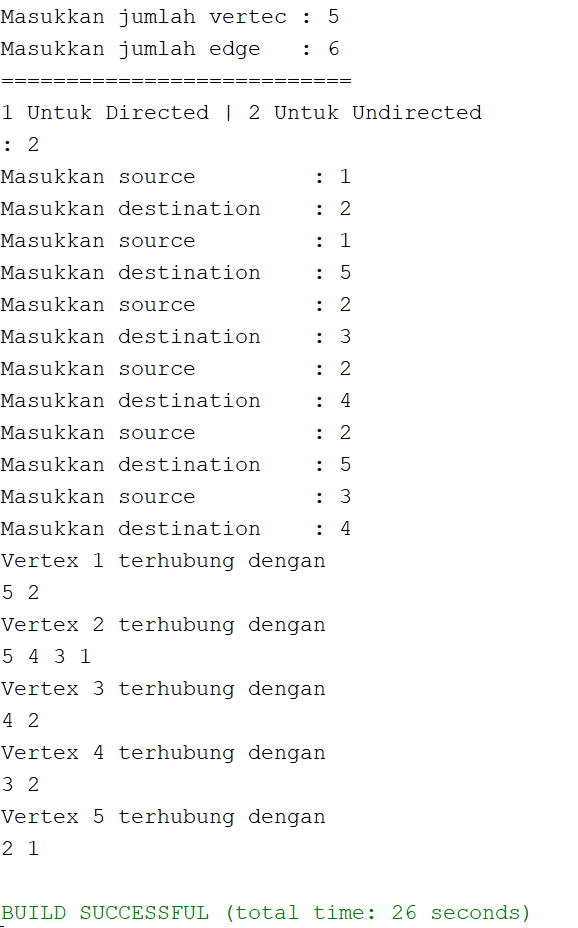<p>

    >Source Code nodeClass :
    ```java
    package minggu15;

    /**
    *
    * @author EgaRam
    */
    public class node {
        int data;
        node prev, next;
        
        node(node prev, int data, node next){
            this.prev = prev;
            this.data = data;
            this.next = next;
        }
    }
    ```

    >Source Code graphClass :
    ```java
    package minggu15;

    /**
    *
    * @author EgaRam
    */
    public class graph {
        int vertex;
        doublelinkedlist list[];
        
        public graph(int vertex){
            this.vertex = vertex;
            list = new doublelinkedlist[vertex];
            for(int i = 0; i < vertex; i++){
                list[i] = new doublelinkedlist();
            }
        }
        void addEdge(int source, int destination){
            //add edge
            list[source].addFirst(destination);
            //add back edge(for undirected)
            list[destination].addFirst(source);
        }
        void degree(int source) throws Exception{
            //undirected
            System.out.println("degree dari vertex " + source + " sejumlah " + list[source].size());
            
            //degree directed graph
            //inDegree
            int k, totalIn = 0, totalOut = 0;
            for(int i = 0; i < vertex; i++){
                for(int j = 0; j < list[i].size; j++){
                    if(list[i].get(j) == source){
                        ++totalIn;
                    }
                }
            }
            //outdegree
            for(k = 0; k < list[source].size(); k++){
                list[source].get(k);
            }
            totalOut = k;
            System.out.println("InDegree dari vertex " + source + " : " + totalIn);
            System.out.println("OutDegree dari vertex " + source + " : " + totalOut);
            System.out.println("Degree dari vertex " + source + " : " + totalIn + totalOut);
        }
        void removeEdge(int source, int destination) throws Exception{
            for(int i = 0; i < vertex; i++){
                if(i == destination){
                    list[source].remove(destination);
                }
            }
        }
        void removeAllEdge(){
            for(int i = 0; i < vertex; i++){
                list[i].clear();
            }
            System.out.println("Seluruh edge pada graf berhasil dihapus");
        }
        void printGraph() throws Exception{
            for(int i = 0; i < vertex; i++){
                if(list[i].size() > 0){
                    System.out.println("Vertex " + i + " terhubung dengan ");
                    for(int j = 0; j < list[i].size(); j++){
                        System.out.print(list[i].get(j) + " ");
                    }
                    System.out.println("");
                }
            }
            System.out.println("  ");
        }
        boolean graphType(int source, int destination){
            list[source].addFirst(destination);
            return true;
        }
    }
    ```

    >Source Code doublelinkedlistClass :
    ```java
    package minggu15;

    /**
    *
    * @author EgaRam
    */
    public class doublelinkedlist {
        node head;
        int size;
        
        public doublelinkedlist(){
            head = null;
            size = 0;
        }
        public boolean isEmpty(){
            return head == null;
        }
        public void addFirst(int item){
            if(isEmpty()){
                head = new node(null, item, null);
            }else{
                node newnode = new node(null, item, head);
                head.prev = newnode;
                head = newnode;
            }
            size++;
        }
        public void addLast(int item){
            if(isEmpty()){
                addFirst(item);
            }else{
                node current = head;
                while(current.next != null){
                    current = current.next;
                }
                node newnode = new node(current, item, null);
                current.next = newnode;
                size++;
            }
        }
        public void add(int item, int index) throws Exception{
            if(isEmpty()){
                addFirst(item);
            }else if(index < 0 || index > size){
                throw new Exception("Nilai indeks di luar batas");
            }else{
                node current = head;
                int i = 0;
                while(i < index){
                    current = current.next;
                    i++;
                }
                if(current.prev == null){
                    node newnode = new node(null, item, current);
                    current.prev = newnode;
                    head = newnode;
                }else{
                    node newnode = new node(current.prev, item, current);
                    newnode.prev = current.prev;
                    newnode.next = current;
                    current.prev.next = newnode;
                    current.prev = newnode;
                }
            }
            size++;
        }
        public int size(){
            return size;
        }
        public void clear(){
            head = null;
            size = 0;
        }
        public void print(){
            if(!isEmpty()){
                node tmp = head;
                while(tmp != null){
                    System.out.print(tmp.data + "\t");
                    tmp = tmp.next;
                }
                System.out.println("\nberhasil diisi");
            }else{
                System.out.println("Linked Lists Kosong");
            }
        }
        public void removeFirst() throws Exception{
            if(isEmpty()){
                throw new Exception("Linked List masih kosong, tidak dapat dihapus!");
            }else if (size == 1){
                removeLast();
            }else{
                head = head.next;
                head.prev = null;
                size--;
            }
        }
        public void removeLast() throws Exception{
            if(isEmpty()){
                throw new Exception("Linked List masih kosong, tidak dapat dihapus!");
            }else if(head.next == null){
                head = null; //proses penghapusan head
                size--;
                return;
            }
            node current = head;
            while(current.next.next != null){
                current = current.next;
            }
            current.next = null;
            size--;
        }
        public void remove(int index) throws Exception{
            if(isEmpty() || index >= size){
                throw new Exception("Nilai indeks di luar batas");
            }else if (index == 0){
                removeFirst();
            }else{
                node current = head;
                int i = 0;
                while(i < index){
                    current = current.next;
                    i++;
                }
                if(current.next == null){
                    current.prev.next = null;
                }else if(current.prev == null){
                    current = current.next;
                    current.prev = null;
                    head = current;
                }else{
                    current.prev.next = current.next;
                    current.next.prev = current.prev;
                }
                size--;
            }
        }
        public int getFirst() throws Exception{
            if(isEmpty()){
                throw new Exception("Linked List Kosong");
            }
            return head.data;
        }
        public int getLast() throws Exception{
            if(isEmpty()){
                throw new Exception("Linked List Kosong");
            }
            node tmp = head;
            while(tmp.next != null){
                tmp = tmp.next;
            }
            return tmp.data;
        }
        public int get(int index) throws Exception{
            if(isEmpty() || index >= size){
                throw new Exception("Nilai indeks di luar batas");
            }
            node tmp = head;
            for(int i = 0; i < index; i++){
                tmp = tmp.next;
            }
            return tmp.data;
        }
    }
    ```

    >Source Code graphMain :
    ```java
    package minggu15;
    import java.util.Scanner;
    /**
    *
    * @author EgaRam
    */
    public class graphMain {
        public static void main(String[] args)throws Exception {
            Scanner sc = new Scanner(System.in);
            
            System.out.print("Masukkan jumlah vertec : ");
            int ve = sc.nextInt();
            System.out.print("Masukkan jumlah edge   : ");
            int ed = sc.nextInt();
            graph Graph = new graph(ed);
            
            System.out.println("===========================");
                                
            int pilih;
            do{
            System.out.println("1 Untuk Directed | 2 Untuk Undirected");
            System.out.print(": ");
            pilih = sc.nextInt();
            
            if(pilih == 1){//untuk directed
                for(int i = 0; i <= ve; i++){
                    System.out.print("Masukkan source         : ");
                    int source = sc.nextInt();
                    System.out.print("Masukkan destination    : ");
                    int destination = sc.nextInt();
                    Graph.graphType(source, destination);
            }
                Graph.printGraph();
            }else if(pilih == 2){//untuk undirected
                    for(int i = 0; i <= ve; i++){
                        System.out.print("Masukkan source         : ");
                        int source = sc.nextInt();
                        System.out.print("Masukkan destination    : ");
                        int destination = sc.nextInt();
                        Graph.addEdge(source, destination);
                    }
                    Graph.printGraph();
            }  
            }while(pilih != 1 && pilih != 2); 
        }
    }
    ```

3. Modifikasi method **removeEdge()** pada praktikum 2.1 agar tidak menghasilkan output yang salah untuk path selain path pertama kali!

    >**Output program diatas tidak ada yang error, akan tetapi vertex yang dilewati mengalami perubahan lintasan**.

4. Ubahlah tipe data vertex pada seluruh graph pada praktikum 2.1 dan 2.2 dari Integer menjadi tipe generic agar dapat menerima semua tipe data dasar Java! Misalnya setiap vertex yang awalnya berupa angka 0,1,2,3, dst. selanjutnya ubah menjadi suatu nama daerah seperti Gresik, Bandung, Yogya, Malang, dst.

    >Hasil Output Graph:

    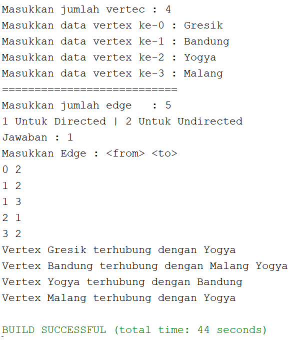<p>

    >Source Code nodeClass :
    ```java
    package minggu15;

    /**
    *
    * @author EgaRam
    */
    public class node {
        int data;
        node prev, next;
        
        node(node prev, int data, node next){
            this.prev = prev;
            this.data = data;
            this.next = next;
        }
    }
    ```

    >Source Code graphClass :
    ```java
    package minggu15;

    /**
    *
    * @author EgaRam
    */
    public class graph <T>{
        T[] vertex;
        doublelinkedlist list[];
        
        public graph(T[] vertex){
            this.vertex = vertex;
            list = new doublelinkedlist[vertex.length];
            for(int i = 0; i < vertex.length; i++){
                list[i] = new doublelinkedlist();
            }
        }
        void addEdge(int source, int destination){
            //add edge
            list[source].addFirst(destination);
            //add back edge(for undirected)
            list[destination].addFirst(source);
        }
        void degree(int source) throws Exception{
            //undirected
            System.out.println("degree dari vertex " + vertex[source] + " sejumlah " + list[source].size());
            
            //degree directed graph
            //inDegree
            int k, totalIn = 0, totalOut = 0;
            for(int i = 0; i < vertex.length; i++){
                for(int j = 0; j < list[i].size; j++){
                    if(list[i].get(j) == source){
                        ++totalIn;
                    }                   }
            //outdegree
            for(k = 0; k < list[source].size(); k++){
                list[source].get(k);
            }
            totalOut = k;
            }
            System.out.println("InDegree dari vertex " + vertex[source] + " : " + totalIn);
            System.out.println("OutDegree dari vertex " + vertex[source] + " : " + totalOut);
            System.out.println("Degree dari vertex " + vertex[source] + " : " + totalIn + totalOut);
        }
        void removeEdge(int source, int destination) throws Exception{
            for(int i = 0; i < vertex.length; i++){
                if(i == destination){
                    list[source].remove(destination);
                }
            }
        }
        void removeAllEdge(){
            for(int i = 0; i < vertex.length; i++){
                list[i].clear();
            }
            System.out.println("Seluruh edge pada graf berhasil dihapus");
        }
        void printGraph() throws Exception{
            for(int i = 0; i < vertex.length; i++){
                if(list[i].size() > 0){
                    System.out.print("Vertex " + vertex[i] + " terhubung dengan ");
                    for(int j = 0; j < list[i].size(); j++){
                        System.out.print(vertex[list[i].get(j)] + " ");
                    }
                    System.out.println("");
                }
            }
            System.out.println("  ");
        }
        //directed
        boolean graphType(int source, int destination){
            list[source].addFirst(destination);
            return true;
        }
    }
    ```

    >Source Code doublelinkedlistClass :
    ```java
    package minggu15;

    /**
    *
    * @author EgaRam
    */
    public class doublelinkedlist {
        node head;
        int size;
        
        public doublelinkedlist(){
            head = null;
            size = 0;
        }
        public boolean isEmpty(){
            return head == null;
        }
        public void addFirst(int item){
            if(isEmpty()){
                head = new node(null, item, null);
            }else{
                node newnode = new node(null, item, head);
                head.prev = newnode;
                head = newnode;
            }
            size++;
        }
        public void addLast(int item){
            if(isEmpty()){
                addFirst(item);
            }else{
                node current = head;
                while(current.next != null){
                    current = current.next;
                }
                node newnode = new node(current, item, null);
                current.next = newnode;
                size++;
            }
        }
        public void add(int item, int index) throws Exception{
            if(isEmpty()){
                addFirst(item);
            }else if(index < 0 || index > size){
                throw new Exception("Nilai indeks di luar batas");
            }else{
                node current = head;
                int i = 0;
                while(i < index){
                    current = current.next;
                    i++;
                }
                if(current.prev == null){
                    node newnode = new node(null, item, current);
                    current.prev = newnode;
                    head = newnode;
                }else{
                    node newnode = new node(current.prev, item, current);
                    newnode.prev = current.prev;
                    newnode.next = current;
                    current.prev.next = newnode;
                    current.prev = newnode;
                }
            }
            size++;
        }
        public int size(){
            return size;
        }
        public void clear(){
            head = null;
            size = 0;
        }
        public void print(){
            if(!isEmpty()){
                node tmp = head;
                while(tmp != null){
                    System.out.print(tmp.data + "\t");
                    tmp = tmp.next;
                }
                System.out.println("\nberhasil diisi");
            }else{
                System.out.println("Linked Lists Kosong");
            }
        }
        public void removeFirst() throws Exception{
            if(isEmpty()){
                throw new Exception("Linked List masih kosong, tidak dapat dihapus!");
            }else if (size == 1){
                removeLast();
            }else{
                head = head.next;
                head.prev = null;
                size--;
            }
        }
        public void removeLast() throws Exception{
            if(isEmpty()){
                throw new Exception("Linked List masih kosong, tidak dapat dihapus!");
            }else if(head.next == null){
                head = null; //proses penghapusan head
                size--;
                return;
            }
            node current = head;
            while(current.next.next != null){
                current = current.next;
            }
            current.next = null;
            size--;
        }
        public void remove(int index) throws Exception{
            if(isEmpty() || index >= size){
                throw new Exception("Nilai indeks di luar batas");
            }else if (index == 0){
                removeFirst();
            }else{
                node current = head;
                int i = 0;
                while(i < index){
                    current = current.next;
                    i++;
                }
                if(current.next == null){
                    current.prev.next = null;
                }else if(current.prev == null){
                    current = current.next;
                    current.prev = null;
                    head = current;
                }else{
                    current.prev.next = current.next;
                    current.next.prev = current.prev;
                }
                size--;
            }
        }
        public int getFirst() throws Exception{
            if(isEmpty()){
                throw new Exception("Linked List Kosong");
            }
            return head.data;
        }
        public int getLast() throws Exception{
            if(isEmpty()){
                throw new Exception("Linked List Kosong");
            }
            node tmp = head;
            while(tmp.next != null){
                tmp = tmp.next;
            }
            return tmp.data;
        }
        public int get(int index) throws Exception{
            if(isEmpty() || index >= size){
                throw new Exception("Nilai indeks di luar batas");
            }
            node tmp = head;
            for(int i = 0; i < index; i++){
                tmp = tmp.next;
            }
            return tmp.data;
        }
    }
    ```

    >Source Code graphMain :
    ```java
    package minggu15;
    import java.util.Scanner;
    /**
    *
    * @author EgaRam
    */
    public class graphMain {
        public static void main(String[] args)throws Exception {
            Scanner sc = new Scanner(System.in);
                
            System.out.print("Masukkan jumlah vertec : ");
            String[] ve = new String[sc.nextInt()];
            sc.nextLine();
            
            for(int i = 0; i < ve.length; i++){
                System.out.print("Masukkan data vertex ke-" +i+ " : ");
                ve[i] = sc.nextLine();
            }
            graph<String> Graph = new graph<String>(ve);
            
            System.out.println("===========================");
            
            System.out.print("Masukkan jumlah edge   : ");
            int edge = sc.nextInt();
            
                                        
            int pilih;
            do{
                System.out.println("1 Untuk Directed | 2 Untuk Undirected");
                System.out.print("Jawaban : ");
                pilih = sc.nextInt();
            
                System.out.println("Masukkan Edge : <from> <to>");
                if(pilih == 1){//untuk directed
                    for(int i = 0; i < edge; i++){
                        //System.out.print("Masukkan source         : ");
                        //int source = sc.nextInt();
                        //System.out.print("Masukkan destination    : ");
                        //int destination = sc.nextInt();
                        Graph.graphType(sc.nextInt(), sc.nextInt());
                }
                Graph.printGraph();
                
            }else if(pilih == 2){//untuk undirected
                    for(int i = 0; i < edge; i++){
                        //System.out.print("Masukkan source         : ");
                        //int source = sc.nextInt();
                        //System.out.print("Masukkan destination    : ");
                        //int destination = sc.nextInt();
                        Graph.addEdge(sc.nextInt(), sc.nextInt());
                    }
                    Graph.printGraph();
            }  
            }while(pilih != 1 && pilih != 2); 
        }
    }
    ```

    >Hasil Output GraphArray :

    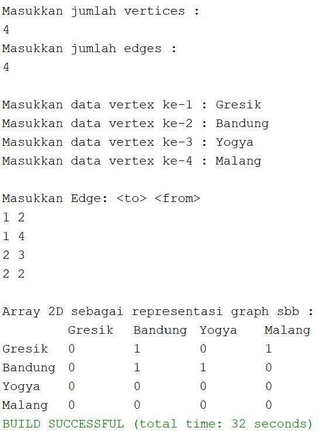<p>

    >Source Code graphArray :
    ```java
    package minggu15.prak2;

    /**
    *
    * @author EgaRam
    */
    public class graphArray <T>{
        T[] vertices;
        int[][] twoD_array;
        
        graphArray(T[] v){
            vertices = v;
            twoD_array = new int[vertices.length + 1][vertices.length + 1];
        }
        void makeEdge(int to, int from, int edge){
            try{
                twoD_array[to][from] = edge;
            }
            catch (ArrayIndexOutOfBoundsException index){
                System.out.println("Vertex tidak ada");
            }
        }
        int getEdge(int to, int from){
            try{
                return twoD_array[to][from];
            }
            catch (ArrayIndexOutOfBoundsException index){
                System.out.println("Vertex tidak ada");
            }
            return -1;
        }
    }
    ```

    >Source Code graphArrayMain :
    ```java
    package minggu15.prak2;
    import java.util.Scanner;
    /**
    * 
    *
    * @author EgaRam
    */
    public class graphArrayMain {
        public static void main(String[] args) {
        int v, e, count = 1, to = 0, from = 0;
        Scanner sc = new Scanner(System.in);
        Scanner ss = new Scanner(System.in);
        graphArray <String> graph;
        
        try{
            System.out.println("Masukkan jumlah vertices : ");
            v = sc.nextInt();
            System.out.println("Masukkan jumlah edges : ");
            e = sc.nextInt();
            
            System.out.println();
            
            String[] vert = new String[v + 1];//Tipe data disesuaikan dengan data yang akan disimpan dalam graph
            
            for(int i = 1; i <= v; i++){
            System.out.print("Masukkan data vertex ke-" + i + " : ");
            vert[i] = ss.nextLine();
            }
            graph = new graphArray<String>(vert);
            
            System.out.println();
            
            System.out.println("Masukkan Edge: <to> <from>");
            while(count <= e){
                to = sc.nextInt();
                from = sc.nextInt();            
                graph.makeEdge(to, from, 1);
                count++;
            }
            System.out.println();
            
            System.out.println("Array 2D sebagai representasi graph sbb : ");
            System.out.print("\t");
            for(int i = 1; i <= v; i++){
                System.out.print(vert[i] + "\t");
            }
            System.out.println();
            
            for(int i = 1; i <= v; i++){
                System.out.print(vert[i] + "\t");
                for(int j = 1; j <= v; j++){
                    System.out.print(graph.getEdge(i, j) + "\t");
                }
                System.out.println();
            }
        }catch(Exception E){
            System.out.println("Error. Silahkan cek kembali\n" + E.getMessage());
        }
        sc.close();
        }
    }
    ```

---
## *<center>Terimakasiih Banyak</center>*
---